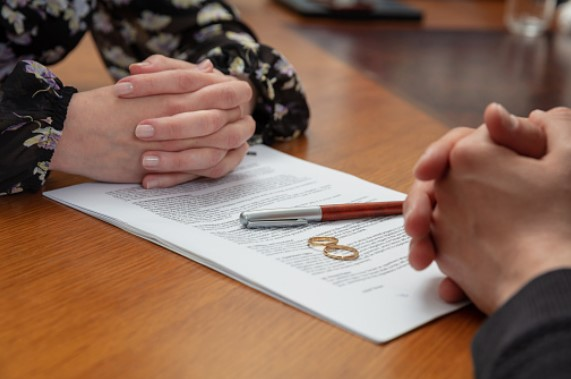
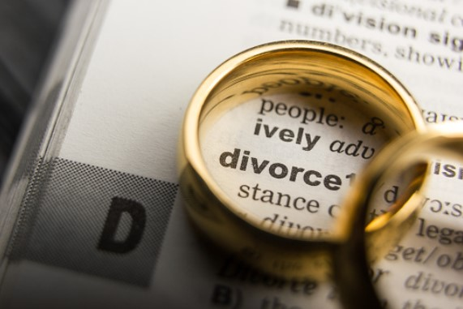

This article has been written and researched by our expert Loveable through a precise methodology. [Learn more about our methodology](https://avada.io/loveable/our-methodological.html)

[Loveable](https://avada.io/loveable/) > [Blog](https://avada.io/loveable/blog/) > [Family](https://avada.io/loveable/family/)

# The Effects of Divorce on Family and Society 

Written by [Rose Bryne](https://avada.io/loveable/author/rose/) Last Updated on August 22, 2023

- [Effect Of Divorce On Society](https://avada.io/loveable/blog/the-effects-of-divorce/#wp-block-heading-2-3)
- [Effect Of Divorce On Children](https://avada.io/loveable/blog/the-effects-of-divorce/#wp-block-heading-2-7) 
- [Effect Of Divorce On Employment](https://avada.io/loveable/blog/the-effects-of-divorce/#wp-block-heading-2-12) 
- [Effect Of Divorce On Academic Achievement](https://avada.io/loveable/blog/the-effects-of-divorce/#wp-block-heading-2-16) 
- [Effect Of Divorce On Self-Esteem](https://avada.io/loveable/blog/the-effects-of-divorce/#wp-block-heading-2-20) 
- [Bottom Line](https://avada.io/loveable/blog/the-effects-of-divorce/#wp-block-heading-2-25)

Divorce is a painful process with long-term consequences for families and society as a whole in many aspects. All we know is that divorce is an unexpected thing in life. No couples thought about that dilemma when they decided to take up a bond together. The decision to end a marriage is one of the most meaningful events in a person’s life, and it is typically followed by sadness.

It can be a double-edged sword that pairs can escape from a toxic relationship but leave a trail of emotional and psychological damage on everyone involved. It’s even becoming an urgent issue nowadays, as the number of divorces rises uncontrollably. It is possible that the sense of self-priority in modern society has pushed them to make this decision more easily than in the past. Overall, the **Effects of Divorce** are complicated and far-reaching. While divorce may be inevitable in some cases; however, it is necessary to recognize and handle the potential effects. Let’s see what they are!

## **Effect Of Divorce On Society**

[Divorce](https://en.wikipedia.org/wiki/Divorce#:~:text=Divorce%20usually%20entails%20the%20canceling,court%20or%20other%20competent%20body.) has several harmful effects on society( depending on many investigations done by researchers). According to research, divorced people are more likely to endure poverty, unemployment, and financial insecurity. Divorce rates in the United States have risen dramatically in recent years. Divorce rates that are so high have become a danger to social stability. It can also contribute to a loss of [social cohesiveness](https://health.gov/healthypeople/priority-areas/social-determinants-health/literature-summaries/social-cohesion#:~:text=Social%20cohesion%20refers%20to%20the,knowledge%20of%20a%20job%20opening.) and trust, which can lead to increased crime and social instability. 

Family breakup affects the family’s vital social unit and may negatively impact society’s principles. Furthermore, children of divorced parents may be more inclined to enter high-risk marriages or shun marriage entirely, disrupting societal peace even further. As a result, there is a need for suitable legislation as well as government assistance to address this issue as quickly as possible.

## **Effect Of Divorce On Children** 

Divorce may have a severe influence on this critical period of adolescent and early adult development. Divorcing parents may engage their children in the process, which can have long-term consequences. According to several studies, those who experienced parental divorce had worse self-esteem, greater rates of depression, etc.

Divorce may be stressful for children because they may blame themselves for their parent’s divorce, resulting in emotions of regret and guilt. However, the negative impacts of divorce on children extend beyond their emotional well-being, which might harm their intellectual advancement (they may struggle with education and are more likely to drop out).

They are more likely to get suspended from school, use firearms, and run away from home, which can lead to criminal behavior and teen pregnancies. 

## **Effect Of Divorce On Employment** 

The effects of divorce can have a significant impact on workplace productivity. There is a fact that the divorce rate is getting more and more, up to 10%, leading to many problems such as stress, anxiety, absence from work, etc. Therefore, employers are not satisfied with this situation.

Individuals going through a divorce typically have low energy and productivity because of the numerous chores and commitments that must be handled during working hours, such as communicating with attorneys or organizing childcare. As a result, most of them often drop out of work because they cannot suffer from the high pressure of balancing work and life.

## **Effect Of Divorce On Academic Achievement** 

Divorced parents may have less time to concentrate on their children’s education and participation in school activities. As a result, children from divorced homes do badly on cognitive development, verbal reasoning, math, and scientific aptitude examinations. 

In fact, children with divorced parents outperform those from intact households in school. Furthermore, they are more likely to drop out of high school or fail to attend college.

## **Effect Of Divorce On Self-Esteem** 

People from divorced families are more likely to have low self-esteem. They may suffer with emotions of inadequacy and self-worth, which can make social interactions, establishing friends, and participating in extracurricular activities challenging.

Whenever they look at a complete family, a feeling of loneliness and inferiority emerges inside them. As a result, most of them find it hard to integrate into the community.

**_Related_**: [Divorced Dad Success: 10 Essential Tips for Thriving in Fatherhood](https://avada.io/loveable/divorced-dad-success/)

## **Bottom Line**

 It is important to emphasize that divorce is a complicated issue with many contributing aspects, and not all children or families will suffer the same consequences. However, it is obvious that divorce may have serious consequences for both the individuals involved and society as a whole. Efforts to minimize divorce rates and support families going through a divorce may help attenuate some of these consequences and improve results for children and society.

**The Effects of Divorce on Family and Society** are undeniable, and it now needs to be controlled instead of being encouraged as before. Many countries have laws that penalize couples for divorce, which is a good idea to ensure that everyone is held accountable for their decisions.

- [Effect Of Divorce On Society](https://avada.io/loveable/blog/the-effects-of-divorce/#wp-block-heading-2-3)
- [Effect Of Divorce On Children](https://avada.io/loveable/blog/the-effects-of-divorce/#wp-block-heading-2-7) 
- [Effect Of Divorce On Employment](https://avada.io/loveable/blog/the-effects-of-divorce/#wp-block-heading-2-12) 
- [Effect Of Divorce On Academic Achievement](https://avada.io/loveable/blog/the-effects-of-divorce/#wp-block-heading-2-16) 
- [Effect Of Divorce On Self-Esteem](https://avada.io/loveable/blog/the-effects-of-divorce/#wp-block-heading-2-20) 
- [Bottom Line](https://avada.io/loveable/blog/the-effects-of-divorce/#wp-block-heading-2-25)

### [Rose Bryne](https://avada.io/loveable/author/rose/)

Hi, I'm Rose! I love animals and spending time with kids. At Loveable, I help people find unique gifts for special occasions like Valentine's Day, housewarmings, and graduations. I enjoy finding gifts for kids, teens, and animal lovers that match their interests and personalities. Making gift-giving a pleasant experience is my priority. Let me assist you in finding the perfect gift!

- [Twitter](https://twitter.com/intent/tweet)
- [Facebook](https://www.facebook.com/sharer/sharer.php)
- [instagram](https://avada.io/loveable/blog/the-effects-of-divorce/)
- [pinterest](https://www.pinterest.com/loveablellc/)

## Related Posts

[### 30 Best 4 Year Old Birthday Party Ideas For A Memorable Celebration](https://avada.io/loveable/blog/4-year-old-birthday-party-ideas/) 

[

### 16th Birthday Party Ideas to Make an Unforgettable Day

](https://avada.io/loveable/blog/16th-birthday-party-ideas/)

[

### 150+ Inspirational Birthday Quotes to Spread Joy on Special Day

](https://avada.io/loveable/blog/inspirational-birthday-quotes/)

[

### 160+ Birthday Wishes for Wife to Express Eternal Love

](https://avada.io/loveable/blog/birthday-wishes-for-wife/)

[### 90+ Heart Touching Birthday Wishes for Niece to Make Her Day Extra Special](https://avada.io/loveable/blog/birthday-wishes-for-niece/)
