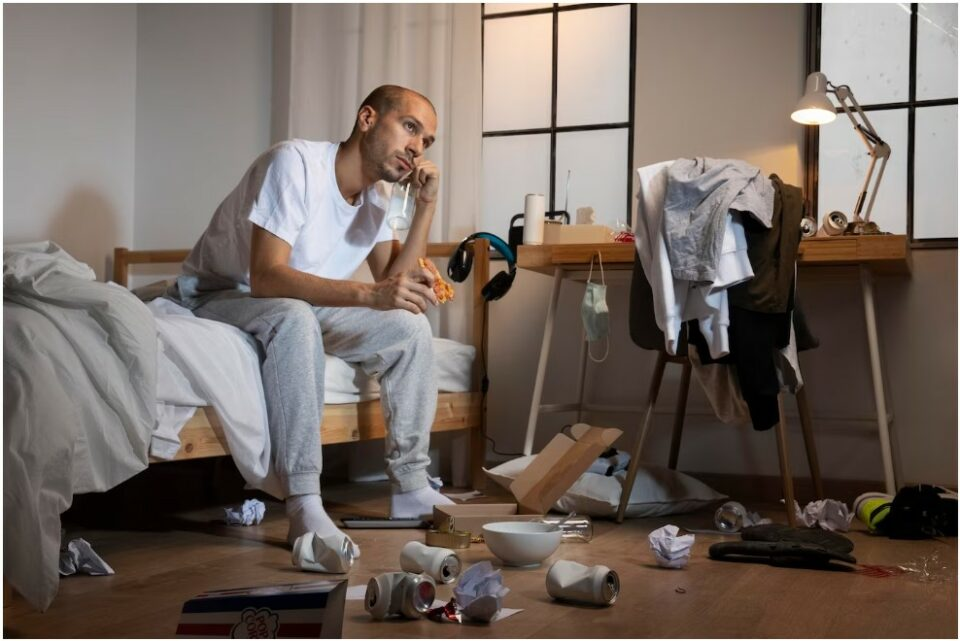
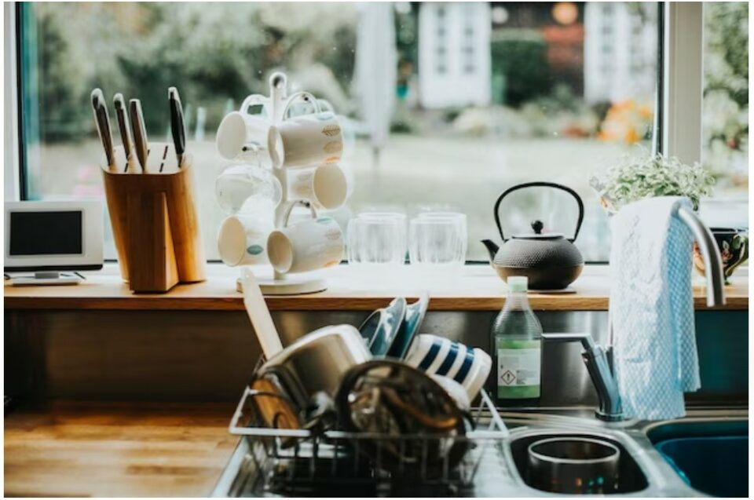
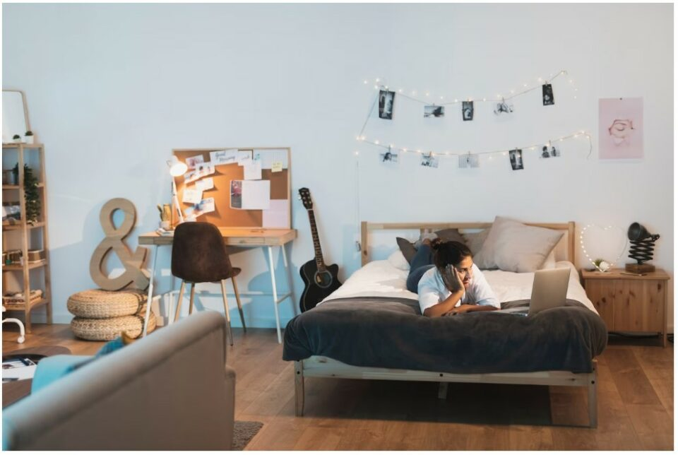
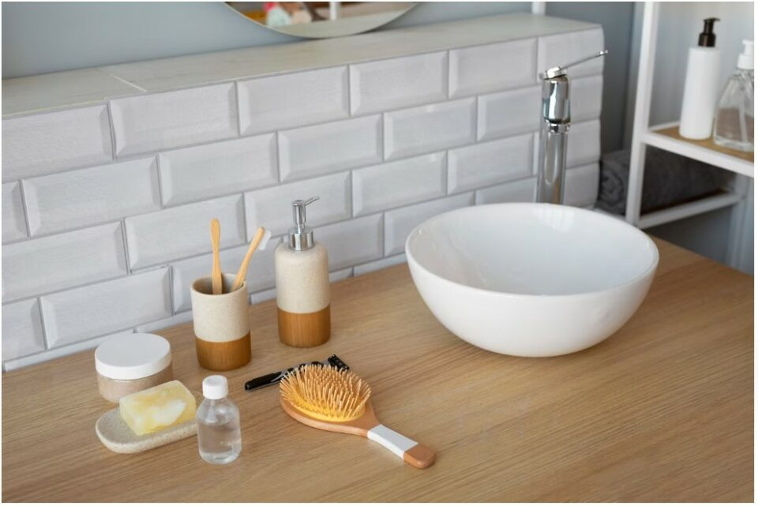
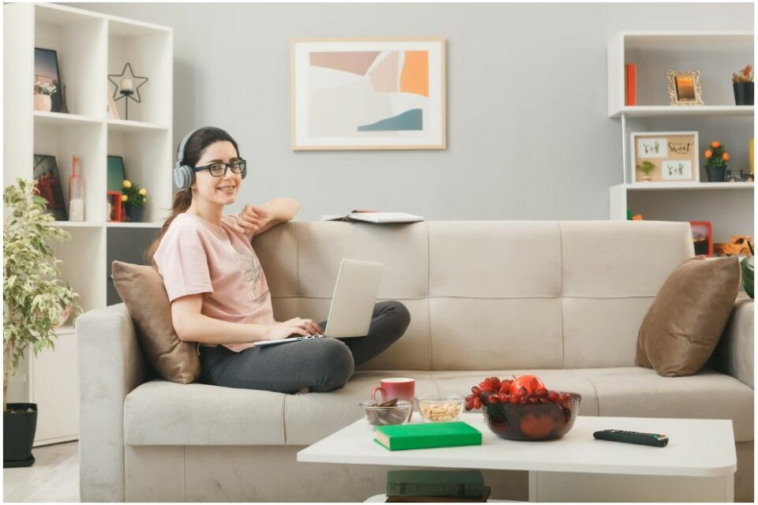
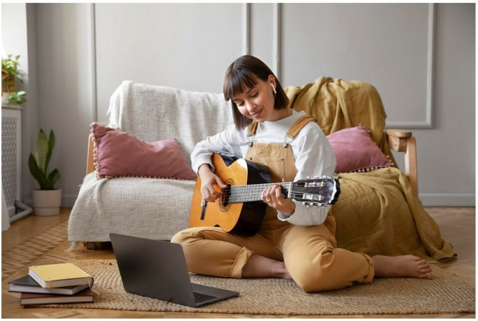

This article has been written and researched by our expert Loveable through a precise methodology. [Learn more about our methodology](https://avada.io/loveable/our-methodological.html)

[Loveable](https://avada.io/loveable/) > [Blog](https://avada.io/loveable/blog/) > [Family](https://avada.io/loveable/family/)

# The Ultimate Guide to Home Organization

Written by [Rose Bryne](https://avada.io/loveable/author/rose/) Last Updated on August 17, 2023

- [Decluttering to get organized](https://avada.io/loveable/blog/home-organization-ideas/#wp-block-heading-2-4)
    - [Why do you need to frequently implement home organization?](https://avada.io/loveable/blog/home-organization-ideas/#wp-block-heading-3-6)
    - [Creative home organization ideas](https://avada.io/loveable/blog/home-organization-ideas/#wp-block-heading-3-14)
- [Room-by-room Organization](https://avada.io/loveable/blog/home-organization-ideas/#wp-block-heading-2-25)
    - [The kitchen](https://avada.io/loveable/blog/home-organization-ideas/#wp-block-heading-3-26)
    - [The bedroom](https://avada.io/loveable/blog/home-organization-ideas/#wp-block-heading-3-34)
    - [The bathroom](https://avada.io/loveable/blog/home-organization-ideas/#wp-block-heading-3-41)
    - [The living room](https://avada.io/loveable/blog/home-organization-ideas/#wp-block-heading-3-48)
- [Maintenance of your organized home](https://avada.io/loveable/blog/home-organization-ideas/#wp-block-heading-2-57)
- [Conclusion](https://avada.io/loveable/blog/home-organization-ideas/#wp-block-heading-2-66)

Home organization is a considerable effort whether you’re downsizing or just wanting to make your life simpler. When you’re overwhelmed, breaking down your decluttering into manageable phases is the greatest strategy. 

Prioritize the cluttered areas in your house by creating a decluttering checklist. Concentrate on only one area, or even one zone inside a room, at a time. Then do every task completely before moving on to the following area.

This is a checklist that you may use as a road map if you intend to organize your house. Clean up every room in your house by reading our **room-by-room guide for guidance and tips**.

## Decluttering to get organized

Decluttering to get organized

### Why do you need to frequently implement home organization?

- There are many perks to owning less stuff. Even yet, taking action is difficult. Up until the main functionalities of clearing clutter start to emerge:
- There is less to clean. Cleaning is obviously a burden, but having to clean around objects you have no emotional connection to makes it much more unpleasant.
- There is less to arrange. Locating stuff becomes much easier. Objects no longer just vanish. Instead of navigating around objects that are in the way, you could move around your home and enjoy the space.
- There is less tension. When your house becomes too cluttered, looking around might be disgusting. Wouldn’t it be lovely to glance around and see a house you adore?
- There will be less debt. Spending less time shopping for material stuff and adding to the clutter keeps your wallet and bank accounts bigger, your credit card balances lower, and your house free of expensive stuff you don’t need.
- Greater financial independence. Decluttering, in conjunction with minimalism, will assist you in saving money to protect yourself in the event of an unforeseen emergency.
- More energy to devote to your most passionate interests. With less debt, greater financial independence, and a clean house, you can now dedicate your time and energy to activities that you like rather than worrying about keeping up with surrounding people. This will eventually make you happy.

### Creative home organization ideas

Creative home organization ideas

If you’re stuck and need help decluttering, you’ll need to be creative with your action plan. To get you started on home organization, here are a few fascinating decluttering tips:

- Begin by taking 5 minutes at a time. If you’re new, even five minutes a day can help you get started with home decluttering.
- Give away one item every day. This would result in the removal of 365 objects from your house each year. If you extended this to two every day, you would have given away 730 things. Raise this number if it becomes too easy.
- Donate any clothes you no longer wear. Just hang all of your items with hangers in the other direction to identify them. When you’ve worn an item, turn the hanger in the proper way. After a few months, throw away the clothes you haven’t worn.
- Consider the 12-12-12 challenge. Find 12 objects to throw, 12 to donate, and 12 to return to their appropriate place.
- Consider your house as if you were a first-time guest. If the house needs improvement, note your initial thoughts on how tidy and arranged it is.
- Photograph a small area before and after. Take an after photo and quickly clean the things in the picture. When you visualize how your home could appear, it’s simpler to start decluttering more of it.
- Get aid from a buddy. Let a friend or family member browse through your home and propose several large items to donate or give away.

**_Related_**: [35 Best Home Decor Gifts That Will Make Up Your Lovely House](https://avada.io/loveable/home-decor-gifts/)

## Room-by-room Organization

### The kitchen

The kitchen

The kitchen serves as the heart of the house. It’s where you prepare and enjoy your food, socialize with friends over a glass of wine, and entertain guests. The kitchen may easily get untidy due to its frequent use. 

You may declutter your kitchen by focusing on one type of item at a time (for example, [cutting boards](https://avada.io/loveable/personalized-cutting-board/), glassware, cutlery, or bakeware) or by going through each zone.

- The first step is to totally empty each space, review each item, and return everything to its proper place. Begin with your most important storage areas, such as the pantry and top cabinets. Then, go to the bottom cabinets, drawers, and space beneath the kitchen sink.
- Next, focus on your countertops. Instead of placing all objects on the counters, you should place as many of them as possible in storage. On the counters, just keep what you use every day.
- Then, take your put-away bin and return any items that don’t belong in the kitchen to their proper storage location elsewhere in the home.
- Get rid of all the different-sized plates and bowls and replace them with a single set. Since all of the dishes are the same size, loading and emptying the dishwasher or draining rack is simple. You never have to move a dish to reach another.

### The bedroom

The bedroom

First and foremost, make your bed. It’s difficult to make any headway in clearing a bedroom when an unmade bed stares you down.

- Begin with the nightstands. Remove everything that does not belong on them and throw it in your trash container. These might contain books you’ve previously read, pens and paper, and mail. Toss away or discard anything you no longer use, such as empty tissue boxes, dried pens, or chargers that no longer function.
- Clean each bureau drawer by drawer. Remove everything. Take everything that is no longer worn and place it in your donation bin. Fold and store the clothing you intend to retain.
- Next, if you have a desk or vanity table in your bedroom, tackle it. Instead of shoving items back into drawers, put them in your put-away bucket. Discard or recycle everything that hasn’t been utilized in more than six months.
- Use the same technique on the tops of your bureaus, dressers, and/or chests. Take close attention to any apparel that may be scattered. Everything that requires folding or hanging goes into the put-away container. You can spread garments out on your bed if you’re concerned they’ll get more wrinkly.

### The bathroom

The bathroom

Because they don’t have a lot of storage space, bathrooms are sometimes forgotten about when arranging. Nevertheless, most of us store a lot of things in these restricted areas.

- Start by checking the medication cabinet. Remove everything, and throw away any expired skincare, cosmetics, or prescription drugs. Restock the cabinet with everything you’re keeping right away, keeping the products you use most frequently at eye level.
- After that, open any cabinet drawers. Take everything out, then swiftly pick what to retain and what to discard. Restock the drawers with the items you want to keep, and then put your most often-used items on top.
- Do the same procedure in the shower or tub now. Lastly, remove anything from below the bathroom sink and clean it out.
- Finally, you can rapidly sort anything that didn’t have a place into the five containers you’ve set up for the job.

### The living room

The living room

One of the most difficult rooms in your house to maintain tidy on a daily basis is the living room. The living room serves as your primary living space, much as the kitchen. Family and friends assemble in this multifunctional area to chat, play games, watch TV, take naps, and do other things.

In addition, living rooms often don’t have a lot of storage space since it is frequently used. No matter how many bookshelves and a TV console you have, they don’t truly hide anything. 

- The secret is to choose permanent storage locations for frequently used goods like remote controls, periodicals, and books and to constantly declutter this space. And to fully declutter a living room, split it into these zones and organize them one at a time.
- Bookcases, consoles, and side tables should come first. Then go to your entertainment center and coffee table. Restore them to their correct storage locations after emptying them and evaluating the goods they hold. Fold blankets, put away books, tidy up mail and other paper clutter, put remote controls back where they go, etc.
- Go to electronics now. Take anything out of the room that is not part of your home theater or television setup. Do you use it? Is it functional? Chargers, [smart home devices](https://avada.io/loveable/smart-home-devices/) and gaming gear should be kept close to where you use them.
- Take on the toys last. Check each toy for signs of wear and tear. Is it still operational? Do your kids still use it for playtime? Store or recycle each toy.
- If anything belongs in another room, get your put-away bin and take it there.

## Maintenance of your organized home

Maintenance of your organized home

Here are a few more general pointers to help you keep your home organization efforts.

- Before you begin organizing, decide how long you will spend doing so – Even one room might need a significant amount of time to organize. Determine how much time you can devote to organizing that specific day before you get started.
- Depending on how much time you have, choose a task – You might be able to go through every drawer in a room if you are prepared to take a few hours to arrange. Choose a fast chore, such as organizing your sock drawer or the cupboard full of water bottles, if you only have 30 minutes.
- Sort objects into those to keep, give, and discard as you move through each area – Each item you abandon or donate reduces the number of things you need to store.
- Keep the order in your space – When you’ve organized a room, make a commitment to spending a few minutes cleaning it up every day to keep the area tidy.
- Get the necessary items – You can maintain organization in your area and make it simpler to locate your possessions by using specialized tools designed to manage particular objects.
- Take into account employing assistance – It might be intimidating to organize a whole house. Get a professional organizer if your finances will allow it. Their experience will facilitate and expedite home organization.

## Conclusion

The most crucial component of organizing, whether you organize your house yourself or hire a professional, is maintenance. Professional organizers follow certain rules, such as putting everything back where it belongs, setting aside time each day to clean up the clutter, and continuing to let go of things you don’t need or prefer. Just following **the simple home organization tips** in this article will help you prevent overwhelming situations and create a worth-living home.

- [Decluttering to get organized](https://avada.io/loveable/blog/home-organization-ideas/#wp-block-heading-2-4)
    - [Why do you need to frequently implement home organization?](https://avada.io/loveable/blog/home-organization-ideas/#wp-block-heading-3-6)
    - [Creative home organization ideas](https://avada.io/loveable/blog/home-organization-ideas/#wp-block-heading-3-14)
- [Room-by-room Organization](https://avada.io/loveable/blog/home-organization-ideas/#wp-block-heading-2-25)
    - [The kitchen](https://avada.io/loveable/blog/home-organization-ideas/#wp-block-heading-3-26)
    - [The bedroom](https://avada.io/loveable/blog/home-organization-ideas/#wp-block-heading-3-34)
    - [The bathroom](https://avada.io/loveable/blog/home-organization-ideas/#wp-block-heading-3-41)
    - [The living room](https://avada.io/loveable/blog/home-organization-ideas/#wp-block-heading-3-48)
- [Maintenance of your organized home](https://avada.io/loveable/blog/home-organization-ideas/#wp-block-heading-2-57)
- [Conclusion](https://avada.io/loveable/blog/home-organization-ideas/#wp-block-heading-2-66)

### [Rose Bryne](https://avada.io/loveable/author/rose/)

Hi, I'm Rose! I love animals and spending time with kids. At Loveable, I help people find unique gifts for special occasions like Valentine's Day, housewarmings, and graduations. I enjoy finding gifts for kids, teens, and animal lovers that match their interests and personalities. Making gift-giving a pleasant experience is my priority. Let me assist you in finding the perfect gift!

- [Twitter](https://twitter.com/intent/tweet)
- [Facebook](https://www.facebook.com/sharer/sharer.php)
- [instagram](https://avada.io/loveable/blog/home-organization-ideas/)
- [pinterest](https://www.pinterest.com/loveablellc/)

## Related Posts

[### 30 Best 4 Year Old Birthday Party Ideas For A Memorable Celebration](https://avada.io/loveable/blog/4-year-old-birthday-party-ideas/) 

[

### 16th Birthday Party Ideas to Make an Unforgettable Day

](https://avada.io/loveable/blog/16th-birthday-party-ideas/)

[

### 150+ Inspirational Birthday Quotes to Spread Joy on Special Day

](https://avada.io/loveable/blog/inspirational-birthday-quotes/)

[

### 160+ Birthday Wishes for Wife to Express Eternal Love

](https://avada.io/loveable/blog/birthday-wishes-for-wife/)

[### 90+ Heart Touching Birthday Wishes for Niece to Make Her Day Extra Special](https://avada.io/loveable/blog/birthday-wishes-for-niece/)
