This article has been written and researched by our expert Loveable through a precise methodology. [Learn more about our methodology](https://avada.io/loveable/our-methodological.html)

[Loveable](https://avada.io/loveable/) > [Blog](https://avada.io/loveable/blog/) > [Holiday](https://avada.io/loveable/holiday/)

# Top 10 Flowers for Mother’s Day to Express Your Love

Written by [Blake Simpson](https://avada.io/loveable/author/blake/) Last Updated on June 09, 2023

- [10 Best Flowers For Mother’s Day](https://avada.io/loveable/blog/best-mothers-day-flowers/#wp-block-heading-2-3)
    - [1\. Roses](https://avada.io/loveable/blog/best-mothers-day-flowers/#wp-block-heading-3-5)
    - [2\. Lilies](https://avada.io/loveable/blog/best-mothers-day-flowers/#wp-block-heading-3-9)
    - [3\. Carnations](https://avada.io/loveable/blog/best-mothers-day-flowers/#wp-block-heading-3-12)
    - [4\. Daisies](https://avada.io/loveable/blog/best-mothers-day-flowers/#wp-block-heading-3-15)
    - [5\. Orchids](https://avada.io/loveable/blog/best-mothers-day-flowers/#wp-block-heading-3-18)
    - [6\. Sunflowers](https://avada.io/loveable/blog/best-mothers-day-flowers/#wp-block-heading-3-21)
    - [7\. Chrysanthemums](https://avada.io/loveable/blog/best-mothers-day-flowers/#wp-block-heading-3-25)
    - [8\. Peonies](https://avada.io/loveable/blog/best-mothers-day-flowers/#wp-block-heading-3-28)
    - [9\. Irises](https://avada.io/loveable/blog/best-mothers-day-flowers/#wp-block-heading-3-31)
    - [10\. Daffodils](https://avada.io/loveable/blog/best-mothers-day-flowers/#wp-block-heading-3-34)
- [6 Tips for creating beautiful flower arrangements](https://avada.io/loveable/blog/best-mothers-day-flowers/#wp-block-heading-2-37)
    - [1\. Determine the type of floral design](https://avada.io/loveable/blog/best-mothers-day-flowers/#wp-block-heading-3-38)
    - [2\. Flowers should be cut and prepared](https://avada.io/loveable/blog/best-mothers-day-flowers/#wp-block-heading-3-40)
    - [3\. Select a clean vase](https://avada.io/loveable/blog/best-mothers-day-flowers/#wp-block-heading-3-43)
    - [4\. Decorate with greeneries](https://avada.io/loveable/blog/best-mothers-day-flowers/#wp-block-heading-3-45)
    - [5\. Add focal flowers](https://avada.io/loveable/blog/best-mothers-day-flowers/#wp-block-heading-3-48)
    - [6\. Add more extra flowers](https://avada.io/loveable/blog/best-mothers-day-flowers/#wp-block-heading-3-50)
- [Conclusion](https://avada.io/loveable/blog/best-mothers-day-flowers/#wp-block-heading-2-53)

We often find it hard to express sincerity for the mother – who is always ready by our side to share and protect her child unconditionally. There is a special occasion – Mother’s Day that honors the selfless love and sacrifice of mothers all over the world. It’s a day to thank and appreciate our moms for everything they do for us, and what better way to do it than with a lovely bouquet of flowers? Flowers have always been a sign of love and appreciation, and the best Mother’s Day flowers may be a meaningful way to show your mom how much she means to you. This blog will introduce the best 10 flowers for Mother’s Day to help you pick the right bouquets.

If you’re stuck for ideas, we’ve got you covered. We’ll go through the significance of each flower, as well as how to arrange them into a lovely bouquet for your mother. Therefore, whether you want to surprise your mother with a gorgeous bouquet for Mother’s Day or you’re just seeking ideas, keep reading to learn about **the best flowers for Mother’s Day and how to utilize them to communicate your love**. Let’s take advantage of beautiful flowers to replace the sincere words you want to say.

## **10 Best Flowers For Mother’s Day**

There are some suggestions as a reference to consider what types of flowers are significant for your Mother.

### [**1\. Roses**](https://www.amazon.com/Hawesome-Artificial-Flowers-Realistic-Decoration/dp/B07ZNVCW8V/?th=1)

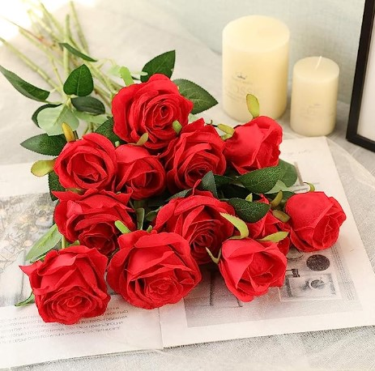

Rose

Roses’ symbolism deeply links to love, giving them an ideal way to express our gratitude and respect for our moms. Roses are not only lovely, but they also represent power, beauty, and resilience, all of which every mother possesses. 

**_Related_**: [Best Valentines Roses To Show Your Love And Appreciation](https://avada.io/loveable/valentines-roses/)

### [**2\. Lilies**](https://www.amazon.com/Asiatic-Lilies-Mix-Pack-Bulbs/dp/B085Q12H7J/)

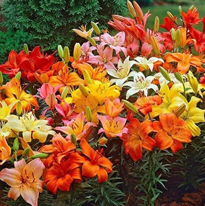

Lilies

Lilies are famous for their delicate beauty and are the ideal way to thank your mother on her special day. Lilies are a popular choice for Mother’s Day because of their gentle smell and exquisite look, reflecting a mother’s pure and unselfish love.

### [**3\. Carnations**](https://www.amazon.com/Benchmark-Bouquets-stem-Rainbow-Carnations/dp/B00KWX5N8Y/)

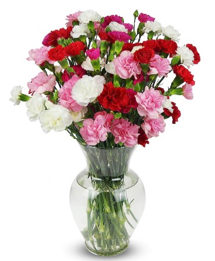

Carnations

Carnations are an everlasting sign of a mother’s love, making them the ideal Mother’s Day gift. They are a genuine way to demonstrate thanks and admiration for the particular woman who has always been there, with their gentle aroma and stunning colors.

### [**4\. Daisies**](https://www.etsy.com/listing/1415270377/daisies-country-floral-arrangement)

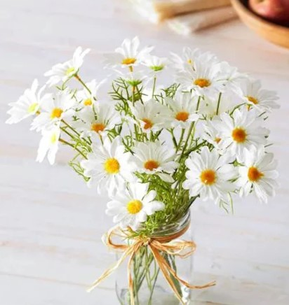

Daisies

Since daisies are frequently linked with purity and innocence, they are a great option for a gift on Mother’s Day. You might combine a bouquet of daisies with a heartfelt card or a personalized gift that demonstrates that you are aware of your mother’s interests and preferences.

### [**5\. Orchids**](https://www.amazon.com/KaBloom-Bouquet-Dendrobium-Orchids-Thailand/dp/B01AMT1282/)

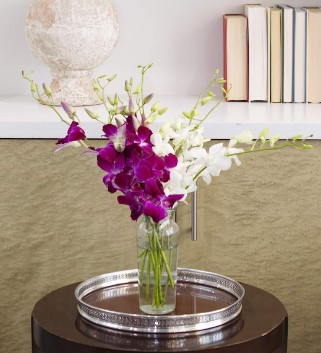

Orchids

Orchids are a varied and breathtakingly gorgeous flower family that comes in a variety of forms, sizes, and colors. Orchids are timeless and cherished flowers that continues to captivate and inspire us, whether given as a gift or admired for their aesthetic appeal.

### [**6\. Sunflowers**](https://www.amazon.com/Benchmark-Bouquets-Flowering-Fields-Flowers/dp/B00KWX688S/r)

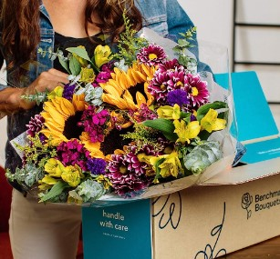

Sunflowers

Sunflowers, with their vibrant color and uplifting meaning, are sure to put a smile on your mother’s face and brighten her day.

_**Related**_: [36 Best Sunflower Gifts For Her That’ll Put A Sun On Her Smile](https://avada.io/loveable/sunflower-gifts-her/)

### [**7\. Chrysanthemums**](https://www.etsy.com/listing/1122563312/chrysanthemum-surprise-collection-live)

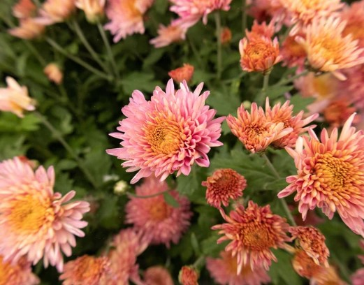

Chrysanthemums

Chrysanthemums, commonly known as mums, are beautiful flowers that are popularly given to mothers on Mother’s Day thanks to their bright beauty

### [**8\. Peonies**](https://www.amazon.com/Nearly-Natural-4689-Arrangement-Assorted/dp/B00B3LL3QU/)

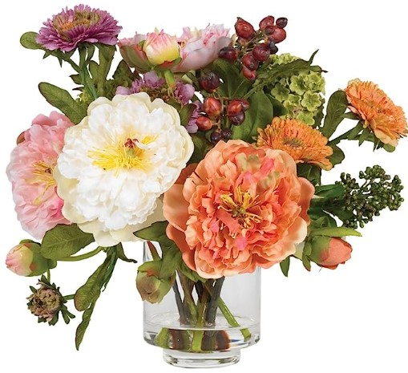

Peonies

Peonies are believed to surprise the most wonderful woman in your life. In the language of flowers, peonies symbolize happiness and good fortune.

### [**9\. Irises**](https://www.etsy.com/listing/769707890/bearded-iris-califlora-colorful-crop-mix)

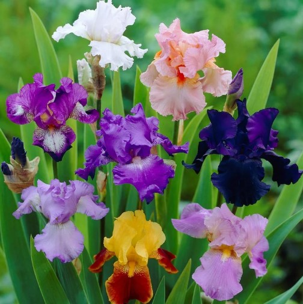

Irises

It would be an omission not to mention it Irises – A type of Flower, with striking beauty and delicate appearance, present for sincerity for your mother.

### [**10\. Daffodils**](https://www.etsy.com/listing/1179995023/daffodil-spring-flowers-daffodil-bouquet)

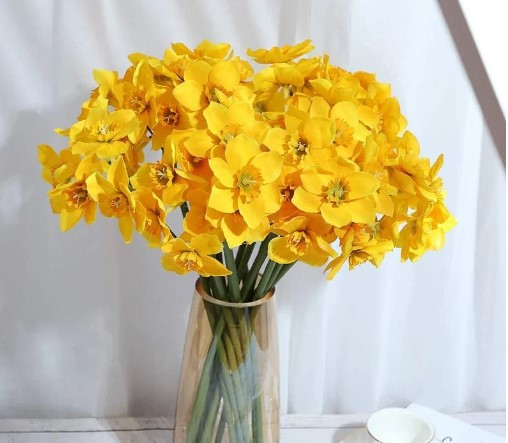

Daffodils

There is a flower that blooms like a dazzling ray of sunshine in the early days of spring, when the snow melts and the earth begins to come alive again. Its name is whispered like a secret, known only to those who truly appreciate its beauty – the [daffodil](https://www.britannica.com/plant/daffodil). 

## **6 Tips for creating beautiful flower arrangements**

### **1\. Determine the type of floral design**

This is one of the most important decisions you must make initially. There are several sorts of flower designs, each with its own distinct traits and techniques. This arrangement is ideal for highlighting a particular type of flower, such as roses or peonies. While selecting the style of floral design for your arrangement, keep the event and venue in mind. You may create a gorgeous and unforgettable flower arrangement that properly reflects the beauty of your selected blossoms by taking the time to identify the style of floral design that best matches your event.

### **2\. Flowers should be cut and prepared**

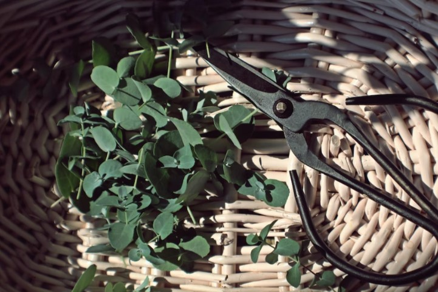

6 Tips for creating beautiful flower arrangements

To begin, select the appropriate tools, like sharp scissors or a flower knife, to assist you in making clean cuts. To increase water absorption and prevent viruses from growing in the water, cut stems at an angle. Next, remove any leaves or thorns that may fall below the waterline to keep the water clean and avoid deterioration.

### **3\. Select a clean vase**

Choosing the correct container is as crucial as choosing the right flowers. Selecting a vase that matches the size and style of the flowers you chose. A clean vase can also help your flowers survive as long as possible. Consider the color and materials of the vase because these factors might affect the overall appearance of your arrangement. One more important thing is the vase you select should highlight your flowers, allowing their beauty to shine through rather than taking all the spotlight.

### **4\. Decorate with greeneries**

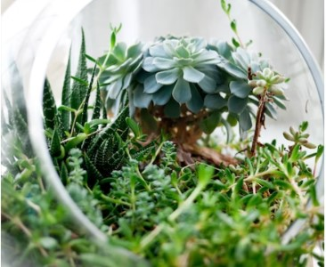

6 Tips for creating beautiful flower arrangements

Adding greenery to the arrangement not only provides texture but also makes the flowers shine. Begin by picking a few different types of greenery that complement the flowers being used to include greenery in the arrangement. Finally, fill up any gaps or empty spots in the arrangement with foliage. With the addition of complimentary foliage, your flower arrangement will be not only gorgeous, but also well-balanced.

### **5\. Add focal flowers**

The focal flowers, which are often larger and showier blooms, are the focal point of your arrangement and bring the eye towards them. To add focal flowers, place them in the center of your arrangement to create a balanced design. To give depth and complexity, work your way outwards, adding smaller blooms and fillers around your central flowers. Experiment with different color combinations and flower forms to create a one-of-a-kind and eye-catching arrangement.

### **6\. Add more extra flowers**

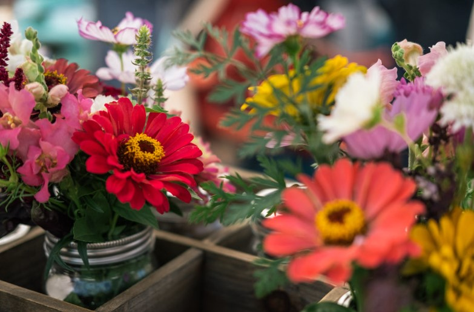

6 Tips for creating beautiful flower arrangements

When you’ve placed your focal flowers and greenery in your arrangement, start adding other flowers to create depth and texture to your design. You should choose smaller flowers with a different texture than your focus blooms to provide visual interest and make your arrangement more dynamic. Search for flowers that highlight the colors and forms of the other flowers in your arrangement. You may also use flowers of various heights and angles to enhance depth and aesthetic appeal.

## **Conclusion**

Flowers have a specific significance that transcends linguistic barriers. For centuries, flowers have been used to convey emotions and express feelings that words alone cannot effectively explain. We may create a personal and unforgettable present for our mothers by carefully selecting the best flowers. Each flower has its own significance and symbolism, which may offer a deeper level of sentiment to the present.

Absolutely! This blog, “**Top 10 Flowers for Mother’s Day to Express Your Love**” is a great resource for anybody searching for unique ways to express their love and gratitude to their mother. Giving flowers on [Mother’s Day](https://avada.io/loveable/mothers-day-poem/) is a long-standing custom that has been embraced for generations and still holds enormous significance in today’s society.

- [10 Best Flowers For Mother’s Day](https://avada.io/loveable/blog/best-mothers-day-flowers/#wp-block-heading-2-3)
    - [1\. Roses](https://avada.io/loveable/blog/best-mothers-day-flowers/#wp-block-heading-3-5)
    - [2\. Lilies](https://avada.io/loveable/blog/best-mothers-day-flowers/#wp-block-heading-3-9)
    - [3\. Carnations](https://avada.io/loveable/blog/best-mothers-day-flowers/#wp-block-heading-3-12)
    - [4\. Daisies](https://avada.io/loveable/blog/best-mothers-day-flowers/#wp-block-heading-3-15)
    - [5\. Orchids](https://avada.io/loveable/blog/best-mothers-day-flowers/#wp-block-heading-3-18)
    - [6\. Sunflowers](https://avada.io/loveable/blog/best-mothers-day-flowers/#wp-block-heading-3-21)
    - [7\. Chrysanthemums](https://avada.io/loveable/blog/best-mothers-day-flowers/#wp-block-heading-3-25)
    - [8\. Peonies](https://avada.io/loveable/blog/best-mothers-day-flowers/#wp-block-heading-3-28)
    - [9\. Irises](https://avada.io/loveable/blog/best-mothers-day-flowers/#wp-block-heading-3-31)
    - [10\. Daffodils](https://avada.io/loveable/blog/best-mothers-day-flowers/#wp-block-heading-3-34)
- [6 Tips for creating beautiful flower arrangements](https://avada.io/loveable/blog/best-mothers-day-flowers/#wp-block-heading-2-37)
    - [1\. Determine the type of floral design](https://avada.io/loveable/blog/best-mothers-day-flowers/#wp-block-heading-3-38)
    - [2\. Flowers should be cut and prepared](https://avada.io/loveable/blog/best-mothers-day-flowers/#wp-block-heading-3-40)
    - [3\. Select a clean vase](https://avada.io/loveable/blog/best-mothers-day-flowers/#wp-block-heading-3-43)
    - [4\. Decorate with greeneries](https://avada.io/loveable/blog/best-mothers-day-flowers/#wp-block-heading-3-45)
    - [5\. Add focal flowers](https://avada.io/loveable/blog/best-mothers-day-flowers/#wp-block-heading-3-48)
    - [6\. Add more extra flowers](https://avada.io/loveable/blog/best-mothers-day-flowers/#wp-block-heading-3-50)
- [Conclusion](https://avada.io/loveable/blog/best-mothers-day-flowers/#wp-block-heading-2-53)

### [Blake Simpson](https://avada.io/loveable/author/blake/)

Hi, I'm Blake from Loveable. I help people find perfect gifts for occasions like anniversaries and weddings. I also write a blog about holidays, sharing insights to make them more meaningful. Let's create unforgettable moments together!

- [Twitter](https://twitter.com/intent/tweet)
- [Facebook](https://www.facebook.com/sharer/sharer.php)
- [instagram](https://avada.io/loveable/blog/best-mothers-day-flowers/)
- [pinterest](https://www.pinterest.com/loveablellc/)

## Related Posts

[### 120+ Christian Birthday Wishes To Spread Your Love](https://avada.io/loveable/blog/christian-birthday-wishes/) 

[

### 35 Best 70th Birthday Ideas To Celebrate The Special Milestone

](https://avada.io/loveable/blog/70th-birthday-ideas/)

[

### 50 Best 30th Birthday Decorations for a Remarkable Birthday Bash

](https://avada.io/loveable/blog/30th-birthday-decorations/)

[

### 40 Delicious Vegan Christmas Desserts to Delight Your Palate

](https://avada.io/loveable/blog/vegan-christmas-desserts/)

[

### 60 Christmas Team Building Activities to Boost Workplace Spirit

](https://avada.io/loveable/blog/christmas-team-building-activities/)
