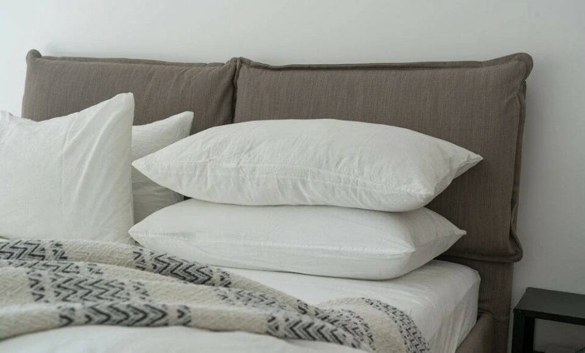
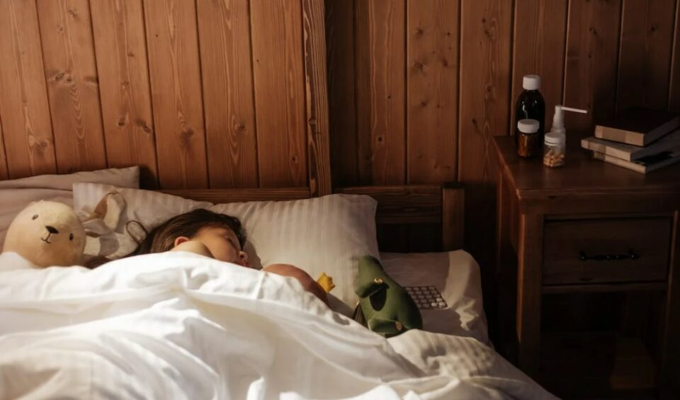
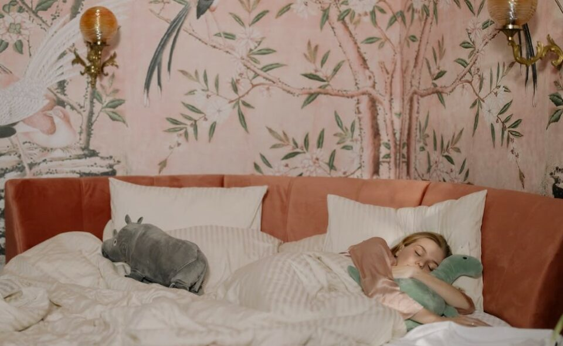
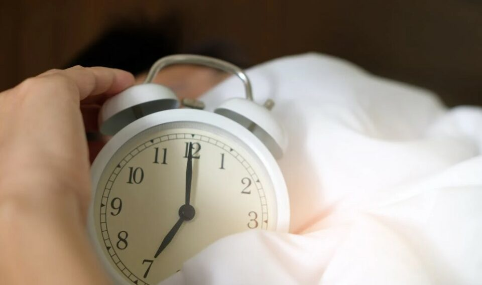
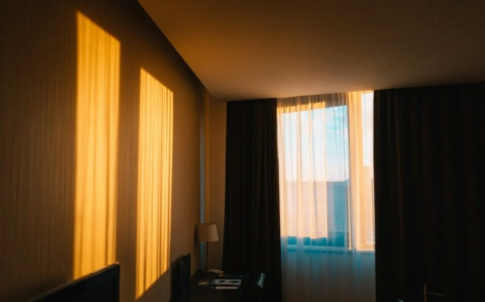
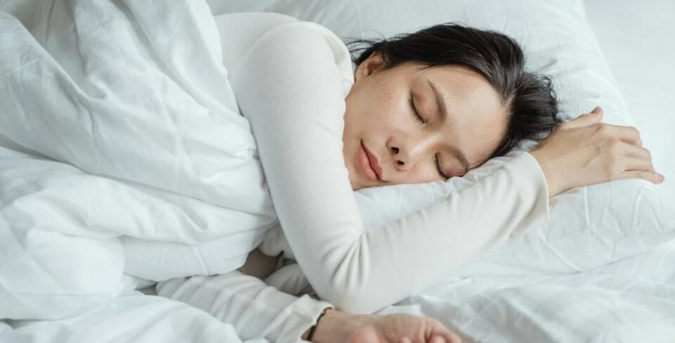
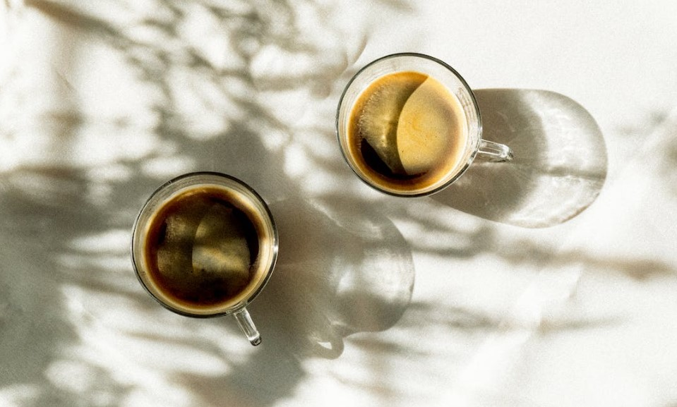
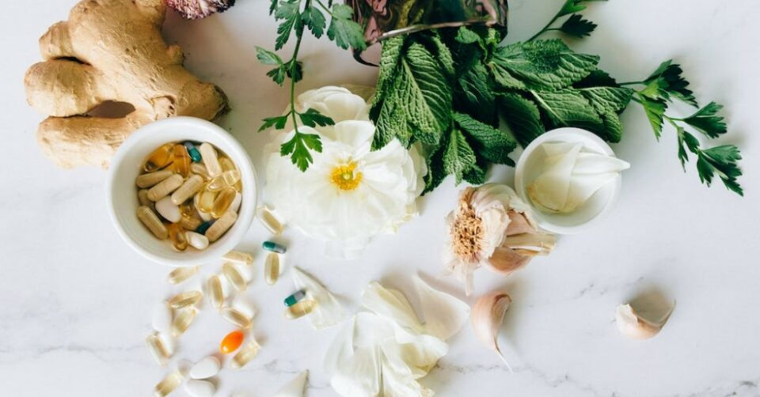
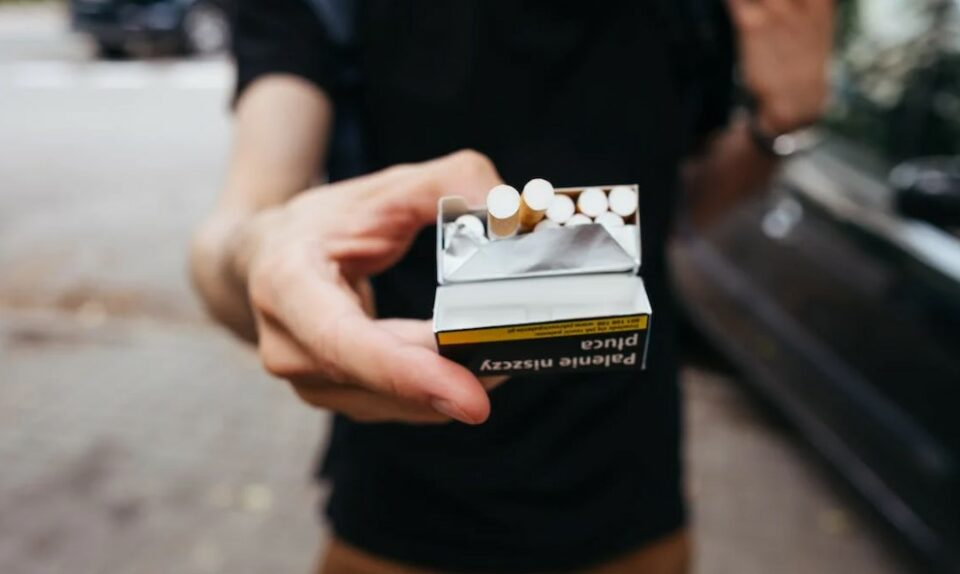
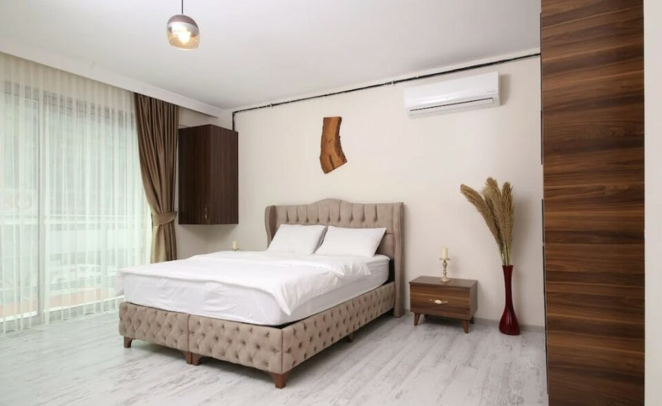

This article has been written and researched by our expert Loveable through a precise methodology. [Learn more about our methodology](https://avada.io/loveable/our-methodological.html)

[Loveable](https://avada.io/loveable/) > [Blog](https://avada.io/loveable/blog/) > [Family](https://avada.io/loveable/family/)

# Top 14 Tips For Better Sleep: Enhance Your Rest And Renewal 

Written by [Rose Bryne](https://avada.io/loveable/author/rose/) Last Updated on September 18, 2023

- [Top 14 Tips For Better Sleep: Enhance Your Rest And Renewal](https://avada.io/loveable/blog/tips-better-sleep/#wp-block-heading-2-3) 
    - [1\. Invest Yourself A Better Mattress And Bedding](https://avada.io/loveable/blog/tips-better-sleep/#wp-block-heading-3-4)
    - [2\. Remove Electronic Devices](https://avada.io/loveable/blog/tips-better-sleep/#wp-block-heading-3-8)
    - [3\. Sleep At Least Seven Hours](https://avada.io/loveable/blog/tips-better-sleep/#wp-block-heading-3-11)
    - [4\. Minimize Surrounding Noise](https://avada.io/loveable/blog/tips-better-sleep/#wp-block-heading-3-14)
    - [5\. Establish An Alarm For The Same Time Every Day](https://avada.io/loveable/blog/tips-better-sleep/#wp-block-heading-3-17)
    - [6\. Block Out Light When You Decide To Sleep](https://avada.io/loveable/blog/tips-better-sleep/#wp-block-heading-3-21)
    - [7\. Noon Naps With 20 Minutes Only!](https://avada.io/loveable/blog/tips-better-sleep/#wp-block-heading-3-24)
    - [8\. Never Consume Caffeine Before Bedtime](https://avada.io/loveable/blog/tips-better-sleep/#wp-block-heading-3-28)
    - [9\. Add A Melatonin Supplement And Additives For Your Sleep](https://avada.io/loveable/blog/tips-better-sleep/#wp-block-heading-3-31)
    - [10\. Abstain From Alcohol, Nicotine and Smoke](https://avada.io/loveable/blog/tips-better-sleep/#wp-block-heading-3-37) 
    - [11\. Take Exercise Regularly — But Not Before Bedtime](https://avada.io/loveable/blog/tips-better-sleep/#wp-block-heading-3-40)
    - [12\. Relax And Clear Your Mind In The Evening, Don’t Overthink!](https://avada.io/loveable/blog/tips-better-sleep/#wp-block-heading-3-43)
    - [13\. Set Your Bedroom Temperature](https://avada.io/loveable/blog/tips-better-sleep/#wp-block-heading-3-46)
    - [14\. Have A Medical Check-Up If Necessary](https://avada.io/loveable/blog/tips-better-sleep/#wp-block-heading-3-49)
- [Bottom Line](https://avada.io/loveable/blog/tips-better-sleep/#wp-block-heading-2-52)

Getting a better sleep holds immense significance when it comes to your well-being. The act of sleeping well plays a crucial role in allowing your body to engage in vital processes of repair and rejuvenation. It thereby significantly contributes to enhancing both your physical vitality and mental acuity. However, achieving restorative sleep has become increasingly challenging in the fast-paced landscape of the contemporary world.

In the face of numerous distractions, and technological stimuli, ensuring a consistent and high-quality sleep can often feel like an uphill task. In this article, we will embark on an exploration of **14 Tips For Better Sleep** that can enhance the quality of your sleep. By integrating our recommendations into your lifestyle, you can proactively establish a sleep routine. It will not only align with your body’s natural circadian rhythms but also foster an environment conducive to profound restfulness.

## **Top 14 Tips For Better Sleep: Enhance Your Rest And Renewal** 

### **1\. Invest Yourself A Better Mattress And Bedding**

It’s crucial to have a mattress that suits your requirements and likes to feel at ease and get better sleep. Putting your money into a mattress and pillow that provides good support is important. It can make sure your back gets the right kind of support and prevent any discomfort. The linens and covers you use also have a significant role in creating a cozy bed atmosphere. Opt for bedding that feels pleasant against your skin and aids in keeping a comfortable temperature throughout the night.

**_See more_**: _32+ [Best Pillows](https://avada.io/loveable/personalized-pillows/) To Get Better Sleep_

### **2\. Remove Electronic Devices**

For better sleep, it’s advisable to minimize screen time on smartphones, and laptops, as they can keep your mind active and hinder relaxation. Additionally, the glow emitted by these gadgets can suppress the natural creation of melatonin. You should disconnect from these devices for at least an hour before bedtime whenever feasible.

### **3\. Sleep At Least Seven Hours**

To enhance sleep quality, it’s important to incorporate the recommended sleep duration into your daily routine. Starting from your established wake-up time, work in reverse and determine a suitable bedtime that permits a minimum of seven hours of sleep. When feasible, allocate extra time before bed to prepare to sleep. Sleeping at least seven hours per day provides you with enough energy to enjoy your day!

### **4\. Minimize Surrounding Noise**

Reducing noise levels significantly contributes to creating a sleep-conducive bedroom environment. If it’s not possible to eliminate external sources of noise, you can use a fan or a device that emits soothing white noise. Alternatively, you can also wear earplugs or headphones to block out disruptive sounds while trying to sleep.

### **5\. Establish An Alarm For The Same Time Every Day**

Establishing a consistent wake-up time is crucial for improving your sleep quality. Your body finds it difficult to adjust to a healthy sleep routine if you frequently wake up at varying hours. Choose a wake-up time and adhere to it consistently, even on weekends or days when the temptation to sleep in arises.

**_See more_**: _35+ Best [Alarm Clocks](https://avada.io/loveable/alarm-clocks-heavy-sleepers/) For Your Morning_

### **6\. Block Out Light When You Decide To Sleep**

To get better sleep, it’s essential to manage your exposure to light effectively. Unwanted light exposure can disrupt your sleep and natural body clock. To counter this, you can use blackout curtains on your windows or wear a sleep mask over your eyes. By avoiding bright light, you can facilitate a smoother transition to bedtime. Moreover, it also supports the production of melatonin – a sleep-promoting hormone in your body.

### **7\. Noon Naps With 20 Minutes Only!**

To enhance the quality of your sleep during the night, it’s important to approach daytime naps with care. While napping can offer benefits such as rejuvenation, improper napping habits can disturb your regular sleep pattern. They can affect your body’s natural sleep-wake cycle, which is challenging to fall asleep at night.

The optimal time for a nap is typically in the early afternoon, shortly after lunch. Napping at this point can help counteract the temporary drop in energy. Furthermore, a nap length of around 20 minutes strikes a balance without delving into the deeper stages of sleep.

### **8\. Never Consume Caffeine Before Bedtime**

Caffeine-containing beverages like coffee, tea, and soft drinks rank among the most widely consumed drinks globally. While some individuals are enticed by the revitalizing effects of caffeine, relying solely on it may lead to a persistent sleep shortage. To prevent such issues, it’s prudent to monitor your caffeine consumption. You should refrain from consuming it later in the day, as it can impede your ability to fall asleep.

### **9\. Add A Melatonin Supplement And Additives For Your Sleep**

Melatonin serves as a crucial sleep hormone that signals your brain when it’s time to unwind and prepare for sleep. Melatonin supplements are widely popular aids for promoting sleep. In a particular study, taking 2 mg of melatonin before bedtime led to better sleep and increased energy the following day.

Melatonin also proves valuable for managing sleep adjustments while traveling and adapting to new time zones. Also, it aids in restoring your body’s natural circadian rhythm.

A recommended dose is around 1–5 mg, taken 30–60 minutes before bedtime. It’s advisable to start with a small dose to gauge your response and gradually increase it if required.

**_See more_**: [_Appealing Gifts, Sweet Dreams_](https://avada.io/loveable/sleep-gifts/)

### **10\. Abstain From Alcohol, Nicotine and Smoke** 

Alcohol effects make it appealing as a pre-sleep drink for certain individuals. Nonetheless, alcohol’s impact on the brain can diminish sleep quality. Besides, smoke exposure, even secondhand, is linked to various sleep-related issues. Some can be counted as trouble initiating sleep and disrupted sleep patterns. Nicotine, especially when used in the evening, is a disruptor of sleep too.

### **11\. Take Exercise Regularly — But Not Before Bedtime**

Engaging in regular physical activity brings about numerous health advantages. The alterations it triggers in energy and body temperature can foster better sleep. However, strenuous workouts right before bedtime are generally discouraged. The reason is they might impede your body’s capacity to naturally wind down before sleep.

### **12\. Relax And Clear Your Mind In The Evening, Don’t Overthink!**

Achieving a state of comfort greatly facilitates the process of falling asleep. Calm reading, gentle stretching, and enjoying calming music are effective for better sleep. Instead of fixating on falling asleep, direct your attention towards relaxation. Bear in mind that bedtime is not for overthinking to clear your mind and prepare to sleep well.

### **13\. Set Your Bedroom Temperature**

You wouldn’t want the temperature in your bedroom to become a source of disturbance. Whether it’s too warm or too chilly, you may not find it easy to get better sleep. While the perfect temperature can differ per person, it is suggested that a cooler sleeping environment is beneficial for optimal sleep. You can set it roughly between 65 and 68 degrees.

### **14\. Have A Medical Check-Up If Necessary**

For comprehensive guidance on severe sleep issues, your doctor is the most qualified source. If you notice a deterioration in your sleep problems in the long term, you should have a conversation with your doctor. They can offer further insights, as well as address any underlying conditions through appropriate treatment.

## **Bottom Line**

Getting better sleep is within reach with our **14 Tips For Better Sleep**. From fostering a sleep-friendly environment to a mindful lifestyle, this article can help you optimize your sleep. Learn to create an ideal sleep haven, make exercise work for your sleep, and find the right bedtime routine. These tips offer a holistic approach to achieving the rejuvenating sleep you deserve.

- [Top 14 Tips For Better Sleep: Enhance Your Rest And Renewal](https://avada.io/loveable/blog/tips-better-sleep/#wp-block-heading-2-3) 
    - [1\. Invest Yourself A Better Mattress And Bedding](https://avada.io/loveable/blog/tips-better-sleep/#wp-block-heading-3-4)
    - [2\. Remove Electronic Devices](https://avada.io/loveable/blog/tips-better-sleep/#wp-block-heading-3-8)
    - [3\. Sleep At Least Seven Hours](https://avada.io/loveable/blog/tips-better-sleep/#wp-block-heading-3-11)
    - [4\. Minimize Surrounding Noise](https://avada.io/loveable/blog/tips-better-sleep/#wp-block-heading-3-14)
    - [5\. Establish An Alarm For The Same Time Every Day](https://avada.io/loveable/blog/tips-better-sleep/#wp-block-heading-3-17)
    - [6\. Block Out Light When You Decide To Sleep](https://avada.io/loveable/blog/tips-better-sleep/#wp-block-heading-3-21)
    - [7\. Noon Naps With 20 Minutes Only!](https://avada.io/loveable/blog/tips-better-sleep/#wp-block-heading-3-24)
    - [8\. Never Consume Caffeine Before Bedtime](https://avada.io/loveable/blog/tips-better-sleep/#wp-block-heading-3-28)
    - [9\. Add A Melatonin Supplement And Additives For Your Sleep](https://avada.io/loveable/blog/tips-better-sleep/#wp-block-heading-3-31)
    - [10\. Abstain From Alcohol, Nicotine and Smoke](https://avada.io/loveable/blog/tips-better-sleep/#wp-block-heading-3-37) 
    - [11\. Take Exercise Regularly — But Not Before Bedtime](https://avada.io/loveable/blog/tips-better-sleep/#wp-block-heading-3-40)
    - [12\. Relax And Clear Your Mind In The Evening, Don’t Overthink!](https://avada.io/loveable/blog/tips-better-sleep/#wp-block-heading-3-43)
    - [13\. Set Your Bedroom Temperature](https://avada.io/loveable/blog/tips-better-sleep/#wp-block-heading-3-46)
    - [14\. Have A Medical Check-Up If Necessary](https://avada.io/loveable/blog/tips-better-sleep/#wp-block-heading-3-49)
- [Bottom Line](https://avada.io/loveable/blog/tips-better-sleep/#wp-block-heading-2-52)

### [Rose Bryne](https://avada.io/loveable/author/rose/)

Hi, I'm Rose! I love animals and spending time with kids. At Loveable, I help people find unique gifts for special occasions like Valentine's Day, housewarmings, and graduations. I enjoy finding gifts for kids, teens, and animal lovers that match their interests and personalities. Making gift-giving a pleasant experience is my priority. Let me assist you in finding the perfect gift!

- [Twitter](https://twitter.com/intent/tweet)
- [Facebook](https://www.facebook.com/sharer/sharer.php)
- [instagram](https://avada.io/loveable/blog/tips-better-sleep/)
- [pinterest](https://www.pinterest.com/loveablellc/)

## Related Posts

[### 30 Best 4 Year Old Birthday Party Ideas For A Memorable Celebration](https://avada.io/loveable/blog/4-year-old-birthday-party-ideas/) 

[

### 16th Birthday Party Ideas to Make an Unforgettable Day

](https://avada.io/loveable/blog/16th-birthday-party-ideas/)

[

### 150+ Inspirational Birthday Quotes to Spread Joy on Special Day

](https://avada.io/loveable/blog/inspirational-birthday-quotes/)

[

### 160+ Birthday Wishes for Wife to Express Eternal Love

](https://avada.io/loveable/blog/birthday-wishes-for-wife/)

[### 90+ Heart Touching Birthday Wishes for Niece to Make Her Day Extra Special](https://avada.io/loveable/blog/birthday-wishes-for-niece/)
