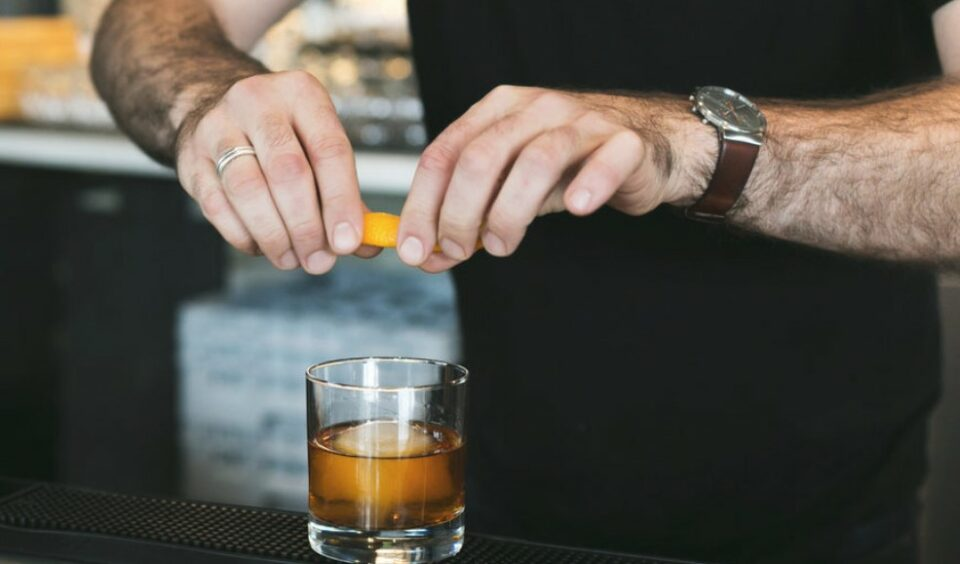
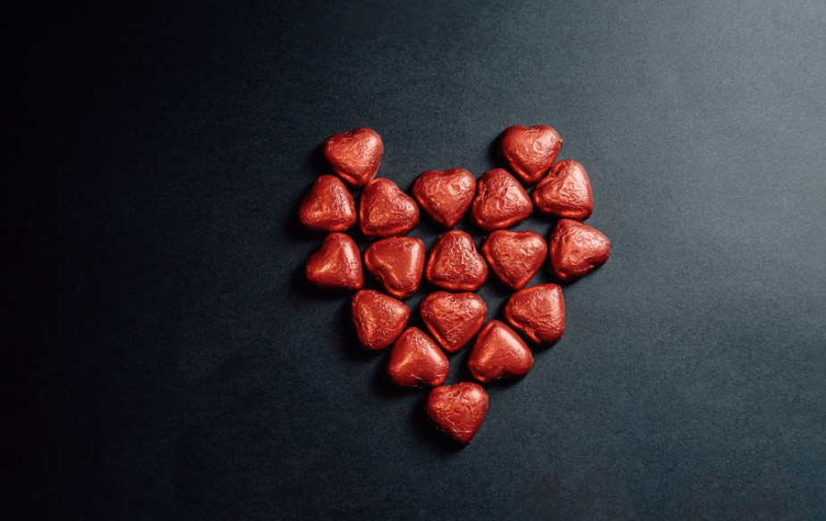
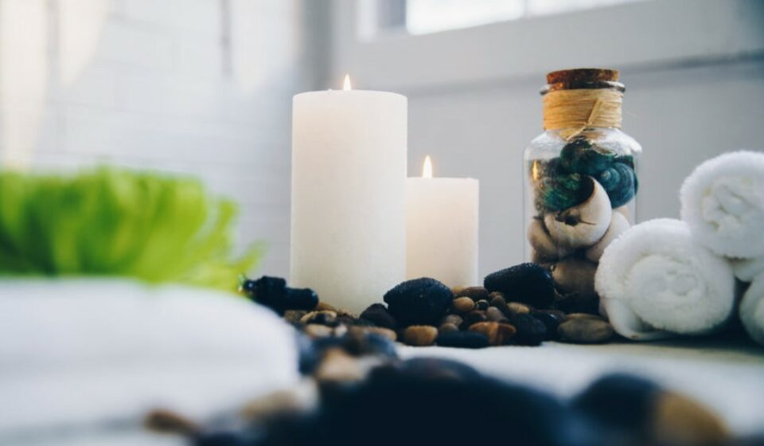

This article has been written and researched by our expert Loveable through a precise methodology. [Learn more about our methodology](https://avada.io/loveable/our-methodological.html)

[Loveable](https://avada.io/loveable/) > [Blog](https://avada.io/loveable/blog/) > [Holiday](https://avada.io/loveable/holiday/)

# Top 14 Valentine’s Day At-Home Ideas To Celebrate With Your Lovers

Written by [Blake Simpson](https://avada.io/loveable/author/blake/) Last Updated on August 21, 2023

- [Why is celebrating Valentine’s at home ideal for couples?](https://avada.io/loveable/blog/valentines-day-at-home-ideas/#wp-block-heading-2-3)
- [Top 14 Valentine’s day at-home ideas to celebrate with your lovers](https://avada.io/loveable/blog/valentines-day-at-home-ideas/#wp-block-heading-2-8)
    - [Make a playlist for your soulmate](https://avada.io/loveable/blog/valentines-day-at-home-ideas/#wp-block-heading-3-9)
    - [Netflix and Chill](https://avada.io/loveable/blog/valentines-day-at-home-ideas/#wp-block-heading-3-12)
    - [Set up a breakfast date on the bed](https://avada.io/loveable/blog/valentines-day-at-home-ideas/#wp-block-heading-3-16)
    - [Set up an indoor picnic](https://avada.io/loveable/blog/valentines-day-at-home-ideas/#wp-block-heading-3-20) 
    - [Flowers, flowers, and flowers](https://avada.io/loveable/blog/valentines-day-at-home-ideas/#wp-block-heading-3-24)
    - [Set up a romantic dinner by yourself](https://avada.io/loveable/blog/valentines-day-at-home-ideas/#wp-block-heading-3-29)
    - [Become the in-home bartender](https://avada.io/loveable/blog/valentines-day-at-home-ideas/#wp-block-heading-3-33)
    - [Play board games](https://avada.io/loveable/blog/valentines-day-at-home-ideas/#wp-block-heading-3-38)
    - [Create a special photobook](https://avada.io/loveable/blog/valentines-day-at-home-ideas/#wp-block-heading-3-42)
    - [Gather cute things into a love box](https://avada.io/loveable/blog/valentines-day-at-home-ideas/#wp-block-heading-3-50)
    - [Enjoy wine and chocolate.](https://avada.io/loveable/blog/valentines-day-at-home-ideas/#wp-block-heading-3-54)
    - [Make chocolate together](https://avada.io/loveable/blog/valentines-day-at-home-ideas/#wp-block-heading-3-58)
    - [Set up a home spa together](https://avada.io/loveable/blog/valentines-day-at-home-ideas/#wp-block-heading-3-62)
    - [Just talk!](https://avada.io/loveable/blog/valentines-day-at-home-ideas/#wp-block-heading-3-75)
- [Wrapping Up](https://avada.io/loveable/blog/valentines-day-at-home-ideas/#wp-block-heading-2-80)

Let’s face it: [Valentine’s Day](https://avada.io/loveable/what-is-valentines-day/) might bring up more anxiety than feelings of love for certain people. Because Valentine’s Day is considered the “most romantic day of the year,” there is often a lot of pressure to celebrate it in a grand manner by having dinner at a fancy restaurant, dancing, receiving flowers and Champagne, and so on. In other words, it can be a lot of work to plan your schedule and money to spend, which can prevent you from appreciating the true meaning of the day. 

For this reason, many people choose to celebrate in a manner that is more conducive to being at home. To our good fortune, there has never been a time when there were more possibilities for enjoying a nice date night at home than there are right now. That’s why in today’s tutorial, we will show you the top 14 **valentine’s day at-home ideas** to [celebrate with your lovers](https://avada.io/loveable/what-to-do-on-valentines-day/). So, let’s dive in!

## Why is celebrating Valentine’s at home ideal for couples?

Some couples find great joy in commemorating their love on Valentine’s Day by engaging in a personal gift-giving exchange that may include greeting cards, flowers, [personalized candies](https://avada.io/loveable/personalized-candy/), and even jewelry. For other couples, Valentine’s Day is just another day of the year, and they choose to express their love in ways that are less planned and, as a result, less expensive throughout the year.

However, it is difficult to avoid the feeling of impending doom that comes with marketing for Valentine’s Day. This marketing makes it seem as though the only way to show your significant other that you care is to purchase them a present. Those who are already struggling with loss or isolation on Valentine’s Day may experience an intensified sense of exclusion and isolation as a result of this holiday.

If a Valentine’s Day meal at an expensive restaurant in a busy restaurant leaves you feeling fatigued, it may be time to try something that has less of a public profile. On the other side, you could long for a night out like this yet be unable to arrange for a babysitter. The good news is that organizing a Valentine’s Day celebration at home can be just as romantic — or even more romantic — than planning a celebration outside the home. This is because you and your partner can tailor the atmosphere of the celebration to match the activities you have planned for the evening.

**_Related_**: [How To Celebrate Valentines Day: 18 Romantic Ways For Couples](https://avada.io/loveable/romantic-ways-to-celebrate-valentines-day/)

## Top 14 Valentine’s day at-home ideas to celebrate with your lovers

### **Make a playlist for your soulmate**

You always have the option of making a romantic playlist for any of your relationships that you wish to take to the next level. Music for you and your significant other to listen to when you are eating Caprese and drinking sparkling apple cider from [champagne](https://avada.io/loveable/gifts-champagne-lovers/) glasses while enjoying Valentine’s Day in your bed. This idea is extremely romantic!

Spend some time with one another on your preferred streaming service and create playlists for each other to listen to. Select melodies that will appeal to your lover but also serve the purpose of bringing back fond memories of the two of you together. After that, pour yourself a glass of wine, put on some music, and reflect on the past.

### **Netflix and Chill**

Do you see a trend emerging here? Letters of affection and movies showed on projectors. When it comes to movie night, having a projector in your own house is a huge advantage. Purchasing one is a good idea not only for Valentine’s Day but also for date evenings throughout the rest of the year.

After that, all that is required of you is to connect your phone or laptop to the internet, open [Netflix](https://avada.io/loveable/netflix-gifts/) or another streaming platform of your choosing, and then purchase the snacks that are most beloved by your companion. Go into town and pick up some adorable popcorn holders while you’re there.

### **Set up a breakfast date on the bed**

When you wake up, and your eyes meet for the first time on Valentine’s Day, give your soulmate a kiss (or whatever you like, haha), and then insist that they continue to sleep in while you prepare a romantic breakfast for the two of you in the kitchen.

The single most important thing you can do in this circumstance is to show the other person that you care about them, that you listen to what they have to say, and that you respect the fact that they are alive. Include their chosen beverage on the breakfast tray, in addition to a [handwritten message](https://avada.io/loveable/write-a-love-letter/) that includes either the phrase “I love you” or some other significant remark of your choosing.

### **Set up an indoor picnic** 

Do you want to have a Valentine’s Day supper that everyone will remember this year? It is customary for the majority of couples to enjoy going out to a fancy restaurant for supper. However, due to the crowded and overwhelming situation of almost all fancy restaurants, setting up an indoor picnic is an ideal activity for your memorable day. 

Since we are familiar with the “stay-at-home” date with in-home delivery services, setting up an indoor picnic is as easy as a piece of cake! Pop up a [bottle of wine](https://avada.io/loveable/gifts-for-wine-lovers/) or Champagne and get out your beautiful glasses for an added touch of elegance if you want to liven things up a bit. But if you want to serve a beverage that does not include alcohol and you have children, make some hot chocolate for everyone. 

If you don’t already have a picnic basket, we recommend that you invest in one that comes complete with a set of utensils, napkins, and glasses. In addition, in order to get the most out of your picnic experience, you should dress in adorable summer attire, such as flowery dresses, gingham shirts, sandals, and hats. Now would be a good time to turn on the television and tune in for a marathon of the most romantic films Hollywood has ever produced. Which film do you like seeing the most?

### **Flowers, flowers, and flowers**

Flowers have been associated with Valentine’s Day for as long as anybody can remember. It is not necessary to create elaborate and showy flower arrangements for Valentine’s Day in order to demonstrate your affection for a special someone.

They might be as easy as purchasing the type of flower that is your Valentine’s preference and then arranging the flowers in an attractive vase. Rather than keeping the flowers in the cellophane box they came in; taking the effort to place them in a vase instead will be a kind gesture that your significant other will appreciate more than you would realize. They will be especially impressed when they find out that you made them a [Valentine’s Day bouquet](https://avada.io/loveable/valentines-day-chocolate-bouquet/) instead of buying one from the store (although that is always an appreciated gesture, even if flower arranging isn’t your cup of tea). They will be especially impressed when they find out that you made them a Valentine’s Day bouquet.

When it comes to arranging flowers, be sure to follow this formula: height plus cluster plus hero. Always center your attention on one flower that will serve as the centerpiece of the bouquet; it might be the one that your Valentine likes most. Choose a flower or filler that has height and structure to it as the next component of your arrangement. In conclusion, while you are arranging the flowers in your vase, rather than having many hero blooms together in one place, cluster a mix of blooms and fillers together. This will give the arrangement more depth. 

### **Set up a romantic dinner by yourself**

When you go out to a beautiful restaurant, there is often a particular “ambiance” that makes it distinctive. This is something that you should look for. You want to get the same effect in your own kitchen. You want to make your Valentine’s Day dinner more special by preparing it at home, but you also want it to stand out from the other meals you typically have there.

When planning a romantic meal for two at home on Valentine’s Day, it is important to give careful consideration to the menu. If you have a passion for the kitchen, don’t be afraid to “chef it up”! Do not make the mistake of attempting to create a meal on par with that of a five-star restaurant if you are not someone who enjoys cooking. The point of having a romantic dinner at home is to spend quality time with your significant other, not to wow them with your culinary skills. You’ll just wind up feeling stressed out and overwhelmed, which is the opposite of what we want to accomplish here!

Keep things straightforward and ask for assistance wherever it’s needed. You may still have a romantic evening at home by setting the table with candles and bringing in takeout cuisine to savor all by yourself. What can you do to make the Valentine’s Day dinner you’re having at home with your significant other a little more “special”? Do you still have the champagne glasses that you used to raise a glass to the happy couple during the toast at your wedding? Get them out of there!

### **Become the in-home bartender**

It is vitally necessary for any relationship to maintain its romantic spark. No matter how long you’ve been married or how recently you fell in love, it’s important to remember that even the smallest gestures may go a long way. This is especially true if your partner longs for one-on-one attention or for you to perform kind deeds for them. The same goes for your cocktail game; similar to the last example, taking those additional measures for presentation may actually go a long way. Because of this, we have broken down these techniques and methods that are guaranteed to amaze your spouse.

We’ve got you covered if you want to wash down your drinks with a glass of wine. When drinking red wine, a wine glass with a large, rounded bowl is preferable. Because red wines are often more robust, it is best to serve them in glasses with wider bowls so that they have more room to “breathe.” 

If you are serving a white wine, you should use glasses with a narrower hole to trap the aromas and tastes, and you should use stems to hold your glasses so that you do not warm the wine with the heat from your hands. Are you popping the cork on a bottle of sparkling wine or Champagne? Then you should start playing the flutes.

### **Play board games**

There is a lot of love in the room, as well as on the shelf with the board games. This Valentine’s Day, let yourself fall in love with some of the best board games. These love-themed board games will provide you with a plethora of possibilities, whether you want to rekindle the flames of passion or simply enjoy a night in with your significant other to unwind. If Cupid hasn’t aimed his bothersome bow at you yet, there’s no need for you to worry because many of these activities may also be played with a buddy.

Because, as the saying goes, “couples who play together, stay together,” you should pour yourself a glass of wine and have the chocolate hearts ready. It may sound improbable, but playing board games with that special someone who is sitting across the table from you may be an excellent way to have an intimate encounter. The perfect game may provide an opportunity to cooperate with others, compete against others, get to know someone better, and have experiences that will last a lifetime. Although a great number of board games have dealt with the subject of sexuality, very few have been able to adequately capture the essence of love.

_**Related**_: [28 Gifts for Board Game Lovers Even Picky Players Will Love](https://avada.io/loveable/gifts-board-game-lovers/)

### **Create a special photobook**

The act of sharing a narrative through the medium of a photo book is unforgettable. Whether it’s the tale of a major event or significant day, a fantastic trip, an entire year spent at home, or even a lifetime of love, it’s such a beautiful thing to be able to display a large number of lovely photo memories all in one location.

Be sure to include any photographs that you have that were taken on your very first date or those that you took when you went back to the place where you had your very first date in the album that you created for Valentine’s Day. Make notes on the relevant pages of the book to keep track of crucial dates or locations.

You and your significant other make a good-looking couple, and you are aware of this fact because one of your most cherished photographs is presently set as the lock screen on your smartphone. Look through all of your photographs and select the ones that are your absolute favorites. When you are putting together your photo book for Valentine’s Day, next to each photo, you should include a page of text on which you describe what it is about the photo that you particularly enjoy.

Create a picture fairy tale about your engagement on Valentine’s Day if you and your lover are planning to get married in the near future. First things first, put your love tale in writing. Then, when you are putting together your picture book, intersperse it with photographs that bring your narrative to life. Obviously, the phrase “Once upon a time…” comes first in the story.

The first child, the first house, the first car—the list of significant life events that you and your spouse have been able to experience together goes on and on. These images are precious; you should have a [personalized book](https://avada.io/loveable/personalized-book/) made out of them all, and the topic of the book should be “milestones.”

### **Gather cute things into a love box**

Obviously, you can’t just use any old box to store anything as valuable as these priceless relics. Are you looking for a Valentine’s Day box idea that is both adorable and simple?

Giving your beloved a gift box may be a lot of fun, and if we’re being really honest here, it’s also one of the most simple things you might offer them. There is a wide selection of pre-made gift boxes available for purchase for Lover’s Day. These gift boxes include things like meat and cheese, chocolate and cookies, and whole spaghetti meals, all of which are guaranteed to put a smile on the face of your Valentine.

Give your beloved savory biscuits as a present rather than anything sweet if you know that they aren’t a fan of sweets. Pimento cheese, buttermilk biscuits, cheese, chives biscuits, and cinnamon biscuits are all included in the gift box. And because the biscuits have already been baked, all you have to do to serve them is heat them up. This means that rather than giving your Valentine a box of biscuits as a present, you can serve them to them as part of a charming breakfast-in-bed spread instead.

### **Enjoy wine and chocolate.**

Wine aficionados would likely concur that a Valentine’s Day must-have is the combination of wine and chocolate. When put together in the right proportions, these two things are a combination that could only have been made in paradise. However, because chocolate has both sweet and bitter qualities, this culinary pairing can frequently result in a conflict. Having said that, chocolate and wine aren’t always the easiest things to pair. A wine that is robust enough to stand up to the intensity of chocolate is the ideal pairing.

The combination of dark chocolate and red wine is one of the most traditional combinations in the world of wine and chocolate pairings. This is due to the fact that foods that have a bittering impact (such as dark chocolate) will make your wine taste fruitier, resulting in a combination that is well-balanced and pleasurable. If you ate a piece of milk chocolate with, for example, a Cabernet Sauvignon that has a high tannin content, the combination may make the wine taste drier and more bitter than expected. 

### **Make chocolate together**

Even without getting into the history of the relationship between Valentine’s Day and chocolates, it is easy to understand why chocolate is the preferred way to communicate love on Valentine’s Day. Chocolate exudes an attraction that is, at its core, exotically romantic; it’s essentially an edible proclamation of love that makes the recipients of chocolate feel unique and unquestionably gratified. 

This charm is what gives chocolate its allure. The chocolate is beautiful in appearance, texture, and flavor. This exquisite liquid not only liquefies in our mouths in an explosion of tastes but also liquefies our emotions in a state of utter contentment. On Valentine’s Day, chocolate and red roses are the second most popular presents to give to a special someone. This is probably the primary reason for this preference.

You have probably heard tales about elderly folks, particularly war veterans, who hid the love letters of their significant others in chocolate boxes and stored them in the attics or basements of their homes. Only for their offspring to discover these love messages in chocolate boxes decades later when they were looking for something else entirely. As a result, if you want to have a memorable Valentine’s Day with your significant other, you might try making chocolate together at home.

### **Set up a home spa together**

Have you ever taken your soulmate on a day trip to the spa? What about holding one at your house? If not, you should think about doing something extra special and a little bit different this Valentine’s Day by turning your own home into a luxurious spa. At the very least, you should consider making some of these treatments to give as gifts (they look stunning when packaged in pretty containers and put in a gift bag or box). Your love will undoubtedly be felt by that one unique person in your life.

In our experience, the greatest spas are havens of peace and quiet, where the primary focuses are on unwinding and feeling refreshed. It seems as though the entire attention is being directed toward you and how happy you are. 

Then why not carry that kind of experience back with you to your everyday life? Here are some tips:

- Give your sweetie a handwritten menu of the various spa treatments that they may anticipate receiving from you. 
- Prepare a nice tray for yourself and arrange all of your spa services on it. 
- Place a pair of clean slippers, a bathrobe that has been freshly laundered, and fluffy towels that have just emerged from the dryer on the table.
- Diffuse some essential oils, or burn some candles specifically designed for aromatherapy. (Tailor the aroma to your sweetheart’s tastes and preferences. For instance, if a flowery aroma such as a rose is out of the question, then perhaps a perfume that is more earthy, minty, or citrusy would be more appropriate)
- Showcase a dish filled with rose petals. However, if your sweetie isn’t into flowers, you may try giving them something else, such as lemon peels or lavender buds. (You may then make use of them later in a relaxing bath.)
- Provide wholesome refreshments to eat and drink, such as spa water.
- Play some music suited for a spa.
- Place an all-new bar of high-end soap in the bathtub or shower and place it over a clean washcloth.

### **Just talk!**

“Love without conversation is impossible.”

Conversations that are more personal and in-depth enable deeper connections, contribute to a greater mutual understanding, and strengthen our ability to empathize with one another. It is beneficial to both our physical and emotional health, as well as to the reduction of stress that it causes. 

Consider giving the gift of conversation to those you care about on Valentine’s Day, whether it be your significant other, your friends, your parents, or your children. Being authentically connected to another person is the single most joyful and therapeutic thing that can happen to our spirits. On Valentine’s Day, you shouldn’t overlook the candies and flowers, but you should also think about giving the gift of dialogue. One of the most meaningful things we can do for other people is to make room in our life for them to experience being listened to, loved, acknowledged, and understood.

**_Related_**: [30+ Things to Do on Valentine Day to Store Memorable Moments](https://avada.io/loveable/things-to-do-on-valentine-day/)

## Wrapping Up

So, those are some creative **valentine’s day at-home ideas** that could surprise and delight your partners. You’re probably familiar with the saying that goes, “Home is where the heart is.” Why, then, would you celebrate Valentine’s Day somewhere else? While other people are rushing about to make dinner reservations and book pricey vacations, you can kick back, relax, and have a wonderful romantic evening in the convenience of your own home.

- [Why is celebrating Valentine’s at home ideal for couples?](https://avada.io/loveable/blog/valentines-day-at-home-ideas/#wp-block-heading-2-3)
- [Top 14 Valentine’s day at-home ideas to celebrate with your lovers](https://avada.io/loveable/blog/valentines-day-at-home-ideas/#wp-block-heading-2-8)
    - [Make a playlist for your soulmate](https://avada.io/loveable/blog/valentines-day-at-home-ideas/#wp-block-heading-3-9)
    - [Netflix and Chill](https://avada.io/loveable/blog/valentines-day-at-home-ideas/#wp-block-heading-3-12)
    - [Set up a breakfast date on the bed](https://avada.io/loveable/blog/valentines-day-at-home-ideas/#wp-block-heading-3-16)
    - [Set up an indoor picnic](https://avada.io/loveable/blog/valentines-day-at-home-ideas/#wp-block-heading-3-20) 
    - [Flowers, flowers, and flowers](https://avada.io/loveable/blog/valentines-day-at-home-ideas/#wp-block-heading-3-24)
    - [Set up a romantic dinner by yourself](https://avada.io/loveable/blog/valentines-day-at-home-ideas/#wp-block-heading-3-29)
    - [Become the in-home bartender](https://avada.io/loveable/blog/valentines-day-at-home-ideas/#wp-block-heading-3-33)
    - [Play board games](https://avada.io/loveable/blog/valentines-day-at-home-ideas/#wp-block-heading-3-38)
    - [Create a special photobook](https://avada.io/loveable/blog/valentines-day-at-home-ideas/#wp-block-heading-3-42)
    - [Gather cute things into a love box](https://avada.io/loveable/blog/valentines-day-at-home-ideas/#wp-block-heading-3-50)
    - [Enjoy wine and chocolate.](https://avada.io/loveable/blog/valentines-day-at-home-ideas/#wp-block-heading-3-54)
    - [Make chocolate together](https://avada.io/loveable/blog/valentines-day-at-home-ideas/#wp-block-heading-3-58)
    - [Set up a home spa together](https://avada.io/loveable/blog/valentines-day-at-home-ideas/#wp-block-heading-3-62)
    - [Just talk!](https://avada.io/loveable/blog/valentines-day-at-home-ideas/#wp-block-heading-3-75)
- [Wrapping Up](https://avada.io/loveable/blog/valentines-day-at-home-ideas/#wp-block-heading-2-80)

### [Blake Simpson](https://avada.io/loveable/author/blake/)

Hi, I'm Blake from Loveable. I help people find perfect gifts for occasions like anniversaries and weddings. I also write a blog about holidays, sharing insights to make them more meaningful. Let's create unforgettable moments together!

- [Twitter](https://twitter.com/intent/tweet)
- [Facebook](https://www.facebook.com/sharer/sharer.php)
- [instagram](https://avada.io/loveable/blog/valentines-day-at-home-ideas/)
- [pinterest](https://www.pinterest.com/loveablellc/)

## Related Posts

[### 120+ Christian Birthday Wishes To Spread Your Love](https://avada.io/loveable/blog/christian-birthday-wishes/) 

[

### 35 Best 70th Birthday Ideas To Celebrate The Special Milestone

](https://avada.io/loveable/blog/70th-birthday-ideas/)

[

### 50 Best 30th Birthday Decorations for a Remarkable Birthday Bash

](https://avada.io/loveable/blog/30th-birthday-decorations/)

[

### 40 Delicious Vegan Christmas Desserts to Delight Your Palate

](https://avada.io/loveable/blog/vegan-christmas-desserts/)

[

### 60 Christmas Team Building Activities to Boost Workplace Spirit

](https://avada.io/loveable/blog/christmas-team-building-activities/)
