This article has been written and researched by our expert Loveable through a precise methodology. [Learn more about our methodology](https://avada.io/loveable/our-methodological.html)

[Loveable](https://avada.io/loveable/) > [Blog](https://avada.io/loveable/blog/) > [Holiday](https://avada.io/loveable/holiday/)

# Top 25 Christmas Flowers and Plants for a Scent-sational Christmas

Written by [Blake Simpson](https://avada.io/loveable/author/blake/) Last Updated on September 07, 2023

- [Top 25 Christmas Flowers and Trees for a Scent-sational Christmas](https://avada.io/loveable/blog/christmas-flowers/#wp-block-heading-2-4)
    - [Poinsettia](https://avada.io/loveable/blog/christmas-flowers/#wp-block-heading-3-5)
    - [Cymbidium](https://avada.io/loveable/blog/christmas-flowers/#wp-block-heading-3-9)
    - [Candy Cane Amaryllis](https://avada.io/loveable/blog/christmas-flowers/#wp-block-heading-3-13)
    - [Tulips in the Snow](https://avada.io/loveable/blog/christmas-flowers/#wp-block-heading-3-17)
    - [Helleborus Niger](https://avada.io/loveable/blog/christmas-flowers/#wp-block-heading-3-21)
    - [Christmas Cactus](https://avada.io/loveable/blog/christmas-flowers/#wp-block-heading-3-25)
    - [Rosemary](https://avada.io/loveable/blog/christmas-flowers/#wp-block-heading-3-29)
    - [Cyclamen](https://avada.io/loveable/blog/christmas-flowers/#wp-block-heading-3-33)
    - [Holly and Evergreens](https://avada.io/loveable/blog/christmas-flowers/#wp-block-heading-3-37)
    - [Pear Tree (Pyrus communis)](https://avada.io/loveable/blog/christmas-flowers/#wp-block-heading-3-41)
    - [Yuletide Camellia (Camellia Sasanqua ‘Yuletide’)](https://avada.io/loveable/blog/christmas-flowers/#wp-block-heading-3-44)
    - [White Azalea](https://avada.io/loveable/blog/christmas-flowers/#wp-block-heading-3-47)
    - [Balsam Fir (Abies balsamea)](https://avada.io/loveable/blog/christmas-flowers/#wp-block-heading-3-51)
    - [Juniper](https://avada.io/loveable/blog/christmas-flowers/#wp-block-heading-3-55)
    - [Red Roses](https://avada.io/loveable/blog/christmas-flowers/#wp-block-heading-3-59)
    - [Winter Honeysuckle (Lonicera fragrantissima)](https://avada.io/loveable/blog/christmas-flowers/#wp-block-heading-3-63)
    - [Anthurium Flamingo Flower](https://avada.io/loveable/blog/christmas-flowers/#wp-block-heading-3-67)
    - [Paperwhites](https://avada.io/loveable/blog/christmas-flowers/#wp-block-heading-3-71)
    - [Norfolk Island Pine](https://avada.io/loveable/blog/christmas-flowers/#wp-block-heading-3-75)
    - [Mistletoe](https://avada.io/loveable/blog/christmas-flowers/#wp-block-heading-3-79)
    - [Bromeliad](https://avada.io/loveable/blog/christmas-flowers/#wp-block-heading-3-83)
    - [Yew (Taxus spp)](https://avada.io/loveable/blog/christmas-flowers/#wp-block-heading-3-87)
    - [Dried Burgundy Eucalyptus](https://avada.io/loveable/blog/christmas-flowers/#wp-block-heading-3-91)
    - [Mini Christmas Tree](https://avada.io/loveable/blog/christmas-flowers/#wp-block-heading-3-95)
    - [Blue spruce](https://avada.io/loveable/blog/christmas-flowers/#wp-block-heading-3-99)
- [In Conclusion,](https://avada.io/loveable/blog/christmas-flowers/#wp-block-heading-2-106)

Experiencing the illumination of your home is truly unmatched, filling you with a festive spirit.

Christmas flowers and plants serve as delightful enhancements to your decor, infusing your abode with a refreshing wintry charm that effortlessly complements other green elements, such as your Christmas tree and wreaths.

In this blog, we will be showcasing the beloved **Christmas flowers and plants**, along with the top choices for a wonderfully aromatic Christmas celebration.

## **Top 25 Christmas Flowers and Trees for a Scent-sational Christmas**

### **Poinsettia**

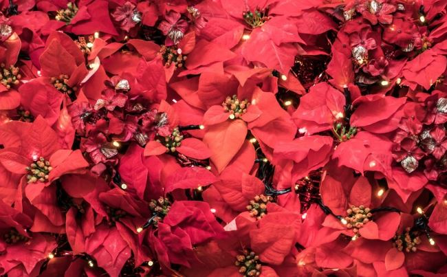

Looking for Christmas decoration ideas? Look no further than poinsettias, the epitome of the holiday season. These winter blooms are not only low-maintenance but also thrive in a warm spot with indirect sunlight. 

As long as you keep the soil moist, it will remain in perfect condition throughout the winter. Whether you want to send a Christmas care package to loved ones or adorn your mantel, poinsettia flowers are a wonderful choice. They come in decorative planters, arriving in buds and blooms. To ensure they last all season, discover how to care for poinsettias.

### **Cymbidium**

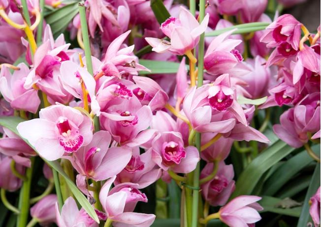

During the Christmas season, you’ll frequently find Cymbidium orchids adorning homes as a highly decorative and beautiful variety of orchids. Their stunning flower spikes make an eye-catching addition to any space and are surprisingly easy to care for. 

Often referred to as ‘boat orchids,’ they are the oldest cultivated orchids, dating back to evidence of cultivation in China over 2,500 years ago. Don’t miss the opportunity to bring these splendid orchids into your home and experience firsthand why they are one of the most beloved Christmas plants.

### **Candy Cane Amaryllis**

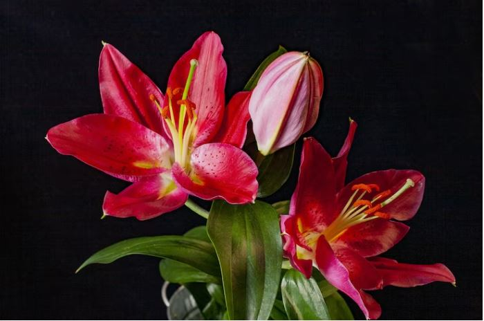

Ensure this candy cane amaryllis graces every Christmas table this year. This forced bulb boasts a delightful festive charm, blooming in the heart of winter, and it’s adored during the holidays for its striking resemblance to a candy cane. 

Delivered in a carefully lined, decorative box to prevent any water leakage, this bulb takes approximately four to eight weeks to blossom. Make sure to place your order in November, and you’ll witness its beautiful blooms just in time for Christmas. For an even sweeter gift, pair it with some Christmas chocolates. Welcome to the enchanting candy cane lane!

### **Tulips in the Snow**

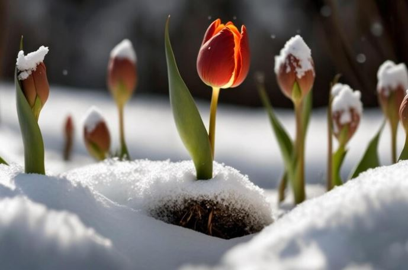

Look no further than BloomsyBox for all your holiday flower and gift needs. They have a diverse selection, ranging from fresh evergreen wreaths to dazzling flower bouquets and potted plants. 

Among their offerings, the “Tulips in the Snow” bouquet has captured our hearts this season. Adorned with white tulips, cedar, and fir boughs, this arrangement is both simple and stunning, with neutral tones that effortlessly complement any tablescape. It makes for the perfect hostess gift! 

### **Helleborus Niger**

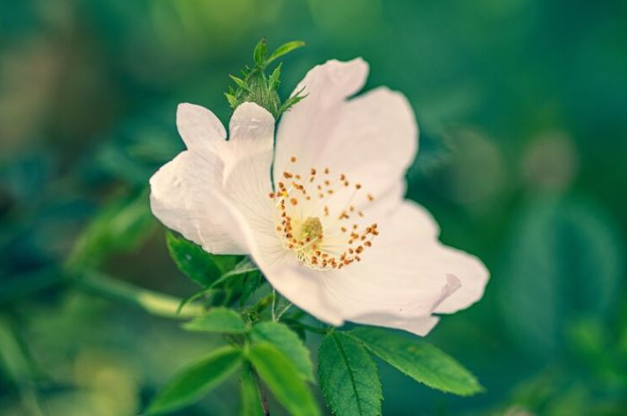

Famously referred to as the ‘Christmas Rose’, the Helleborus niger showcases magnificent, round, white flat-faced flowers that rise above low-growing mounds of leathery, deep green foliage. 

With the arrival of warmer weather, it generously produces masses of bright white flowers on short stems. However, it’s crucial to bear in mind that all parts of the Helleborus plant are toxic to both humans and pets. Despite this, it remains an incredibly stunning and popular choice for Christmas celebrations.

### **Christmas Cactus**

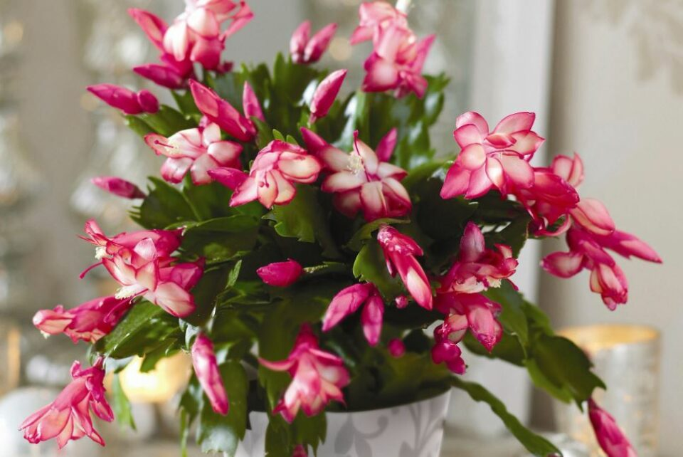

Transform your beloved succulent into a Christmas delight with the Christmas cactus, a winter essential hailing from the tropical realms of South American jungles. Though it blooms just once a year, its ideal fit for the holiday season lies in its ability to flourish in cooler temperatures. 

Remember to keep these cacti away from heat sources! To gauge their water needs, simply check if the top half of the soil is dry, and when it is, water the plant until the top is saturated, allowing it to dry again before the next watering. By the way, have you heard of succulent Christmas trees? They’re an adorable trend for holiday decorations!

### **Rosemary**

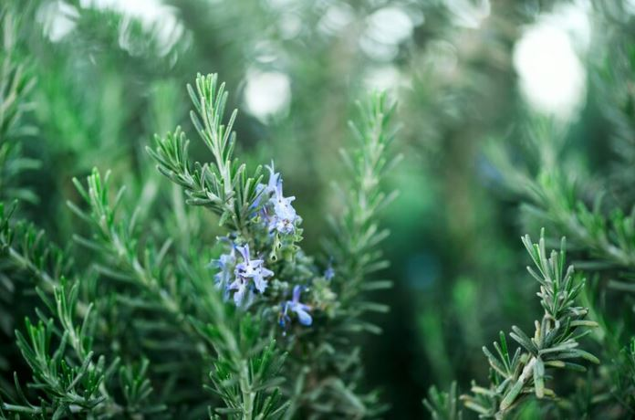

Rosemary goes beyond being a delectable herb for cooking; it also stands as one of the finest Christmas plant gifts. Even though rosemary’s growth slows down during winter, it effortlessly illuminates any space with holiday charm. Our adoration for this rosemary plant knows no bounds. You can personalize your gift by choosing the pot color and size, and it even comes with plant food to ensure its vitality.

To ensure optimal growth, place the rosemary plant near a light source. If natural light falls short (less than six to eight hours per day), consider using a fluorescent light bulb to supplement it. Remarkably, rosemary doesn’t demand excessive watering as it naturally absorbs moisture from the air. Ideally, water it only when the top soil feels dry to the touch, yet not entirely parched (approximately once a week).

### **Cyclamen**

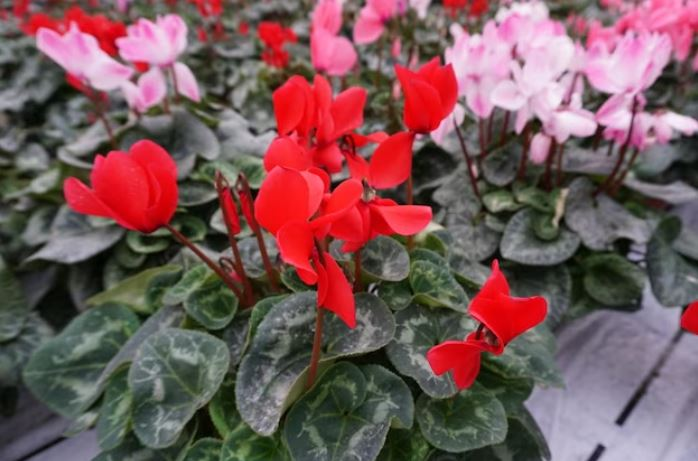

Cyclamen is a popular holiday plant, adored for its lovely blooms that grace the season’s festivities. These plants are perfect for table arrangements, boasting exquisite white, pink, or red petals resembling delicate butterflies. To encourage their blossoming, they prefer cooler temperatures and can grace us with their presence for up to six months if kept cool. 

Notably, their silver-frosted leaves add a touch of elegance. However, they go dormant during the summer months due to their intolerance for warmer temperatures. But fret not, as this perennial delights us year after year, returning with an abundance of blossoms.

### **Holly and Evergreens**

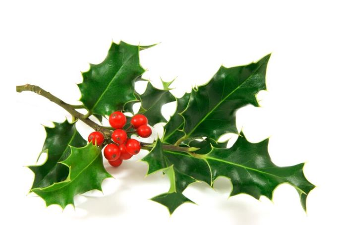

To bring forth holiday cheer, there’s nothing like keeping holly berries vibrant and close by. And why not add a touch of evergreens and pine cones to enhance the festive spirit even further? 

Holly and evergreens are among the finest seasonal flowers and plants to craft your own delightful arrangements. You can conveniently order fresh bunches, like the holly and evergreen centerpiece we offer, just in time to adorn your home with winter decor. 

### **Pear Tree (Pyrus communis)**

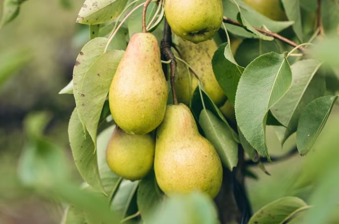

While a partridge might not be in your plans, growing a pear tree can be just as rewarding. Pear trees come in early, mid-season, and late-season varieties, offering a harvest that can extend well into late fall, and sometimes even winter, depending on the climate. Their late harvest makes them a common sight in holiday dishes. 

### **Yuletide Camellia (Camellia Sasanqua ‘Yuletide’)**

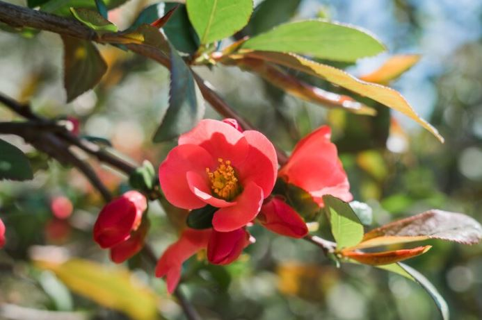

Camellia, an evergreen shrub, showcases an oval to pyramidal shape, growing to around 6 to 10 feet in height and width. Its dark green foliage graces us with beautiful winter flowers in certain climates. The Yuletide variety, in particular, boasts vibrant red blooms that add a festive touch to the Christmas season. 

### **White Azalea**

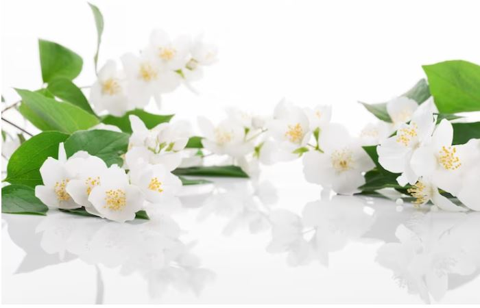

Exuding elegance, delicacy, and a delightful festive aura, white azaleas feature delicate trumpet blooms. This exquisite white azalea arrangement not only makes a charming gift but also arrives in a beautiful ceramic planter while still in the budding stage. As a perennial, it can be replanted outdoors, providing year-round blooms to enjoy.

To ensure its thriving beauty, place the white azalea in a location with indirect bright light, avoiding direct sunlight. For optimal care, opt for clean, distilled water twice a week to keep it blooming at its best.

### **Balsam Fir (Abies balsamea)**

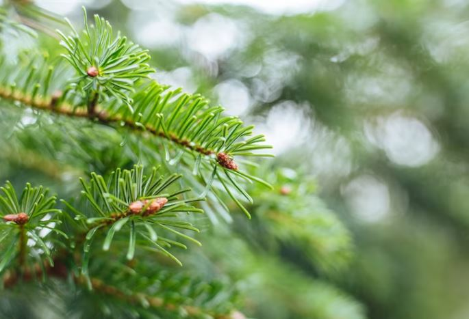

The balsam fir stands as the epitome of the Christmas tree tradition. Its robust evergreen scent, deep blue-green needles, and elegant conical shape captures the essence of the holiday spirit. Moreover, its excellent needle retention makes it an ideal choice for crafting wreaths as well. For successful growth, balsam first require good soil drainage, while adding mulch around the base helps retain essential moisture.

Young trees should be watered deeply approximately once a week, whereas established trees only need watering during extended periods of drought. By providing the right care, you can enjoy the timeless beauty and fragrance of the balsam fir as the centerpiece of your Christmas celebrations.

### **Juniper**

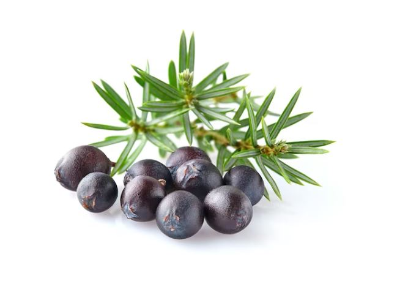

Juniper bushes have become associated with Christmas due to their evergreen needles and delightful scent. They come in various forms, including small shrubs, trees, and low-growing ground coverings, and some even use them as Christmas trees.

One of the reasons why juniper is highly favored during the holiday season is its low-maintenance nature. Young plants might require staking until they become established to ensure they grow upright. Additionally, they prefer consistently moist soil without becoming waterlogged. However, mature juniper plants are quite self-sufficient and generally require minimal care.

### **Red Roses**

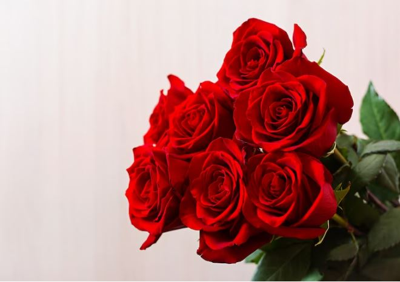

A Christmas classic, the bouquet of red roses holds an irresistible charm all year round, but they become even more enchanting during the holiday season. Treat yourself or surprise a loved one with this stunning flower arrangement, perfectly presented in a glass vase. 

Whether it’s a [Christmas gift for mom](https://avada.io/loveable/christmas-gift-idea-mom/), your significant other, sister, grandma, or anyone in need of an early dose of holiday magic, these red roses are sure to bring joy and delight to the season.

### **Winter Honeysuckle (Lonicera fragrantissima)**

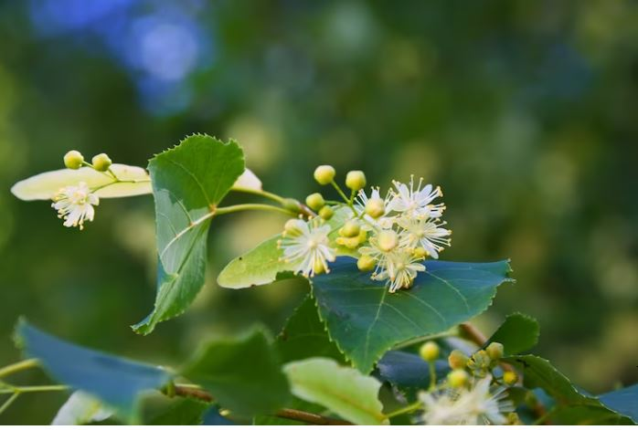

Winter honeysuckle brings delight to the winter garden, creating a striking contrast against the drab, gray overcast days with its snow-white or cream-colored flowers. Its winter blooms release a pleasant and sweet fragrance, adding an enchanting touch to the season.

Additionally, this lovely shrub features dark green evergreen leaves and small, bright red berries, enhancing its allure and making it a captivating sight throughout the colder months.

### **Anthurium Flamingo Flower**

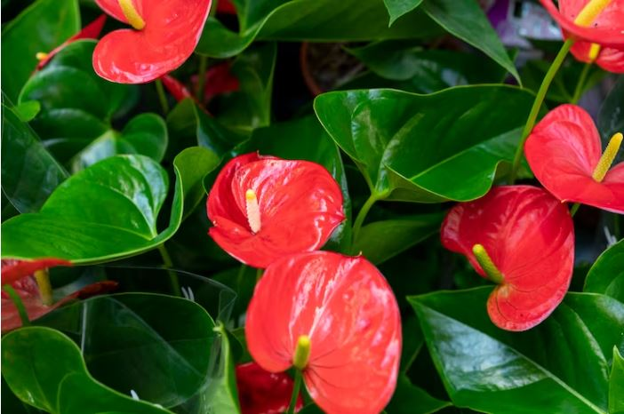

While the term “flamingo flower” may not immediately evoke Christmas, this exquisite blossom is, in fact, a popular holiday plant that infuses your indoors with tropical vibes. Pink Anthuriums stand out as one of the finest Christmas plants due to their preference for indirect light. 

Moreover, their glossy blooms and lush green leaves flawlessly complement the glitz and glam of the holiday season. To ensure its vibrancy, the plant thrives with regular watering throughout the week, though observing the topsoil closely is essential. Only water the plant again when the topsoil dries slightly.

### **Paperwhites**

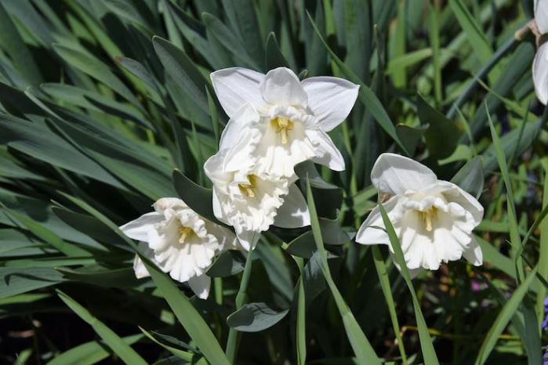

The paperwhite takes the spotlight on the beloved Christmas flowers cultivated indoors during winter. Sporting tall green stalks adorned with clusters of tiny, fragrant, and dazzling white blossoms add elegance to any setting. All you need to do is place the bulbs in a container with water and gravel, patiently waiting for them to sprout. 

To ensure a Christmas bloom, begin the process in November, as it typically takes four to six weeks from planting to flowering. When you notice the roots starting to grow, transplant the pot to a sunny window for the best results and enjoy the beauty of these delightful paperwhites during the festive season.

### **Norfolk Island Pine**

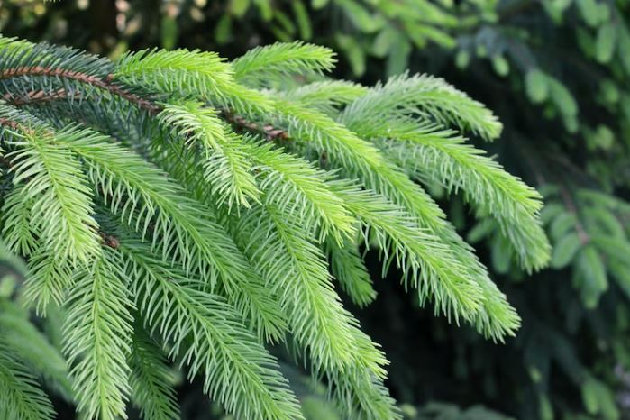

Embrace the spirit of the Christmas forest within the confines of your home with a Norfolk Island pine plant. This pint-sized gem serves as an ideal alternative to a traditional Christmas tree, and its tropical nature allows it to flourish indoors throughout the year. You can have it delivered in a beautiful pot of your choice, selecting the color and size that suits your taste.

Being a low-maintenance Christmas plant, this little pine requires watering only once every one to two weeks or when the topsoil shows signs of dryness. For its optimal growth, ensure it basks in medium to bright indirect light. This delightful Norfolk Island pine is sure to bring a touch of evergreen charm to your holiday decor and beyond.

### **Mistletoe**

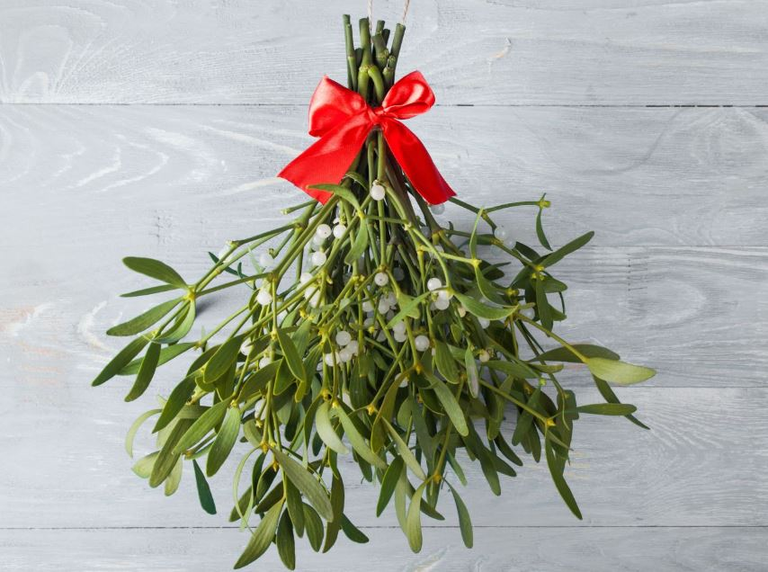

Exchanging a holiday kiss under the mistletoe has become a cherished tradition. Mistletoe naturally forms interactions with other plants, and the female plants produce abundant white berries, while their foliage remains evergreen. 

These mistletoe plants require minimal upkeep, but beginning with a sturdy, mature host tree is essential. Interestingly, mistletoe ranks among the most popular Christmas plants worldwide. Moreover, historically, mistletoe has symbolized romance, fertility, and vitality, adding an extra layer of significance to its holiday presence.

### **Bromeliad**

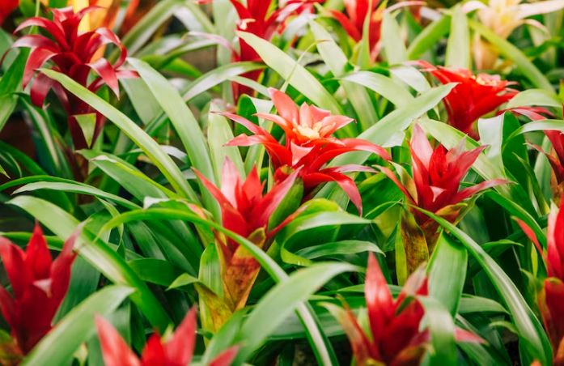

Surprising but true, you can now purchase Christmas flowers on Amazon! Thanks to Costa Farms, sending one to a friend or treating yourself has never been easier. This flowering bromeliad comes adorned with stunning, bold red blooms encircled by lush greenery. 

The best part is that this live holiday decoration doesn’t demand constant sunlight, making it a perfect fit for any room in your home. What’s more, you won’t have to worry about any shedding or pruning with this hassle-free Christmas flower!

### **Yew (Taxus spp)**

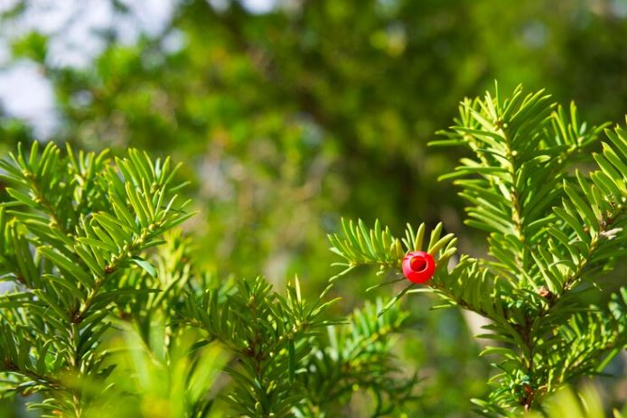

Yew shrubs, adorned with striking red berries and evergreen foliage, are known for their slow growth and low-maintenance nature. These versatile plants can serve as an alternative Christmas tree, and their sprigs add a touch of natural beauty to holiday decorations. 

To ensure their healthy growth, it is essential to provide sharp soil drainage. Beyond that, they require minimal attention, with only the possibility of annual fertilization and pruning for shaping. With yew shrubs, you can enjoy the beauty of their vivid red berries and greenery without much fuss or effort.

### **Dried Burgundy Eucalyptus**

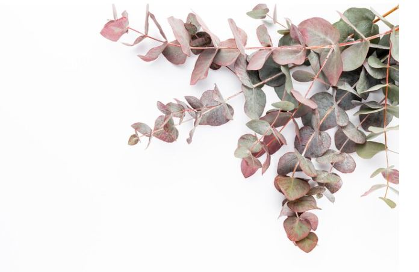

When it comes to Christmas flowers, look no further than this incredibly low-maintenance option. Perfect for those with busy lifestyles or a preference for easy-care greenery, dried flowers are the way to go. They maintain their beauty even after drying, offering lasting charm for years to come. 

This dried burgundy eucalyptus bunch is particularly ideal for DIY arrangements. Whether paired with fresh Christmas flowers or displayed in a vase on its own, it effortlessly transforms any room into a botanical oasis. As a delightful addition to a [Christmas gift basket](https://avada.io/loveable/christmas-gift-baskets-families/), it adds an extra touch of natural elegance to the festive season.

### **Mini Christmas Tree**

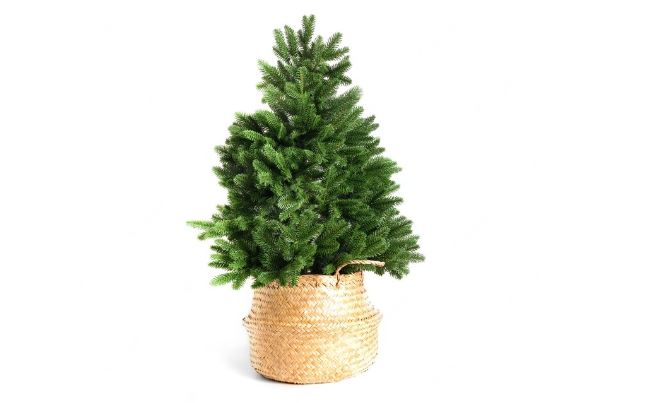

Undoubtedly, the inclusion of evergreen elements like pine and Douglas fir brings about some of the most exquisite Christmas flowers. This delightful mini Christmas tree bouquet checks all the boxes for the perfect holiday arrangement. 

Expertly hand-tied using greenery and flowers from floral farms, it arrives in a stunning red mason jar. Placing it on any table or window sill infuses the surroundings with a delightful Christmas cheer. Without delay, we are sending one of these to our loved ones ASAP to share the holiday spirit!

### **Blue spruce**

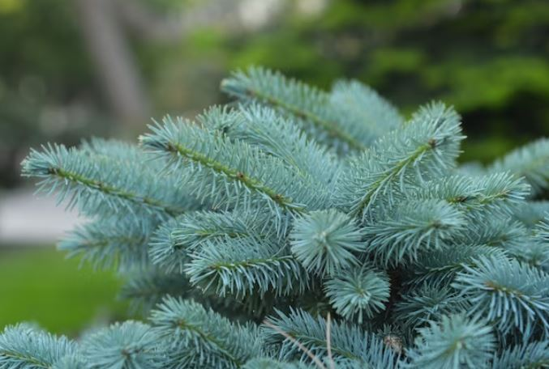

Among the favored [Christmas tree options](https://avada.io/loveable/christmas-tree-decorating-ideas/), blue spruce stands out as a popular choice. Its delightful pyramidal shape is accentuated by branches adorned with green, blue-green, or silver-green needles, exuding a pleasant, fresh, evergreen scent. 

Blue spruce boughs are commonly utilized in wreaths and other decorations due to their natural beauty and enchanting aroma. Fortunately, maintaining these trees is hassle-free, requiring minimal effort. Applying mulch around the base, but not too close to the trunk, can aid in retaining soil moisture and contribute to the tree’s overall health.

**_Check Out:_**

- Best [Flower Girl Gifts](https://avada.io/loveable/flower-girl-gifts/)

- Best [Sunflower Gifts For Her](https://avada.io/loveable/sunflower-gifts-her/)

## **In Conclusion,**

These top **Christmas flowers and plants** promise to infuse your holiday season with delightful scents and visual splendor. From the vibrant hues of poinsettias to the enchanting fragrance of paperwhites, these blooms add a touch of magic to your celebrations. Whether adorning your home, gifting to loved ones, or simply brightening your surroundings, these sensational Christmas flowers are sure to make your festive season truly unforgettable.

- [Top 25 Christmas Flowers and Trees for a Scent-sational Christmas](https://avada.io/loveable/blog/christmas-flowers/#wp-block-heading-2-4)
    - [Poinsettia](https://avada.io/loveable/blog/christmas-flowers/#wp-block-heading-3-5)
    - [Cymbidium](https://avada.io/loveable/blog/christmas-flowers/#wp-block-heading-3-9)
    - [Candy Cane Amaryllis](https://avada.io/loveable/blog/christmas-flowers/#wp-block-heading-3-13)
    - [Tulips in the Snow](https://avada.io/loveable/blog/christmas-flowers/#wp-block-heading-3-17)
    - [Helleborus Niger](https://avada.io/loveable/blog/christmas-flowers/#wp-block-heading-3-21)
    - [Christmas Cactus](https://avada.io/loveable/blog/christmas-flowers/#wp-block-heading-3-25)
    - [Rosemary](https://avada.io/loveable/blog/christmas-flowers/#wp-block-heading-3-29)
    - [Cyclamen](https://avada.io/loveable/blog/christmas-flowers/#wp-block-heading-3-33)
    - [Holly and Evergreens](https://avada.io/loveable/blog/christmas-flowers/#wp-block-heading-3-37)
    - [Pear Tree (Pyrus communis)](https://avada.io/loveable/blog/christmas-flowers/#wp-block-heading-3-41)
    - [Yuletide Camellia (Camellia Sasanqua ‘Yuletide’)](https://avada.io/loveable/blog/christmas-flowers/#wp-block-heading-3-44)
    - [White Azalea](https://avada.io/loveable/blog/christmas-flowers/#wp-block-heading-3-47)
    - [Balsam Fir (Abies balsamea)](https://avada.io/loveable/blog/christmas-flowers/#wp-block-heading-3-51)
    - [Juniper](https://avada.io/loveable/blog/christmas-flowers/#wp-block-heading-3-55)
    - [Red Roses](https://avada.io/loveable/blog/christmas-flowers/#wp-block-heading-3-59)
    - [Winter Honeysuckle (Lonicera fragrantissima)](https://avada.io/loveable/blog/christmas-flowers/#wp-block-heading-3-63)
    - [Anthurium Flamingo Flower](https://avada.io/loveable/blog/christmas-flowers/#wp-block-heading-3-67)
    - [Paperwhites](https://avada.io/loveable/blog/christmas-flowers/#wp-block-heading-3-71)
    - [Norfolk Island Pine](https://avada.io/loveable/blog/christmas-flowers/#wp-block-heading-3-75)
    - [Mistletoe](https://avada.io/loveable/blog/christmas-flowers/#wp-block-heading-3-79)
    - [Bromeliad](https://avada.io/loveable/blog/christmas-flowers/#wp-block-heading-3-83)
    - [Yew (Taxus spp)](https://avada.io/loveable/blog/christmas-flowers/#wp-block-heading-3-87)
    - [Dried Burgundy Eucalyptus](https://avada.io/loveable/blog/christmas-flowers/#wp-block-heading-3-91)
    - [Mini Christmas Tree](https://avada.io/loveable/blog/christmas-flowers/#wp-block-heading-3-95)
    - [Blue spruce](https://avada.io/loveable/blog/christmas-flowers/#wp-block-heading-3-99)
- [In Conclusion,](https://avada.io/loveable/blog/christmas-flowers/#wp-block-heading-2-106)

### [Blake Simpson](https://avada.io/loveable/author/blake/)

Hi, I'm Blake from Loveable. I help people find perfect gifts for occasions like anniversaries and weddings. I also write a blog about holidays, sharing insights to make them more meaningful. Let's create unforgettable moments together!

- [Twitter](https://twitter.com/intent/tweet)
- [Facebook](https://www.facebook.com/sharer/sharer.php)
- [instagram](https://avada.io/loveable/blog/christmas-flowers/)
- [pinterest](https://www.pinterest.com/loveablellc/)

## Related Posts

[### 120+ Christian Birthday Wishes To Spread Your Love](https://avada.io/loveable/blog/christian-birthday-wishes/) 

[

### 35 Best 70th Birthday Ideas To Celebrate The Special Milestone

](https://avada.io/loveable/blog/70th-birthday-ideas/)

[

### 50 Best 30th Birthday Decorations for a Remarkable Birthday Bash

](https://avada.io/loveable/blog/30th-birthday-decorations/)

[

### 40 Delicious Vegan Christmas Desserts to Delight Your Palate

](https://avada.io/loveable/blog/vegan-christmas-desserts/)

[

### 60 Christmas Team Building Activities to Boost Workplace Spirit

](https://avada.io/loveable/blog/christmas-team-building-activities/)
