This article has been written and researched by our expert Loveable through a precise methodology. [Learn more about our methodology](https://avada.io/loveable/our-methodological.html)

[Loveable](https://avada.io/loveable/) > [Blog](https://avada.io/loveable/blog/) > [Holiday](https://avada.io/loveable/holiday/)

# Top 40 DIY Outdoor Christmas Decorations to Dress Up Your Home

Written by [Blake Simpson](https://avada.io/loveable/author/blake/) Last Updated on September 14, 2023

- [40 DIY Outdoor Christmas Decorations to Dress Up Your Home](https://avada.io/loveable/blog/diy-outdoor-christmas-decorations/#wp-block-heading-2-2)
    - [DIY Oversized Ornaments](https://avada.io/loveable/blog/diy-outdoor-christmas-decorations/#wp-block-heading-3-3)
    - [DIY Red Stars](https://avada.io/loveable/blog/diy-outdoor-christmas-decorations/#wp-block-heading-3-7)
    - [Outdoor Winter Planters](https://avada.io/loveable/blog/diy-outdoor-christmas-decorations/#wp-block-heading-3-11)
    - [Colorful Front Door Display](https://avada.io/loveable/blog/diy-outdoor-christmas-decorations/#wp-block-heading-3-15)
    - [DIY Wreath Doormat](https://avada.io/loveable/blog/diy-outdoor-christmas-decorations/#wp-block-heading-3-19)
    - [DIY Pom-Pom Wreath](https://avada.io/loveable/blog/diy-outdoor-christmas-decorations/#wp-block-heading-3-23)
    - [DIY Ice Skates Frame Door Hanging](https://avada.io/loveable/blog/diy-outdoor-christmas-decorations/#wp-block-heading-3-27)
    - [DIY Christmas Sign Paddle Board](https://avada.io/loveable/blog/diy-outdoor-christmas-decorations/#wp-block-heading-3-31)
    - [Plaid Front Porch Display](https://avada.io/loveable/blog/diy-outdoor-christmas-decorations/#wp-block-heading-3-35)
    - [Simple Evergreen Outdoor Display](https://avada.io/loveable/blog/diy-outdoor-christmas-decorations/#wp-block-heading-3-39)
    - [Lighted Front Porch](https://avada.io/loveable/blog/diy-outdoor-christmas-decorations/#wp-block-heading-3-43)
    - [DIY Vintage Toy Car Wreath](https://avada.io/loveable/blog/diy-outdoor-christmas-decorations/#wp-block-heading-3-47)
    - [DIY Felt Poinsettia Wreath](https://avada.io/loveable/blog/diy-outdoor-christmas-decorations/#wp-block-heading-3-51)
    - [Modern Holiday Entryway](https://avada.io/loveable/blog/diy-outdoor-christmas-decorations/#wp-block-heading-3-55)
    - [Snowy Scene Entryway](https://avada.io/loveable/blog/diy-outdoor-christmas-decorations/#wp-block-heading-3-59)
    - [Rainbow Christmas Porch](https://avada.io/loveable/blog/diy-outdoor-christmas-decorations/#wp-block-heading-3-63)
    - [DIY Noel Plaid Sign](https://avada.io/loveable/blog/diy-outdoor-christmas-decorations/#wp-block-heading-3-67)
    - [DIY Candy Cane Poles](https://avada.io/loveable/blog/diy-outdoor-christmas-decorations/#wp-block-heading-3-71)
    - [DIY Pallet Christmas Tree](https://avada.io/loveable/blog/diy-outdoor-christmas-decorations/#wp-block-heading-3-75)
    - [DIY Holiday Ice Lantern](https://avada.io/loveable/blog/diy-outdoor-christmas-decorations/#wp-block-heading-3-79)
    - [DIY Joy Sign](https://avada.io/loveable/blog/diy-outdoor-christmas-decorations/#wp-block-heading-3-83)
    - [DIY Christmas Skis](https://avada.io/loveable/blog/diy-outdoor-christmas-decorations/#wp-block-heading-3-87)
    - [DIY Christmas Planters](https://avada.io/loveable/blog/diy-outdoor-christmas-decorations/#wp-block-heading-3-91)
    - [DIY Vintage Wooden Sled](https://avada.io/loveable/blog/diy-outdoor-christmas-decorations/#wp-block-heading-3-95)
    - [DIY Stair Spindle Snowflakes](https://avada.io/loveable/blog/diy-outdoor-christmas-decorations/#wp-block-heading-3-99)
    - [DIY Christmas Doormat](https://avada.io/loveable/blog/diy-outdoor-christmas-decorations/#wp-block-heading-3-103)
    - [Concrete Holiday Gift Box](https://avada.io/loveable/blog/diy-outdoor-christmas-decorations/#wp-block-heading-3-107)
    - [Tiered Tomato Cage Christmas Trees](https://avada.io/loveable/blog/diy-outdoor-christmas-decorations/#wp-block-heading-3-111)
    - [DIY Front Yard Reindeer](https://avada.io/loveable/blog/diy-outdoor-christmas-decorations/#wp-block-heading-3-115)
    - [DIY Christmas Chandelier](https://avada.io/loveable/blog/diy-outdoor-christmas-decorations/#wp-block-heading-3-119)
    - [DIY Christmas Light Garland](https://avada.io/loveable/blog/diy-outdoor-christmas-decorations/#wp-block-heading-3-123)
    - [DIY Holiday Hanging Basket](https://avada.io/loveable/blog/diy-outdoor-christmas-decorations/#wp-block-heading-3-127)
    - [DIY Yardstick Star](https://avada.io/loveable/blog/diy-outdoor-christmas-decorations/#wp-block-heading-3-131)
    - [Shutter Snowmen](https://avada.io/loveable/blog/diy-outdoor-christmas-decorations/#wp-block-heading-3-135)
    - [Lighted Gift Boxes](https://avada.io/loveable/blog/diy-outdoor-christmas-decorations/#wp-block-heading-3-139)
    - [DIY Wood Christmas Tree](https://avada.io/loveable/blog/diy-outdoor-christmas-decorations/#wp-block-heading-3-143)
    - [DIY WREATH TRIO](https://avada.io/loveable/blog/diy-outdoor-christmas-decorations/#wp-block-heading-3-147)
    - [DIY Holiday Swag](https://avada.io/loveable/blog/diy-outdoor-christmas-decorations/#wp-block-heading-3-151)
    - [DIY Cheerful Christmas Trees](https://avada.io/loveable/blog/diy-outdoor-christmas-decorations/#wp-block-heading-3-155)
    - [DIY Wintry Planter](https://avada.io/loveable/blog/diy-outdoor-christmas-decorations/#wp-block-heading-3-159)
- [In Conclusion,](https://avada.io/loveable/blog/diy-outdoor-christmas-decorations/#wp-block-heading-2-166)

The holiday season is just around the corner, and what better way to embrace the festive spirit than by adorning your outdoor space with **DIY Christmas decorations**? In this article, we’ll explore creative and budget-friendly ideas to transform your yard into a winter wonderland that dazzles both guests and passersby.

## **40 DIY Outdoor Christmas Decorations to Dress Up Your Home**

### **DIY Oversized Ornaments**

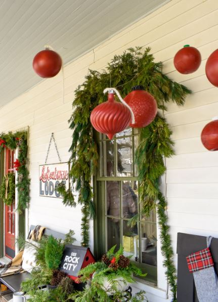

By recycling and repurposing, you can effortlessly create a festive atmosphere that leaves a lasting impression. Let these vibrant [Christmas DIY ornaments](https://avada.io/loveable/blog/christmas-ornaments-diy/) showcase your creativity and holiday spirit while turning ordinary objects into extraordinary expressions of celebration.

[Get the tutorial!](https://www.tmoorehome.com/blog/christmas-porch-decorations-oversized-ornament-diy-from-trash)

### DIY Red Stars

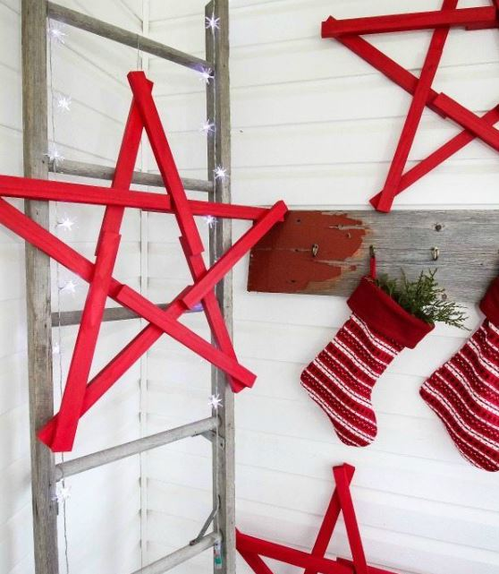

Whether you choose to make them from paper, fabric, or other craft supplies, these DIY Red Stars will add a delightful pop of color and holiday cheer to any room or space. You can hang them on walls, and windows, or even create a dazzling starry garland. The creativity lets these DIY Red Stars shine bright, spreading warmth and joy throughout your home.

[Get the tutorial!](https://www.creeklinehouse.com/diy-sized-wood-scrap-stars/)

### **Outdoor Winter Planters**

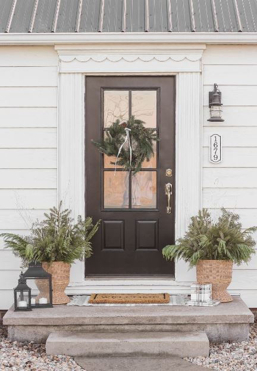

To bring it all together, adorn your arrangement with a rustic wreath, creating a harmonious and inviting look that resonates well into winter. The elegance of evergreen touches paired with a charming wreath evokes a sense of coziness and festive spirit, welcoming guests and the season’s magic to your doorstep.

[Get the tutorial!](https://lovegrowswild.com/2020/12/christmas-front-porch-a-winter-planter-tutorial/)

### **Colorful Front Door Display**

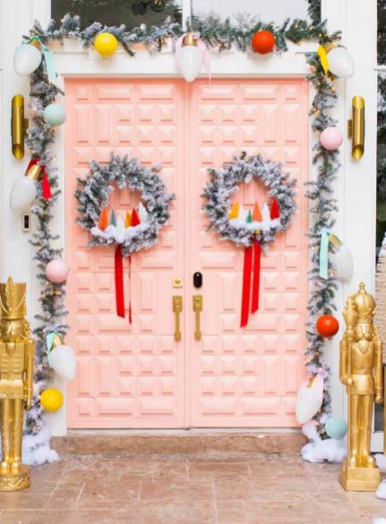

You can transform your surroundings into a kaleidoscope of holiday joy by crafting an outdoor display filled with oversized Christmas light garlands, vibrant wreaths, and gilded nutcracker statues. Enhancing this lively backdrop, a pink front door adds a striking touch that truly pops with the essence of the season, creating a scene that captures the festive spirit in all its glory.

[Get the tutorial!](https://sugarandcloth.com/our-home-colorful-front-door-christmas-decor/)

### **DIY Wreath Doormat**

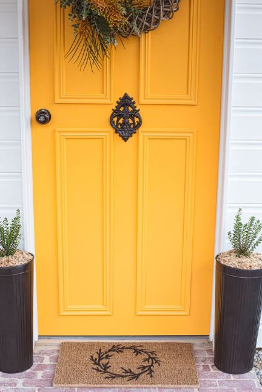

You can shield your home from winter’s elements by crafting charming doormats. These doormats will bid farewell to snow and dirt indoors while infusing your front porch with a cozy and inviting aura. Create a minimalist masterpiece with a delicate wreath design, adding a touch of elegance to the threshold. This season, let your doormats be a practical yet stylish expression of your warm hospitality.

[Get the tutorial!](https://homemadebycarmona.com/diy-wreath-doormat/)

### **DIY Pom-Pom Wreath**

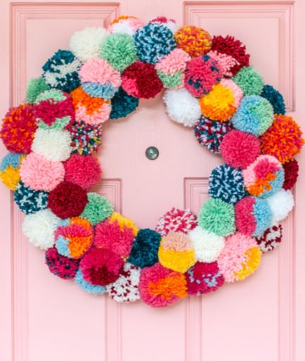

During Christmas, subtlety takes a backseat as the season bursts forth with vibrant and extravagant decorations. Transform your front door into a captivating focal point that mirrors this unreserved festive atmosphere. 

[Get the tutorial!](http://diyinpdx.com/2018/11/27/diy-pom-pom-holiday-wreath/)

### **DIY Ice Skates Frame Door Hanging**

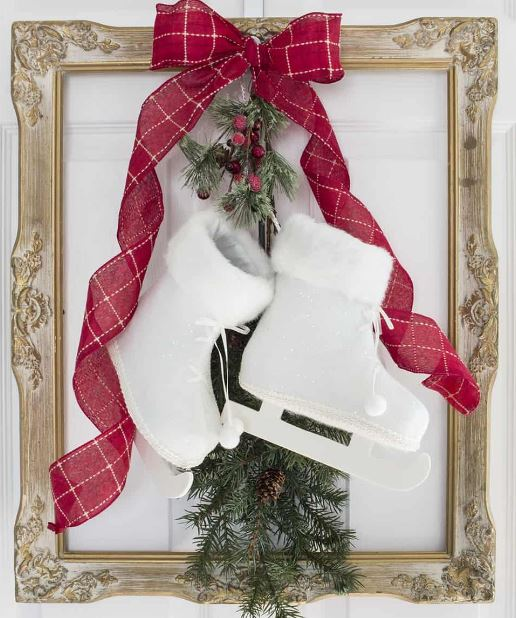

If the winter holidays find you and your family eagerly embracing the joys of ice skating, then these DIY outdoor Christmas decorations are destined to resonate with your seasonal spirit. Envision a scene where the magic of ice skating is beautifully translated into an enchanting display for your outdoor space.

[Get the tutorial!](https://homemadelovely.com/french-farmhouse-christmas-decor-idea-frame-skates-and-greenery/)

### **DIY Christmas Sign Paddle Board**

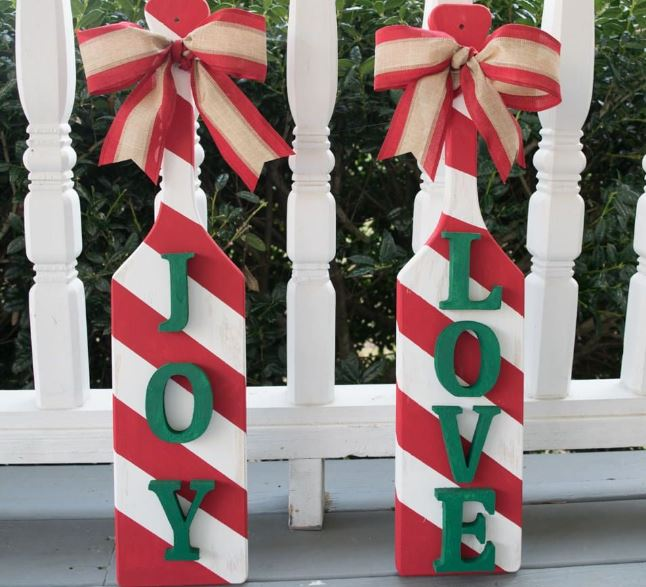

You can elevate your holiday décor with a creative touch by crafting charming candy cane-inspired paddle board signs. Whether you are looking for a delightful gift or a statement piece for your own porch, these adorable signs are a perfect choice. You can embrace the festive spirit and add a personalized touch to your seasonal decorations with this DIY project.

[Get the tutorial!](https://backtothesouth.com/christmas-wood-paddle-signs/)

### **Plaid Front Porch Display**

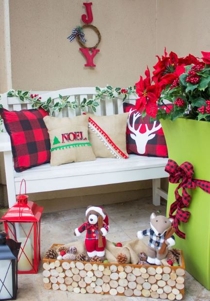

This Christmas, you can cherish your passion for holiday decor with a plaid-themed front porch arrangement. Your entire entryway can be enveloped in a timeless color palette that exudes classic charm. By integrating cushions, ribbons, garlands, and lanterns, you can infuse your porch with the inviting warmth of plaid, creating a snug and welcoming ambiance.

[Get the tutorial!](https://designimprovised.com/2018/11/plaid-christmas-front-porch-ideas.html)

### **Simple Evergreen Outdoor Display**

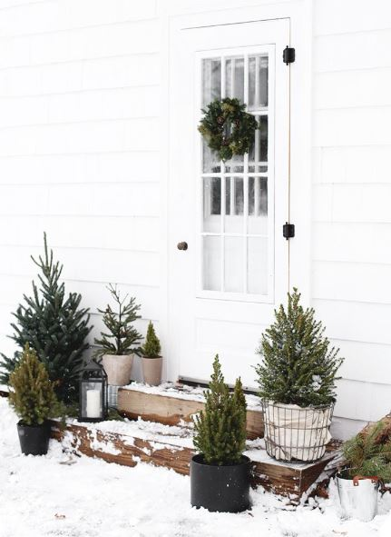

An elegant and straightforward outdoor Christmas presentation can be achieved by arranging potted trees at your front doorstep. At your front doorstep, these potted trees create an uncomplicated yet sophisticated evergreen display that effortlessly captures the spirit of the season.

[Get the tutorial!](https://themerrythought.com/dwelling/minimal-outdoor-christmas-decor/)

### **Lighted Front Porch**

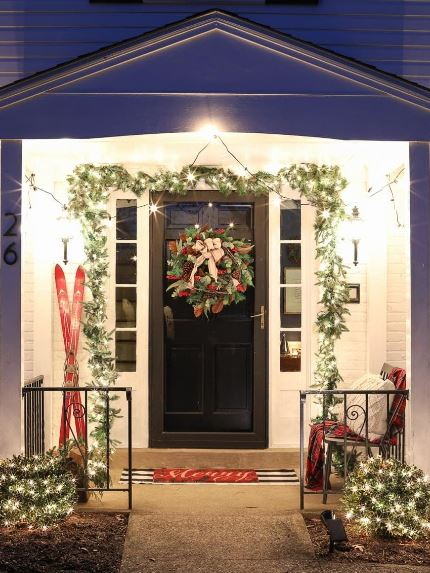

Elevate your front porch’s appeal with a captivating lighted transformation. Drape an abundance of twinkling lights across your façade, skillfully intertwining them with garlands, adorning the bushes, and illuminating the entryway. Watch as your outdoor space becomes a radiant haven that captures the magic of the season in every sparkling detail.

[Get the tutorial!](https://inspiredbycharm.com/evening-at-bayberry-house-christmas-2018/)

### **DIY Vintage Toy Car Wreath**

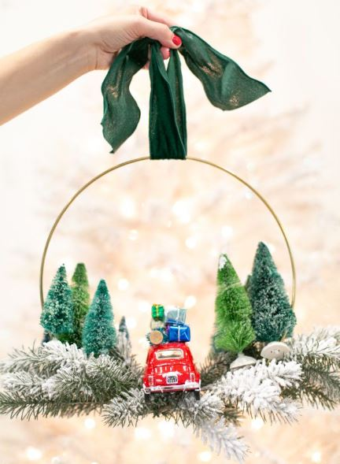

This creative project not only brings a playful and old-fashioned allure to your door but also serves as a conversation starter that evokes cherished memories. Embrace the spirit of creativity and nostalgia as you welcome guests with this enchanting and one-of-a-kind decoration that harks back to the simpler times of classic toys and holiday cheer.

[Get the tutorial!](https://lovelyindeed.com/diy-christmas-wreath-with-vintage-toy-cars/)

### **DIY Felt Poinsettia Wreath**

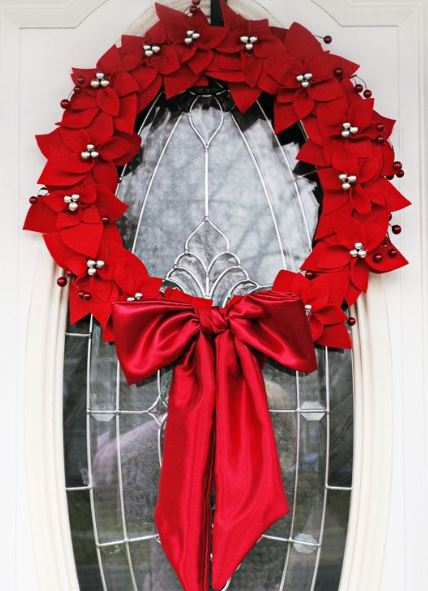

With just a few simple materials and easy-to-follow steps, you can craft a beautiful wreath adorned with vibrant felt poinsettia flowers. This handmade masterpiece will add a touch of elegance and charm to your home during the holiday season. Get ready to unleash your creativity and bring the spirit of Christmas to life with this enchanting DIY project.

[Get the tutorial!](https://www.skiptomylou.org/diy-felt-poinsettia-christmas-wreath/)

### **Modern Holiday Entryway**

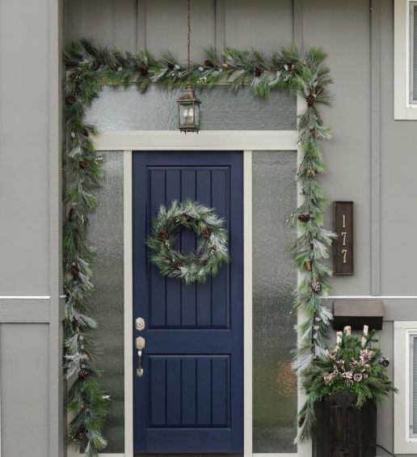

Your decor can be elevated by adorning your entry with an elegant frosted garland and a coordinating wreath. Embrace the enchanting beauty of a monochromatic scheme that captures the essence of the season, resulting in a stylish and inviting ambiance that warmly welcomes both guests and the magic of winter.

[Get the tutorial!](https://www.lemonthistle.com/modern-christmas-entry-decor/)

### **Snowy Scene Entryway**

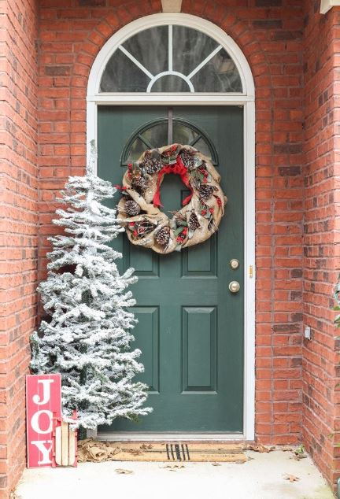

Craft a picturesque winter scene in your entryway, evoking a snowy wonderland even in non-snowy locales. By adorning your outdoor space with a white Christmas tree, you can conjure the magical essence of a snowy landscape right outside your home. Embrace the whimsy of the season and let your entryway become a canvas of holiday enchantment, regardless of the weather conditions in your area.

[Get the tutorial!](https://theturquoisehome.com/neutral-christmas-entry-way/)

### **Rainbow Christmas Porch**

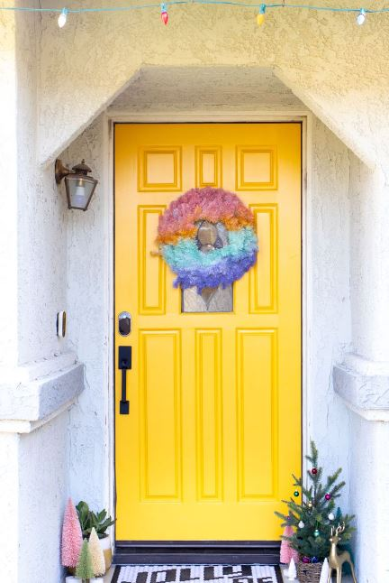

This is a captivating rainbow wreath to enhance the allure of your porch, making it an ideal choice, especially if your front door boasts a lively and colorful personality. This dynamic combination serves as a heartwarming welcome to all who enter, infusing your outdoor space with an array of hues.

[Get the tutorial!](https://www.clubcrafted.com/modernized-front-door/)

### **DIY Noel Plaid Sign**

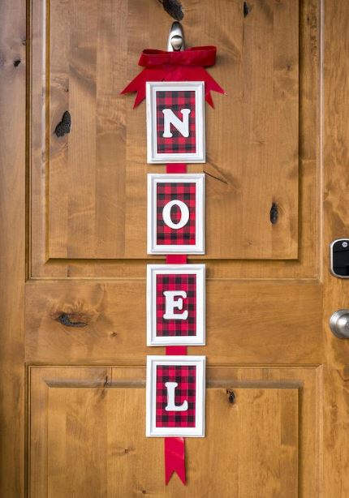

The DIY Noel Plaid Sign is a charming and festive project that allows you to create your own personalized holiday decor. With just a few simple materials and easy-to-follow steps, you can craft a stunning sign adorned with a classic plaid pattern and the timeless “Noel” lettering. This handmade masterpiece will bring a touch of warmth and nostalgia to your home during the holiday season.

[Get the tutorial!](https://modpodgerocksblog.com/christmas-door-hanging/)

### **DIY Candy Cane Poles**

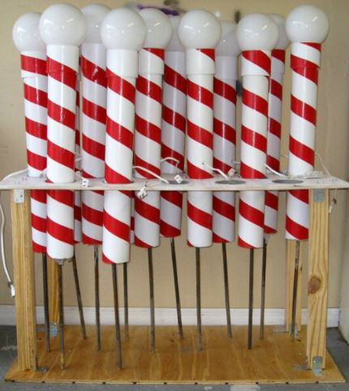

Note that a degree of familiarity with lighting and lamps is beneficial, as you’ll need to connect the lights. Once completed, these poles serve as captivating additions that beautifully illuminate your pathway for Christmas, adding a touch of enchantment to your home’s entrance. The finished product is not only visually appealing but also functions as a charming guide that leads the way to your festive abode.

[Get the tutorial!](http://copelandchristmas.blogspot.com/2010/03/outdoor-christmas-decorations-for.html)

### **DIY Pallet Christmas Tree**

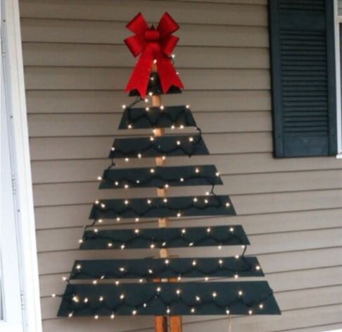

This craft presents an ideal Christmas tree option for your front porch or can be displayed as a charming duo in your yard, spreading festive cheer throughout your outdoor space.

[Get the tutorial!](https://web.archive.org/web/20220303104257/http://jolenescrafting.org/wooden-skidshipping-board-christmas-tree-perfect-for-the-front-porch-made-with-pallet-great-idea/)

### **DIY Holiday Ice Lantern**

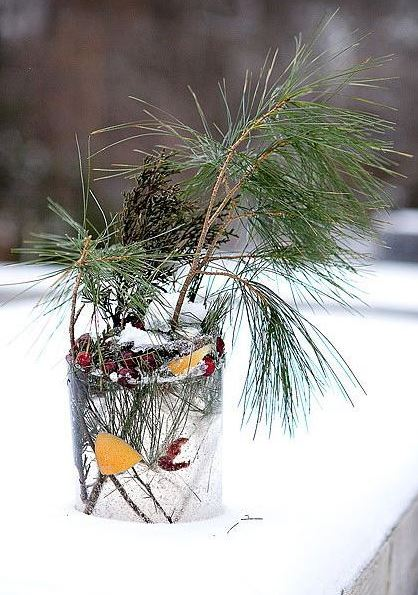

Featuring the delightful combination of cranberries, oranges, and pine branches, transforms ice into a mesmerizing masterpiece. You can create enchanting ice lanterns to adorn your front porch or backyard, crafting a captivating display that uniquely captures the essence of the season in an icy and elegant way. These ice lanterns will add an extra touch of charm to your outdoor spaces, turning them into magical winter wonderlands.

[Get the tutorial!](https://houseofjoyfulnoise.com/make-beautiful-winter-ice-decor-yard/)

### **DIY Joy Sign**

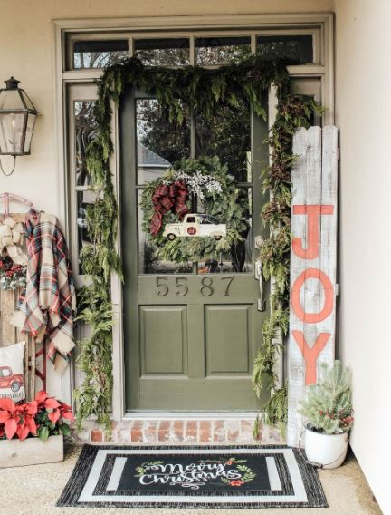

The DIY Joy Sign allows you to craft a joyful expression that radiates the spirit of the holiday season. You will adorn your porch with a charming “Joy” sign ingeniously crafted from fence posts, spreading the delight of the festivities. Let’s create a joyous sentiment and transform your porch into a canvas for celebrating the arrival of the holidays in a creative and welcoming manner.

[Get the tutorial!](https://beautyforasheshome.com/christmas-porch-tour-wreath-giveaway/)

### **DIY Christmas Skis**

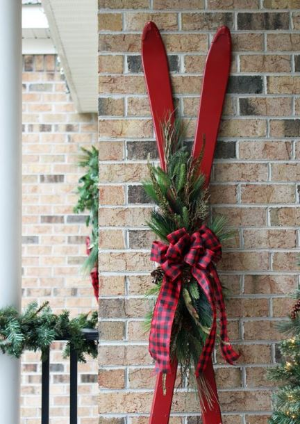

It’s incredible to think that once hurtling down snow-covered slopes, these skis have now found a new purpose as a painted decorative element, tailored for the holiday season and extending seamlessly into the winter months.

[Get the tutorial!](https://www.confessionsofaserialdiyer.com/repurposed-skis/)

### **DIY Christmas Planters**

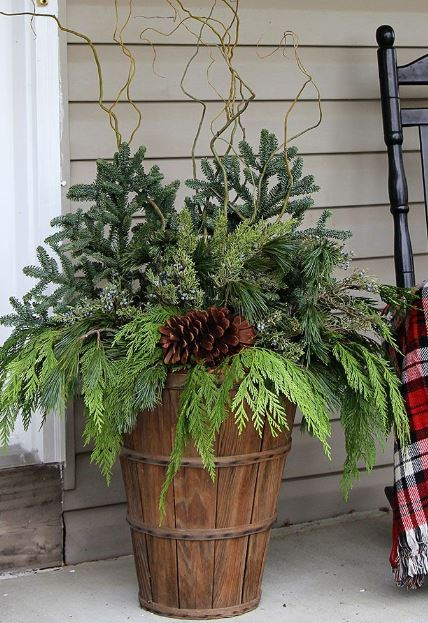

With a touch of creativity and a few essential materials, you can craft stunning planters that bring the spirit of Christmas to your outdoor spaces. From evergreen branches and holly berries to colorful ornaments and twinkling lights, the possibilities are endless. These DIY Christmas Planters will add a cheerful and vibrant touch to your porch, patio, or garden, creating a welcoming and festive atmosphere.

[Get the tutorial!](https://www.houseofhawthornes.com/how-to-make-winter-porch-pots/)

### **DIY Vintage Wooden Sled**

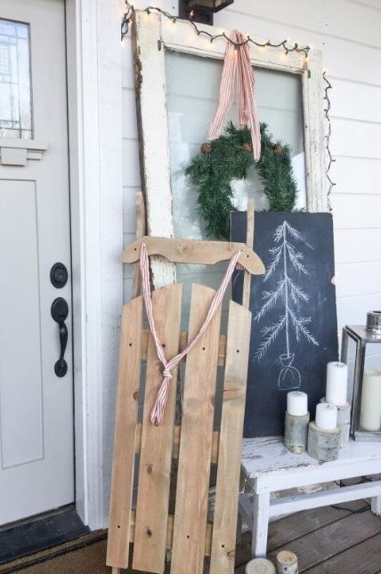

As the snow blankets the ground, it’s the perfect time to embrace the spirit of sledding. Elevate your Christmas porch with the timeless charm of a DIY Vintage Wooden Sled. With a bit of woodworking know-how, you can fashion this delightful sled, capturing the essence of winter nostalgia and infusing your outdoor space with an enchanting touch.

[Get the tutorial!](https://www.twelveonmain.com/diy-vintage-wooden-sled/)

### **DIY Stair Spindle Snowflakes**

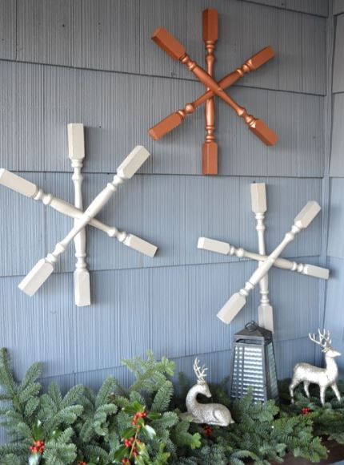

These spindles are transformed into delightful and captivating winter decorations through a simple transformation process. Adorned with metallic shades, these snowflakes make for a flawless addition to your outdoor Christmas decor, adding a touch of elegance and festive allure to your surroundings. Craft enchanting DIY snowflakes from ordinary stair spindles with ease. 

[Get the tutorial!](https://www.1905farmhouse.com/outdoor-christmas-decor-snowflakes/)

### **DIY Christmas Doormat**

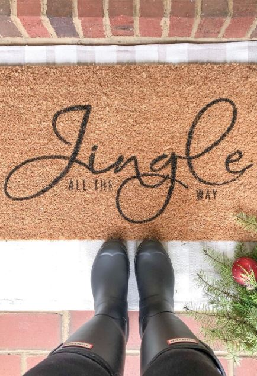

This tutorial offers the perfect avenue for those who delight in elaborate outdoor Christmas decor. This DIY Christmas Doormat is not only a practical addition to your home but also a delightful way to showcase your creativity and spread holiday joy to all who step foot on your doorstep. Get ready to welcome guests with a warm and festive greeting with your very own [DIY Christmas Doormat.](https://avada.io/loveable/personalized-doormat/) 

[Get the tutorial!](https://lifeonsummerhill.com/design-your-own-doormat/)

### **Concrete Holiday Gift Box**

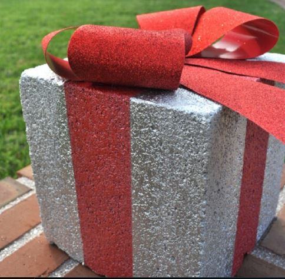

Amongst DIY outdoor Christmas decorations, this concrete holiday gift box stands out as a personal favorite. Its beauty is matched by its simplicity in creation. Utilizing Frog Tape, readily available at hardware or home improvement stores, this project transforms concrete squares into a stunning and lasting showcase piece. The process mainly involves marking off areas to paint and applying paint—an effortlessly straightforward endeavor.

[Get the tutorial!](http://club.chicacircle.com/holiday-gift-box-concrete-block-craft-with-frogtape/)

### **Tiered Tomato Cage Christmas Trees**

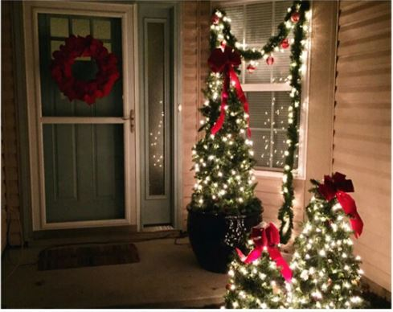

Utilize the ideal structure of tomato cages to craft charming outdoor [Christmas trees decorating](https://avada.io/loveable/blog/christmas-tree-decorating-ideas/). To create these, make sure to acquire wired garland, conveniently available at Dollar Stores or Wal-Mart for an affordable price. 

[Get the tutorial!](http://www.twotwentyone.net/tiered-tomato-cage-christmas-trees/)

### **DIY Front Yard Reindeer**

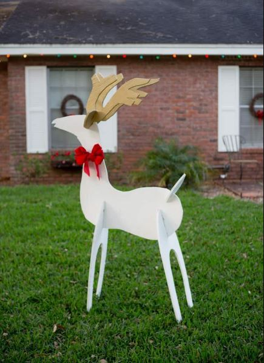

Imagine filling your yard with Santa’s famed reindeer, including the iconic Rudolph, to curate a scene reminiscent of the enchanting North Pole. Let your outdoor space become a canvas for festive wonder as these endearing reindeer captivate the spirit of the season and create a heartwarming spectacle that delights both young and old. Craft your very own DIY Front Yard Reindeer display, bringing the holiday magic to life. 

[Get the tutorial!](https://eclecticrecipes.com/christmas-reindeer-and-angel-wooden-yard-decorations-diy/)

### **DIY Christmas Chandelier**

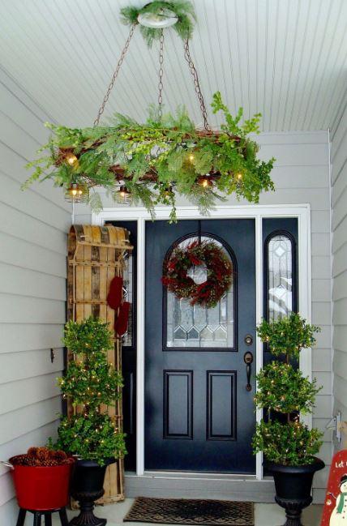

This captivating piece features a grand grapevine wreath adorned with string lights and artificial greenery, making it a delightful addition to your holiday decor. The beauty of this chandelier extends beyond the festive season, as it seamlessly transitions to spring and summer use, adding a touch of timeless elegance and allure to your outdoor space year-round. Create an awe-inspiring outdoor chandelier with the DIY Christmas Chandelier project. 

[Get the tutorial!](https://urbancottageliving.com/diy/grapevine-wreath-chandelier/)

### **DIY Christmas Light Garland**

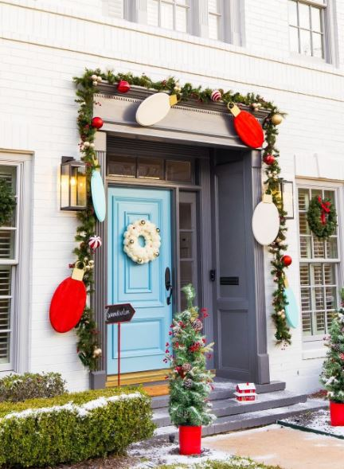

This charming idea features oversized wooden Christmas lights that exude a delightful and whimsical charm, offering a handcrafted touch to embellish your doorway. Elevate your decor with this adorable creation, showcasing your creativity and spreading festive cheer in a uniquely personalized manner. Craft a heartwarming outdoor Christmas garland with the DIY Christmas Light Garland concept. 

[Get the tutorial!](https://sugarandcloth.com/jumbo-lights-outdoor-diy-christmas-decorations/)

### **DIY Holiday Hanging Basket**

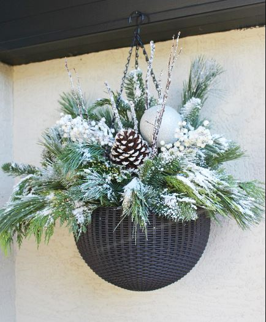

Elevate your porch, deck, or patio for the holiday season with the DIY Holiday Hanging Basket. Adorned with frosted winter greens, ornaments, and pine cones, this charming creation adds a finishing touch that captures the essence of Christmastime. Let your outdoor space become a festive haven as you embrace the beauty of this hanging basket, infusing your surroundings with the warmth and magic of the season.

[Get the tutorial!](https://www.cleanandscentsible.com/diy-christmas-planters/)

### **DIY Yardstick Star**

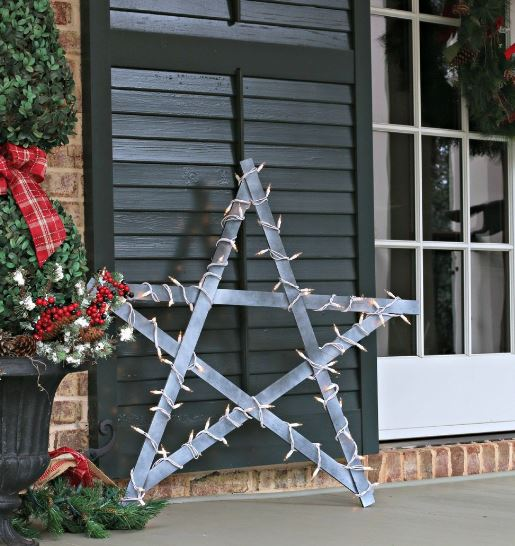

This project allows you to blend the old and new, resulting in a yardstick Christmas star that resonates with both tradition and creativity, enhancing the beauty of your outdoor space with a unique touch.

[Get the tutorial!](https://www.oursouthernhomesc.com/weathered-yardstick-stars/)

### **Shutter Snowmen**

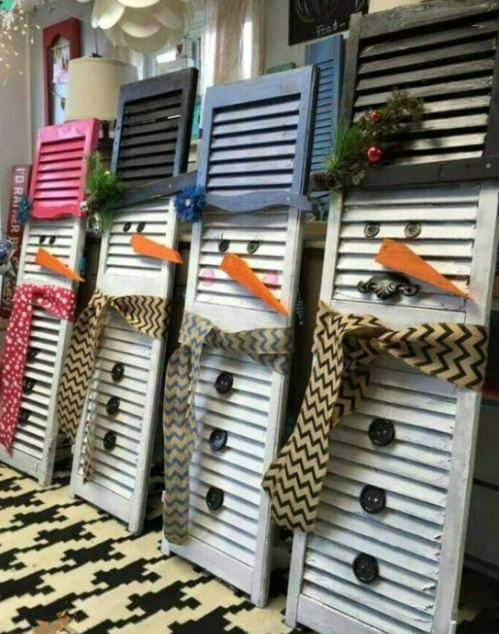

If you lack old shutters to create these charming snowmen, consider scouting thrift stores or even garage sales where you might find them at affordable prices. You can effortlessly transform these shutters into an endearing Frosty family with a coat of paint and creative embellishments. Anticipate delighting the children in your neighborhood as they’re sure to fall in love with these adorable DIY outdoor Christmas decorations.

[Get the tutorial!](https://www.pinterest.com/pin-builder/?description=20+Impossibly+Creative+DIY+Outdoor+Christmas+Decorations+-+I+absolutely+love+decorating+for+Christmas%21+I+also+love+changing+up+my+decorations+from+time+to+time%2C+particularly+the+outdoor+ones.+If+you%E2%80%99ve+been+looking+for+new+ways+to+dress+up+your+lawn+this+holiday+season%2C+this+is+definitely+the+collection+for+you.+%23diy+%23decorations+%23christmasdecor+%23outdoordecor+%23christmascrafts+%23crafts&is_video=false&media=https%3A%2F%2Fcdn.diyncrafts.com%2Fwp-content%2Fuploads%2F2016%2F11%2F10-shutter-snowmen-outdoor-christmas-decoration.jpg&method=bookmarklet&url=https%3A%2F%2Fwww.diyncrafts.com%2F21882%2Fdecor%2F20-impossibly-creative-diy-outdoor-christmas-decorations)

### **Lighted Gift Boxes**

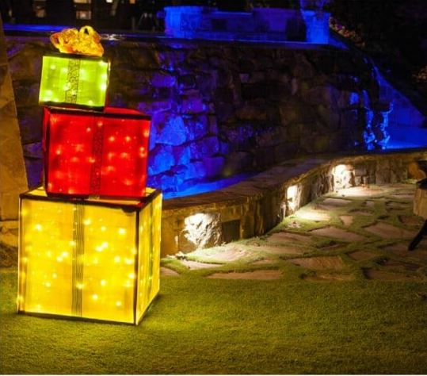

While these gift boxes diverge from the concrete construction, their DIY process is undoubtedly rewarding. The beauty of this project lies in its versatility, offering numerous methods and materials to choose from. 

[Get the tutorial!](http://www.christmaslightsetc.com/pages/lighted-gift-boxes)

### **DIY Wood Christmas Tree**

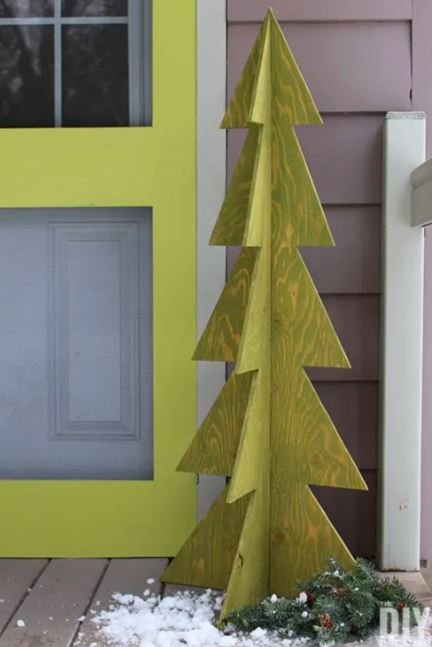

With the DIY Wood Christmas Tree project, you can engage in a contemporary twist on the traditional outdoor Christmas tree. A stylish 3D wooden rendition adds a touch of modernity to your decor, following this tutorial.

[Get the tutorial!](https://thediydreamer.com/christmas/how-to-make-a-3d-wood-christmas-tree/)

### **DIY WREATH TRIO**

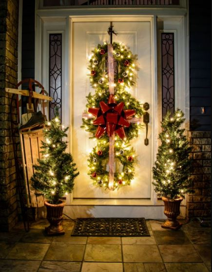

This project showcases the art of embellishing your front door with a trio of stunning wreaths. You can complement this ensemble with petite Christmas trees and a charming sled, and for an added touch of holiday grandeur, crown it all with an oversized red bow.

[Get the tutorial!](https://go.skimresources.com/?id=74968X1616970&isjs=1&jv=15.4.2-stackpath&sref=https%3A%2F%2Fwww.thepioneerwoman.com%2Fholidays-celebrations%2Fg34553139%2Foutdoor-christmas-decorations%2F%3Fslide%3D41&url=https%3A%2F%2Fdecorandthedog.net%2Fdecorandthedog%2F2015%2F11%2F5%2Fhow-to-make-a-christmas-wreath-trio-the-home-depot-diy-workshop&xs=1&xtz=-420&xuuid=d585ad2d3c5e3ca2dc500a5ab26eaa7b&xjsf=other_click__auxclick%20%5B2%5D)

### **DIY Holiday Swag**

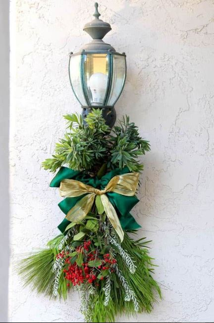

This delightful creation offers the perfect solution for those with limited time to spare for crafting their own seasonal DIY outdoor Christmas decorations. Embrace the simplicity of this endeavor, allowing you to swiftly fashion a charming and enchanting swag that adds a touch of festive allure to your surroundings, even amidst a busy holiday season.

[Get the tutorial!](https://go.skimresources.com/?id=74968X1616970&isjs=1&jv=15.4.2-stackpath&sref=https%3A%2F%2Fwww.thepioneerwoman.com%2Fholidays-celebrations%2Fg34553139%2Foutdoor-christmas-decorations%2F%3Fslide%3D42&url=https%3A%2F%2Fwww.apieceofrainbow.com%2Feasiest-diy-christmas-swag-ever%2F&xs=1&xtz=-420&xuuid=d585ad2d3c5e3ca2dc500a5ab26eaa7b&xjsf=other_click__auxclick%20%5B2%5D)

### **DIY Cheerful Christmas Trees**

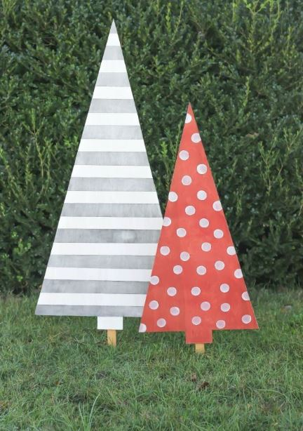

These patterned trees bring a touch of whimsy and playfulness to your outdoor decor, encapsulating the joyous spirit of the season. With their distinctive patterns and festive allure, these trees become enchanting focal points that exude a sense of merriment and cheer, making your outdoor space a delightful canvas of holiday magic.

[Get the tutorial!](https://go.skimresources.com/?id=74968X1616970&isjs=1&jv=15.4.2-stackpath&sref=https%3A%2F%2Fwww.thepioneerwoman.com%2Fholidays-celebrations%2Fg34553139%2Foutdoor-christmas-decorations%2F%3Fslide%3D43&url=https%3A%2F%2Fwww.purelykatie.com%2Fmodern-wood-trees-using-color-stain%2F&xs=1&xtz=-420&xuuid=d585ad2d3c5e3ca2dc500a5ab26eaa7b&xjsf=other_click__auxclick%20%5B2%5D)

### **DIY Wintry Planter**

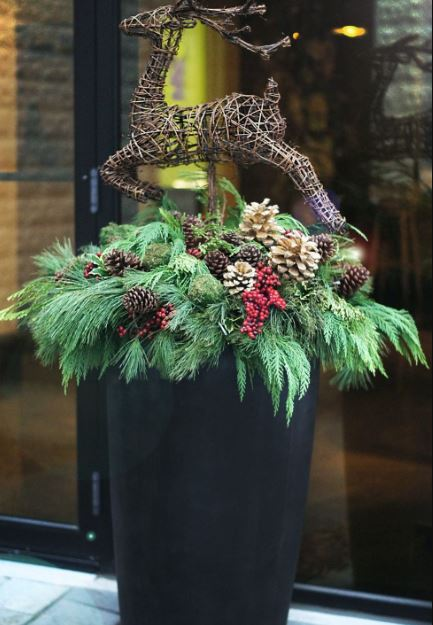

Incorporate evergreen branches, pinecones, winter berries, and other natural elements to capture the enchanting beauty of the season. Add a festive bow or ornaments for a pop of color and sparkle. This DIY Wintry Planter will not only enhance the visual appeal of your outdoor areas but also create a welcoming and festive ambiance.

[Get the tutorial!](https://go.skimresources.com/?id=74968X1616970&isjs=1&jv=15.4.2-stackpath&sref=https%3A%2F%2Fwww.thepioneerwoman.com%2Fholidays-celebrations%2Fg34553139%2Foutdoor-christmas-decorations%2F%3Fslide%3D44&url=https%3A%2F%2Fthreadsandblooms.com%2Fhow-to-make-a-winter-planter%2F&xs=1&xtz=-420&xuuid=d585ad2d3c5e3ca2dc500a5ab26eaa7b&xjsf=other_click__auxclick%20%5B2%5D)

**_See More:_**

- [Christmas Door Decorations](https://avada.io/loveable/blog/christmas-door-decorations/)

- [Christmas Party Decoration Ideas](https://avada.io/loveable/blog/christmas-party-decoration-ideas/)

## **In Conclusion,**

**DIY outdoor Christmas decorations** allow you to infuse your personal style and creativity into your festive displays. From classic wreaths to imaginative illuminated silhouettes, these ideas will help you create a holiday ambiance that radiates warmth and joy. So, gather your supplies, embrace your inner artist, and bring the magic of the season to your outdoor spaces.

- [40 DIY Outdoor Christmas Decorations to Dress Up Your Home](https://avada.io/loveable/blog/diy-outdoor-christmas-decorations/#wp-block-heading-2-2)
    - [DIY Oversized Ornaments](https://avada.io/loveable/blog/diy-outdoor-christmas-decorations/#wp-block-heading-3-3)
    - [DIY Red Stars](https://avada.io/loveable/blog/diy-outdoor-christmas-decorations/#wp-block-heading-3-7)
    - [Outdoor Winter Planters](https://avada.io/loveable/blog/diy-outdoor-christmas-decorations/#wp-block-heading-3-11)
    - [Colorful Front Door Display](https://avada.io/loveable/blog/diy-outdoor-christmas-decorations/#wp-block-heading-3-15)
    - [DIY Wreath Doormat](https://avada.io/loveable/blog/diy-outdoor-christmas-decorations/#wp-block-heading-3-19)
    - [DIY Pom-Pom Wreath](https://avada.io/loveable/blog/diy-outdoor-christmas-decorations/#wp-block-heading-3-23)
    - [DIY Ice Skates Frame Door Hanging](https://avada.io/loveable/blog/diy-outdoor-christmas-decorations/#wp-block-heading-3-27)
    - [DIY Christmas Sign Paddle Board](https://avada.io/loveable/blog/diy-outdoor-christmas-decorations/#wp-block-heading-3-31)
    - [Plaid Front Porch Display](https://avada.io/loveable/blog/diy-outdoor-christmas-decorations/#wp-block-heading-3-35)
    - [Simple Evergreen Outdoor Display](https://avada.io/loveable/blog/diy-outdoor-christmas-decorations/#wp-block-heading-3-39)
    - [Lighted Front Porch](https://avada.io/loveable/blog/diy-outdoor-christmas-decorations/#wp-block-heading-3-43)
    - [DIY Vintage Toy Car Wreath](https://avada.io/loveable/blog/diy-outdoor-christmas-decorations/#wp-block-heading-3-47)
    - [DIY Felt Poinsettia Wreath](https://avada.io/loveable/blog/diy-outdoor-christmas-decorations/#wp-block-heading-3-51)
    - [Modern Holiday Entryway](https://avada.io/loveable/blog/diy-outdoor-christmas-decorations/#wp-block-heading-3-55)
    - [Snowy Scene Entryway](https://avada.io/loveable/blog/diy-outdoor-christmas-decorations/#wp-block-heading-3-59)
    - [Rainbow Christmas Porch](https://avada.io/loveable/blog/diy-outdoor-christmas-decorations/#wp-block-heading-3-63)
    - [DIY Noel Plaid Sign](https://avada.io/loveable/blog/diy-outdoor-christmas-decorations/#wp-block-heading-3-67)
    - [DIY Candy Cane Poles](https://avada.io/loveable/blog/diy-outdoor-christmas-decorations/#wp-block-heading-3-71)
    - [DIY Pallet Christmas Tree](https://avada.io/loveable/blog/diy-outdoor-christmas-decorations/#wp-block-heading-3-75)
    - [DIY Holiday Ice Lantern](https://avada.io/loveable/blog/diy-outdoor-christmas-decorations/#wp-block-heading-3-79)
    - [DIY Joy Sign](https://avada.io/loveable/blog/diy-outdoor-christmas-decorations/#wp-block-heading-3-83)
    - [DIY Christmas Skis](https://avada.io/loveable/blog/diy-outdoor-christmas-decorations/#wp-block-heading-3-87)
    - [DIY Christmas Planters](https://avada.io/loveable/blog/diy-outdoor-christmas-decorations/#wp-block-heading-3-91)
    - [DIY Vintage Wooden Sled](https://avada.io/loveable/blog/diy-outdoor-christmas-decorations/#wp-block-heading-3-95)
    - [DIY Stair Spindle Snowflakes](https://avada.io/loveable/blog/diy-outdoor-christmas-decorations/#wp-block-heading-3-99)
    - [DIY Christmas Doormat](https://avada.io/loveable/blog/diy-outdoor-christmas-decorations/#wp-block-heading-3-103)
    - [Concrete Holiday Gift Box](https://avada.io/loveable/blog/diy-outdoor-christmas-decorations/#wp-block-heading-3-107)
    - [Tiered Tomato Cage Christmas Trees](https://avada.io/loveable/blog/diy-outdoor-christmas-decorations/#wp-block-heading-3-111)
    - [DIY Front Yard Reindeer](https://avada.io/loveable/blog/diy-outdoor-christmas-decorations/#wp-block-heading-3-115)
    - [DIY Christmas Chandelier](https://avada.io/loveable/blog/diy-outdoor-christmas-decorations/#wp-block-heading-3-119)
    - [DIY Christmas Light Garland](https://avada.io/loveable/blog/diy-outdoor-christmas-decorations/#wp-block-heading-3-123)
    - [DIY Holiday Hanging Basket](https://avada.io/loveable/blog/diy-outdoor-christmas-decorations/#wp-block-heading-3-127)
    - [DIY Yardstick Star](https://avada.io/loveable/blog/diy-outdoor-christmas-decorations/#wp-block-heading-3-131)
    - [Shutter Snowmen](https://avada.io/loveable/blog/diy-outdoor-christmas-decorations/#wp-block-heading-3-135)
    - [Lighted Gift Boxes](https://avada.io/loveable/blog/diy-outdoor-christmas-decorations/#wp-block-heading-3-139)
    - [DIY Wood Christmas Tree](https://avada.io/loveable/blog/diy-outdoor-christmas-decorations/#wp-block-heading-3-143)
    - [DIY WREATH TRIO](https://avada.io/loveable/blog/diy-outdoor-christmas-decorations/#wp-block-heading-3-147)
    - [DIY Holiday Swag](https://avada.io/loveable/blog/diy-outdoor-christmas-decorations/#wp-block-heading-3-151)
    - [DIY Cheerful Christmas Trees](https://avada.io/loveable/blog/diy-outdoor-christmas-decorations/#wp-block-heading-3-155)
    - [DIY Wintry Planter](https://avada.io/loveable/blog/diy-outdoor-christmas-decorations/#wp-block-heading-3-159)
- [In Conclusion,](https://avada.io/loveable/blog/diy-outdoor-christmas-decorations/#wp-block-heading-2-166)

### [Blake Simpson](https://avada.io/loveable/author/blake/)

Hi, I'm Blake from Loveable. I help people find perfect gifts for occasions like anniversaries and weddings. I also write a blog about holidays, sharing insights to make them more meaningful. Let's create unforgettable moments together!

- [Twitter](https://twitter.com/intent/tweet)
- [Facebook](https://www.facebook.com/sharer/sharer.php)
- [instagram](https://avada.io/loveable/blog/diy-outdoor-christmas-decorations/)
- [pinterest](https://www.pinterest.com/loveablellc/)

## Related Posts

[### 120+ Christian Birthday Wishes To Spread Your Love](https://avada.io/loveable/blog/christian-birthday-wishes/) 

[

### 35 Best 70th Birthday Ideas To Celebrate The Special Milestone

](https://avada.io/loveable/blog/70th-birthday-ideas/)

[

### 50 Best 30th Birthday Decorations for a Remarkable Birthday Bash

](https://avada.io/loveable/blog/30th-birthday-decorations/)

[

### 40 Delicious Vegan Christmas Desserts to Delight Your Palate

](https://avada.io/loveable/blog/vegan-christmas-desserts/)

[

### 60 Christmas Team Building Activities to Boost Workplace Spirit

](https://avada.io/loveable/blog/christmas-team-building-activities/)
