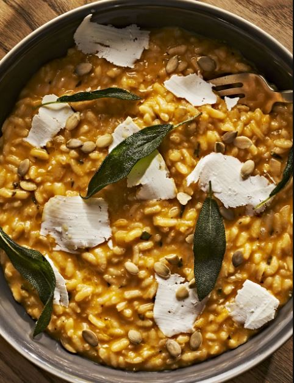

This article has been written and researched by our expert Loveable through a precise methodology. [Learn more about our methodology](https://avada.io/loveable/our-methodological.html)

[Loveable](https://avada.io/loveable/) > [Blog](https://avada.io/loveable/blog/) > [Holiday](https://avada.io/loveable/holiday/)

# Top 40 Halloween Dinner Ideas for 2023 Holiday

Written by [Blake Simpson](https://avada.io/loveable/author/blake/) Last Updated on August 31, 2023

- [40 Halloween Dinner Ideas That Make Kids And Adults Find Spooky](https://avada.io/loveable/blog/halloween-dinner-ideas/#wp-block-heading-2-4)
    - [1\. Skull Pizzadillas](https://avada.io/loveable/blog/halloween-dinner-ideas/#wp-block-heading-3-5)
    - [2\. Mummy Jalapeño Poppers](https://avada.io/loveable/blog/halloween-dinner-ideas/#wp-block-heading-3-8)
    - [3\. Halloween Deviled Eggs](https://avada.io/loveable/blog/halloween-dinner-ideas/#wp-block-heading-3-11)
    - [4\. Dip-Dyed Donuts](https://avada.io/loveable/blog/halloween-dinner-ideas/#wp-block-heading-3-14)
    - [5\. Graveyard Dip](https://avada.io/loveable/blog/halloween-dinner-ideas/#wp-block-heading-3-17)
    - [6\. Skillet Roasted Chicken](https://avada.io/loveable/blog/halloween-dinner-ideas/#wp-block-heading-3-20)
    - [7\. Black Chocolate Cake](https://avada.io/loveable/blog/halloween-dinner-ideas/#wp-block-heading-3-23)
    - [8\. Roasted Butternut Squash Salad With Tahini Vinaigrette](https://avada.io/loveable/blog/halloween-dinner-ideas/#wp-block-heading-3-26)
    - [9\. Roasted Pumpkin Seeds](https://avada.io/loveable/blog/halloween-dinner-ideas/#wp-block-heading-3-29)
    - [10\. Savory Pumpkin and Sage Soup](https://avada.io/loveable/blog/halloween-dinner-ideas/#wp-block-heading-3-32)
    - [11\. Rosemary Gin Gimlet](https://avada.io/loveable/blog/halloween-dinner-ideas/#wp-block-heading-3-35)
    - [12\. Butternut Mole Enchiladas](https://avada.io/loveable/blog/halloween-dinner-ideas/#wp-block-heading-3-38)
    - [13\. Double Chocolate Cookie Bark](https://avada.io/loveable/blog/halloween-dinner-ideas/#wp-block-heading-3-41)
    - [14\. Pulled Pork Nachos](https://avada.io/loveable/blog/halloween-dinner-ideas/#wp-block-heading-3-44)
    - [15\. Slow Cooker BBQ Jackfruit Sandwich With Pineapple Slaw](https://avada.io/loveable/blog/halloween-dinner-ideas/#wp-block-heading-3-47)
    - [16\. Spinach and Artichoke Mac & Cheese](https://avada.io/loveable/blog/halloween-dinner-ideas/#wp-block-heading-3-50)
    - [17\. Monster Wraps](https://avada.io/loveable/blog/halloween-dinner-ideas/#wp-block-heading-3-53)
    - [18\. Ghostly Pizza](https://avada.io/loveable/blog/halloween-dinner-ideas/#wp-block-heading-3-56)
    - [19\. Chicken Pot Pie With Crawling Hands](https://avada.io/loveable/blog/halloween-dinner-ideas/#wp-block-heading-3-59)
    - [20\. Jack-o’-Lantern Chicken and Sweet Potato Potpies](https://avada.io/loveable/blog/halloween-dinner-ideas/#wp-block-heading-3-62)
    - [21\. Hot Pepper and Onion Pizza](https://avada.io/loveable/blog/halloween-dinner-ideas/#wp-block-heading-3-65)
    - [22\. Saucy Spider with Hairy Leg Sticks](https://avada.io/loveable/blog/halloween-dinner-ideas/#wp-block-heading-3-68)
    - [23\. Slow Cooker Sausage, Potato and Onion-Stuffed Peppers](https://avada.io/loveable/blog/halloween-dinner-ideas/#wp-block-heading-3-71)
    - [24\. Severed Toes in Bandages](https://avada.io/loveable/blog/halloween-dinner-ideas/#wp-block-heading-3-74)
    - [25\. Mummy Meat Loaves](https://avada.io/loveable/blog/halloween-dinner-ideas/#wp-block-heading-3-77)
    - [26\. Monster Burgers](https://avada.io/loveable/blog/halloween-dinner-ideas/#wp-block-heading-3-81)
    - [27\. Snakes and Soup](https://avada.io/loveable/blog/halloween-dinner-ideas/#wp-block-heading-3-84)
    - [28\. Beef and Lentil Chili](https://avada.io/loveable/blog/halloween-dinner-ideas/#wp-block-heading-3-87)
    - [29\. Cauldron Dip](https://avada.io/loveable/blog/halloween-dinner-ideas/#wp-block-heading-3-90)
    - [30\. Spooky Spinach Dip in Bread Bowl Cauldron](https://avada.io/loveable/blog/halloween-dinner-ideas/#wp-block-heading-3-93)
    - [31\. Sweet Potato Sausage Lasagna](https://avada.io/loveable/blog/halloween-dinner-ideas/#wp-block-heading-3-96)
    - [32\. Mummy Hot Dogs](https://avada.io/loveable/blog/halloween-dinner-ideas/#wp-block-heading-3-99)
    - [33\. Frito Pie](https://avada.io/loveable/blog/halloween-dinner-ideas/#wp-block-heading-3-102)
    - [34\. Pumpkin Risotto](https://avada.io/loveable/blog/halloween-dinner-ideas/#wp-block-heading-3-105)
    - [35\. Butternut Squash Casserole](https://avada.io/loveable/blog/halloween-dinner-ideas/#wp-block-heading-3-108)
    - [36\. Roasted Butternut Squash Soup](https://avada.io/loveable/blog/halloween-dinner-ideas/#wp-block-heading-3-111)
    - [37\. Harvest Chicken Casserole](https://avada.io/loveable/blog/halloween-dinner-ideas/#wp-block-heading-3-114)
    - [38\. Stuffed Bell Pepper Soup](https://avada.io/loveable/blog/halloween-dinner-ideas/#wp-block-heading-3-117)
    - [39\. Broccoli Cheddar Pasta](https://avada.io/loveable/blog/halloween-dinner-ideas/#wp-block-heading-3-120)
    - [40\. Apple Cider Glazed Chicken](https://avada.io/loveable/blog/halloween-dinner-ideas/#wp-block-heading-3-123)
- [To Sum up,](https://avada.io/loveable/blog/halloween-dinner-ideas/#wp-block-heading-2-129)

During Halloween, people often become engrossed in perfecting their costumes, ensuring they have enough candy for trick-or-treaters, setting up mildly spooky decorations, and organizing various party plans. 

Amidst all this excitement, dinner plans can be overlooked. While sticking to familiar options is possible, we believe it’s much more enjoyable (for both you and your kids) to make your dinner Halloween-themed. You can get creative by incorporating creepy ghosts, mummies, and Jack-o’-lanterns into your dishes or by featuring seasonal produce such as pumpkins, apples, and sweet potatoes. 

To assist you, we’ve compiled a list of **31 Halloween dinner ideas** suitable for both kids and adults, certain to delight all the little monsters and spirits gathered around your dinner table.

## **40 Halloween Dinner Ideas That Make Kids And Adults Find Spooky**

### **1\. Skull Pizzadillas**

To conjure up a simple yet spooky dinner, transform your ordinary quesadilla into a Halloween delight by crafting eerie designs with holes in the tortillas.

### **2\. Mummy Jalapeño Poppers**

Without a doubt, people will find themselves going for seconds! These delightful treats are not only adorable to behold but also exceptionally delicious. With a delectable cheesy filling encased in flaky crescent roll dough, it’s impossible to go wrong with these.

### **3\. Halloween Deviled Eggs**

By adding just a few drops of gel food coloring, you can transform ordinary deviled eggs into a spooktacular Halloween delight! This is among the most preferred Halloween dinner ideas for recent years.

### **4\. Dip-Dyed Donuts**

Prepare these delightful no-fry pumpkin cake donuts, which are not only super easy to make but also bring loads of fun. As a bonus, they serve as a perfect [Halloween activity](https://avada.io/loveable/blog/halloween-traditions/) that the whole family can enjoy together.

### **5\. Graveyard Dip**

Create a spooktacular Halloween treat by cutting tortilla chips into the shape of gravestones and serving them alongside salsa, guacamole, and black bean [Halloween dip](https://avada.io/loveable/blog/halloween-dip-recipes/). It’s sure to be a hauntingly delicious addition to your festivities!

### **6\. Skillet Roasted Chicken**

On October 31, you can savor a golden roast chicken that features perfectly in-season produce, including squash and fennel. It’s a delightful dish showcasing the best flavors of the season.

### **7\. Black Chocolate Cake**

For an extra-dark and delightful dessert that will impress everyone at the bash, give black cocoa a try (you can find it in the baking aisle!).

### **8\. Roasted Butternut Squash Salad With Tahini Vinaigrette**

Considering that you might be tempted to have Halloween candy for dinner (no judgment here!), why not balance it out with a tasty, veggie-packed salad?

### **9\. Roasted Pumpkin Seeds**

The best part about [carving pumpkins for Halloween](https://avada.io/loveable/blog/halloween-pumpkin/) is the delightful snack of nutty roasted seeds afterward. For a delicious twist, try seasoning them with Parmesan cheese and black pepper!

### **10\. Savory Pumpkin and Sage Soup**

Beyond its role as a Jack O’ Lantern, pumpkin can be savored in a different form! Give it a try by blending it with garlic, onions, and spices, and then topping it off with a shiitake mushroom and sage garnish. It’s a delightful way to enjoy this versatile ingredient.

### **11\. Rosemary Gin Gimlet**

Using torched rosemary as a garnish not only adds a wicked-good touch but also infuses a subtle smoky flavor.

### **12\. Butternut Mole Enchiladas**

Embrace the best of butternut squash during the Halloween season and indulge in this delectable savory-sweet sensation.

### **13\. Double Chocolate Cookie Bark**

Prepare a sweet and shareable snack by spreading dark chocolate cookies with white chocolate frosting. Adding an extra drizzle of chocolate and candy eyes gives them an adorable (and friendly!) mummy appearance.

### **14\. Pulled Pork Nachos**

Prepare a tray of cheesy, zesty nachos, and you’ll be astonished at how quickly they vanish. The best part is, you can whip them up in your Instant Pot!

### **15\. Slow Cooker BBQ Jackfruit Sandwich With Pineapple Slaw**

Start off Halloween with a delicious treat: try this clever trick of making vegan jackfruit that tastes just like pulled pork! Simply set up the slow cooker before heading out for some trick-or-treating.

### **16\. Spinach and Artichoke Mac & Cheese**

In Tieghan Gerard’s Half Baked Harvest Super Simple cookbook, two beloved comfort food classics come together to create a warm and delightful meal. This ultimate family dinner is sure to win over even the pickiest eaters.

### **17\. Monster Wraps**

These tasty bites will turn your dinner into a graveyard smash! The best part is that they are completely customizable, ensuring even picky eaters will be pleased.

### **18\. Ghostly Pizza**

While bugs on food are usually a turn-off, it’s a different story when they’re made of olives. Don’t worry; even if olives aren’t your preference, you can still relish a ghostly cheese pizza.

### **19\. Chicken Pot Pie With Crawling Hands**

Keep your little ghost or goblin well-nourished for the night ahead with this savory pot pie, packed with a delightful combination of veggies and protein. Are you looking for amazing Halloween dinner ideas, this is a must-try!

### **20\. Jack-o’-Lantern Chicken and Sweet Potato Potpies**

For Halloween, indulge in this frightfully tasty main course featuring a sweet potato dish. Not only is it perfect for the spooky season, but it also makes a comforting choice throughout the winter. You can serve it in ramekins as shown, or create one big pie with uncut puff pastry on top, baking it until it turns golden and delicious.

### **21\. Hot Pepper and Onion Pizza**

This completely vegetarian dish, and easily made vegan by omitting the cheese or using a vegan alternative, is anything but lacking in flavor. The combination of hot peppers, onions, and jalapeños creates one of the best flavor combinations ever.

### **22\. Saucy Spider with Hairy Leg Sticks**

Create a web of doughy deliciousness with this perfect [Halloween appetizer](https://avada.io/loveable/blog/halloween-party-appetizers/) for your party. If you can’t find pizza dough at your local supermarket, consider visiting a nearby pizza parlor, as they often sell fresh dough balls that you can use.

### **23\. Slow Cooker Sausage, Potato and Onion-Stuffed Peppers**

For this fun dinner idea, feel free to use our slow cooker stuffed pepper recipe or any other recipe you prefer. The process is simple – just carve a little face in the pepper, and you’re all set!

### **24\. Severed Toes in Bandages**

These baked cocktail franks, wrapped in pie crust strips with a sliced almond toenail inserted into one end of each “digit,” will be a hit with your guests. For a chilling effect, serve them with blood-red ketchup for dipping.

### **25\. Mummy Meat Loaves**

These mini-meat loaves come with a delightful surprise – sweet cherry tomatoes hidden in their center, providing a burst of juicy flavor when you take a bite. Even after Halloween, you can keep this recipe in your rotation by piping mashed potatoes atop the loaves, just like frosting on a cupcake.

**Related:** Best [Halloween Cake](https://avada.io/loveable/halloween-cake/) that’s Scary-Good and Delicious

### **26\. Monster Burgers**

Prepare your burgers as you typically would and add a festive twist to the toppings. Cut the cheese slices into tooth shapes and finish them off with toothpick eyes—well, actually olives—for a spooky and fun touch.

### **27\. Snakes and Soup**

Amaze your partygoers with a unique first course featuring a wriggling reptile breadstick garnish. As this little creature glides across a glass bowl of tomato soup, not only is he stealthy, but he also adds a delicious twist to the dish.

### **28\. Beef and Lentil Chili**

Chili is a timeless classic for a good reason. Your guests will appreciate having a hearty option to enjoy, especially when [Halloween cocktails](https://avada.io/loveable/blog/halloween-drinks/) are flowing. Simply serve it in festive bowls, and you’re all set for a perfect meal.

### **29\. Cauldron Dip**

How can you have a Halloween party without a green dip? This crowd-pleaser is crafted from nutritious edamame and low-fat ricotta cheese, elegantly presented in a large acorn squash surrounded by a “fire” of crudité and breadsticks.

### **30\. Spooky Spinach Dip in Bread Bowl Cauldron**

Amaze your guests with this appetizer that ingeniously converts pumpernickel bread and breadsticks. Just fill it with a wonderfully easy creamy spinach dip, and you’re all set to impress.

### **31\. Sweet Potato Sausage Lasagna**

Lasagnas are infallible – they hold the title of being the most soul-satisfying food, and this one is no different. Furthermore, it demonstrates that pasta isn’t a prerequisite. Without noodles to boil, it’s almost even easier to prepare than a traditional lasagna.

### **32\. Mummy Hot Dogs**

Among the multitude of mummy hot dogs out there, ours stands out as the best for a couple of compelling reasons. To begin with, they are generously stuffed with cheese. Additionally, every mummy is delicately brushed with melted butter before baking, resulting in a delectable, buttery, flaky, and cheesy treat that is simply unbeatable!

### **33\. Frito Pie**

If you’ve missed the dinner window and it’s now time for trick-or-treating, no need to stress on Halloween day. Let this recipe be your savior. The on-the-go-friendly Frito pie will ensure you and your kids stay full while maintaining the holiday spirit. Enjoy the fun-filled day without worries!

### **34\. Pumpkin Risotto**

Elevate your beloved risotto recipe for the fall season by incorporating pumpkin puree, fragrant sage, and a touch of nutmeg. For an extra touch of creaminess, opt for shaved ricotta salata, although Parmesan works just as well if that’s what you have on hand. Enjoy the delightful flavors of autumn in every bite!

### **35\. Butternut Squash Casserole**

In this delectable casserole, you’ll find a delightful combination of savory bacon and two types of cheese—mozzarella and cheddar. To add a healthy-ish twist and balance out all the candy indulgence, we’ve included just the right amount of kale. Enjoy this mouthwatering dish guilt-free!

### **36\. Roasted Butternut Squash Soup**

When it comes to capturing the essence of leaves falling and the chilly autumn breeze, some might suggest pumpkin pie, while others might opt for warm apple cider. However, for us, nothing complements October sweater weather better than a delightful bowl of butternut squash soup.

### **37\. Harvest Chicken Casserole**

Indulge in the ultimate fall casserole featuring all your favorites—Brussels sprouts, butternut squash, and cranberries. This satisfying dish is the perfect fuel to energize you and your family before embarking on a fun-filled Halloween trick-or-treating adventure.

### **38\. Stuffed Bell Pepper Soup**

This soup encapsulates all the beloved elements of a classic stuffed pepper—ground beef, rice, tomatoes, and an indulgent amount of cheese. Whether enjoyed on its own or paired with cornbread or a salad, it makes for a satisfying and hearty Halloween evening meal.

### **39\. Broccoli Cheddar Pasta**

Including broccoli in this dish is a clever tactic to sneak in an extra serving of greens before heading out for trick-or-treating. Even the pickiest of little ghouls and goblins won’t be able to resist their vegetables when they are coated in delicious cheese!

### **40\. Apple Cider Glazed Chicken**

Why limit the fun to chicken breasts? Chicken thighs offer incredible flavor, and effortless cooking, and pair wonderfully with sweet potatoes and apples. Give this delightful combination a try for Halloween dinner ideas or any evening during the fall season. You won’t be disappointed!

**Related:**

- Best [Halloween Food Ideas](https://avada.io/loveable/halloween-food-ideas/)

- Spooktacular [Halloween Potluck Ideas](https://avada.io/loveable/halloween-potluck-ideas/)

## **To Sum up,**

In conclusion, these **top 40 Halloween dinner ideas for the 2023** holiday are sure to elevate your celebrations and delight your guests. From spooky-themed dishes to comforting fall favorites, there’s something for everyone to enjoy. 

Whether you’re hosting a Halloween party or simply looking to add a festive touch to your family dinner, these creative and delicious recipes will make your Halloween festivities truly memorable. So, get ready to indulge in a culinary adventure that captures the spirit of the season and makes this Halloween one to remember!

- [40 Halloween Dinner Ideas That Make Kids And Adults Find Spooky](https://avada.io/loveable/blog/halloween-dinner-ideas/#wp-block-heading-2-4)
    - [1\. Skull Pizzadillas](https://avada.io/loveable/blog/halloween-dinner-ideas/#wp-block-heading-3-5)
    - [2\. Mummy Jalapeño Poppers](https://avada.io/loveable/blog/halloween-dinner-ideas/#wp-block-heading-3-8)
    - [3\. Halloween Deviled Eggs](https://avada.io/loveable/blog/halloween-dinner-ideas/#wp-block-heading-3-11)
    - [4\. Dip-Dyed Donuts](https://avada.io/loveable/blog/halloween-dinner-ideas/#wp-block-heading-3-14)
    - [5\. Graveyard Dip](https://avada.io/loveable/blog/halloween-dinner-ideas/#wp-block-heading-3-17)
    - [6\. Skillet Roasted Chicken](https://avada.io/loveable/blog/halloween-dinner-ideas/#wp-block-heading-3-20)
    - [7\. Black Chocolate Cake](https://avada.io/loveable/blog/halloween-dinner-ideas/#wp-block-heading-3-23)
    - [8\. Roasted Butternut Squash Salad With Tahini Vinaigrette](https://avada.io/loveable/blog/halloween-dinner-ideas/#wp-block-heading-3-26)
    - [9\. Roasted Pumpkin Seeds](https://avada.io/loveable/blog/halloween-dinner-ideas/#wp-block-heading-3-29)
    - [10\. Savory Pumpkin and Sage Soup](https://avada.io/loveable/blog/halloween-dinner-ideas/#wp-block-heading-3-32)
    - [11\. Rosemary Gin Gimlet](https://avada.io/loveable/blog/halloween-dinner-ideas/#wp-block-heading-3-35)
    - [12\. Butternut Mole Enchiladas](https://avada.io/loveable/blog/halloween-dinner-ideas/#wp-block-heading-3-38)
    - [13\. Double Chocolate Cookie Bark](https://avada.io/loveable/blog/halloween-dinner-ideas/#wp-block-heading-3-41)
    - [14\. Pulled Pork Nachos](https://avada.io/loveable/blog/halloween-dinner-ideas/#wp-block-heading-3-44)
    - [15\. Slow Cooker BBQ Jackfruit Sandwich With Pineapple Slaw](https://avada.io/loveable/blog/halloween-dinner-ideas/#wp-block-heading-3-47)
    - [16\. Spinach and Artichoke Mac & Cheese](https://avada.io/loveable/blog/halloween-dinner-ideas/#wp-block-heading-3-50)
    - [17\. Monster Wraps](https://avada.io/loveable/blog/halloween-dinner-ideas/#wp-block-heading-3-53)
    - [18\. Ghostly Pizza](https://avada.io/loveable/blog/halloween-dinner-ideas/#wp-block-heading-3-56)
    - [19\. Chicken Pot Pie With Crawling Hands](https://avada.io/loveable/blog/halloween-dinner-ideas/#wp-block-heading-3-59)
    - [20\. Jack-o’-Lantern Chicken and Sweet Potato Potpies](https://avada.io/loveable/blog/halloween-dinner-ideas/#wp-block-heading-3-62)
    - [21\. Hot Pepper and Onion Pizza](https://avada.io/loveable/blog/halloween-dinner-ideas/#wp-block-heading-3-65)
    - [22\. Saucy Spider with Hairy Leg Sticks](https://avada.io/loveable/blog/halloween-dinner-ideas/#wp-block-heading-3-68)
    - [23\. Slow Cooker Sausage, Potato and Onion-Stuffed Peppers](https://avada.io/loveable/blog/halloween-dinner-ideas/#wp-block-heading-3-71)
    - [24\. Severed Toes in Bandages](https://avada.io/loveable/blog/halloween-dinner-ideas/#wp-block-heading-3-74)
    - [25\. Mummy Meat Loaves](https://avada.io/loveable/blog/halloween-dinner-ideas/#wp-block-heading-3-77)
    - [26\. Monster Burgers](https://avada.io/loveable/blog/halloween-dinner-ideas/#wp-block-heading-3-81)
    - [27\. Snakes and Soup](https://avada.io/loveable/blog/halloween-dinner-ideas/#wp-block-heading-3-84)
    - [28\. Beef and Lentil Chili](https://avada.io/loveable/blog/halloween-dinner-ideas/#wp-block-heading-3-87)
    - [29\. Cauldron Dip](https://avada.io/loveable/blog/halloween-dinner-ideas/#wp-block-heading-3-90)
    - [30\. Spooky Spinach Dip in Bread Bowl Cauldron](https://avada.io/loveable/blog/halloween-dinner-ideas/#wp-block-heading-3-93)
    - [31\. Sweet Potato Sausage Lasagna](https://avada.io/loveable/blog/halloween-dinner-ideas/#wp-block-heading-3-96)
    - [32\. Mummy Hot Dogs](https://avada.io/loveable/blog/halloween-dinner-ideas/#wp-block-heading-3-99)
    - [33\. Frito Pie](https://avada.io/loveable/blog/halloween-dinner-ideas/#wp-block-heading-3-102)
    - [34\. Pumpkin Risotto](https://avada.io/loveable/blog/halloween-dinner-ideas/#wp-block-heading-3-105)
    - [35\. Butternut Squash Casserole](https://avada.io/loveable/blog/halloween-dinner-ideas/#wp-block-heading-3-108)
    - [36\. Roasted Butternut Squash Soup](https://avada.io/loveable/blog/halloween-dinner-ideas/#wp-block-heading-3-111)
    - [37\. Harvest Chicken Casserole](https://avada.io/loveable/blog/halloween-dinner-ideas/#wp-block-heading-3-114)
    - [38\. Stuffed Bell Pepper Soup](https://avada.io/loveable/blog/halloween-dinner-ideas/#wp-block-heading-3-117)
    - [39\. Broccoli Cheddar Pasta](https://avada.io/loveable/blog/halloween-dinner-ideas/#wp-block-heading-3-120)
    - [40\. Apple Cider Glazed Chicken](https://avada.io/loveable/blog/halloween-dinner-ideas/#wp-block-heading-3-123)
- [To Sum up,](https://avada.io/loveable/blog/halloween-dinner-ideas/#wp-block-heading-2-129)

### [Blake Simpson](https://avada.io/loveable/author/blake/)

Hi, I'm Blake from Loveable. I help people find perfect gifts for occasions like anniversaries and weddings. I also write a blog about holidays, sharing insights to make them more meaningful. Let's create unforgettable moments together!

- [Twitter](https://twitter.com/intent/tweet)
- [Facebook](https://www.facebook.com/sharer/sharer.php)
- [instagram](https://avada.io/loveable/blog/halloween-dinner-ideas/)
- [pinterest](https://www.pinterest.com/loveablellc/)

## Related Posts

[### 120+ Christian Birthday Wishes To Spread Your Love](https://avada.io/loveable/blog/christian-birthday-wishes/) 

[

### 35 Best 70th Birthday Ideas To Celebrate The Special Milestone

](https://avada.io/loveable/blog/70th-birthday-ideas/)

[

### 50 Best 30th Birthday Decorations for a Remarkable Birthday Bash

](https://avada.io/loveable/blog/30th-birthday-decorations/)

[

### 40 Delicious Vegan Christmas Desserts to Delight Your Palate

](https://avada.io/loveable/blog/vegan-christmas-desserts/)

[

### 60 Christmas Team Building Activities to Boost Workplace Spirit

](https://avada.io/loveable/blog/christmas-team-building-activities/)
