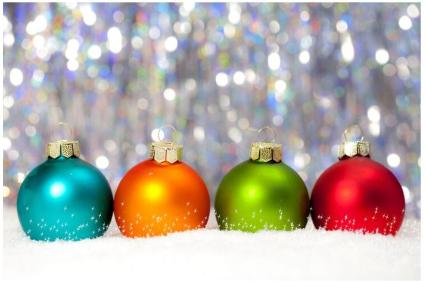
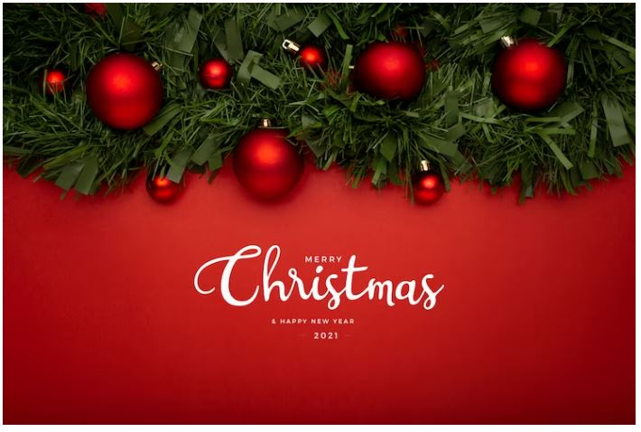
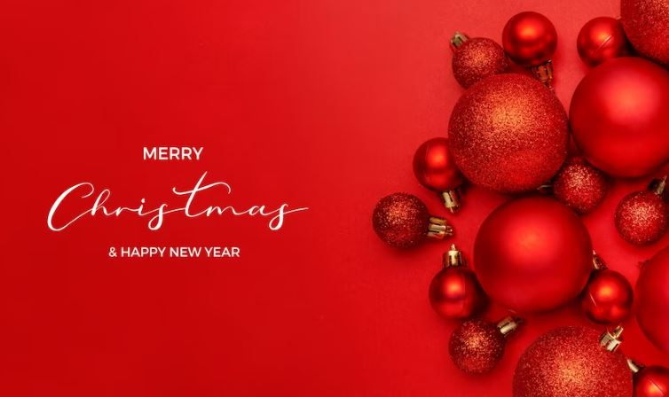
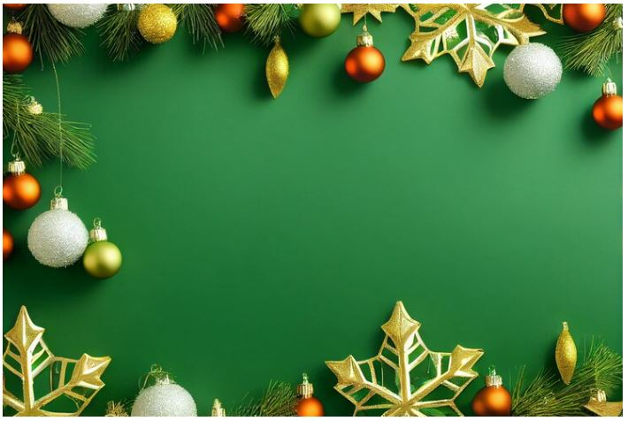
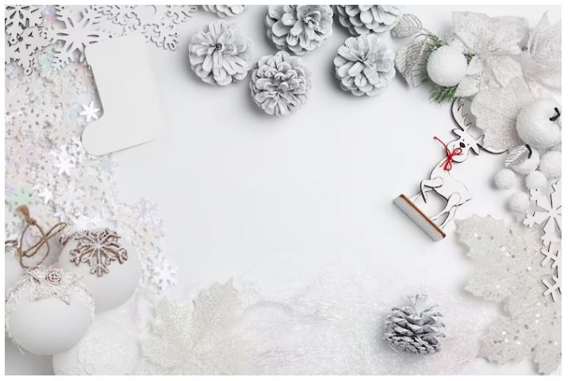
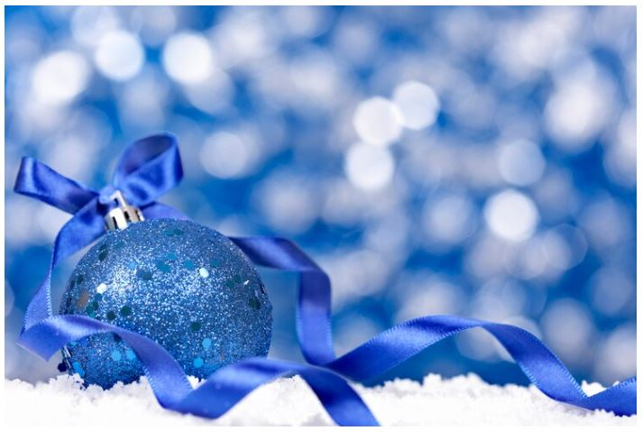
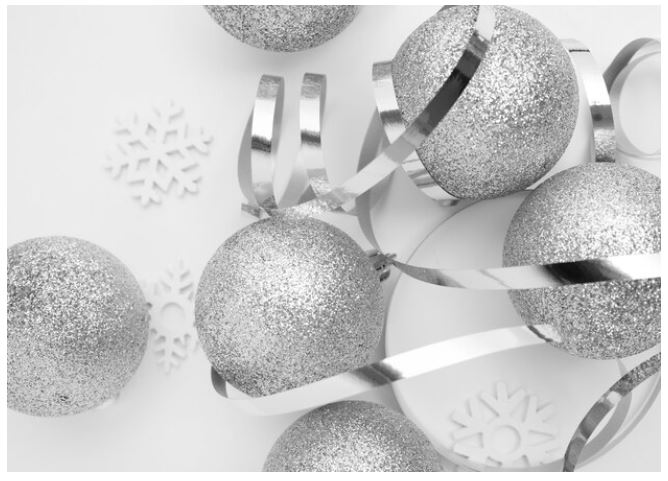
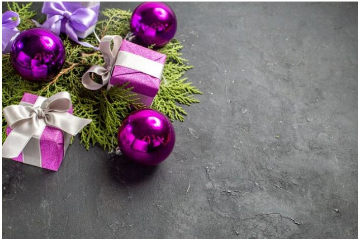
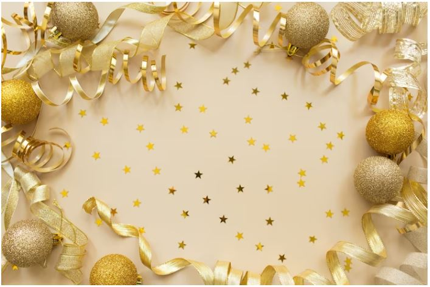

This article has been written and researched by our expert Loveable through a precise methodology. [Learn more about our methodology](https://avada.io/loveable/our-methodological.html)

[Loveable](https://avada.io/loveable/) > [Blog](https://avada.io/loveable/blog/) > [Holiday](https://avada.io/loveable/holiday/)

# Top Most Popular Christmas Colors Ever and Their Meaning

Written by [Blake Simpson](https://avada.io/loveable/author/blake/) Last Updated on August 18, 2023

- [Why Do We Have Christmas Colors?](https://avada.io/loveable/blog/christmas-colors/#wp-block-heading-2-3)
- [Why Have Red And Green Become The Traditional Christmas Colors?](https://avada.io/loveable/blog/christmas-colors/#wp-block-heading-2-9) 
- [Top Most Popular Christmas Colors and Their Meaning](https://avada.io/loveable/blog/christmas-colors/#wp-block-heading-2-15)
    - [Red](https://avada.io/loveable/blog/christmas-colors/#wp-block-heading-3-16)
    - [Green](https://avada.io/loveable/blog/christmas-colors/#wp-block-heading-3-24)
    - [White](https://avada.io/loveable/blog/christmas-colors/#wp-block-heading-3-33)
    - [Blue](https://avada.io/loveable/blog/christmas-colors/#wp-block-heading-3-41)
    - [Silver](https://avada.io/loveable/blog/christmas-colors/#wp-block-heading-3-47)
    - [Purple](https://avada.io/loveable/blog/christmas-colors/#wp-block-heading-3-53)
    - [Gold](https://avada.io/loveable/blog/christmas-colors/#wp-block-heading-3-60)
- [To Conclude,](https://avada.io/loveable/blog/christmas-colors/#wp-block-heading-2-69)

With the holiday season just around the corner, it’s the perfect opportunity to infuse your surroundings with the joyful and festive hues of Christmas. Red and green, a timeless and classic color combination synonymous with this season, are widely recognized as the traditional Christmas colors, celebrated from Asia to North America. However, there are a plethora of other Christmas colors to explore and incorporate into your decorations or designs.

Undoubtedly, the origins of these traditional **Christmas colors** are steeped in legend, history, religion, popular culture, and extensive marketing efforts. If you’re interested in crafting your unique Christmas color palettes and delving deeper into the significance of your favorite colors, continue reading!

## **Why Do We Have Christmas Colors?**

The presence of Christmas colors can be attributed to several factors. According to Angelo Randaci, a horticulturist and an authority on the symbolism of plant colors, people attach meaning to specific colors to the extent that these colors can trigger particular emotions or memories.

For example, the sight of a red and green poinsettia might instantly transport someone back to cherished memories of Christmas Eve spent at their grandmother’s house, evoking feelings of happiness and nostalgia.

Furthermore, there’s an economic rationale behind the use of signature colors. Employing specific colors associated with holiday aid in marketing and branding products relevant to the occasion. 

For instance, even if someone already possesses a door wreath, purchasing a new one adorned with red and green decorations allows them to showcase their Christmas spirit. By the way, if you’re in need of a new wreath, we offer an extensive selection of Christmas wreaths for you to peruse.

## **Why Have Red And Green Become The Traditional Christmas Colors?** 

While they are now closely associated with Christmas, their origins can be traced back to a different holiday: the winter solstice. In ancient times, Celtic people believed that holly plants possessed special qualities, bringing beauty and good fortune during the harsh winter months. Consequently, they adorned their homes with vibrant red and green holly as a way to usher in prosperity for the new year.

Over the years, this Celtic tradition evolved, leading to the practice of hanging red and green decorations in general. Thus, the idea of adorning homes with these festive colors became a widely recognized and passed-down tradition around the world.

Additionally, there is a question about the religious significance of these colors, particularly for those who wish to uphold the Christ-centered aspect of Christmas. While many people embrace these colors purely for their aesthetic and traditional value, some Christians see a deeper symbolism in them, particularly in holly wreaths. In this interpretation, the red berries symbolize Jesus’ blood, while the spiky holly leaves represent the crown of thorns that encircled his head during the crucifixion.

Regardless of their origins and symbolism, red and green have firmly entrenched themselves as the beloved and iconic colors of the holiday season.

## **Top Most Popular Christmas Colors and Their Meaning**

### **Red**

Red holds significant importance as one of the most prominent Christmas colors, mainly due to its associations and symbolic representations. The red holly berries, which are often seen during the holiday season, symbolize the blood shed by Jesus Christ on the cross, emphasizing the religious aspect of Christmas. 

Beyond this, red holds broader meanings throughout the year, representing love, romance, and courage in various contexts.

During the Middle Ages, Christmas plays featured red apples tied to a Paradise Tree, symbolizing the fall of Adam when he consumed the forbidden fruit.

Red’s significance continued to grow as it became linked to the attire of Catholic Bishops, including Saint Nicholas, a revered 3rd Century bishop known for his charitable deeds toward the less fortunate.

In the Civil War era, cartoonists depicted Saint Nicholas as a joyful, smiling figure dressed in a red suit adorned with white fur, further solidifying the association of red with the beloved character.

During the 1930s, Coca-Cola’s iconic ad campaign featuring Santa Claus in his red coat, joyfully sipping a Coke, contributed to the lasting and widespread perception of red as one of the most defining Christmas colors.

### **Green**

No compilation of Christmas colors would be comprehensive without acknowledging the prominence of green as a top holiday hue!

In the realm of traditional Christmas festivities, evergreen foliage such as mistletoe and holly assumes a significant role, symbolizing the life and eternal nature of Jesus Christ.

In ancient times, green foliage held symbolism representing nature’s resilience, even during icy winters, and it also came to embody good luck, prosperity, and well-being throughout the Christmas season and into the new year.

Our ancestors utilized evergreen plants like Ivy, Holly, and Mistletoe to adorn their homes during the long, dark winters, serving as a reminder that spring was approaching and that winter’s grip would eventually subside.

Moreover, historical practices across different cultures involved exchanging evergreen branches as good luck charms during the winter months, with Egyptians incorporating palm branches in their winter celebrations.

During medieval European Paradise plays, particularly on Christmas Eve, a pivotal element was the Paradise Tree, typically a green pine tree adorned with red apples, thus contributing to the association between red Santa robes and green fir trees.

Lastly, the beloved green Christmas trees hold an indispensable place in the winter holidays, as they add an irreplaceable charm to the festive season!

### **White**

White stands out as one of the most iconic holiday colors, epitomizing the Christmas spirit with its enchanting resemblance to a winter wonderland, especially in the northern hemisphere, where magical sprinkles of white snow transform the landscape.

The history of white as a color is deeply rooted in pagan winter solstice celebrations, where it held connotations of purity and the triumph of good over evil, making it a symbol of the Christmas festivities.

In the context of the medieval Paradise Tree, white-hued paper wafers were used as decorations, representing the body of Christ and the sacred bread consumed during Mass or Holy Communion.

Throughout various Christian churches, a white cloth serves to cover the altar during Christmas services, symbolizing reverence and spiritual significance, although the Russian Orthodox Church employs gold-hued altar coverings instead.

During the 19th century, artists like Ives and Currier contributed to the allure of white as a cozy color during Christmas, depicting a world transformed by gentle dustings of snow.

Moreover, Bing Crosby’s iconic “White Christmas” holiday song, composed by Irving Berlin, made its indelible mark after Crosby’s captivating performance in 1941, becoming a best-selling single and forever associating the color white with the magic of Christmas.

### **Blue**

Blue holds great significance as one of the notable Christmas colors, primarily because of its representation of Mary, the mother of Jesus Christ, particularly in Catholic Christmas services, aligning with the biblical symbolism of colors.

In medieval times, blue dyes were exceedingly precious and even more costly than gold, making them a luxury reserved for the wealthy and royalty, who could afford expensive blue garments. Thus, Mary is depicted in blue clothing underscoring her profound importance as the mother of Jesus Christ. 

Additionally, blue hues symbolize the color of heaven and a clear sky, adding to its symbolic value.

Despite its historical rarity and limited use in [Christmas decorations](https://avada.io/loveable/unique-christmas-ornaments/), the prominence of blue has grown over time. While it was once associated with coldness and negativity, contemporary Christmas tree decorations, like icicles, commonly feature the color blue. Moreover, blue is now among the five predominant holiday colors featured in many Christmas tree lights.

### **Silver**

Throughout the ages, silver has retained its status as a precious and prized commodity, with historical evidence suggesting its trade and mining in Turkey dating back to 3000 B.C.

In modern times, silver has emerged as one of the most meaningful Christmas colors, serving as a symbolic representation of the birth and divinity of Jesus Christ.

Adding to its significance, families often bring out their finest silverware during the holiday season or other special occasions, elevating the festive atmosphere with its gleaming allure.

The sparkling polish of silver infuses the holiday season with a unique seasonal charm, evoking feelings of cheerfulness and contentment as loved ones gather together to celebrate Christmas and enjoy the warmth of togetherness. Its radiant presence adds a touch of elegance and joy to the festivities, creating cherished memories that will be cherished for years to come.

### **Purple**

Despite not being commonly seen as one of the traditional Christmas colors, purple holds a steadfast and significant place within Christianity, carrying deep spiritual symbolism.

During the period leading up to Christmas, purple assumes a special association with the observance of Advent, a profoundly reflective and spiritual time in which the faithful fast and engage in penitence to prepare their hearts and souls for the momentous birth of Jesus Christ.

Within the sacred walls of churches, purple or blue-hued cloths and candles are thoughtfully used to adorn the altars, creating an atmosphere of reverence and anticipation during this meaningful season.

This luxurious shade, which has historically been linked to wealth and royalty, now finds itself firmly entrenched in the fabric of Christian tradition. Its symbolic representation in the Advent season serves as a reminder of the profound spiritual journey undertaken by believers in anticipation of the joyous celebration of Christ’s birth.

The color purple beautifully accentuates the solemnity and spiritual depth of this pre-Christmas period, adding a touch of grace and spirituality to the festive season.

### **Gold**

Radiant and shimmering gold stands tall as one of the most iconic Christmas colors, imbued with profound symbolism that reflects the illuminating nature of the Son of God, bringing light to the darkness.

In the story of the Three Wise Men, or Magi, one of them presented the newborn Baby Jesus with the precious gift of gold, a revered metal both in biblical times and to this day.

During those ancient times, gifts comprising frankincense, myrrh, and gold were exclusively reserved for kings, leading scholars to believe that these valuable offerings served to reinforce the prophecy that Jesus Christ was a King.

Even in contemporary Christmas celebrations, gold decorations and gifts retain their significance, symbolizing prosperity, luxury, wealth, and royalty.

However, recognizing that not all could afford gold-hued Christmas decorations, those of more modest means turned to yellow decorations as a fitting substitute, still emanating the warmth and cheer associated with the color gold.

Beyond its symbolic value, the color gold also holds practical importance during the heart of winter, as it mirrors the hues of sunlight and the glow of a roaring fire, providing much-needed warmth and comfort during the cold months. Gold’s presence during the holiday season truly elevates the ambiance and spirit of celebration, embodying both the divine and the earthly aspects of this cherished time.

_**Check Out:**_ Perfect [Personalized Christmas Ornaments](https://avada.io/loveable/personalized-christmas-ornaments/)

## **To Conclude,**

The array of **Christmas colors** holds a rich tapestry of meanings and traditions, woven throughout history and across cultures. From the classic red and green, symbolizing joy and prosperity, to the spiritual depth of purple, signifying the anticipation of Christ’s birth, each hue carries its own significance, evoking cherished memories and heartfelt emotions during the holiday season.

Sparkling gold and shimmering silver reflect the divine nature of the season, while the tranquil blue reminds us of Mary’s pivotal role in the Christmas story. Alongside these iconic colors, white blankets the landscape with its wintry charm, while bringing purity and spiritual depth to the celebration.

As we deck the halls and embrace the enchantment of Christmas, these colors surround us with their symbolic beauty, connecting us to centuries of tradition and timeless stories. The meaning behind these colors not only adds depth to the festive ambiance but also serves as a reminder of the true essence of Christmas – a time of joy, love, and unity with friends and family.

- [Why Do We Have Christmas Colors?](https://avada.io/loveable/blog/christmas-colors/#wp-block-heading-2-3)
- [Why Have Red And Green Become The Traditional Christmas Colors?](https://avada.io/loveable/blog/christmas-colors/#wp-block-heading-2-9) 
- [Top Most Popular Christmas Colors and Their Meaning](https://avada.io/loveable/blog/christmas-colors/#wp-block-heading-2-15)
    - [Red](https://avada.io/loveable/blog/christmas-colors/#wp-block-heading-3-16)
    - [Green](https://avada.io/loveable/blog/christmas-colors/#wp-block-heading-3-24)
    - [White](https://avada.io/loveable/blog/christmas-colors/#wp-block-heading-3-33)
    - [Blue](https://avada.io/loveable/blog/christmas-colors/#wp-block-heading-3-41)
    - [Silver](https://avada.io/loveable/blog/christmas-colors/#wp-block-heading-3-47)
    - [Purple](https://avada.io/loveable/blog/christmas-colors/#wp-block-heading-3-53)
    - [Gold](https://avada.io/loveable/blog/christmas-colors/#wp-block-heading-3-60)
- [To Conclude,](https://avada.io/loveable/blog/christmas-colors/#wp-block-heading-2-69)

### [Blake Simpson](https://avada.io/loveable/author/blake/)

Hi, I'm Blake from Loveable. I help people find perfect gifts for occasions like anniversaries and weddings. I also write a blog about holidays, sharing insights to make them more meaningful. Let's create unforgettable moments together!

- [Twitter](https://twitter.com/intent/tweet)
- [Facebook](https://www.facebook.com/sharer/sharer.php)
- [instagram](https://avada.io/loveable/blog/christmas-colors/)
- [pinterest](https://www.pinterest.com/loveablellc/)

## Related Posts

[### 120+ Christian Birthday Wishes To Spread Your Love](https://avada.io/loveable/blog/christian-birthday-wishes/) 

[

### 35 Best 70th Birthday Ideas To Celebrate The Special Milestone

](https://avada.io/loveable/blog/70th-birthday-ideas/)

[

### 50 Best 30th Birthday Decorations for a Remarkable Birthday Bash

](https://avada.io/loveable/blog/30th-birthday-decorations/)

[

### 40 Delicious Vegan Christmas Desserts to Delight Your Palate

](https://avada.io/loveable/blog/vegan-christmas-desserts/)

[

### 60 Christmas Team Building Activities to Boost Workplace Spirit

](https://avada.io/loveable/blog/christmas-team-building-activities/)
