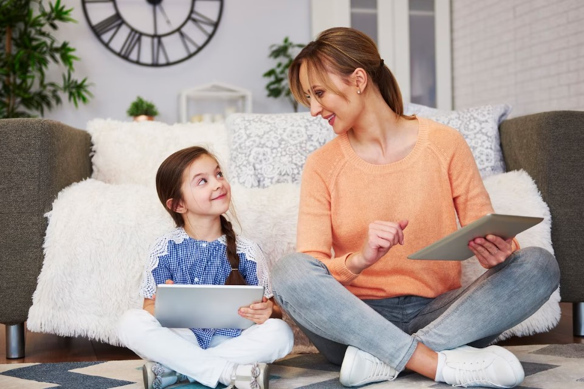
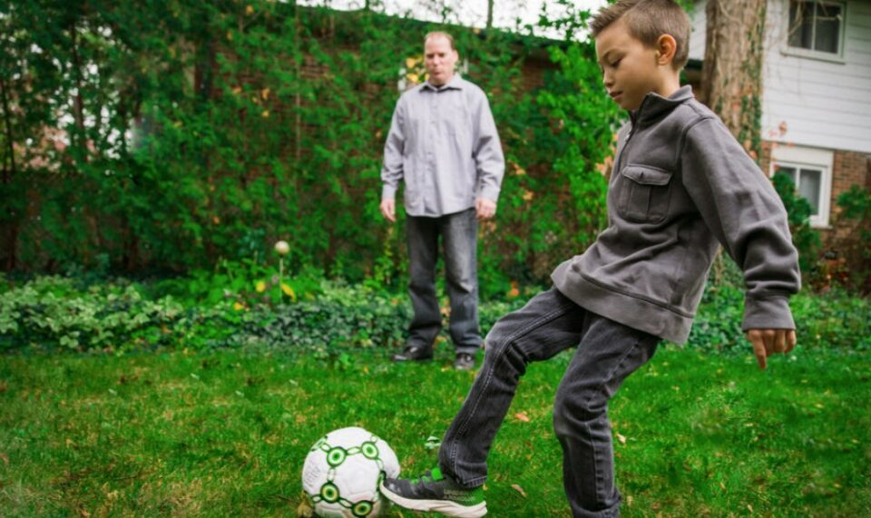

This article has been written and researched by our expert Loveable through a precise methodology. [Learn more about our methodology](https://avada.io/loveable/our-methodological.html)

[Loveable](https://avada.io/loveable/) > [Blog](https://avada.io/loveable/blog/) > [Parenting](https://avada.io/loveable/parenting/)

# Understanding Different Parenting Styles: Which One Is Right for You? – Expert Advice

Written by [Benjamin Collins](https://avada.io/loveable/author/benjamin/) Last Updated on August 28, 2023

- [4 Types of Parenting Styles According To Expert – Traits and Examples](https://avada.io/loveable/blog/different-parenting-styles/#wp-block-heading-2-4)
    - [The Authoritative Parent](https://avada.io/loveable/blog/different-parenting-styles/#wp-block-heading-3-8)
    - [The Neglectful Parent](https://avada.io/loveable/blog/different-parenting-styles/#wp-block-heading-3-16)
    - [The Authoritarian Parent](https://avada.io/loveable/blog/different-parenting-styles/#wp-block-heading-3-24)
    - [The Permissive Parent](https://avada.io/loveable/blog/different-parenting-styles/#wp-block-heading-3-32)
- [How parenting styles affect child’s personality?](https://avada.io/loveable/blog/different-parenting-styles/#wp-block-heading-2-40)
    - [1\. Social and emotional development](https://avada.io/loveable/blog/different-parenting-styles/#wp-block-heading-3-42)
    - [2\. Academic performance](https://avada.io/loveable/blog/different-parenting-styles/#wp-block-heading-3-44)
    - [3\. Behavioral and conduct issues](https://avada.io/loveable/blog/different-parenting-styles/#wp-block-heading-3-47)
    - [4\. Self-confidence and self-esteem](https://avada.io/loveable/blog/different-parenting-styles/#wp-block-heading-3-49)
    - [5\. Long-term outcomes](https://avada.io/loveable/blog/different-parenting-styles/#wp-block-heading-3-52)
- [What is the best parenting style for you?](https://avada.io/loveable/blog/different-parenting-styles/#wp-block-heading-2-54)
- [Final Thoughts](https://avada.io/loveable/blog/different-parenting-styles/#wp-block-heading-2-62)

Parenting is an important and complex task in the life of every parent. We all have the same question: “How can we become [good fathers or mothers](https://avada.io/loveable/mother-son-relationships/)?” This question raises a series of smaller questions, such as, “Should we control our children strictly or let them freely do what they want?” and “How should we handle it when our children make mistakes?” All these questions revolve around the common issue of **parenting styles**.

Parenting styles directly impact the development and personality of children, contributing to shaping their future. However, many parents still follow conventional methods and have not found a consistent and effective parenting style for themselves. If you aspire to be a serious parent and not overlook your child’s mistakes, that is fine. But how can you be “strict” in the right way? How can you be firm while ensuring your child still has a [happy and loving life with their parents?](https://avada.io/loveable/heartwarming-family-tradition-examples/)

With all these concerns in mind, this article will introduce you to some popular parenting styles, along with tips and principles associated with each style. We hope that this article will help you confidently find a parenting style that suits you and reassure you that you are doing the right things in the [process of raising your child](https://avada.io/loveable/how-to-play-with-newborn/).

## 4 Types of Parenting Styles According To Expert – Traits and Examples

Dianna Baumrind, a renowned researcher affiliated with Stanford University, dedicated many years to studying parenting styles, leading to significant conclusions.

According to Baumrind, the differences in parenting style can be divided into two main factors: degrees of responsiveness and demandingness. While the degree of responsiveness reflects the level of warmth and sensitivity parents show towards their child’s needs, demandingness, on the other hand, pertains to the level of control parents exert over their children. Furthermore, these parenting styles have some distinct characteristics, which we will explore shortly. Here are the four main parenting styles that you should take note of.

### The Authoritative Parent

The authoritative parenting style shows a balance between responsiveness and demandingness. Authoritative parents provide structure and guidance while also being responsive to their child’s emotional needs and fostering independence. This parenting approach is often considered a healthy and effective style. Common traits associated with authoritative parents include:

- **High responsiveness**: Authoritative parents are attentive and responsive to their child’s emotions, needs, and concerns. They create a supportive and nurturing environment where open communication is encouraged.

- **Reasonable demands:** While authoritative parents set clear expectations and rules, they also consider their child’s perspective. They provide reasons and explanations for rules, allowing for discussion and negotiation when appropriate.

- **Healthy discipline:** Authoritative parents use positive discipline techniques, focusing on teaching and guiding their child’s behavior rather than resorting to harsh punishments. They establish consequences that are fair and consistent.

- **Independence and autonomy:** Authoritative parents encourage their child’s independence and decision-making skills. They allow their child to explore and make age-appropriate choices, providing guidance and support along the way.

One of the most common examples is when a parent sets clear expectations for their child’s behavior, such as completing homework before leisure activities. They explain the importance of prioritizing responsibilities while also considering the child’s input. The parent maintains open lines of communication, actively listening to the child’s thoughts and concerns. If the child fails to meet expectations, the parent discusses the consequences in a calm and understanding manner, focusing on teaching responsibility rather than punishing. The child feels supported, respected, and understood within the parent-child relationship.

### The Neglectful Parent

The neglectful parenting style, also known as uninvolved parenting, is known by a lack of responsiveness, attention, and involvement from the parent toward their child. Neglectful parents may be indifferent to their child’s needs or may be overwhelmed with their own issues, resulting in minimal nurturance and guidance. Common traits associated with neglectful parents include:

- **Low responsiveness**: Neglectful parents display a lack of responsiveness toward their child’s emotional and physical needs. They may be emotionally detached, uninvolved, and uninterested in their child’s well-being.

- **Minimal demandingness:** Neglectful parents have low expectations and few demands on their children. They provide little guidance, structure, or rules, leading to a lack of direction and guidance in the child’s life.

- **Limited nurturance:** Neglectful parents offer little emotional support, affection, or nurturing to their children. They may neglect to provide the necessary care, attention, and affection needed for healthy development.

- **Struggles with own issues:** Neglectful parents often have personal challenges, such as mental health issues, substance abuse problems, or other difficulties that prevent them from being fully present and engaged in their child’s life.

An example of neglectful parenting is when a parent consistently fails to provide basic necessities, such as food, clothing, or shelter, for their child. They may not prioritize their child’s well-being or neglect to meet their physical and emotional needs. The parent may be emotionally distant, rarely showing affection or engaging in meaningful interactions with the child. This lack of involvement and neglect can have severe consequences for the child’s overall development and well-being.

### The Authoritarian Parent

The authoritarian parenting style is characterized by high control and strict adherence to rules and expectations. Parents who adopt this style tend to desire obedience and compliance from their children strongly. Common traits associated with authoritarian parents include:

- **High demands:** Authoritarian parents have high expectations of their children and set strict rules and standards that must be followed without question.

- **Little or no explanation****:** These parents provide little explanation for their rules and decisions. Instead, they rely on their authority and expect unquestioning obedience from their children.

- **Lack of open communication:** Authoritarian parents often discourage open and honest communication. They may discourage their children from expressing their opinions, feelings, or thoughts and may not actively listen or engage in meaningful conversations with them.

- **Punitive discipline**: Punishment and strict consequences are commonly employed by authoritarian parents to maintain control and enforce compliance. They may rely on physical punishment or harsh disciplinary measures to correct their behavior.

An example of an authoritarian parenting approach is when a parent sets strict curfew times for their teenager, with no room for negotiation or discussion. The parent expects the teenager to follow the curfew without question and imposes consequences if the rule is violated without explaining the reasoning behind the curfew or considering the teenager’s perspective. The parent focuses solely on maintaining control and obedience rather than fostering a dialogue or understanding.

### The Permissive Parent

The last one is the permissive parenting style, characterized by low demandingness and high responsiveness. Permissive parents tend to be indulgent and lenient, often placing few demands or expectations on their children. They prioritize their child’s happiness and desires over discipline and structure. Here are some permissive traits

- **Low demandingness:** Permissive parents have few rules and boundaries for their children. They may avoid enforcing consequences or consistently following through with discipline. They prioritize maintaining a positive and harmonious relationship with their child, sometimes at the expense of setting clear expectations.

- **High responsiveness:** Permissive parents are highly responsive to their child’s wants and desires. They may be overly lenient, granting their child’s requests without requiring accountability or responsibility.

- **Lack of structure:** Permissive parents may have a lack of structure and routine in their child’s daily life. They may avoid imposing strict schedules or consistent expectations, allowing their child to make decisions without much guidance or guidance.

- **Avoidance of conflict:** Permissive parents tend to avoid conflict and confrontation. They may prioritize keeping their child happy and avoiding disagreements, even if it means overlooking inappropriate behavior or lack of discipline.

When a child consistently avoids completing their chores, the parent continuously overlooks this behavior without consequences or expectations. The parent may indulge the child’s demands, even if they are unreasonable or go against established rules. The child may have little structure or routine in their daily life, as the parent may avoid setting clear expectations or enforcing consistent discipline. The parent prioritizes maintaining a positive and relaxed atmosphere, often at the expense of teaching responsibility or appropriate behavior.

## How parenting styles affect child’s personality?

According to research findings, parenting styles have been found to exert various effects on children. These effects can manifest in different areas of a child’s life, both present and future. Some of the domains that may be influenced by parenting styles encompass

### 1\. Social and emotional development

Parenting styles can shape a child’s social and emotional well-being. For example, authoritative parenting has been linked to positive outcomes such as higher self-esteem, better emotional regulation, and the development of strong interpersonal skills. In contrast, authoritarian or neglectful parenting may contribute to difficulties in forming healthy relationships and emotional regulation.

### 2\. Academic performance

Parenting styles can impact a child’s academic performance and motivation. Authoritative parenting, characterized by support and high expectations, has been associated with better educational outcomes. On the other hand, permissive or neglectful parenting may contribute to lower academic achievement and a lack of motivation.

### 3\. Behavioral and conduct issues

Different parenting styles can influence a child’s behavior and the development of conduct issues. With its balance of structure and warmth, authoritative parenting tends to promote positive behavior and reduce the likelihood of behavioral problems. Conversely, authoritarian or permissive parenting may contribute to behavior issues such as aggression, defiance, or impulsivity.

### 4\. Self-confidence and self-esteem

Parenting styles can impact a child’s sense of self-confidence and self-esteem. Positive and supportive parenting styles, such as authoritative parenting, foster a child’s belief in their abilities and worth. In contrast, overly critical or neglectful parenting can undermine a child’s self-confidence and self-worth.

### 5\. Long-term outcomes

The effects of parenting styles can extend into adulthood. Research suggests that children raised in authoritative households tend to have better long-term outcomes, including higher educational attainment, healthier relationships, and overall well-being. In contrast, authoritarian or neglectful parenting styles may lead to challenges in adulthood, such as difficulties in forming and maintaining relationships or struggles with self-esteem.

## What is the best parenting style for you?

When it comes to parenting styles, there is genuinely no one-size-fits-all approach that can be considered the “best” or suitable for everyone. If there were, everything would become rigid and monotonous. Even a parenting style like permissive, which may not be appropriate for you, could be suitable for someone else.

Parenting is a highly individualized and dynamic process that depends on various factors, including the child’s temperament, cultural background, and specific circumstances. What works well for one child or family may not work for another.

However, research suggests that the authoritative parenting style is associated with positive outcomes for children.

Authoritative parenting combines warmth, responsiveness, and clear expectations with appropriate discipline. It fosters a supportive and nurturing environment while also promoting independence and autonomy. This parenting style emphasizes open communication, mutual respect, and collaborative problem-solving.

Authoritative parents set reasonable boundaries and rules while providing their children with explanations and guidance. They encourage autonomy and decision-making skills while maintaining appropriate parental control levels. This parenting approach is associated with better social-emotional development, academic performance, and overall well-being in children.

It’s important to note that parenting is a dynamic process, and flexibility is key. Adjusting the parenting style based on the child’s needs, developmental stage, and cultural context is crucial for fostering a healthy parent-child relationship.

## Final Thoughts

Gaining a deeper understanding of your own **parenting style** can facilitate your exploration of various approaches to raising your children. If you find that you lean towards being overly strict, overly permissive, or dismissive, there are actionable steps you can take to become more engaged and authoritative in your interactions with your children.

- [4 Types of Parenting Styles According To Expert – Traits and Examples](https://avada.io/loveable/blog/different-parenting-styles/#wp-block-heading-2-4)
    - [The Authoritative Parent](https://avada.io/loveable/blog/different-parenting-styles/#wp-block-heading-3-8)
    - [The Neglectful Parent](https://avada.io/loveable/blog/different-parenting-styles/#wp-block-heading-3-16)
    - [The Authoritarian Parent](https://avada.io/loveable/blog/different-parenting-styles/#wp-block-heading-3-24)
    - [The Permissive Parent](https://avada.io/loveable/blog/different-parenting-styles/#wp-block-heading-3-32)
- [How parenting styles affect child’s personality?](https://avada.io/loveable/blog/different-parenting-styles/#wp-block-heading-2-40)
    - [1\. Social and emotional development](https://avada.io/loveable/blog/different-parenting-styles/#wp-block-heading-3-42)
    - [2\. Academic performance](https://avada.io/loveable/blog/different-parenting-styles/#wp-block-heading-3-44)
    - [3\. Behavioral and conduct issues](https://avada.io/loveable/blog/different-parenting-styles/#wp-block-heading-3-47)
    - [4\. Self-confidence and self-esteem](https://avada.io/loveable/blog/different-parenting-styles/#wp-block-heading-3-49)
    - [5\. Long-term outcomes](https://avada.io/loveable/blog/different-parenting-styles/#wp-block-heading-3-52)
- [What is the best parenting style for you?](https://avada.io/loveable/blog/different-parenting-styles/#wp-block-heading-2-54)
- [Final Thoughts](https://avada.io/loveable/blog/different-parenting-styles/#wp-block-heading-2-62)

### [Benjamin Collins](https://avada.io/loveable/author/benjamin/)

I'm Benjamin Collins, a gift ideas creator at Loveable. We specialize in unique and personalized gifts for any occasion. With my honed skills, I recommend gifts tailored to the recipient's personality and interests, whether it's Halloween, Christmas, or any other celebration.

- [Twitter](https://twitter.com/intent/tweet)
- [Facebook](https://www.facebook.com/sharer/sharer.php)
- [instagram](https://avada.io/loveable/blog/different-parenting-styles/)
- [pinterest](https://www.pinterest.com/loveablellc/)

## Related Posts

[

### 79 Heartfelt Missing Mom Quotes for Expressing Love and Longing

](https://avada.io/loveable/blog/missing-mom-quotes/)

[

### Parenting with Depression: Strategies for Coping, Seeking Help, and Building Resilience

](https://avada.io/loveable/blog/parenting-with-depression/)

[

### 100 Empowering Single Mom Quotes: Inspirational Words for Strong Mothers

](https://avada.io/loveable/blog/single-mom-quotes/)

[

### 99+ Heartfelt Quotes And Wishes: Happy Anniversary to Mom and Dad!

](https://avada.io/loveable/blog/quotes-happy-anniversary-mom-dad/)

[

### 5 Ways to Foster a Positive Parent-Teacher Relationship

](https://avada.io/loveable/blog/parent-teacher-relationship/)
