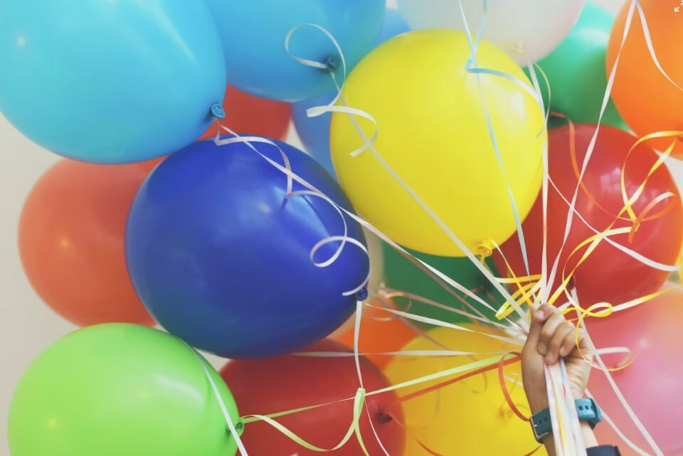
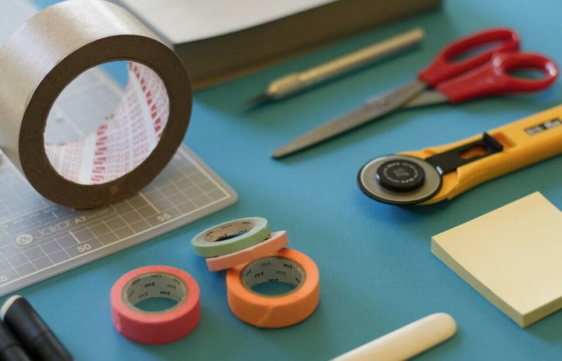

This article has been written and researched by our expert Loveable through a precise methodology. [Learn more about our methodology](https://avada.io/loveable/our-methodological.html)

[Loveable](https://avada.io/loveable/) > [Blog](https://avada.io/loveable/blog/) > [Family](https://avada.io/loveable/family/)

# Unforgettable 13th Birthday Ideas: Celebrate the Teen Milestone in Style

Written by [Rose Bryne](https://avada.io/loveable/author/rose/) Last Updated on September 22, 2023

- [13th Birthday Ideas: Themed Party Ideas](https://avada.io/loveable/blog/13th-birthday-ideas/#wp-block-heading-2-4)
    - [Popular themes for 13th birthday parties](https://avada.io/loveable/blog/13th-birthday-ideas/#wp-block-heading-3-5)
    - [Decorations, invitations, and party favors to match the theme](https://avada.io/loveable/blog/13th-birthday-ideas/#wp-block-heading-3-12)
    - [Activities and games that suit the theme](https://avada.io/loveable/blog/13th-birthday-ideas/#wp-block-heading-3-18)
- [13th Birthday Ideas: Outdoor Adventures](https://avada.io/loveable/blog/13th-birthday-ideas/#wp-block-heading-2-24)
    - [Outdoor activities for an adventurous celebration](https://avada.io/loveable/blog/13th-birthday-ideas/#wp-block-heading-3-25)
    - [Suggestions for outdoor venues or destinations](https://avada.io/loveable/blog/13th-birthday-ideas/#wp-block-heading-3-32)
    - [Sports and recreational activities to engage the guests](https://avada.io/loveable/blog/13th-birthday-ideas/#wp-block-heading-3-38)
- [13th Birthday Ideas: Creative Experiences](https://avada.io/loveable/blog/13th-birthday-ideas/#wp-block-heading-2-44)
    - [Arts and crafts activities for a creative celebration](https://avada.io/loveable/blog/13th-birthday-ideas/#wp-block-heading-3-45)
    - [DIY projects or workshops for hands-on fun](https://avada.io/loveable/blog/13th-birthday-ideas/#wp-block-heading-3-52)
    - [Personalized gifts and keepsakes to create during the party](https://avada.io/loveable/blog/13th-birthday-ideas/#wp-block-heading-3-58)
- [13th Birthday Ideas: Unconventional Celebrations](https://avada.io/loveable/blog/13th-birthday-ideas/#wp-block-heading-2-64)
    - [Unique and unconventional ideas for a memorable birthday](https://avada.io/loveable/blog/13th-birthday-ideas/#wp-block-heading-3-65)
    - [Alternative celebration options beyond traditional parties](https://avada.io/loveable/blog/13th-birthday-ideas/#wp-block-heading-3-72)
    - [Examples of unconventional celebrations and their highlights](https://avada.io/loveable/blog/13th-birthday-ideas/#wp-block-heading-3-78)
- [13th Birthday Ideas: Technology and Gaming](https://avada.io/loveable/blog/13th-birthday-ideas/#wp-block-heading-2-84)
    - [Tech-focused gift ideas for tech-savvy teenagers](https://avada.io/loveable/blog/13th-birthday-ideas/#wp-block-heading-3-85)
    - [Virtual reality experiences or gaming tournaments](https://avada.io/loveable/blog/13th-birthday-ideas/#wp-block-heading-3-92)
    - [Cutting-edge gadgets or accessories as birthday presents](https://avada.io/loveable/blog/13th-birthday-ideas/#wp-block-heading-3-96)
- [13th Birthday Ideas: Memorable Experiences](https://avada.io/loveable/blog/13th-birthday-ideas/#wp-block-heading-2-102)
    - [Special experiences or outings for a memorable celebration](https://avada.io/loveable/blog/13th-birthday-ideas/#wp-block-heading-3-103)
    - [Suggestions for memorable trips or adventures](https://avada.io/loveable/blog/13th-birthday-ideas/#wp-block-heading-3-110)
    - [Creating lasting memories through unique experiences](https://avada.io/loveable/blog/13th-birthday-ideas/#wp-block-heading-3-116)
    - [13th Birthday Ideas, In Conclusion](https://avada.io/loveable/blog/13th-birthday-ideas/#wp-block-heading-3-122) 

Turning 13 is an exciting milestone in a young person’s life. It’s a transition from childhood to adolescence, marking the beginning of their teenage years. To make this special occasion memorable, it’s important to plan a celebration that reflects their interests and personality. In this article, we’ll explore a range of creative and fun **13th birthday ideas** to help you organize a celebration that your teenager will cherish for years to come. 

From unique party themes to exciting activities, we’ve got you covered with suggestions that will make their 13th birthday a truly unforgettable experience. Let’s dive in and start planning an extraordinary celebration for your soon-to-be teenager!

Turning 13 is a significant event, and what better way to celebrate than with the perfect 13-year-old birthday gift? We have curated a range of exciting and age-appropriate [birthday gift ideas for 13-year-olds](https://avada.io/loveable/gifts-for-13-year-olds-girls/). Whether you’re searching for a present that sparks their creativity, fuels their passion for technology, or caters to their unique interests, we’ve got you covered. 

## **13th Birthday Ideas: Themed Party Ideas**

### **Popular themes for 13th birthday parties**

**1\. Superhero Extravaganza:** Transform the party venue into a superhero’s hideout with themed decorations and costumes.

**2\. Hollywood Glamour:** Roll out the red carpet and create a movie star atmosphere with a glamorous Hollywood-themed party.

**3\. Neon Dance Party:** Get groovy with a neon-themed dance party, complete with blacklights, glow sticks, and funky music.

**4\. Outdoor Carnival:** Bring the carnival to your backyard with games, rides, and delicious fair-style treats.

**5\. Tropical Paradise:** Transport guests to a tropical island with Hawaiian decorations, leis, and fruity refreshments.

### **Decorations, invitations, and party favors to match the theme**

**1\. Superhero Extravaganza:** Decorate with superhero-themed banners, balloons, and table settings. Design invitations with superhero logos and provide capes or masks as party favors.

**2\. Hollywood Glamour:** Create an elegant atmosphere with gold and silver decorations, red velvet ropes, and personalized VIP invitations. Party favors could include mini Oscar statues or Hollywood-themed keychains.

**3\. Neon Dance Party:** Set up neon lights, colorful streamers, and a disco ball. Design invitations with neon colors and provide glow-in-the-dark accessories as party favors, such as bracelets or sunglasses.

**4\. Outdoor Carnival:** Use bright colors for banners and balloons, and set up game booths and a popcorn or cotton candy machine. Create carnival-themed invitations and offer small prizes or stuffed animals as party favors.

**5\. Tropical Paradise:** Decorate with palm leaves, tropical flowers, and vibrant colors. Design invitations with a tropical theme and provide flower leis or sunglasses as party favors.

### **Activities and games that suit the theme**

**1\. Superhero Extravaganza:** Organize a superhero costume contest or set up obstacle courses to test their superpowers.

**2\. Hollywood Glamour:** Arrange a red carpet photo booth and a movie trivia game. Screen a favorite movie and have a mini award ceremony.

**3\. Neon Dance Party:** Hire a professional DJ or create a dance playlist. Have a dance-off, limbo contest, or a glow-in-the-dark treasure hunt.

**4\. Outdoor Carnival:** Set up classic carnival games like ring toss, duck pond, or bean bag toss. Have a face painting booth or organize a mini Ferris wheel ride.

**5\. Tropical Paradise:** Plan a limbo competition, hula dancing lessons, or a DIY tropical-themed craft station. Serve tropical-inspired snacks and drinks.

## **13th Birthday Ideas: Outdoor Adventures**

### **Outdoor activities for an adventurous celebration**

**1\. Scavenger Hunt:** Organize a thrilling scavenger hunt in a park or forest, challenging guests to solve clues and find hidden treasures.

**2\. Camping Trip:** Plan an overnight camping adventure with tents, campfires, and storytelling under the stars.

**3\. Water Sports Day:** Arrange a day filled with water activities like kayaking, paddleboarding, or swimming at a nearby lake or beach.

**4\. Adventure Park Visit:** Take the celebration to new heights by visiting an adventure park with ziplining, ropes courses, and rock climbing.

**5\. Outdoor Movie Night:** Set up a projector and screen in the backyard for an outdoor movie experience with blankets and popcorn.

### **Suggestions for outdoor venues or destinations**

**1\. Local Park:** Utilize a spacious local park with open fields, picnic areas, and trails for various outdoor activities.

**2\. Nature Reserve:** Explore the beauty of a nearby nature reserve with hiking trails, wildlife spotting, and scenic views.

**3\. Beach or Lakeside:** Enjoy the sun, sand, and water by celebrating at a nearby beach or lakeside location.

**4\. Adventure Sports Center:** Look for adventure sports centers that offer activities like whitewater rafting, rock climbing, or mountain biking.

**5\. Botanical Gardens:** Organize a celebration amidst the natural beauty of botanical gardens with lush landscapes and serene settings.

### **Sports and recreational activities to engage the guests**

**1\. Team Sports Tournament:** Set up friendly competitions in popular team sports like soccer, basketball, or volleyball.

**2\. Obstacle Course Challenge:** Create an outdoor obstacle course with hurdles, tunnels, and balance beams for some friendly competition.

**3\. Bike Ride or Rollerblading:** Plan a group bike ride or rollerblading adventure along scenic trails or in a safe neighborhood.

**4\. Frisbee Golf:** Enjoy a game of Frisbee golf in a local park with designated courses and targets.

**5\. Outdoor Yoga or Fitness Class:** Arrange a yoga or fitness instructor to lead an outdoor class that keeps the guests active and energized.

## **13th Birthday Ideas: Creative Experiences**

### **Arts and crafts activities for a creative celebration**

**1\. DIY T-shirt Design:** Provide plain white T-shirts and fabric markers for guests to create their own unique designs.

**2\. Paint and Sip Party:** Set up an outdoor painting station where guests can create their own artwork while enjoying non-alcoholic beverages.

**3\. Jewelry Making:** Provide beads, strings, and charms for guests to design their own personalized bracelets, necklaces, or keychains.

**4\. Tie-Dye Fun:** Have a tie-dye station where guests can create vibrant and colorful designs on shirts, socks, or tote bags.

**5\. Scrapbooking:** Set up a scrapbooking corner with colorful papers, stickers, and embellishments for guests to create their own memory albums.

### **DIY projects or workshops for hands-on fun**

**1\. Candle Making:** Conduct a candle-making workshop where guests can learn to make their own scented candles.

**2\. Terrarium Building:** Provide glass containers, soil, and mini plants for guests to create their own beautiful terrariums.

**3\. DIY Bath Bombs:** Teach guests how to make their own bath bombs using natural ingredients and essential oils.

**4\. Pottery Painting:** Arrange for a pottery painting session where guests can decorate their own pottery pieces like mugs or plant pots.

**5\. Personalized Tote Bags:** Provide plain canvas tote bags and fabric paints for guests to create personalized designs on their bags.

### **Personalized gifts and keepsakes to create during the party**

**1\. Friendship Bracelets:** Have guests create friendship bracelets for each other using colorful threads and beads.

**2\. Memory Jars:** Provide small glass jars and decorative items for guests to create personalized memory jars filled with meaningful notes or mementos.

**3\. Customized Picture Frames:** Set up a station where guests can decorate picture frames with paint, glitter, and other embellishments.

**4\. Personalized Keychains:** Provide materials like key rings, beads, and charms for guests to create their own personalized keychains.

**5\. Handmade Greeting Cards:** Set up a card-making station with various papers, stamps, and markers for guests to create customized birthday cards for each other.

## **13th Birthday Ideas: Unconventional Celebrations**

### **Unique and unconventional ideas for a memorable birthday**

**1\. Volunteer and Give Back:** Organize a birthday event focused on giving back to the community by participating in a volunteer activity or organizing a charity fundraiser.

**2\. Adventure Day:** Plan an action-packed day filled with thrilling activities such as indoor skydiving, trampoline parks, or go-kart racing.

**3\. Outdoor Movie Marathon:** Set up a cozy outdoor movie night under the stars with a projector and a lineup of favorite movies or a movie series marathon.

**4\. Surprise Trip:** Arrange a surprise trip for the birthday celebrant to a destination they’ve always wanted to visit, creating unforgettable memories.

**5\. Themed Escape Room:** Experience the excitement of solving puzzles and challenges in a themed escape room with friends or family.

### **Alternative celebration options beyond traditional parties**

**1\. Weekend Getaway:** Plan a weekend getaway with close friends or family to a nearby destination, exploring new places and creating lasting memories.

**2\. Day of Adventure:** Opt for a day filled with adventurous activities like rock climbing, zip-lining, or even a hot air balloon ride.

**3\. Spa Retreat:** Treat the birthday celebrant to a day of relaxation and pampering at a spa, enjoying massages, facials, and other soothing treatments.

**4\. Creative Workshop:** Arrange a creative workshop where guests can learn a new skill, such as pottery, cooking, or painting.

**5\. Technology Experience:** Explore interactive technology experiences like virtual reality gaming, laser tag, or a visit to a tech innovation center.

### **Examples of unconventional celebrations and their highlights**

**1\. Volunteer and Give Back:** The birthday celebrant and their friends can spend a day volunteering at a local animal shelter, planting trees in a park, or organizing a fundraising event for a charitable cause.

**2\. Adventure Day:** From conquering a challenging ropes course to experiencing the thrill of indoor skydiving, the day will be filled with adrenaline-pumping activities and memorable moments.

**3\. Outdoor Movie Marathon:** Guests can snuggle up in blankets, enjoy delicious snacks, and watch a series of favorite movies projected on a big screen outdoors, creating a cozy and nostalgic atmosphere.

**4\. Surprise Trip:** Surprising the birthday celebrant with a spontaneous trip to a dream destination allows them to explore new surroundings, indulge in new experiences, and create unforgettable memories.

**5\. Themed Escape Room:** Engaging in a themed escape room challenge will test the guests’ problem-solving skills and teamwork while providing an exciting and immersive experience.

## **13th Birthday Ideas: Technology and Gaming**

### **Tech-focused gift ideas for tech-savvy teenagers**

**1\. Smart Speakers:** Gift a voice-controlled smart speaker that can play music, answer questions, and control smart home devices.

**2\. Wireless Headphones:** Provide high-quality wireless headphones for an immersive audio experience while gaming or listening to music.

**3\. Gaming Consoles:** Consider the latest gaming consoles, such as PlayStation or Xbox, to enhance their gaming adventures.

**4\. Fitness Trackers:** Help them stay active and track their fitness goals with a smart fitness tracker that monitors their activity, heart rate, and sleep patterns.

**5\. Portable Bluetooth Speakers:** Give a portable Bluetooth speaker that allows them to enjoy their favorite music on the go.

### **Virtual reality experiences or gaming tournaments**

**1\. Virtual Reality Experience:** Organize a virtual reality gaming session where guests can immerse themselves in virtual worlds and compete in exciting VR games.

**2\. Gaming Tournaments:** Host a gaming tournament featuring popular multiplayer games, whether it’s console-based or on PCs, where participants can showcase their skills and compete for prizes.

**3\. LAN Party:** Set up a local area network (LAN) party where friends bring their gaming devices and connect them for multiplayer gaming sessions, fostering a fun and competitive atmosphere.

### **Cutting-edge gadgets or accessories as birthday presents**

**1\. Drone:** Surprise them with a high-quality drone for capturing aerial photos and videos, providing an exciting new perspective.

**2\. Virtual Reality Headset:** Gift a virtual reality headset that allows them to explore immersive VR experiences and games.

**3\. Smartwatch:** Consider a feature-rich smartwatch that not only tells time but also tracks fitness, receives notifications, and offers various apps and customization options.

**4\. High-Performance Gaming Keyboard and Mouse:** Upgrade their gaming setup with a mechanical gaming keyboard and a precision gaming mouse for improved performance and comfort.

**5\. Portable Gaming Monitor:** Provide a portable gaming monitor that allows them to take their gaming experience on the go, compatible with consoles and laptops.

## **13th Birthday Ideas: Memorable Experiences**

### **Special experiences or outings for a memorable celebration**

**1\. Hot Air Balloon Ride:** Take the birthday celebrant on a breathtaking hot air balloon ride, providing stunning views and a unique sense of adventure.

**2\. Theme Park Adventure:** Plan a trip to a thrilling theme park where they can enjoy exhilarating rides, shows, and attractions with friends and family.

**3\. Concert or Live Event:** Surprise them with tickets to their favorite band or artist’s concert or a live event that aligns with their interests.

**4\. Helicopter Tour:** Arrange a helicopter tour of the city or a scenic area, offering a bird’s-eye view and a memorable experience.

**5\. Exclusive Dining Experience:** Treat them to an exclusive dining experience, such as a chef’s table or a unique culinary adventure, exploring new tastes and flavors.

### **Suggestions for memorable trips or adventures**

**1\. Road Trip:** Plan an exciting road trip to explore new destinations, visit national parks, or discover hidden gems along the way.

**2\. Beach Vacation:** Organize a beach vacation where they can relax, swim, participate in water sports, and enjoy the sun and sand.

**3\. Adventure Travel:** Consider an adventurous trip like hiking in a scenic mountain range, exploring a natural wonder, or embarking on a wildlife safari.

**4\. Cultural Exploration:** Arrange a trip to a culturally rich city or country where they can immerse themselves in new traditions, cuisine, and historical landmarks.

**5\. Outdoor Camping Expedition:** Organize a camping trip in a picturesque location, allowing them to connect with nature, stargaze, and engage in outdoor activities.

### **Creating lasting memories through unique experiences**

**1\. Surprise Party:** Plan a surprise party with close friends and family, incorporating personalized decorations, heartfelt messages, and meaningful activities.

**2\. Time Capsule:** Create a time capsule together, gathering items, photos, and handwritten letters to be opened on a future significant occasion.

**3\. Adventure Challenges**: Design a series of adventurous challenges or scavenger hunts that they can compete with friends, creating lasting memories and teamwork.

**4\. Personalized Experiences:** Customize an experience tailored to their interests, such as a private cooking class, art workshop, or a visit to a place related to their favorite hobby.

**5\. Capture Moments:** Encourage guests to document the celebration by providing disposable cameras or setting up a photo booth, ensuring that the memories are captured in photographs.

### **13th Birthday Ideas, In Conclusion** 

In this guide, we have explored a wide range of **13th birthday celebration ideas** to make this milestone a memorable experience. From themed parties and outdoor adventures to creative workshops, unconventional celebrations, technology and gaming options, and memorable experiences, there are endless possibilities to create a unique and exciting celebration. By tapping into your creativity and considering the interests of the birthday celebrant, you can plan an unforgettable birthday that reflects their personality and brings joy and happiness to their special day, marking the beginning of their teenage years with cherished memories that will last a lifetime.

- [13th Birthday Ideas: Themed Party Ideas](https://avada.io/loveable/blog/13th-birthday-ideas/#wp-block-heading-2-4)
    - [Popular themes for 13th birthday parties](https://avada.io/loveable/blog/13th-birthday-ideas/#wp-block-heading-3-5)
    - [Decorations, invitations, and party favors to match the theme](https://avada.io/loveable/blog/13th-birthday-ideas/#wp-block-heading-3-12)
    - [Activities and games that suit the theme](https://avada.io/loveable/blog/13th-birthday-ideas/#wp-block-heading-3-18)
- [13th Birthday Ideas: Outdoor Adventures](https://avada.io/loveable/blog/13th-birthday-ideas/#wp-block-heading-2-24)
    - [Outdoor activities for an adventurous celebration](https://avada.io/loveable/blog/13th-birthday-ideas/#wp-block-heading-3-25)
    - [Suggestions for outdoor venues or destinations](https://avada.io/loveable/blog/13th-birthday-ideas/#wp-block-heading-3-32)
    - [Sports and recreational activities to engage the guests](https://avada.io/loveable/blog/13th-birthday-ideas/#wp-block-heading-3-38)
- [13th Birthday Ideas: Creative Experiences](https://avada.io/loveable/blog/13th-birthday-ideas/#wp-block-heading-2-44)
    - [Arts and crafts activities for a creative celebration](https://avada.io/loveable/blog/13th-birthday-ideas/#wp-block-heading-3-45)
    - [DIY projects or workshops for hands-on fun](https://avada.io/loveable/blog/13th-birthday-ideas/#wp-block-heading-3-52)
    - [Personalized gifts and keepsakes to create during the party](https://avada.io/loveable/blog/13th-birthday-ideas/#wp-block-heading-3-58)
- [13th Birthday Ideas: Unconventional Celebrations](https://avada.io/loveable/blog/13th-birthday-ideas/#wp-block-heading-2-64)
    - [Unique and unconventional ideas for a memorable birthday](https://avada.io/loveable/blog/13th-birthday-ideas/#wp-block-heading-3-65)
    - [Alternative celebration options beyond traditional parties](https://avada.io/loveable/blog/13th-birthday-ideas/#wp-block-heading-3-72)
    - [Examples of unconventional celebrations and their highlights](https://avada.io/loveable/blog/13th-birthday-ideas/#wp-block-heading-3-78)
- [13th Birthday Ideas: Technology and Gaming](https://avada.io/loveable/blog/13th-birthday-ideas/#wp-block-heading-2-84)
    - [Tech-focused gift ideas for tech-savvy teenagers](https://avada.io/loveable/blog/13th-birthday-ideas/#wp-block-heading-3-85)
    - [Virtual reality experiences or gaming tournaments](https://avada.io/loveable/blog/13th-birthday-ideas/#wp-block-heading-3-92)
    - [Cutting-edge gadgets or accessories as birthday presents](https://avada.io/loveable/blog/13th-birthday-ideas/#wp-block-heading-3-96)
- [13th Birthday Ideas: Memorable Experiences](https://avada.io/loveable/blog/13th-birthday-ideas/#wp-block-heading-2-102)
    - [Special experiences or outings for a memorable celebration](https://avada.io/loveable/blog/13th-birthday-ideas/#wp-block-heading-3-103)
    - [Suggestions for memorable trips or adventures](https://avada.io/loveable/blog/13th-birthday-ideas/#wp-block-heading-3-110)
    - [Creating lasting memories through unique experiences](https://avada.io/loveable/blog/13th-birthday-ideas/#wp-block-heading-3-116)
    - [13th Birthday Ideas, In Conclusion](https://avada.io/loveable/blog/13th-birthday-ideas/#wp-block-heading-3-122) 

### [Rose Bryne](https://avada.io/loveable/author/rose/)

Hi, I'm Rose! I love animals and spending time with kids. At Loveable, I help people find unique gifts for special occasions like Valentine's Day, housewarmings, and graduations. I enjoy finding gifts for kids, teens, and animal lovers that match their interests and personalities. Making gift-giving a pleasant experience is my priority. Let me assist you in finding the perfect gift!

- [Twitter](https://twitter.com/intent/tweet)
- [Facebook](https://www.facebook.com/sharer/sharer.php)
- [instagram](https://avada.io/loveable/blog/13th-birthday-ideas/)
- [pinterest](https://www.pinterest.com/loveablellc/)

## Related Posts

[### 30 Best 4 Year Old Birthday Party Ideas For A Memorable Celebration](https://avada.io/loveable/blog/4-year-old-birthday-party-ideas/) 

[

### 16th Birthday Party Ideas to Make an Unforgettable Day

](https://avada.io/loveable/blog/16th-birthday-party-ideas/)

[

### 150+ Inspirational Birthday Quotes to Spread Joy on Special Day

](https://avada.io/loveable/blog/inspirational-birthday-quotes/)

[

### 160+ Birthday Wishes for Wife to Express Eternal Love

](https://avada.io/loveable/blog/birthday-wishes-for-wife/)

[### 90+ Heart Touching Birthday Wishes for Niece to Make Her Day Extra Special](https://avada.io/loveable/blog/birthday-wishes-for-niece/)
