This article has been written and researched by our expert Loveable through a precise methodology. [Learn more about our methodology](https://avada.io/loveable/our-methodological.html)

[Loveable](https://avada.io/loveable/) > [Blog](https://avada.io/loveable/blog/) > [Family](https://avada.io/loveable/family/)

# Unique 3 Year Old Birthday Party Ideas For An Exciting And Stress-Free Celebration

Written by [Rose Bryne](https://avada.io/loveable/author/rose/) Last Updated on October 03, 2023

- [Best 3 Year Old Birthday Party Ideas To Surprise Your Little One](https://avada.io/loveable/blog/3-year-old-birthday-party/#wp-block-heading-2-3)
    - [Bookworm Party](https://avada.io/loveable/blog/3-year-old-birthday-party/#wp-block-heading-3-4)
    - [Movie Night](https://avada.io/loveable/blog/3-year-old-birthday-party/#wp-block-heading-3-7)
    - [Backyard Carnival](https://avada.io/loveable/blog/3-year-old-birthday-party/#wp-block-heading-3-10)
    - [Masquerade Party](https://avada.io/loveable/blog/3-year-old-birthday-party/#wp-block-heading-3-13)
    - [Treasure Hunt](https://avada.io/loveable/blog/3-year-old-birthday-party/#wp-block-heading-3-16)
    - [Bee Three](https://avada.io/loveable/blog/3-year-old-birthday-party/#wp-block-heading-3-19)
    - [Wild Three](https://avada.io/loveable/blog/3-year-old-birthday-party/#wp-block-heading-3-22)
    - [Under the Sea Party](https://avada.io/loveable/blog/3-year-old-birthday-party/#wp-block-heading-3-25)
    - [Picnic Party](https://avada.io/loveable/blog/3-year-old-birthday-party/#wp-block-heading-3-28)
    - [Cupcake Decorating Party](https://avada.io/loveable/blog/3-year-old-birthday-party/#wp-block-heading-3-31)
    - [Petting Zoo Party](https://avada.io/loveable/blog/3-year-old-birthday-party/#wp-block-heading-3-34)
    - [Balloon Bash](https://avada.io/loveable/blog/3-year-old-birthday-party/#wp-block-heading-3-37)
    - [Popsicle Bash](https://avada.io/loveable/blog/3-year-old-birthday-party/#wp-block-heading-3-40)
    - [Frozen Princess](https://avada.io/loveable/blog/3-year-old-birthday-party/#wp-block-heading-3-43)
    - [Bubble Party](https://avada.io/loveable/blog/3-year-old-birthday-party/#wp-block-heading-3-46)
    - [Monster Bash](https://avada.io/loveable/blog/3-year-old-birthday-party/#wp-block-heading-3-49)
    - [Partea Party](https://avada.io/loveable/blog/3-year-old-birthday-party/#wp-block-heading-3-52)
    - [Minion Party](https://avada.io/loveable/blog/3-year-old-birthday-party/#wp-block-heading-3-55)
    - [Three Rex](https://avada.io/loveable/blog/3-year-old-birthday-party/#wp-block-heading-3-58)
    - [Sports Party](https://avada.io/loveable/blog/3-year-old-birthday-party/#wp-block-heading-3-61)
- [Best 3-Year-Old Birthday Gifts That Will Make Them Smile](https://avada.io/loveable/blog/3-year-old-birthday-party/#wp-block-heading-2-64)
    - [Sweet Dreams Cute Elephants – Personalized 3D Led Light](https://avada.io/loveable/blog/3-year-old-birthday-party/#wp-block-heading-3-65)
    - [Piano Keyboard Toy for Kids](https://avada.io/loveable/blog/3-year-old-birthday-party/#wp-block-heading-3-68)
    - [9 Pack Cars Toys for Toddlers Boys & Girls](https://avada.io/loveable/blog/3-year-old-birthday-party/#wp-block-heading-3-71)
    - [Colorful Dinosaur Toys](https://avada.io/loveable/blog/3-year-old-birthday-party/#wp-block-heading-3-74)
- [Bottom Line](https://avada.io/loveable/blog/3-year-old-birthday-party/#wp-block-heading-2-77)

Your little one is about to turn three, and we can’t wait to help you create a magical birthday bash that will fill their heart with wonder and laughter. From enchanting themed parties, like lovely unicorns or daring superheroes, to outdoor games and treats, we have a treasure trove of **3-year-old birthday party ideas** to make this celebration unforgettable.

Get ready for a day brimming with giggles, hugs, and precious memories as we embark on a journey of imagination and delight. Let’s make this milestone birthday one to remember!

## **Best 3 Year Old Birthday Party Ideas To Surprise Your Little One**

### **Bookworm Party**

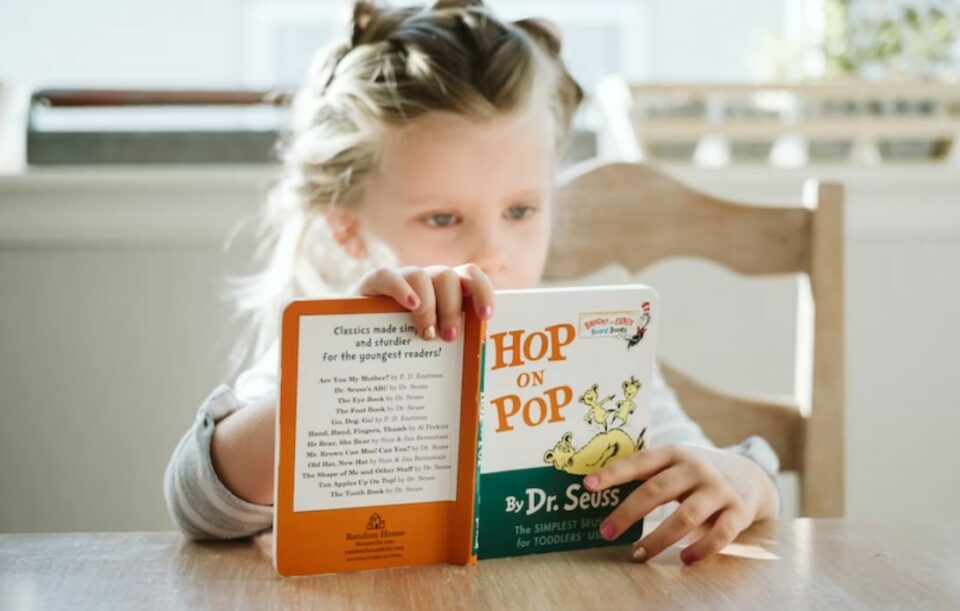

If your little boy or girl loves books, why not go for a comfy bookworm party? It’s sure to be a hit! Picture this: a cozy reading corner adorned with soft cushions and snug blankets, where the kids can snuggle up and immerse themselves in the enchanting world of stories. To add an extra touch of magic, ask the guests to bring along their most beloved reads too! You can arrange other activities lined up to keep everyone entertained throughout the celebration. With a treasure trove of books and [fun games](https://avada.io/loveable/educational-games-and-toys-kids/) at hand, the kids will be endlessly delighted.

### **Movie Night**

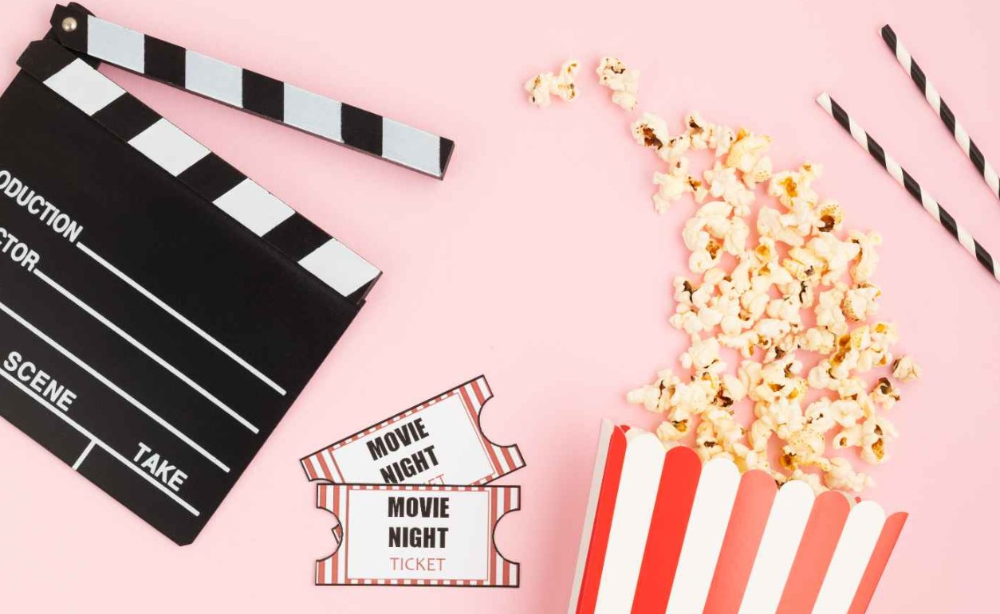

Are you thinking of hosting a fabulous movie party for your little one? Here’s the perfect 3-year-old birthday party idea for an unforgettable event. First, create some super cool movie ticket-themed invitations. Then choose a kid-friendly film that’ll have them giggling, smiling, and maybe even dancing in their seats! To sprinkle in some joy, arrange some movie-related games like movie trivia or movie charades. These interactive activities will keep the kids engaged and entertained throughout the party. Don’t miss out on the photo booth! Kids love to strike poses with movie-themed props, and it’s the perfect opportunity to capture those precious smiles.

### **Backyard Carnival**

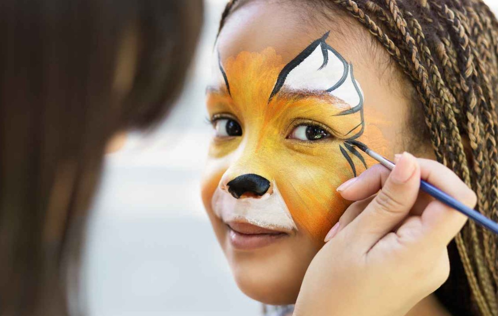

A Backyard Carnival will make your little one’s third birthday unforgettable. You can create exciting stations with face-painting galore, plastic bottle ring-toss or corn hole games, and cool temporary tattoos that kids will adore. But that’s not all; take the party to the great outdoors with thrilling lawn games like croquet or DIY mini golf. All you need are simple materials like cardboard boxes, lawn furniture, and plastic cups to craft an enthralling mini golf course. And here’s a bonus treat: why not find a brave-hearted adult ready to take a few whipped cream pies to the face? Laughter and joy are guaranteed for everyone.

### **Masquerade Party**

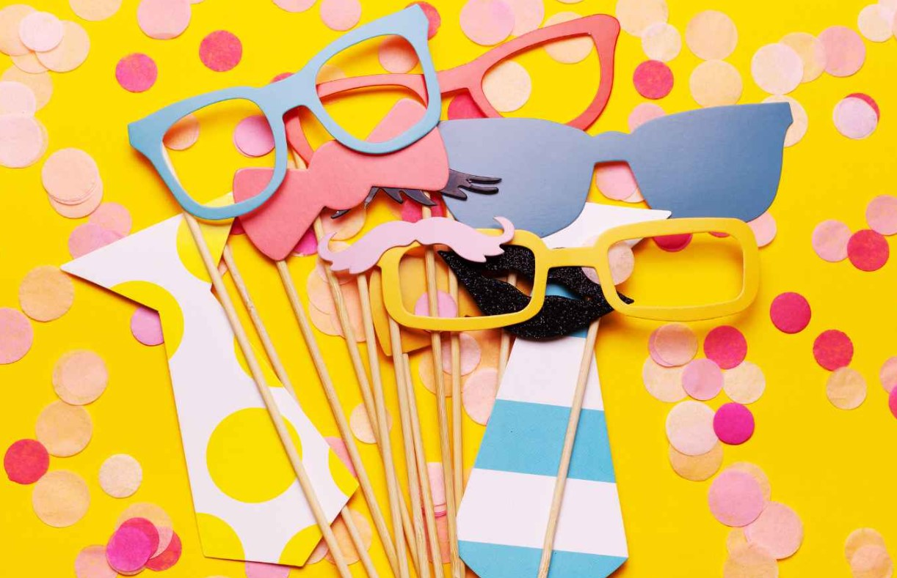

Keep the excitement soaring with this 3-year-old birthday party idea: A marvelous dress-up box. Simply request parents to bring along some fabulous fancy dress costumes, and you’re all set for a fabulous time! You can go all out and host a dazzling fashion show, allowing the tiny stars to strut their stuff, or simply let them indulge in hours of pretend play. Embrace the magic of make-believe and create a cherished birthday celebration!

### **Treasure Hunt**

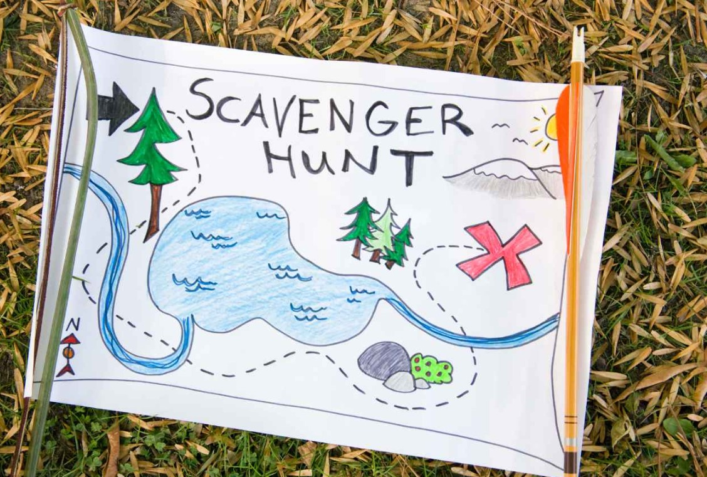

With a 3-year-old birthday party idea filled with treasure chests, maps, and compasses, you’re in store for a thrilling adventure. A day of playful exploration and surprises awaits the little adventurers. To make the experience even more enjoyable, request parents to bring along their child’s favorite toys or stuffed animals to join in on the fun. This way, everyone gets to share their special companions in the quest for hidden treasures. Don’t miss out on this precious opportunity to create magical moments with your child and their friends.

### **Bee Three**

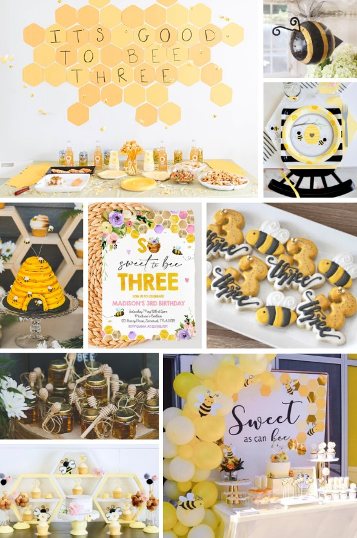

A honey [bee](https://avada.io/loveable/gifts-for-bee-lovers/) theme would be perfect for celebrating your child’s special “bee-day”. A vivid color scheme featuring a plethora of black and yellow decorations, charming honeycomb patterns, and cute bee motifs. It’s sure to be a buzzing celebration that will have your party guests abuzz with joy! This theme brings a sweet touch of nature’s wonders to the festivities, creating a cheerful atmosphere that everyone will love.

### **Wild Three**

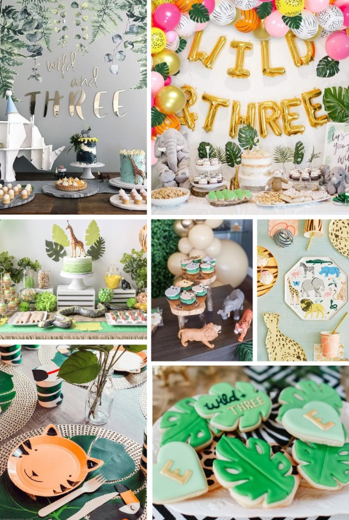

Got a little wild child on your hands? Embrace the beautiful madness and throw them a Young, Wild, and Three party! Prepare to embark on a jungle adventure with animal-inspired decorations. Transform your party space into a wild oasis filled with vibrant colors and playful animal cutouts. And what’s a wild adventure without face painting? Create a little station where the little ones can transform into their favorite jungle animals. Let the beats flow with some upbeat music in the background to keep the energy high. Let the wild rumpus begin!

### **Under the Sea Party**

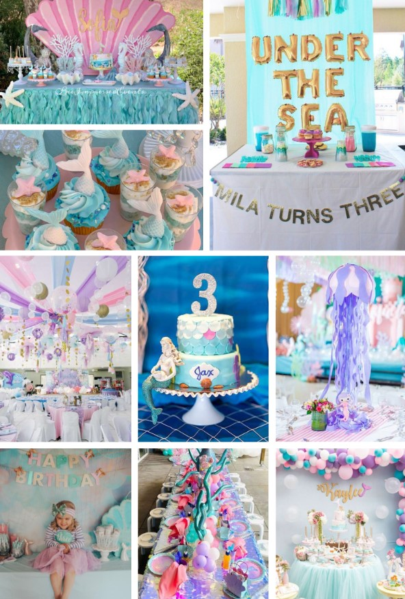

An underwater party will make a dreamy 3-year-old birthday party idea for your kiddo! Your guests will be greeted by charming schools of fish, playful dolphins, and enchanting mermaids, creating an oceanic wonderland of fun. Immerse yourself in a sea of creativity with our party food ideas that perfectly match the theme: munch on starfish-shaped sandwiches, savor the sweetness of oyster cookies, and dive into the scrumptiousness of mermaid tail cupcakes.

### **Picnic Party**

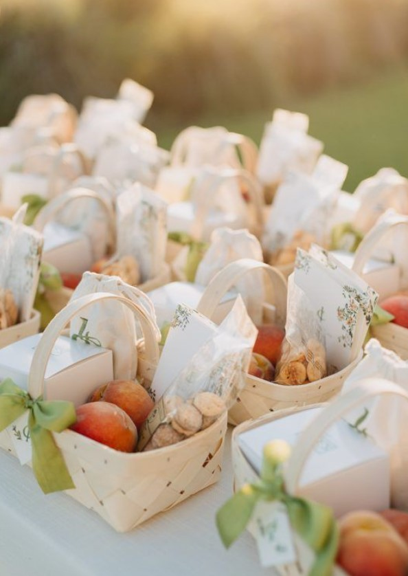

When the weather shows its sunny and warm side, throwing a picnic party is an absolute delight to win your kid’s heart. Lay out charming picnic blankets and fill them with a delectable selection of your daughter’s favorite foods. You can invite even more guests, as the great outdoors plays the gracious host, taking the pressure off you. A picnic is not just about the food; it’s about love, laughter, and the bond you share with your loved ones. Embrace the outdoor charm and make this picnic party an unforgettable experience for your 3-year-old!

### **Cupcake Decorating Party**

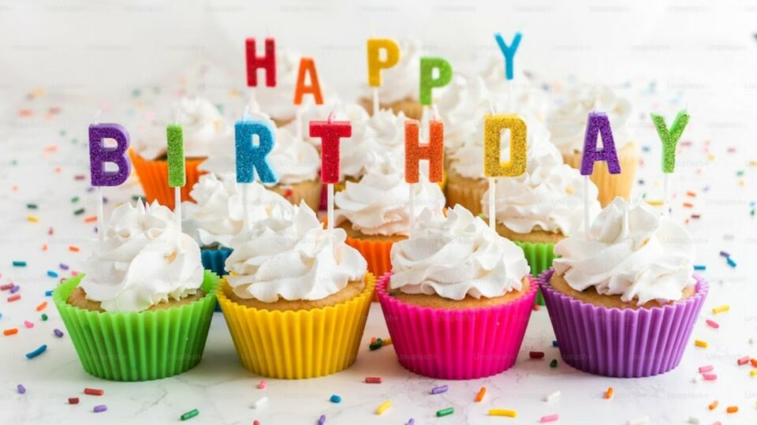

Are you looking for the perfect 3-year-old birthday party idea that takes care of everything in one go? Look no further than a cupcake decorating party! It’s an absolute blast for kids and parents alike. Have every little guest receive their own cupcake, along with an assortment of colorful sprinkles, icing, and other yummy toppings. Not only does this activity keep the toddlers happily engaged, but it is also a wonderful opportunity for parents to join with their children. Moreover, it’s an excellent way to encourage artistic expression and foster a sense of togetherness.

### **Petting Zoo Party**

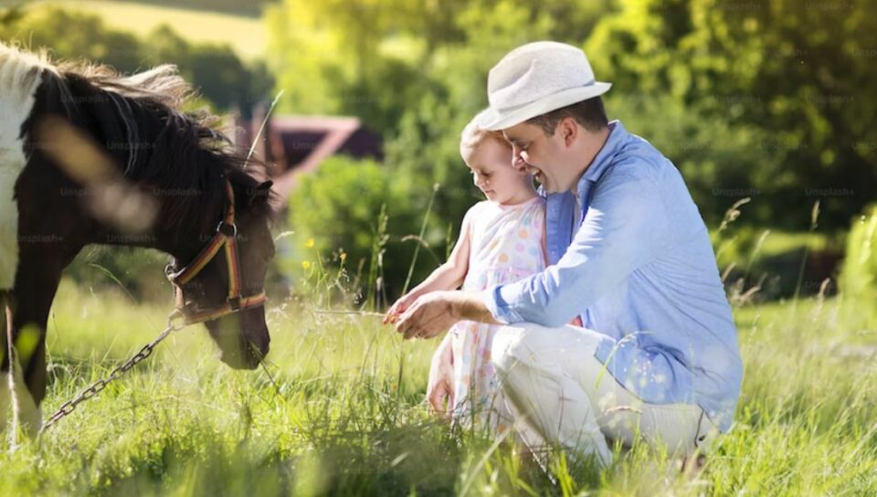

How about a petting zoo extravaganza for your little animal lover? Have a mobile petting zoo service arriving at your doorstep, along with a bunch of adorable and child-friendly animals. Your tiny guests will be over the moon while petting and playing with these furry friends. To add extra charm, consider setting up animal-themed activities with cute coloring pages featuring their favorite animals. A 3-year-old birthday party idea that’s bound to be a roaring success!

### **Balloon Bash**

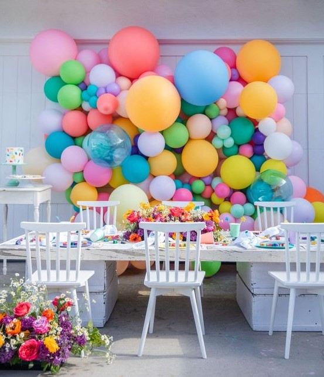

Throwing a fantastic birthday party doesn’t require you to be a master of creativity. In fact, balloons alone can be a perfect 3-year-old birthday party idea! Embrace the magic of colors and imagination as you craft mesmerizing arches, walls, or garlands. And the best part? You don’t need any extraordinary skills; it’s all about creating a joyful atmosphere for your little one.

### **Popsicle Bash**

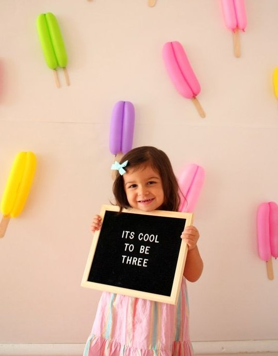

Celebrate your 3-year-old’s birthday with a popsicle-themed party that’s perfect for a sunny summer celebration! Imagine a whimsical wonderland filled with popsicle-shaped decorations and an indoor popsicle-making station. The children can have a blast decorating their own frozen masterpieces with an array of toppings. Whether it’s summer or winter, a popsicle-themed birthday bash is a tasty and delightful way to celebrate your toddler’s special day!

### **Frozen Princess**

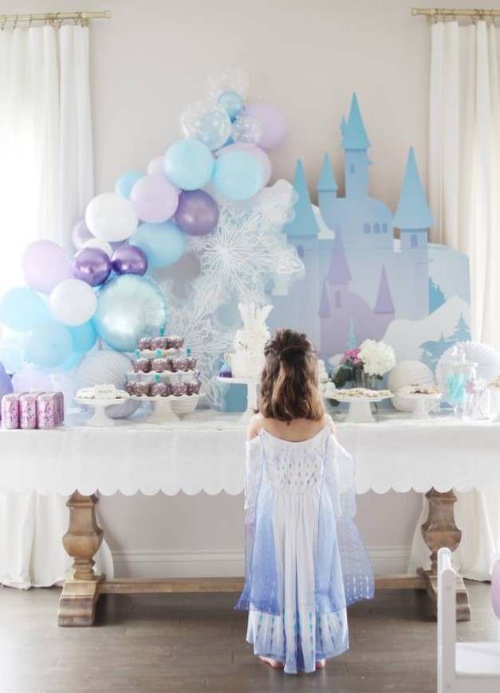

Make your toddler’s special day truly magical by turning her into the adorable ice queen herself. Picture the excitement in her eyes as she twirls around in her Elsa outfit! A stunning balloon arch will also add a touch of whimsy and wonder to your party. Make various Frozen-themed treats to delight her taste buds, from Olaf-shaped cookies to snowflake cupcakes. You can encourage all the little guests to join in the fun by dressing up as their favorite Frozen characters. Just remember, there should only be one Elsa at the party. This way, you can create memories that will warm everyone’s hearts and leave your little princess beaming with joy!

### **Bubble Party**

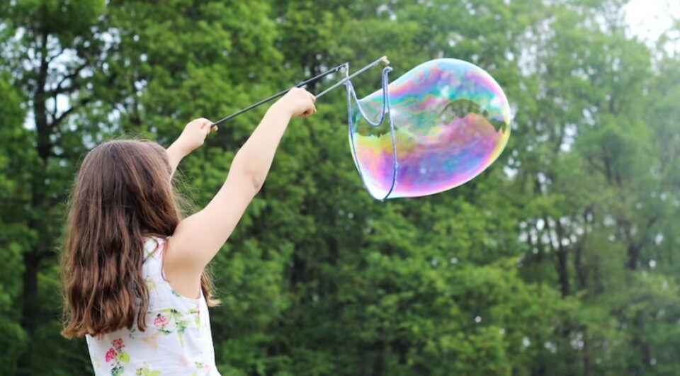

A fabulous bubble party will definitely make your child’s special day truly unforgettable. To start off, craft vibrant invitations that look just like bubbles and pop in a small surprise – a bubble wand for each guest. For the main event, set up a bubble station with all kinds of magical bubble wands. But wait, there’s more! Create a bubble obstacle course with hula hoops, tunnels, and other fun props, making it an adventure zone where the little ones can blow bubbles while navigating through the course.

### **Monster Bash**

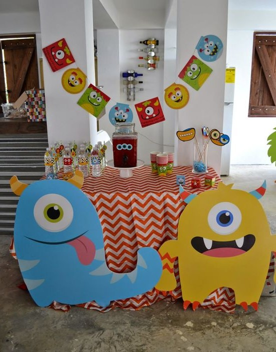

If your kid’s birthday falls near Halloween, this monster-themed party will do the trick! The guests will arrive dressed in adorable monster costumes, creating a joyful atmosphere as you prepare some snacks and goodies. For the party decoration,s simply wrap colorful strips of paper around cups and water bottles, then add googly eyes to bring those cute creatures to life! Make sure to draw on some wacky smiles to complete the monster theme.

### **Partea Party**

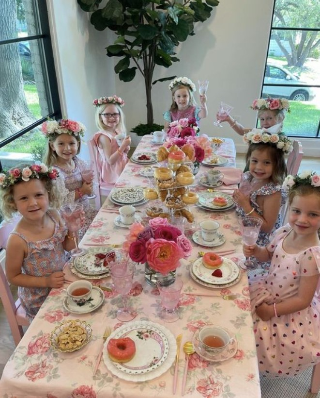

If your little munchkin loves playing pretend and has already had countless tea parties with her stuffed animal friends, why not bring her dream to life with this 3-year-old birthday party idea? Welcome to the elegant world of a tea party! The toddlers can sip on tea-like juices while munching on tiny sandwiches and a cake platter. Dress them up in fancy attire, and watch their imaginations soar as they create enchanting stories together. Toast to an amazing birthday celebration with those tiny teacups!

### **Minion Party**

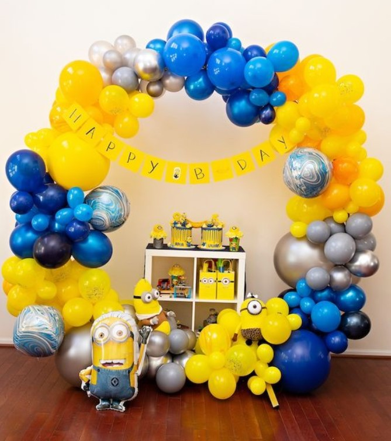

Whether your kid is obsessed with Minions or just loves the show, why not throw them a minion-themed birthday party? Dress up your toddler in a cheerful yellow shirt and comfy denim overalls to make them feel like a true Minion themselves. Make your party space delightful with Minions decorations, then screen the “Despicable Me” movie for the little guests to watch together. Don’t forget to prepare [sweet birthday gifts](https://avada.io/loveable/birthday-gifts-3-year-olds/) to bring a smile to your 3-year-old’s face!

### **Three Rex**

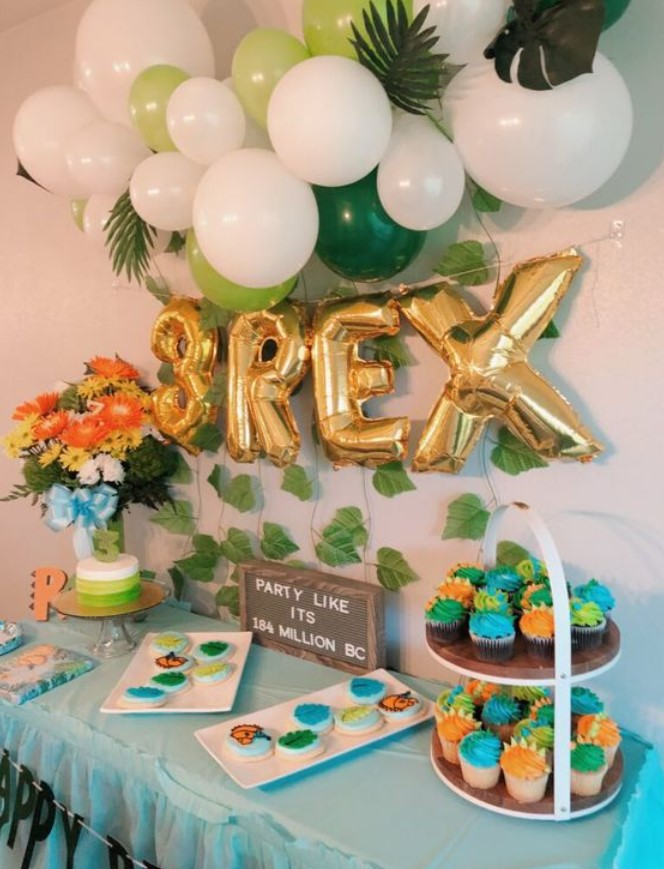

A Three Rex party is an absolute must for your little kid who loves dinosaurs! It’s the perfect 3-year-old birthday party idea for an epic dino-filled celebration. Imagine serving up dinosaur-shaped snacks that will delight their taste buds and ignite their imaginations. Be sure to include a gigantic dinosaur balloon that will amaze everyone! Get ready for giggles as the kids play pin-the-tail on the dinosaur, adding a touch of adventure to the festivities. Gather all the dino-loving friends and family for a roaring good time at the Three Rex bash!

### **Sports Party**

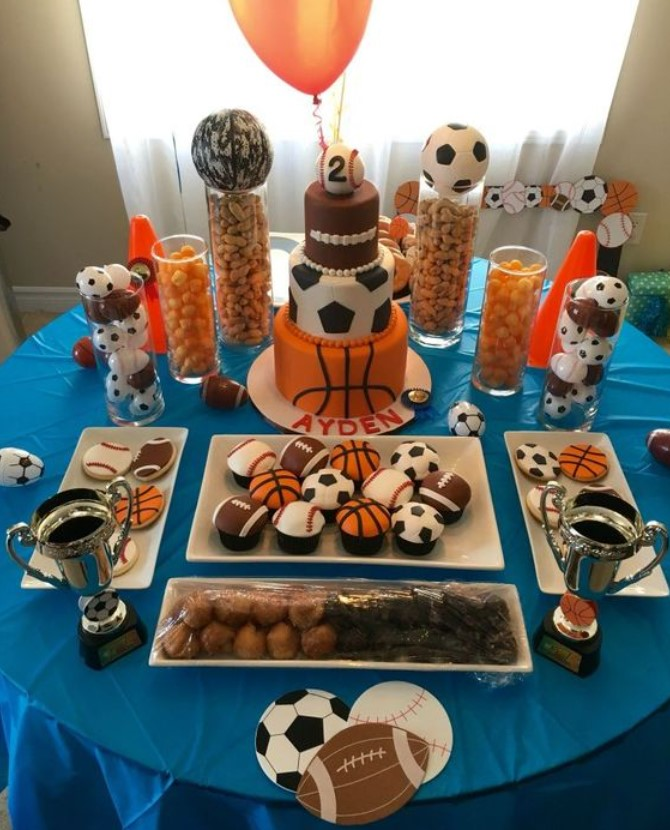

Celebrate your little champ’s 3rd birthday in style with a thrilling Free Agent sports-themed party! Prepare a vibrant concession stand filled with refreshing sports beverages and stadium-style snacks, ensuring everyone stays fueled for the games ahead. Speaking of games, get ready to have a blast with a lineup of exciting sports-themed activities that will keep the young athletes engaged and giggling all day long. Each guest also gets to take home a special trophy as a cherished party favor. Create lasting memories with this 3-year-old birthday party idea filled with laughter, camaraderie, and pure enjoyment!

## **Best 3-Year-Old Birthday Gifts That Will Make Them Smile**

### **[Sweet Dreams Cute Elephants – Personalized 3D Led Light](https://loveable.ai/products/sweet-dreams-cute-elephants-personalized-3d-led-light-best-gift-for-kid-for-elephant-lovers-cute-birthday-gift-for-sondaughter-for-grandsongranddaughter-303ihplnll373)**

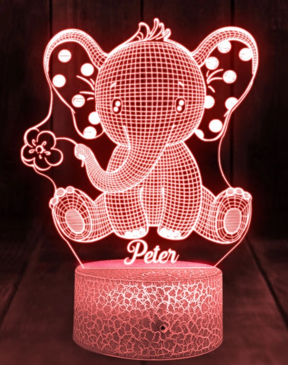

This birthday gift is bound to impress your little one with its charming brilliance as a night lamp. This awesome lamp seamlessly blends artistry and technology to create a mind-boggling 3D optical illusion, delighting and tricking your eyes in the best way possible. Form afar, the design looks captivating, but up close, you’ll discover a sleek and flat acrylic glass sheet behind the magic.

### **[Piano Keyboard Toy for Kids](https://www.amazon.com/ConoMus-Keyboard-Birthday-Multifunctional-Electronic/dp/B07GN31TZ9?th=1)**

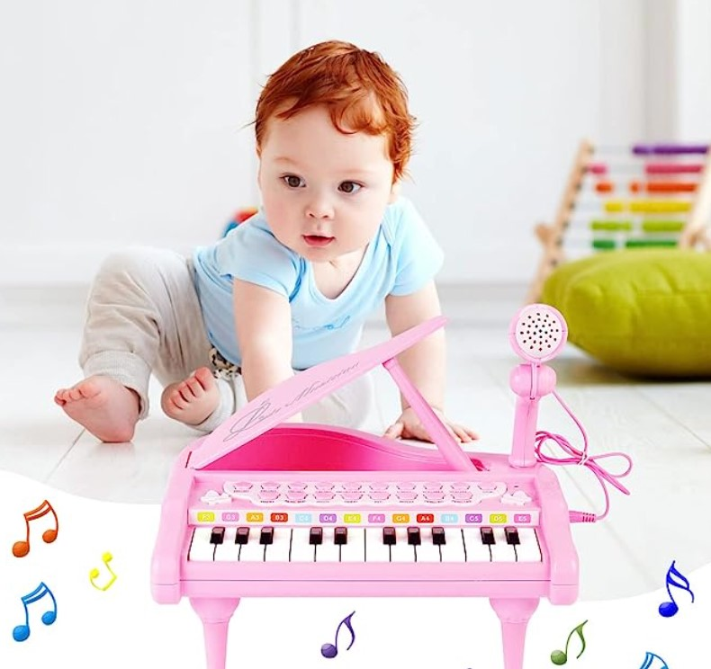

If you are searching for the perfect 3-year-old birthday gift for your little music lover, this one is for you! With a piano, music box, drum, music player, recording, and microphone all rolled into one, this musical toy is a dream come true. Whether your child wants to learn the piano or simply have a blast making music, this toy covers everything. Your kids can groove to 22 demo songs, using four musical instruments and eight percussion instruments.

### [9 Pack Cars Toys for Toddlers Boys & Girls](https://www.amazon.com/Toddlers-Transport-Colorful-Assorted-Vehicles/dp/B08P4S1F13)

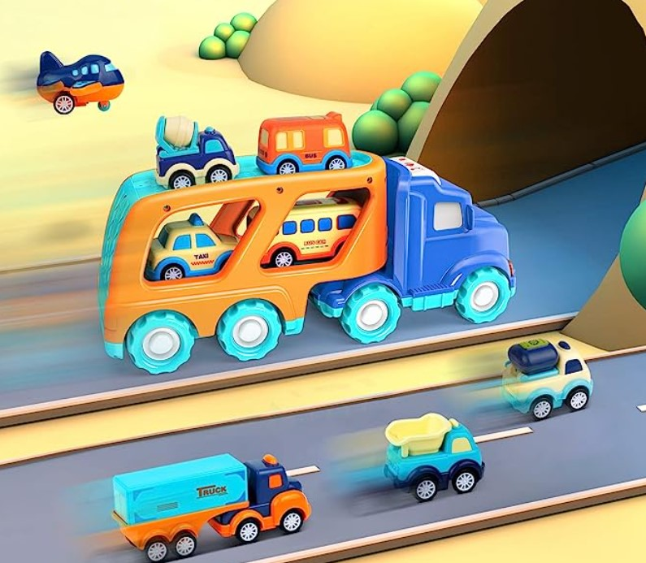

The nostalgia of being a kid, and how our eyes would light up with joy when so many toys are inside a gift box! Well, imagine now the sheer joy a 3-year-old will experience with this car toy set of 9 different car variations. So, when the toddlers gather around for playtime, there won’t be any squabbles – just happy and harmonious play sessions.

### [Colorful Dinosaur Toys](https://www.amazon.com/Dinosaur-Projection-Chirstmas-Birthday-Children/dp/B083R2P78L)

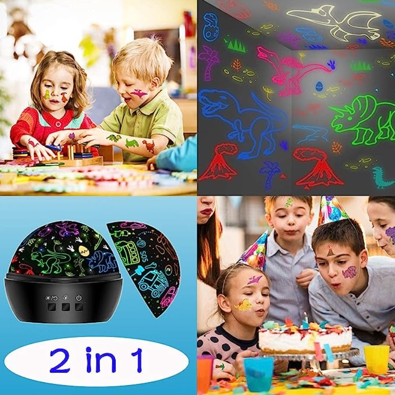

Why settle for an ordinary 3-year-old birthday gift when you can give the joy of imagination and wonder with these mesmerizing dinosaur toys? These toys create a stunning optical illusion with realistic Triceratops, Pterosaurs, T-Rexs, and more!  Their 360-degree rotating feature and 16 color combinations with touch control make these even more special. Also, you can easily adjust the colors to your liking. Whether it’s a birthday party or playtime with friends, these dinosaur toys are sure to amaze everyone.

## **Bottom Line**

Planning a memorable 3-year-old birthday party is an exciting adventure filled with endless possibilities! Whether you opt for a carnival theme, a fairy tale extravaganza, or a superhero bash, the key is keeping the kids entertained and engaged. Our above list of **3-year-old birthday ideas** is all about creating a joyful atmosphere where the birthday munchkin can revel in the love of family and friends. Be prepared to see their faces light up when their special day arrives, and the giggles fill the air!

- [Best 3 Year Old Birthday Party Ideas To Surprise Your Little One](https://avada.io/loveable/blog/3-year-old-birthday-party/#wp-block-heading-2-3)
    - [Bookworm Party](https://avada.io/loveable/blog/3-year-old-birthday-party/#wp-block-heading-3-4)
    - [Movie Night](https://avada.io/loveable/blog/3-year-old-birthday-party/#wp-block-heading-3-7)
    - [Backyard Carnival](https://avada.io/loveable/blog/3-year-old-birthday-party/#wp-block-heading-3-10)
    - [Masquerade Party](https://avada.io/loveable/blog/3-year-old-birthday-party/#wp-block-heading-3-13)
    - [Treasure Hunt](https://avada.io/loveable/blog/3-year-old-birthday-party/#wp-block-heading-3-16)
    - [Bee Three](https://avada.io/loveable/blog/3-year-old-birthday-party/#wp-block-heading-3-19)
    - [Wild Three](https://avada.io/loveable/blog/3-year-old-birthday-party/#wp-block-heading-3-22)
    - [Under the Sea Party](https://avada.io/loveable/blog/3-year-old-birthday-party/#wp-block-heading-3-25)
    - [Picnic Party](https://avada.io/loveable/blog/3-year-old-birthday-party/#wp-block-heading-3-28)
    - [Cupcake Decorating Party](https://avada.io/loveable/blog/3-year-old-birthday-party/#wp-block-heading-3-31)
    - [Petting Zoo Party](https://avada.io/loveable/blog/3-year-old-birthday-party/#wp-block-heading-3-34)
    - [Balloon Bash](https://avada.io/loveable/blog/3-year-old-birthday-party/#wp-block-heading-3-37)
    - [Popsicle Bash](https://avada.io/loveable/blog/3-year-old-birthday-party/#wp-block-heading-3-40)
    - [Frozen Princess](https://avada.io/loveable/blog/3-year-old-birthday-party/#wp-block-heading-3-43)
    - [Bubble Party](https://avada.io/loveable/blog/3-year-old-birthday-party/#wp-block-heading-3-46)
    - [Monster Bash](https://avada.io/loveable/blog/3-year-old-birthday-party/#wp-block-heading-3-49)
    - [Partea Party](https://avada.io/loveable/blog/3-year-old-birthday-party/#wp-block-heading-3-52)
    - [Minion Party](https://avada.io/loveable/blog/3-year-old-birthday-party/#wp-block-heading-3-55)
    - [Three Rex](https://avada.io/loveable/blog/3-year-old-birthday-party/#wp-block-heading-3-58)
    - [Sports Party](https://avada.io/loveable/blog/3-year-old-birthday-party/#wp-block-heading-3-61)
- [Best 3-Year-Old Birthday Gifts That Will Make Them Smile](https://avada.io/loveable/blog/3-year-old-birthday-party/#wp-block-heading-2-64)
    - [Sweet Dreams Cute Elephants – Personalized 3D Led Light](https://avada.io/loveable/blog/3-year-old-birthday-party/#wp-block-heading-3-65)
    - [Piano Keyboard Toy for Kids](https://avada.io/loveable/blog/3-year-old-birthday-party/#wp-block-heading-3-68)
    - [9 Pack Cars Toys for Toddlers Boys & Girls](https://avada.io/loveable/blog/3-year-old-birthday-party/#wp-block-heading-3-71)
    - [Colorful Dinosaur Toys](https://avada.io/loveable/blog/3-year-old-birthday-party/#wp-block-heading-3-74)
- [Bottom Line](https://avada.io/loveable/blog/3-year-old-birthday-party/#wp-block-heading-2-77)

### [Rose Bryne](https://avada.io/loveable/author/rose/)

Hi, I'm Rose! I love animals and spending time with kids. At Loveable, I help people find unique gifts for special occasions like Valentine's Day, housewarmings, and graduations. I enjoy finding gifts for kids, teens, and animal lovers that match their interests and personalities. Making gift-giving a pleasant experience is my priority. Let me assist you in finding the perfect gift!

- [Twitter](https://twitter.com/intent/tweet)
- [Facebook](https://www.facebook.com/sharer/sharer.php)
- [instagram](https://avada.io/loveable/blog/3-year-old-birthday-party/)
- [pinterest](https://www.pinterest.com/loveablellc/)

## Related Posts

[### 30 Best 4 Year Old Birthday Party Ideas For A Memorable Celebration](https://avada.io/loveable/blog/4-year-old-birthday-party-ideas/) 

[

### 16th Birthday Party Ideas to Make an Unforgettable Day

](https://avada.io/loveable/blog/16th-birthday-party-ideas/)

[

### 150+ Inspirational Birthday Quotes to Spread Joy on Special Day

](https://avada.io/loveable/blog/inspirational-birthday-quotes/)

[

### 160+ Birthday Wishes for Wife to Express Eternal Love

](https://avada.io/loveable/blog/birthday-wishes-for-wife/)

[### 90+ Heart Touching Birthday Wishes for Niece to Make Her Day Extra Special](https://avada.io/loveable/blog/birthday-wishes-for-niece/)
