This article has been written and researched by our expert Loveable through a precise methodology. [Learn more about our methodology](https://avada.io/loveable/our-methodological.html)

[Loveable](https://avada.io/loveable/) > [Blog](https://avada.io/loveable/blog/) > [Holiday](https://avada.io/loveable/holiday/)

# Unique Halloween Face Paint Ideas for Every Style in 2023

Written by [Blake Simpson](https://avada.io/loveable/author/blake/) Last Updated on August 24, 2023

- [Classic Halloween Characters](https://avada.io/loveable/blog/halloween-face-paint-ideas/#wp-block-heading-2-4)
    - [Vampire](https://avada.io/loveable/blog/halloween-face-paint-ideas/#wp-block-heading-3-5)
    - [Witch](https://avada.io/loveable/blog/halloween-face-paint-ideas/#wp-block-heading-3-10)
    - [Zombie](https://avada.io/loveable/blog/halloween-face-paint-ideas/#wp-block-heading-3-17)
- [Fantasy and Mythical Creatures](https://avada.io/loveable/blog/halloween-face-paint-ideas/#wp-block-heading-2-22)
    - [Mermaid](https://avada.io/loveable/blog/halloween-face-paint-ideas/#wp-block-heading-3-23)
    - [Fairy](https://avada.io/loveable/blog/halloween-face-paint-ideas/#wp-block-heading-3-28)
    - [Unicorn](https://avada.io/loveable/blog/halloween-face-paint-ideas/#wp-block-heading-3-33)
- [Scary and Spooky Designs](https://avada.io/loveable/blog/halloween-face-paint-ideas/#wp-block-heading-2-39)
    - [Skull](https://avada.io/loveable/blog/halloween-face-paint-ideas/#wp-block-heading-3-40)
    - [Spiderweb](https://avada.io/loveable/blog/halloween-face-paint-ideas/#wp-block-heading-3-45)
    - [Ghost](https://avada.io/loveable/blog/halloween-face-paint-ideas/#wp-block-heading-3-50)
- [Pop Culture-Inspired Face Paints](https://avada.io/loveable/blog/halloween-face-paint-ideas/#wp-block-heading-2-56)
    - [Superhero](https://avada.io/loveable/blog/halloween-face-paint-ideas/#wp-block-heading-3-57)
    - [Movie Monster](https://avada.io/loveable/blog/halloween-face-paint-ideas/#wp-block-heading-3-62)
    - [Cartoon Character](https://avada.io/loveable/blog/halloween-face-paint-ideas/#wp-block-heading-3-67)
- [Creative and Unique Ideas](https://avada.io/loveable/blog/halloween-face-paint-ideas/#wp-block-heading-2-72)
    - [Optical Illusions](https://avada.io/loveable/blog/halloween-face-paint-ideas/#wp-block-heading-3-73)
    - [Animal-Inspired](https://avada.io/loveable/blog/halloween-face-paint-ideas/#wp-block-heading-3-78)
    - [Geometric Patterns](https://avada.io/loveable/blog/halloween-face-paint-ideas/#wp-block-heading-3-83)
- [Tips and Tricks for Halloween Face Painting](https://avada.io/loveable/blog/halloween-face-paint-ideas/#wp-block-heading-2-88)
- [In Conclusion,](https://avada.io/loveable/blog/halloween-face-paint-ideas/#wp-block-heading-2-96)

Welcome to the world of Halloween face paint ideas! In this guide, we will explore a myriad of creative and captivating face paint ideas that cater to every style. Whether you’re aiming for spooky and sinister or whimsical and enchanting, the possibilities are endless. 

Get ready to unleash your imagination and transform yourself into a bewitching creature, a haunting monster, or a mystical being. From intricate designs to bold colors, these face paint ideas will help you bring your Halloween look to life and make a lasting impression. 

So, grab your brushes, paints, and a dash of magic as we embark on a journey of creativity and self-expression. Let your imagination run wild and dive into the world of **Halloween face paint**!

## **Classic Halloween Characters**

### **Vampire**

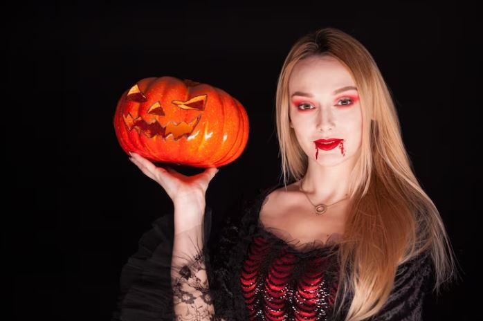

Sink your teeth into the world of vampires with spine-chilling face paint. Start by applying a pale base to create a ghostly complexion. Enhance your features with deep, blood-red lips that scream danger. 

Smoky eye shadow and [dramatic eyeliner](https://avada.io/loveable/blog/halloween-eyeliner/) will give you an alluring gaze. Sharpen your fangs with white face paint and add veiny details for an extra touch of eeriness. Finish the look with a subtle shimmer to give your vampire face paint an otherworldly glow that will captivate all who cross your path.

[Take a look at the detailed steps!](https://www.motherandbaby.com/family-life/halloween/halloween-face-paint/)

### **Witch**

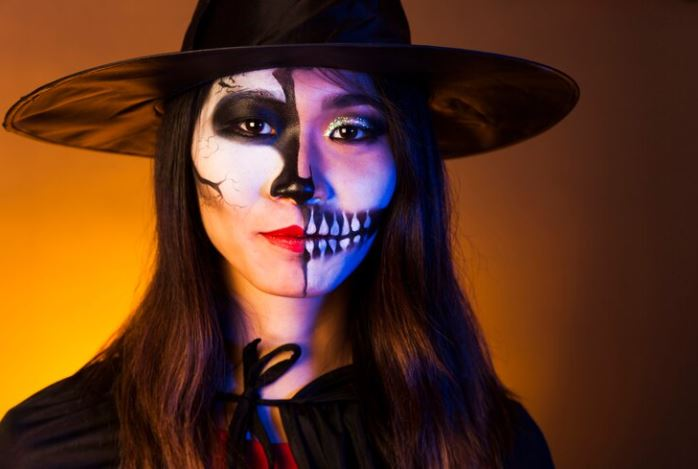

Embrace your inner enchantress with spellbinding witch-inspired face paint. Begin by creating a greenish hue as the base, giving your skin an otherworldly tone. Accentuate your cheekbones with contouring to achieve that wickedly mysterious look. 

Define your eyes with smoky eyeshadow and winged eyeliner for a captivating gaze. Add a touch of green glitter to give your eyes a bewitching sparkle. 

Complete the look with a crooked nose, using a darker shade of green, and add a few strategically placed warts for that quintessential witchy charm. Don’t forget to don a pointy hat and grab your trusty broomstick for the ultimate witch transformation.

[Take a look at the detailed steps!](https://www.hobbycraft.co.uk/ideas/how-to-face-paint-a-witch.html)

**_Related_**: Best [Witch Gifts](https://avada.io/loveable/witch-gifts/) For Your Witchiest Friend

### **Zombie**

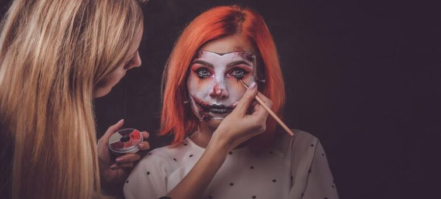

Prepare to unleash your inner undead with a realistic zombie face paint that will send shivers down spines. Begin by applying a grayish base to give your skin a lifeless, decayed appearance. Use shades of green and brown to create the illusion of rotting flesh and exposed bones. 

Add depth with darker shadows around the eyes and sunken cheeks. Apply fake blood generously to mimic the gruesome aftermath of a feeding frenzy. For an authentic touch, smudge and smear your makeup to achieve a disheveled and decayed look. Perfect your zombie walk and unleash your inner monster to complete the transformation.

[Take a look at the detailed steps!](https://www.costumebox.com.au/blogs/party-aunty/halloween-face-paint-zombie)

## **Fantasy and Mythical Creatures**

### **Mermaid**

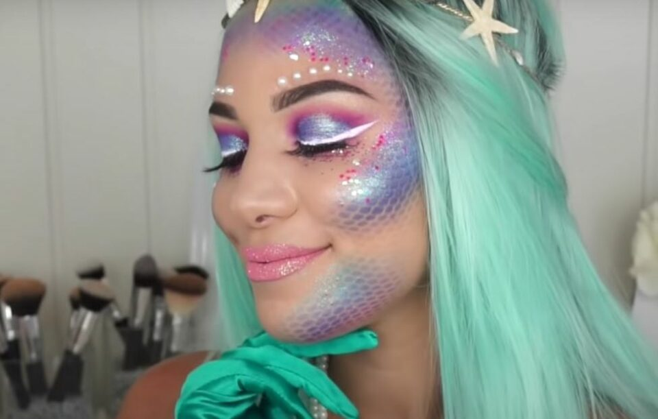

Dive into the mystical depths of the sea with mesmerizing mermaid-inspired face paint. Begin by creating a shimmery base using iridescent shades of blue, green, and purple. Enhance your eyes with aquatic-themed eyeshadow and sparkly accents. Add scales along your cheeks and temples using a stencil or freehand technique. 

Complete the look with a touch of seashell-inspired glitter on your cheeks and temples. With your enchanting mermaid face paint, you’ll leave everyone spellbound as you channel the ethereal beauty of the sea.

[Take a look at the detailed steps!](https://www.instructables.com/Mystical-Mermaid-Face-Paint/)

### **Fairy**

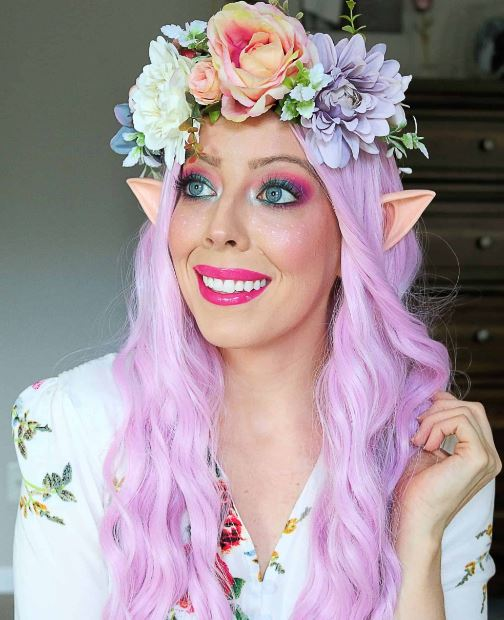

Sprinkle some magic into your Halloween with whimsical and ethereal fairy face paint. Start by applying a soft, pastel base to create a fairytale glow. Use glittery eyeshadows in shades of pink, purple, and silver to create a dreamy eye look. 

Adorn your temples and forehead with delicate swirls and twirls using metallic face paints. Complete the enchantment with a shimmering highlighter on your cheekbones and a dusting of fairy dust (glitter) across your face. With your fairy face paint, you’ll bring a touch of magic and wonder to any Halloween celebration.

[Take a look at the detailed steps!](https://www.facepaint.com/blogs/facepaint-blog/easy-fairy-face-paint-design-tutorial-by-kiki)

### **Unicorn**

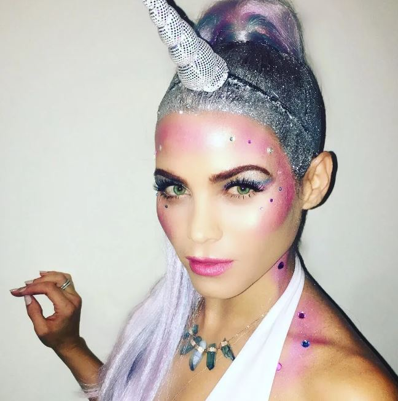

Embrace your inner unicorn with a colorful and sparkly face paint design that will make you the star of the Halloween parade. Start with a soft pastel base, and then use bright and vibrant face paints to create a rainbow effect on your cheeks and forehead. Add shimmering highlights to your temples and bridge of the nose. 

Finally, you can apply glitter in coordinating colors across your face, focusing on the cheeks and around the eyes. With your radiant unicorn face paint, you’ll be a vision of whimsy and enchantment.

[Take a look at the detailed steps!](https://facepaintingsheffield.com/2020/04/26/how-to-face-paint-a-unicorn/)

**_Related_**: Best [Unicorn Gifts](https://avada.io/loveable/unicorn-gifts/) for The One Who Loves Rainbow and Sparkle

## **Scary and Spooky Designs**

### **Skull**

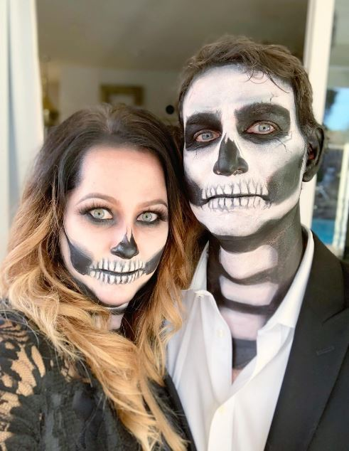

Unleash your dark side with a spine-chilling skull face paint. Begin by creating a bone-white base on your face using water-based face paint. Then, use black face paint to outline the hollow eye sockets and nose cavity. Add intricate details like cracks, shading, and teeth to give your skull a realistic and eerie look. 

Enhance the effect by shading the hollow areas with gray or black face paint. With this skull  Halloween face paint ideas, you’ll send shivers down everyone’s spines and become the embodiment of Halloween fright.

[Take a look at the detailed steps!](https://www.wikihow.com/Face-Paint-a-Skull)

### **Spiderweb**

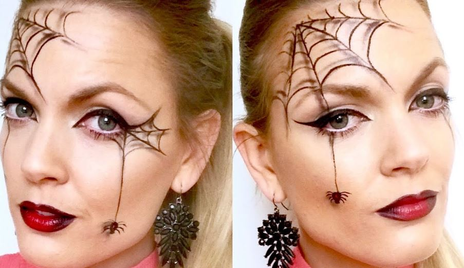

Weave a web of spookiness with captivating spiderweb Halloween face paint ideas. Start by applying a white base on your face and neck. Using a fine-tipped brush and black face paint, draw a spiderweb pattern across your forehead, extending down to your temples and cheekbones.

Add intricate lines and details to mimic the delicate strands of a spiderweb. For an extra creepy touch, add a small spider crawling along the web. With your spiderweb face paint, you’ll create a hauntingly beautiful look that will mesmerize everyone you encounter.

[Take a look at the detailed steps!](https://www.snazaroo.com/uk/tips-and-techniques/spider-girl/#:~:text=3%20STEP%20GUIDE,-1&text=Sponge%20Purple%20paint%20to%20the,bottom%20of%20the%20opposite%20side.&text=Using%20a%20brush%20and%20Black,to%20the%20areas%20of%20purple.&text=Finally%2C%20with%20Black%20paint%20and,Highlight%20in%20White.)

### **Ghost**

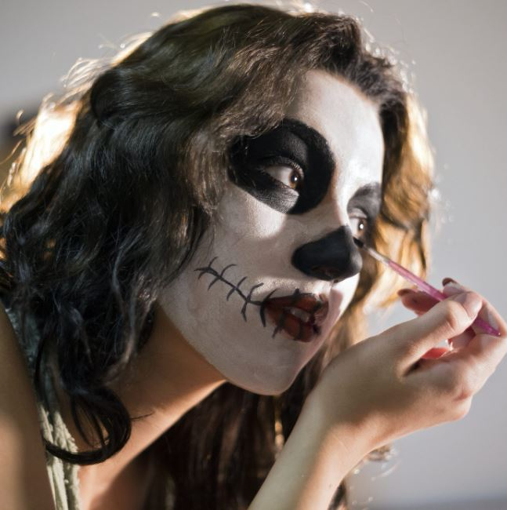

Haunt the night with a ghostly face paint design that will send chills down everyone’s spine. Begin by applying a pale, almost translucent base color to your face. Use light gray or white face paint to create a hazy and ethereal effect, emphasizing the hollows of your cheeks and eyes. 

Add wispy lines and faded edges to give the illusion of floating. Enhance the ghostly look by adding dark, smoky eyeshadow and a touch of shimmer on your cheekbones. With your ghost face paint, you’ll evoke the eerie essence of the spirit world.

These scary and spooky Halloween face paint ideas will give you a bone-chilling transformation for Halloween.

[Take a look at the detailed steps!](https://www.madeformums.com/school-and-family/face-paint-ghoulish-ghost-step-by-step/)

## **Pop Culture-Inspired Face Paints**

### **Superhero**

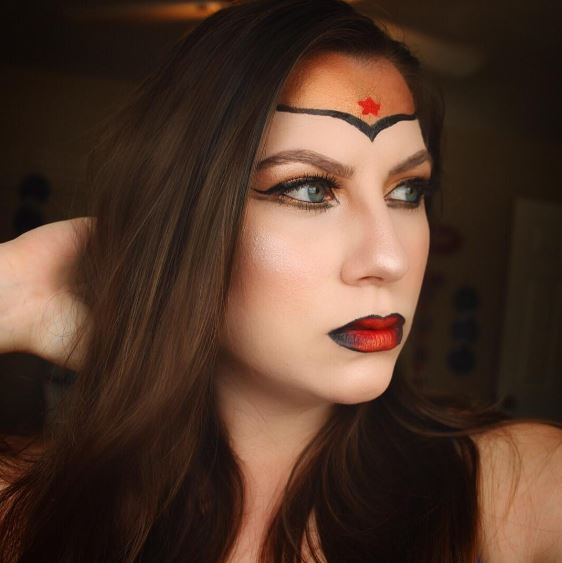

You can unleash your inner hero with [DC superhero-inspired](https://avada.io/loveable/dc-comics-gifts/) face paint. Start by choosing your favorite superhero character and study their signature look. Use vibrant face paints to recreate their iconic mask or symbol on your face. Add bold lines and colors to mimic the superhero’s features, like chiseled jawlines or expressive eyes. 

What you can do more for effect is add glitter or metallic accents for an extra touch of superhero glam. With your superhero face paint, you’ll be ready to save the day and make a powerful impression at any Halloween event.

[Take a look at the detailed steps!](https://www.twinkl.com.au/resource/face-paint-instructions-superhero-t-p-1631101655)

### **Movie Monster**

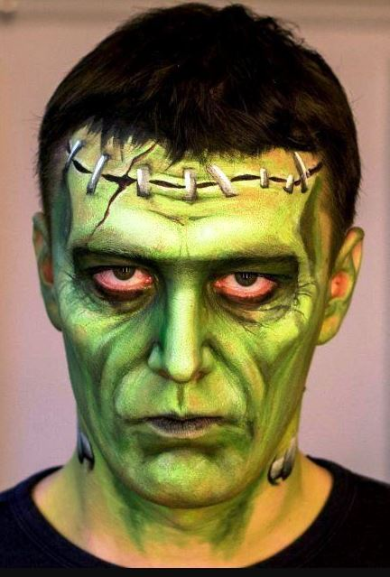

Bring classic movie monsters to life with chilling movie monster face paint. Select an iconic creature like Frankenstein, Dracula, or the Mummy, and study its distinctive features. Use a combination of face paints and shading techniques to create the monster’s unique look. Add stitches, fangs, or gory details to enhance the fright factor. 

Pay attention to the color scheme and textures to make your movie monster face paint truly realistic. With your movie monster face paint, you’ll embody the essence of cinematic horror and leave a lasting impression.

[Take a look at the detailed steps!](https://facepaintingsheffield.com/2020/09/13/387/)

### **Cartoon Character**

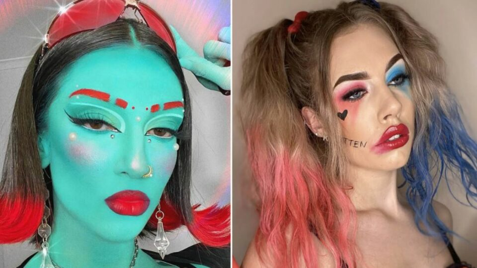

Step into the world of animation with [cartoon character](https://avada.io/loveable/blog/famous-halloween-cartoon-characters/)\-inspired face paint. Choose your favorite animated character and study their signature features and colors. Use vibrant face paints to recreate their iconic hairstyle, facial expressions, and accessories. Pay attention to the shape of their eyes, the style of their eyebrows, and the colors that define their look. 

Add playful details like exaggerated lashes or rosy cheeks to capture the essence of the character. With your cartoon character face paint, you’ll bring the magic of cartoons to life and spread joy wherever you go.

[Take a look at the detailed steps!](https://www.youtube.com/watch?v=WTTaUgEIgHA)

## **Creative and Unique Ideas**

### **Optical Illusions**

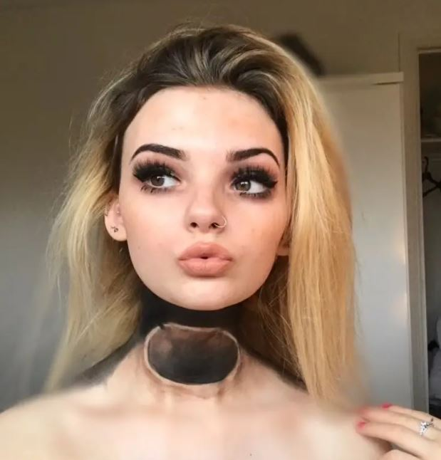

Mesmerize everyone with mind-bending and eye-catching optical illusion face paints. Experiment with geometric shapes, patterns, and contrasting colors to create illusions of depth and movement. 

Play with perspective and symmetry to create intriguing effects on your face. Use shading and highlights to enhance the illusion. Whether it’s a floating mask, a shattered face, or a distorted image, optical illusion face paints are sure to captivate and leave people questioning reality.

[Take a look at the detailed steps!](https://www.youtube.com/watch?v=ZQ9zO7BOP3s)

### **Animal-Inspired**

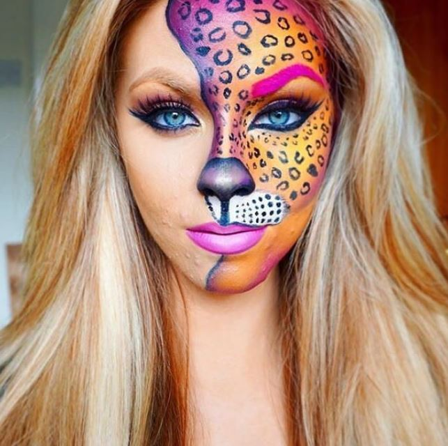

Channel the spirit of the animal kingdom with animal-inspired face paints. Choose your favorite [Halloween animal](https://avada.io/loveable/blog/halloween-animals/) and study its unique features and markings. Use face paints to mimic the animal’s fur, feathers, or scales. 

Pay attention to the animal’s distinct facial features, such as snouts, noses, or beaks. Add realistic details like whiskers, claws, or horns to complete the transformation. With animal-inspired face paints, you can unleash your wild side and embody the beauty and strength of your favorite creatures.

[Take a look at the detailed steps!](https://www.youtube.com/watch?v=CL8_fawwVl0)

### **Geometric Patterns**

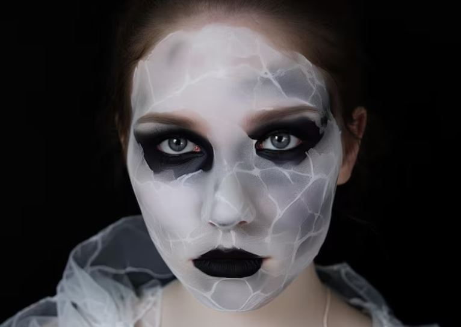

Embrace the power of symmetry and precision with geometric pattern face paints. Create striking designs using triangles, squares, circles, or intricate patterns inspired by sacred geometry. Use bold, contrasting colors to make the patterns pop. Experiment with negative space and overlapping shapes for a visually dynamic effect. Geometric pattern face paints are a unique way to showcase your artistic skills and make a bold statement at any Halloween gathering.

These creative and unique Halloween face paint ideas offer a departure from traditional Halloween looks. Whether you’re creating mind-bending optical illusions, transforming into majestic animals, or embracing the precision of geometric patterns, these face paints will make you stand out and showcase your artistic flair. Let your imagination run wild and unleash your creativity to create face paints that are truly one-of-a-kind.

[Take a look at the detailed steps!](https://www.clownantics.com/blogs/clownantics-blog/melissa-munn-inspired-eye-design-tutorial)

## **Tips and Tricks for Halloween Face Painting**

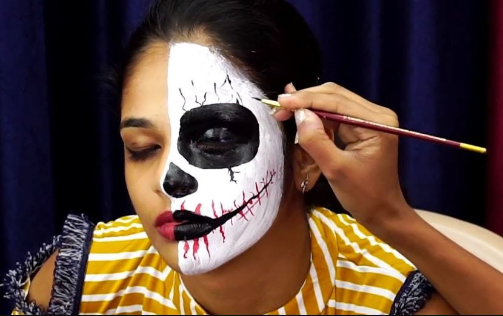

When it comes to creating captivating Halloween face paints, it’s important to have the right tools, prepare the skin properly, and master the techniques for blending colors, adding details, and applying finishing touches. Here are some valuable tips and tricks to help you achieve stunning results for your Halloween face paint ideas:

- Choosing the right face paint products and tools is crucial. Opt for high-quality, skin-safe face paints specifically designed for face and body use. Look for non-toxic, hypoallergenic options that are easily removable with water and gentle soap. Invest in a variety of brushes in different sizes, sponges for blending and shading, and stencils for creating precise designs.
- Before applying face paint, prepare the skin to ensure a smooth and long-lasting finish. Cleanse the face thoroughly and moisturize to create a hydrated canvas. If the skin is sensitive or prone to irritation, consider applying a thin layer of barrier cream to protect it.
- When it comes to blending colors, start with a light base and gradually build up the intensity. Use a sponge or brush to blend the colors seamlessly, creating smooth transitions. Experiment with different techniques such as stippling, feathering, or swirling to achieve desired effects.
- Adding intricate details is what brings your face paint design to life. Use fine-tipped brushes to create sharp lines, intricate patterns, and delicate accents. Consider using shimmer or glitter for extra sparkle and dimension. Remember to work in layers, allowing each layer to dry before adding more details.
- To complete your Halloween face paint, don’t forget the finishing touches. Set the design with a setting powder or spray to enhance its longevity. Consider adding accessories like fake blood, gems, or prosthetics to elevate the overall look.

## **In Conclusion,**

**Halloween face painting** offers endless possibilities for expressing your creativity and adding a touch of magic to your costume. Whether you prefer classic characters, fantasy creatures, spooky designs, pop culture references, or unique concepts, there’s a face paint idea to suit every style. With the right products, tools, and techniques, you can transform yourself into anything you desire. 

Let your imagination run wild and bring your Halloween look to life with stunning  Halloween face paint ideas. From vampires to unicorns, skulls to optical illusions, there’s no limit to the enchanting transformations you can achieve. So embrace the art of face painting, unleash your inner artist, and prepare to make a lasting impression at any Halloween gathering. Get ready to amaze and inspire with your extraordinary face paint creations. Happy face painting and happy Halloween!

- [Classic Halloween Characters](https://avada.io/loveable/blog/halloween-face-paint-ideas/#wp-block-heading-2-4)
    - [Vampire](https://avada.io/loveable/blog/halloween-face-paint-ideas/#wp-block-heading-3-5)
    - [Witch](https://avada.io/loveable/blog/halloween-face-paint-ideas/#wp-block-heading-3-10)
    - [Zombie](https://avada.io/loveable/blog/halloween-face-paint-ideas/#wp-block-heading-3-17)
- [Fantasy and Mythical Creatures](https://avada.io/loveable/blog/halloween-face-paint-ideas/#wp-block-heading-2-22)
    - [Mermaid](https://avada.io/loveable/blog/halloween-face-paint-ideas/#wp-block-heading-3-23)
    - [Fairy](https://avada.io/loveable/blog/halloween-face-paint-ideas/#wp-block-heading-3-28)
    - [Unicorn](https://avada.io/loveable/blog/halloween-face-paint-ideas/#wp-block-heading-3-33)
- [Scary and Spooky Designs](https://avada.io/loveable/blog/halloween-face-paint-ideas/#wp-block-heading-2-39)
    - [Skull](https://avada.io/loveable/blog/halloween-face-paint-ideas/#wp-block-heading-3-40)
    - [Spiderweb](https://avada.io/loveable/blog/halloween-face-paint-ideas/#wp-block-heading-3-45)
    - [Ghost](https://avada.io/loveable/blog/halloween-face-paint-ideas/#wp-block-heading-3-50)
- [Pop Culture-Inspired Face Paints](https://avada.io/loveable/blog/halloween-face-paint-ideas/#wp-block-heading-2-56)
    - [Superhero](https://avada.io/loveable/blog/halloween-face-paint-ideas/#wp-block-heading-3-57)
    - [Movie Monster](https://avada.io/loveable/blog/halloween-face-paint-ideas/#wp-block-heading-3-62)
    - [Cartoon Character](https://avada.io/loveable/blog/halloween-face-paint-ideas/#wp-block-heading-3-67)
- [Creative and Unique Ideas](https://avada.io/loveable/blog/halloween-face-paint-ideas/#wp-block-heading-2-72)
    - [Optical Illusions](https://avada.io/loveable/blog/halloween-face-paint-ideas/#wp-block-heading-3-73)
    - [Animal-Inspired](https://avada.io/loveable/blog/halloween-face-paint-ideas/#wp-block-heading-3-78)
    - [Geometric Patterns](https://avada.io/loveable/blog/halloween-face-paint-ideas/#wp-block-heading-3-83)
- [Tips and Tricks for Halloween Face Painting](https://avada.io/loveable/blog/halloween-face-paint-ideas/#wp-block-heading-2-88)
- [In Conclusion,](https://avada.io/loveable/blog/halloween-face-paint-ideas/#wp-block-heading-2-96)

### [Blake Simpson](https://avada.io/loveable/author/blake/)

Hi, I'm Blake from Loveable. I help people find perfect gifts for occasions like anniversaries and weddings. I also write a blog about holidays, sharing insights to make them more meaningful. Let's create unforgettable moments together!

- [Twitter](https://twitter.com/intent/tweet)
- [Facebook](https://www.facebook.com/sharer/sharer.php)
- [instagram](https://avada.io/loveable/blog/halloween-face-paint-ideas/)
- [pinterest](https://www.pinterest.com/loveablellc/)

## Related Posts

[### 120+ Christian Birthday Wishes To Spread Your Love](https://avada.io/loveable/blog/christian-birthday-wishes/) 

[

### 35 Best 70th Birthday Ideas To Celebrate The Special Milestone

](https://avada.io/loveable/blog/70th-birthday-ideas/)

[

### 50 Best 30th Birthday Decorations for a Remarkable Birthday Bash

](https://avada.io/loveable/blog/30th-birthday-decorations/)

[

### 40 Delicious Vegan Christmas Desserts to Delight Your Palate

](https://avada.io/loveable/blog/vegan-christmas-desserts/)

[

### 60 Christmas Team Building Activities to Boost Workplace Spirit

](https://avada.io/loveable/blog/christmas-team-building-activities/)
