This article has been written and researched by our expert Loveable through a precise methodology. [Learn more about our methodology](https://avada.io/loveable/our-methodological.html)

[Loveable](https://avada.io/loveable/) > [Blog](https://avada.io/loveable/blog/) > [Holiday](https://avada.io/loveable/holiday/)

# Unique Teacher Halloween Costumes in 2023 to Celebrate This Holiday

Written by [Blake Simpson](https://avada.io/loveable/author/blake/) Last Updated on October 03, 2023

- [Importance of Teacher Halloween Costumes](https://avada.io/loveable/blog/teacher-halloween-costumes/#wp-block-heading-2-3)
    - [Creating a fun and engaging learning environment](https://avada.io/loveable/blog/teacher-halloween-costumes/#wp-block-heading-3-6)
    - [Promoting creativity and imagination among students](https://avada.io/loveable/blog/teacher-halloween-costumes/#wp-block-heading-3-9)
    - [Encouraging a sense of community and unity within the school](https://avada.io/loveable/blog/teacher-halloween-costumes/#wp-block-heading-3-11)
- [Creative Ideas for Teacher Halloween Costumes](https://avada.io/loveable/blog/teacher-halloween-costumes/#wp-block-heading-2-14)
    - [The Most Popular Teacher Halloween Costume Ideas](https://avada.io/loveable/blog/teacher-halloween-costumes/#wp-block-heading-3-16)
        - [1\. Crayola Crayon Box](https://avada.io/loveable/blog/teacher-halloween-costumes/#wp-block-heading-4-17)
        - [2\. Blue’s Clues & Co](https://avada.io/loveable/blog/teacher-halloween-costumes/#wp-block-heading-4-21)
        - [3\. Napoleon and Pedro](https://avada.io/loveable/blog/teacher-halloween-costumes/#wp-block-heading-4-26)
        - [4\. Bucket Fillers](https://avada.io/loveable/blog/teacher-halloween-costumes/#wp-block-heading-4-30)
        - [5\. The Princess A-Team](https://avada.io/loveable/blog/teacher-halloween-costumes/#wp-block-heading-4-34)
        - [6\. Magic School Bus](https://avada.io/loveable/blog/teacher-halloween-costumes/#wp-block-heading-4-38)
        - [7\. Beanie Babies](https://avada.io/loveable/blog/teacher-halloween-costumes/#wp-block-heading-4-43)
        - [8\. Food Groups](https://avada.io/loveable/blog/teacher-halloween-costumes/#wp-block-heading-4-47)
        - [9\. Expo Markers](https://avada.io/loveable/blog/teacher-halloween-costumes/#wp-block-heading-4-53)
        - [10\. Field Trip Survivors](https://avada.io/loveable/blog/teacher-halloween-costumes/#wp-block-heading-4-58)
        - [11\. Giraffes Can’t Dance](https://avada.io/loveable/blog/teacher-halloween-costumes/#wp-block-heading-4-63)
        - [12\. Disco Teachers](https://avada.io/loveable/blog/teacher-halloween-costumes/#wp-block-heading-4-67)
    - [Teacher Halloween Costumes – Historical Figures](https://avada.io/loveable/blog/teacher-halloween-costumes/#wp-block-heading-3-71)
        - [1\. Albert Einstein](https://avada.io/loveable/blog/teacher-halloween-costumes/#wp-block-heading-4-72)
        - [2\. Amelia Earhart](https://avada.io/loveable/blog/teacher-halloween-costumes/#wp-block-heading-4-76)
        - [3\. Abraham Lincoln](https://avada.io/loveable/blog/teacher-halloween-costumes/#wp-block-heading-4-80)
    - [Teacher Halloween Costumes – Literary Characters](https://avada.io/loveable/blog/teacher-halloween-costumes/#wp-block-heading-3-84)
        - [1\. Harry Potter](https://avada.io/loveable/blog/teacher-halloween-costumes/#wp-block-heading-4-85)
        - [2\. Miss Frizzle from “The Magic School Bus”](https://avada.io/loveable/blog/teacher-halloween-costumes/#wp-block-heading-4-90)
        - [3\. Sherlock Holmes](https://avada.io/loveable/blog/teacher-halloween-costumes/#wp-block-heading-4-94)
    - [Teacher Halloween Costumes – Pop Culture Icons](https://avada.io/loveable/blog/teacher-halloween-costumes/#wp-block-heading-3-98)
        - [1\. Superheroes (e.g., Wonder Woman, Spider-Man)](https://avada.io/loveable/blog/teacher-halloween-costumes/#wp-block-heading-4-99)
        - [2\. Disney Characters (e.g., Mary Poppins, Cruella de Vil)](https://avada.io/loveable/blog/teacher-halloween-costumes/#wp-block-heading-4-103)
        - [3\. TV Show Characters (e.g., Walter White from “Breaking Bad”)](https://avada.io/loveable/blog/teacher-halloween-costumes/#wp-block-heading-4-107)
    - [DIY Teacher Halloween Costume Ideas](https://avada.io/loveable/blog/teacher-halloween-costumes/#wp-block-heading-3-111)
        - [1\. Smartie Pants](https://avada.io/loveable/blog/teacher-halloween-costumes/#wp-block-heading-4-112)
        - [2\. Grammar Police](https://avada.io/loveable/blog/teacher-halloween-costumes/#wp-block-heading-4-115)
        - [3\. Bookworm](https://avada.io/loveable/blog/teacher-halloween-costumes/#wp-block-heading-4-119)
        - [4\. Science Teacher (lab coat, safety goggles)](https://avada.io/loveable/blog/teacher-halloween-costumes/#wp-block-heading-4-123)
        - [5\. Art Teacher (paint-splattered smock, palette)](https://avada.io/loveable/blog/teacher-halloween-costumes/#wp-block-heading-4-127)
        - [6\. Chalkboard Costume](https://avada.io/loveable/blog/teacher-halloween-costumes/#wp-block-heading-4-130)
        - [7\. Giant Pencil Costume](https://avada.io/loveable/blog/teacher-halloween-costumes/#wp-block-heading-4-134)
- [Tips for Choosing and Creating Teacher Halloween Costumes](https://avada.io/loveable/blog/teacher-halloween-costumes/#wp-block-heading-2-140)
    - [1\. Consider age-appropriateness and cultural sensitivity](https://avada.io/loveable/blog/teacher-halloween-costumes/#wp-block-heading-3-141)
    - [2\. Incorporate educational elements into the costume (e.g., props, visuals)](https://avada.io/loveable/blog/teacher-halloween-costumes/#wp-block-heading-3-144)
    - [3\. Utilize DIY and budget-friendly options](https://avada.io/loveable/blog/teacher-halloween-costumes/#wp-block-heading-3-148)
    - [4\. Collaborate with colleagues for group costume ideas](https://avada.io/loveable/blog/teacher-halloween-costumes/#wp-block-heading-3-151)
- [To Conclude,](https://avada.io/loveable/blog/teacher-halloween-costumes/#wp-block-heading-2-157)

Step into the classroom with style this Halloween as we unveil a collection of **unique teacher costumes** that will make you the talk of the school! From history buffs to science enthusiasts, we’ve got the perfect costumes to showcase your passion for education while embracing the spirit of the spooky season. 

Say goodbye to the typical witch or ghost costumes and say hello to a world of creativity and academic inspiration. Get ready to inspire and entertain your students as you step into the classroom with confidence and style, showcasing your love for both education and the Halloween festivities. Let the transformation begin!

## **Importance of Teacher Halloween Costumes**

Teacher Halloween costumes are of great importance as they contribute to creating a fun and engaging learning environment, promoting creativity and imagination among students, and encouraging a sense of community and unity within the school. By embracing the spirit of Halloween, teachers can enhance the overall educational experience and foster a positive and memorable atmosphere for their students.

### **Creating a fun and engaging learning environment**

Teacher Halloween costumes play a significant role in fostering a fun and engaging learning environment. When teachers dress up in creative and exciting costumes, it adds an element of surprise and anticipation to the classroom. 

Students are more likely to be excited about coming to school and participating in the learning process when they see their teachers embracing the spirit of Halloween. The costumes spark curiosity and ignite the students’ imaginations, creating a positive and memorable experience for everyone involved.

### **Promoting creativity and imagination among students**

By witnessing their teachers transform into different [Halloween cartoon characters](https://avada.io/loveable/blog/famous-halloween-cartoon-characters/) or embodying various themes, students are encouraged to think outside the box and explore their own creative abilities. It opens up a world of possibilities and allows students to express themselves in unique and imaginative ways. This can have a lasting impact on their overall creativity and problem-solving skills.

### **Encouraging a sense of community and unity within the school**

Dressing up in Halloween costumes helps foster a sense of community and unity within the school. It brings teachers and students together in a shared experience, creating a bond and a sense of belonging. 

When everyone participates in the Halloween festivities, it promotes a supportive and inclusive environment, where individual differences are celebrated and appreciated. It breaks down barriers and encourages collaboration and cooperation among students, as they engage in conversations and activities related to the costumes.

## **Creative Ideas for Teacher Halloween Costumes**

### **The Most Popular Teacher Halloween Costume Ideas**

#### **1\. Crayola Crayon Box**

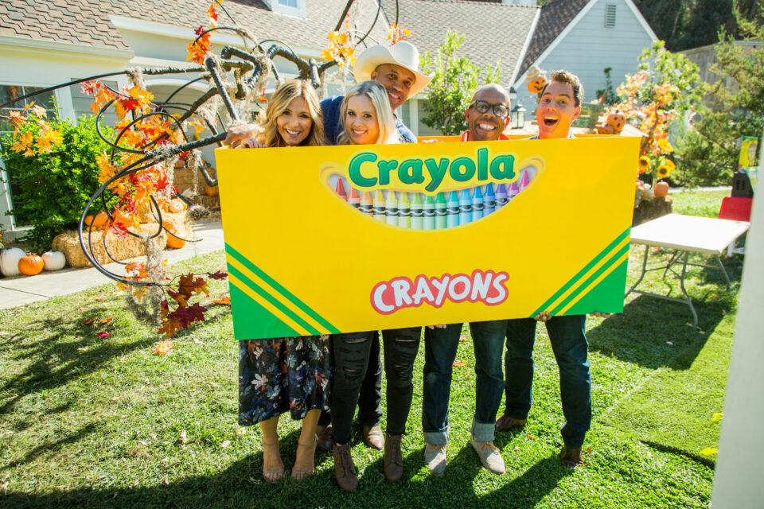

We absolutely adore Halloween costumes for teachers that perfectly match their students’ backpacks. This incredibly simple costume suggestion is ideal for larger groups and requires only primary-colored [personalized T-shirts](https://avada.io/loveable/personalized-t-shirts/) and party hats. Having someone creative design the lettering and a large box would be helpful.

[Take a look!](https://www.pinterest.com/pin/250090585533462971/)

#### **2\. Blue’s Clues & Co**

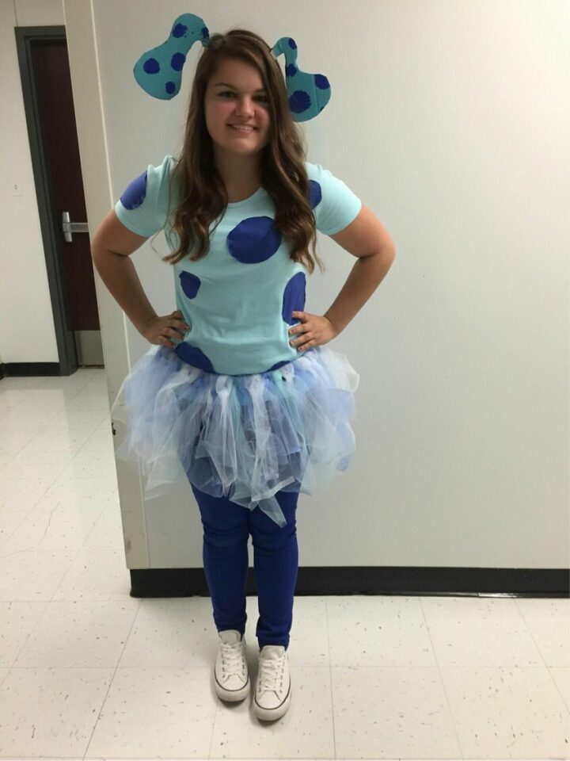

Prepare to be captivated by the upcoming group costume as we provide you with four tantalizing clues. Witness the cleverness of this group’s idea as they transform chef hats into adorable Salt and Pepper toppers through the magic of painting. 

They have even secured an exact replica of Steve’s iconic shirt from the show and curated a delightful selection of options to embody the spirit of Blue. Stay tuned for the exciting reveal of this imaginative and playful ensemble!

[Take a look!](https://www.amazon.com/Rubies-Adult-Comfywear-Costume-X-Large/dp/B09P7SR9ZH/)

#### **3\. Napoleon and Pedro**

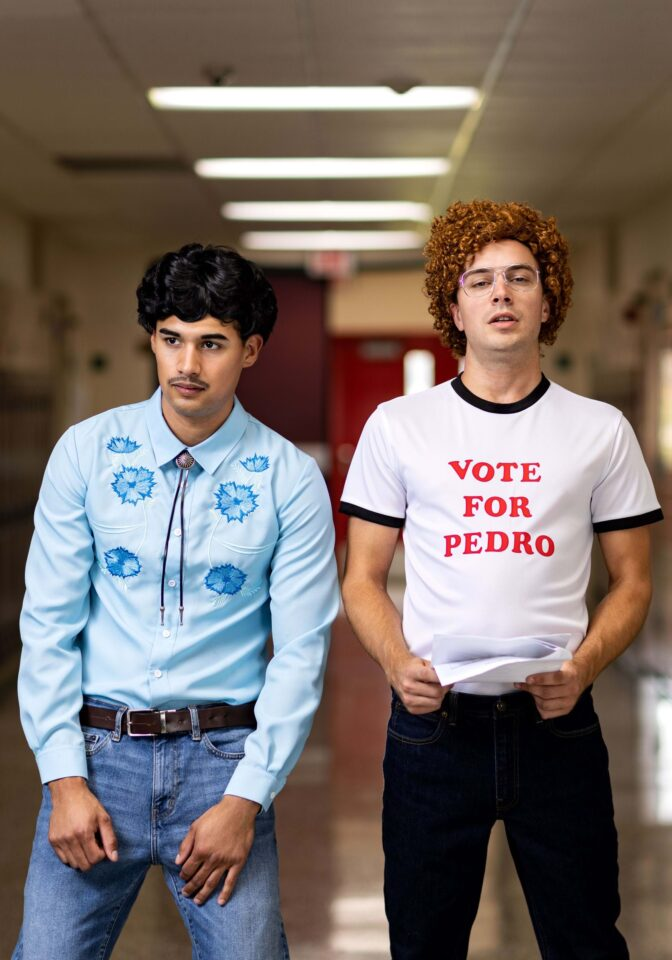

This particular teacher Halloween costume might resonate more with your colleagues rather than your students, as it pays homage to a classic movie. Emulating this dynamic duo is incredibly effortless and straightforward! We substituted a blue shirt for Pedro, inspired by one of his iconic looks in the film, but any button-up shirt will suffice.

[Take a look!](https://www.pinterest.com/pin/261208847110618344/)

#### **4\. Bucket Fillers**

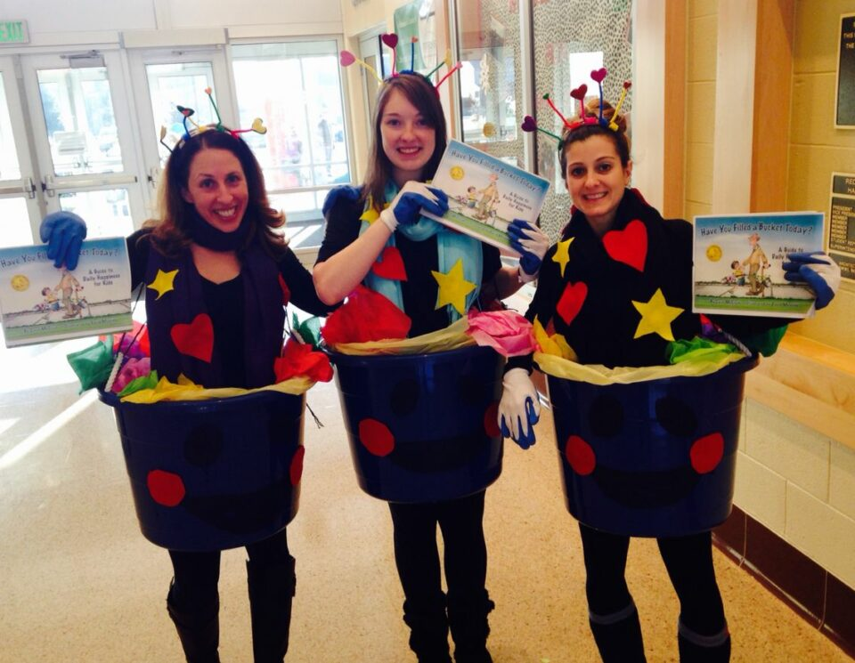

Behold, is a group costume that not only brings people together but also emphasizes the significance of kindness and filling others’ buckets. Indeed, it’s an embodiment of a powerful message! The most challenging aspect lies in shaping the plastic buckets, but fear not, as all you’ll need afterward is a touch of hot glue and your boundless imagination.

[Take a look!](https://www.pinterest.com/pin/65513369559611646/)

#### **5\. The Princess A-Team**

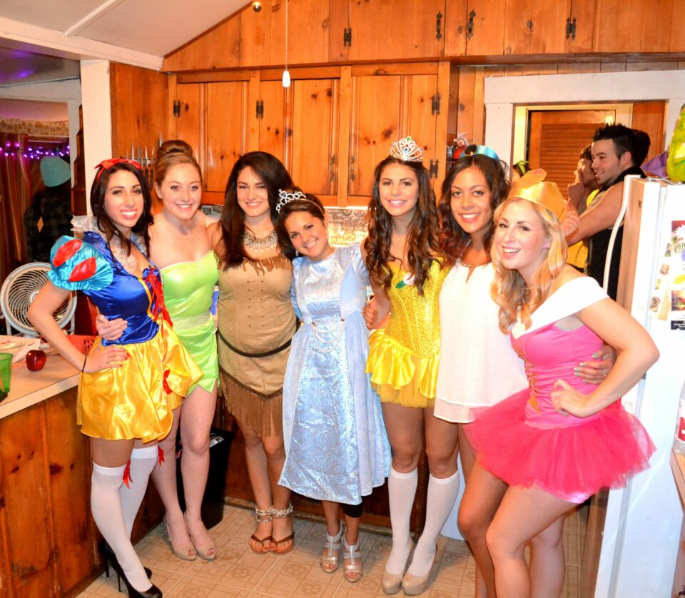

If you’re seeking teacher Halloween costumes that instantly transform you into adored Disney characters, you’re in for a treat! Drawing inspiration from the enchanting Fairy Godmother on the left, we have curated a delightful collection of exquisite pieces and pre-made costumes that will allow your inner Disney princess to radiate with splendor!

[Take a look!](https://www.pinterest.com/pin/558446422541131828/)

#### **6\. Magic School Bus**

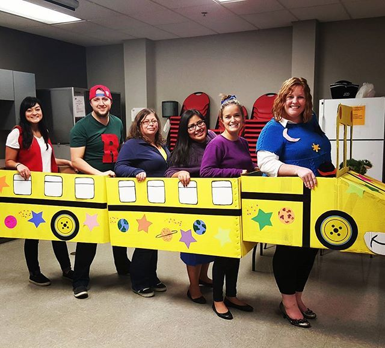

The Magic School Bus, a cherished show and book series that remains a childhood staple for millennials and their children, has resurfaced with a revival series. It presents an ideal choice for a captivating group costume. 

To embody everyone’s beloved teacher, Miss Frizzle, a red wig and the perfect dress are must-haves. For those feeling particularly adventurous, consider acquiring battery-operated tap lights to serve as functional headlights, adding an extra touch of authenticity to your ensemble.

[Take a look!](https://www.pinterest.com/floraflora1halloween/costumes-magic-schoolbus/)

#### **7\. Beanie Babies**

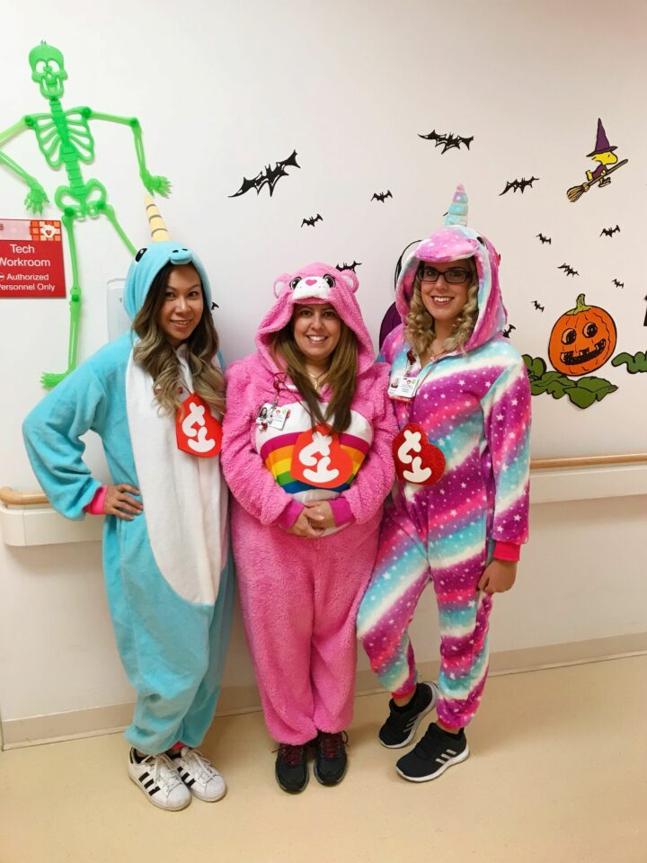

This teacher costume is bound to captivate kids’ attention, as Beanie Babies are adored by children everywhere. Choose your preferred animal onesie, and enlist the assistance of your artistic friend who owns a Cricut to create the iconic TY tags. As a bonus, you’ll experience unparalleled comfort during your workday, making it an ideal choice for both style and coziness.

[Take a look!](https://www.pinterest.com/pin/8444318026924476/)

#### **8\. Food Groups**

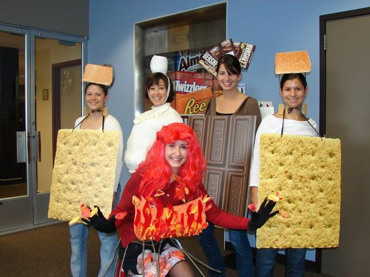

Who says teacher Halloween costumes can’t also serve as a wellness lesson? Count us in! If you’re pressed for time and looking for an affordable, ready-to-wear option, this fantastic ensemble costume idea is just what you need. 

The best part? You can easily involve more people in the excitement! Imagine someone joining in as a bunch of grapes, adorned with vibrant purple balloons. Get ready to have a blast while spreading wellness vibes all around!

[Take a look!](https://www.pinterest.com/whcostumes/food-costume-ideas/)

**_Related_**: Best [Gifts For Foodies](https://avada.io/loveable/gifts-foodies/) Who Have High Gastronomical Love

#### **9\. Expo Markers**

Prepare for an exhilarating face-off against another group by donning costumes inspired by Crayola colors, igniting an epic battle to determine the ultimate champions of school supplies! 

Alternatively, you can simply have a blast posing and enjoying the festivities with your group. Either way, all you need are some card stock for crafting cap hats, white aprons, and fabric paint to bring the magic to life. Get ready to create unforgettable memories in these vibrant and playful costumes!

[Take a look!](https://www.pinterest.com/pin/16044142408764892/)

#### **10\. Field Trip Survivors**

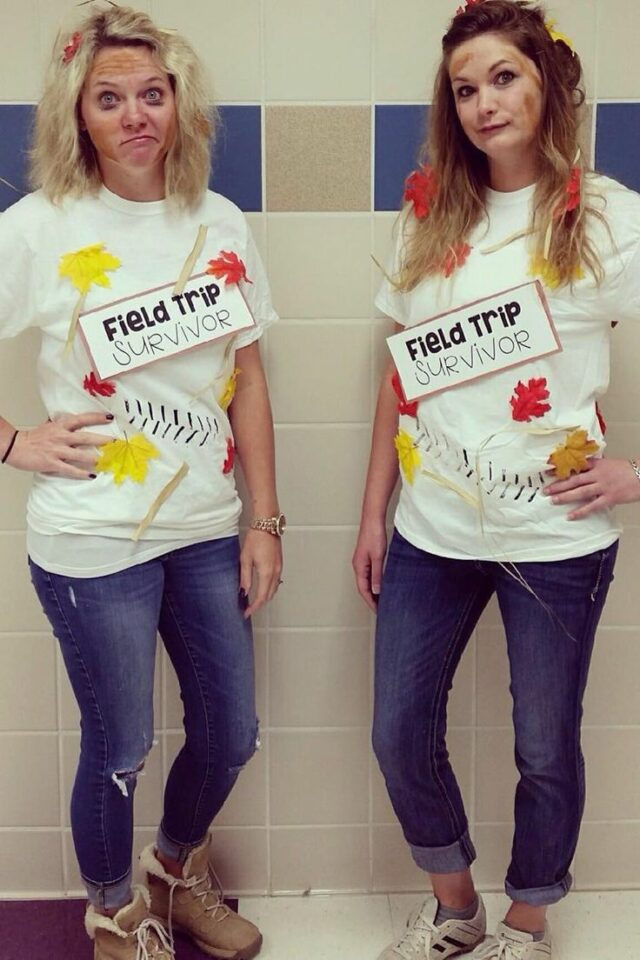

Assembling this costume is a breeze with a straightforward poster-board sign, and you have the freedom to customize it based on your latest school field trip. Take inspiration from these ladies who appear to have triumphed over a visit to the nearby pumpkin patch. 

If your most recent excursion was to a museum instead, why not tear up an inexpensive print of a famous artwork showcased there for a creative twist? You could even consider reprinting some replicas to adorn your classroom walls, adding an extra touch of artistic flair. Let your field trip memories come to life in this fun and versatile costume idea!

[Take a look!](https://www.pinterest.com/pin/232568768246499545/)

#### **11\. Giraffes Can’t Dance**

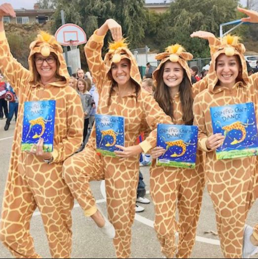

When it comes to teacher Halloween costumes, comfort is key, just like this adorable ensemble. Embracing the beloved book Giraffes Can’t Dance, which is cherished for teaching social skills, becomes even more enchanting when you don a playful onesie while reading it to your students. This delightful combination ensures that your storytelling experience is both comfortable and magical.

[Take a look!](https://www.amazon.co.uk/Smiffys-50713L-Giraffe-Costume-Unisex/dp/B07NJ6V4T8/)

#### **12\. Disco Teachers**

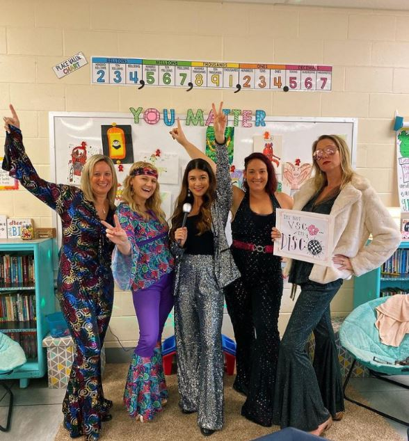

Do you happen to know someone who has tucked away some retro disco outfits? This group costume provides the perfect opportunity to showcase those groovy threads! However, if you don’t have access to such attire, fear not! We’ve discovered a few alternative options that will still allow you to embrace your inner Dancing Queen.

[Take a look!](https://www.amazon.co.uk/Amscan-847828-55-Adults-1970s-Costume/dp/B06XNR1KYF/)

### **Teacher Halloween Costumes – Historical Figures**

#### **1\. Albert Einstein**

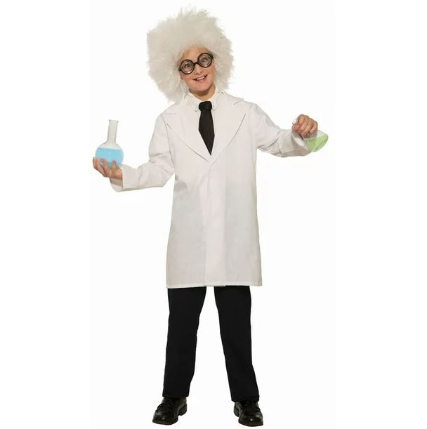

Dressing up as the iconic physicist [Albert Einstein](https://en.wikipedia.org/wiki/Albert_Einstein) can be a great way to inspire students’ interest in science and innovation. Complete the look with a wild white wig, a lab coat, and round glasses. Use Einstein’s famous equation, E=mc², as a prop to engage students in discussions about physics and the power of imagination.

[Take a look!](https://www.amazon.co.uk/Albert-Einstein-Costume-for-Kids/dp/B01DYMBDJC/)

#### **2\. Amelia Earhart**

Pay tribute to the courageous aviator [Amelia Earhart](https://en.wikipedia.org/wiki/Amelia_Earhart) by dressing up as her. Wear a leather bomber jacket, a pilot’s hat, and goggles to recreate her adventurous spirit. You can use this costume to encourage students to dream big, embrace challenges, and explore their own potential for greatness.

[Take a look!](https://www.amazon.co.uk/California-Costumes-Earhart-Aviator-Costume/dp/B07D54V7KJ/)

#### **3\. Abraham Lincoln**

It is a good idea to portray the 16th President of the United States by donning a tall top hat, a black suit, and a fake beard. This costume offers an opportunity to teach students about the significance of leadership, integrity, and the pursuit of equality. Engage in discussions about the Civil War and the Emancipation Proclamation, and encourage students to reflect on the importance of social justice.

[Take a look!](https://www.amazon.co.uk/Adult-Abraham-Lincoln-Fancy-Costume/dp/B07CGF8YZP/)

### **Teacher Halloween Costumes – Literary Characters**

#### **1\. Harry Potter**

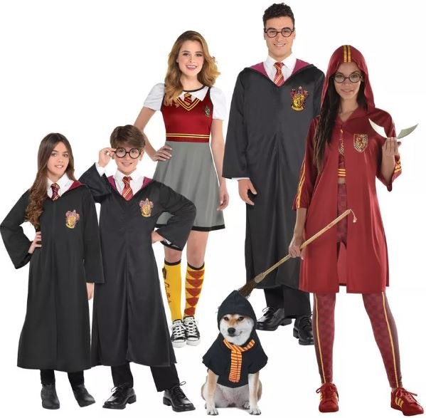

Why not bring the magical world of Harry Potter to life by dressing up as the famous wizard. Wear a Hogwarts robe, carry a wand, and draw a lightning-shaped scar on your forehead. This costume can spark enthusiasm for reading and inspire students to explore the power of imagination through literature.

[Take a look!](https://www.amazon.co.uk/Official-Gryffindor-Classic-Costume-9-10/dp/B07NFC66QP/)

**_Related_**: Best [Harry Potter Gifts For Potterhead](https://avada.io/loveable/harry-potter-gifts/) Who Love Fantastic Wizarding World

#### **2\. Miss Frizzle from “The Magic School Bus”**

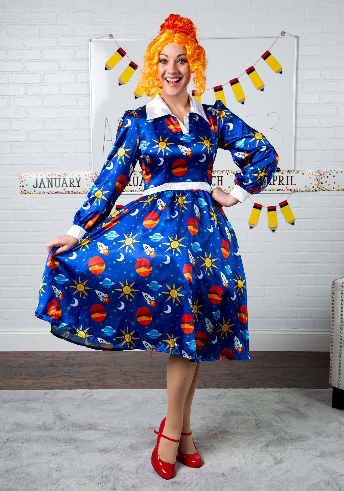

You can also transform into the adventurous and educational Miss Frizzle by wearing a bright and eccentric outfit, complete with a crazy hairstyle. This costume allows you to promote a love for science and exploration, just like the beloved teacher from the popular book and TV series. Consider carrying a miniature school bus or displaying educational props related to different science topics.

[Take a look!](https://www.amazon.co.uk/Magic-School-Frizzle-Fancy-Costume/dp/B08KHR3S4K)

#### **3\. Sherlock Holmes**

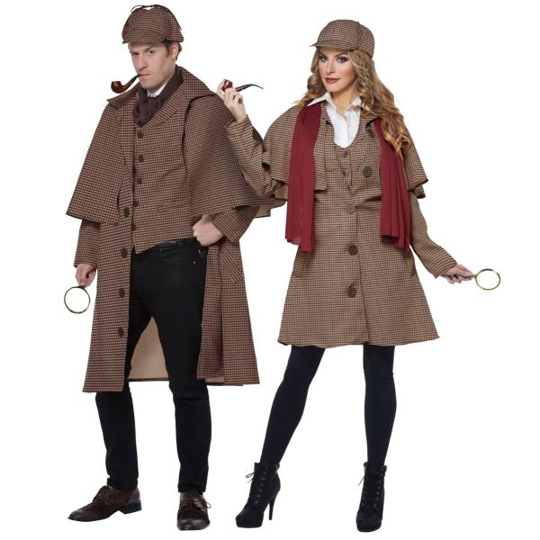

Channel the brilliant detective Sherlock Holmes by wearing a classic Victorian-era outfit, a deerstalker hat, and a magnifying glass. This costume provides an opportunity to engage students in critical thinking, problem-solving, and deductive reasoning activities. Then, you will create a mystery-solving atmosphere in the classroom, where students can work together to solve puzzles and analyze evidence.

[Take a look!](https://www.amazon.co.uk/Sherlock-Holmes-Fancy-dress-costume/dp/B015QQZN18?th=1)

### **Teacher Halloween Costumes – Pop Culture Icons**

#### **1\. Superheroes (e.g., Wonder Woman, Spider-Man)**

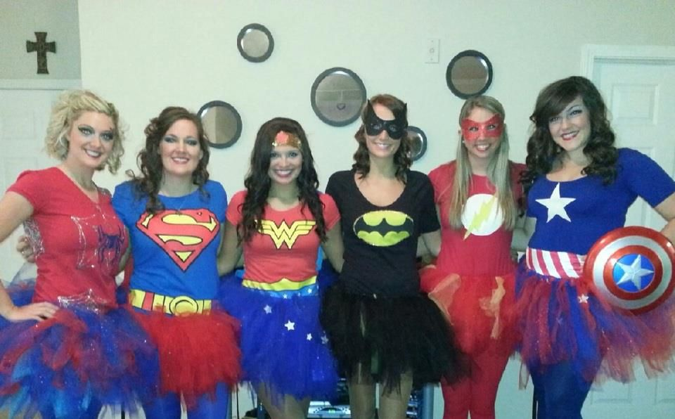

Embrace the superhero theme by dressing up as iconic characters like Wonder Woman or Spider-Man. These costumes promote values such as bravery, justice, and teamwork. Encourage students to discuss the importance of standing up for what is right and using their unique strengths to positively impact the world.

[Take a look!](https://www.amazon.com/iROLEWIN-Superhero-Cape-Dress-up-Costume-Halloween/dp/B0B3J19KWD)

#### **2\. Disney Characters (e.g., Mary Poppins, Cruella de Vil)**

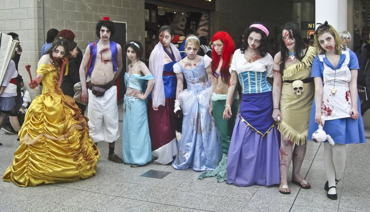

Let’s bring the enchantment of Disney to the classroom by embodying characters such as Mary Poppins or Cruella de Vil. These costumes can inspire creativity, kindness, and empathy among students. Incorporate elements from the characters’ stories and encourage discussions about character development, moral lessons, and the power of storytelling.

[Take a look!](https://www.amazon.com/Disney-Costume-Childrens-Classic-Princess/dp/B0BTTNSSS1)

#### **3\. TV Show Characters (e.g., Walter White from “Breaking Bad”)**

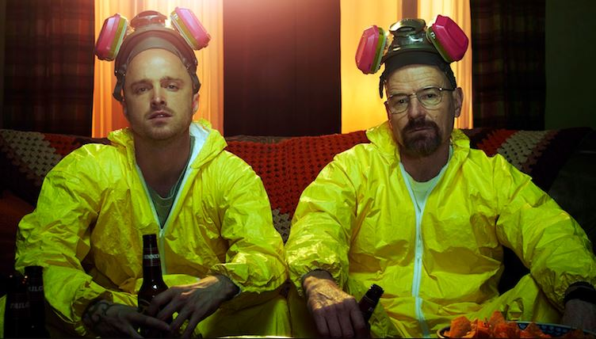

Don’t forget to take inspiration from popular TV shows like “Breaking Bad” and dress up as the complex character Walter White. While this choice may be more suitable for older students, it provides an opportunity to explore themes of transformation, consequences, and moral ambiguity. Engage students in discussions about character growth and the impact of choices in storytelling.

[Take a look!](https://www.amazon.com/Smiffys-Breaking-Costume-Hazmat-Rubber/dp/B00LU9H3I2)

### **DIY Teacher Halloween Costume Ideas**

#### **1\. Smartie Pants**

This costume choice is perfect for showcasing your wit and intellect. By attaching Smarties candy to a pair of pants, you create a playful pun that will bring a smile to your student’s faces. It’s a light-hearted way to emphasize the importance of intelligence and a fun approach to learning.

#### **2\. Grammar Police**

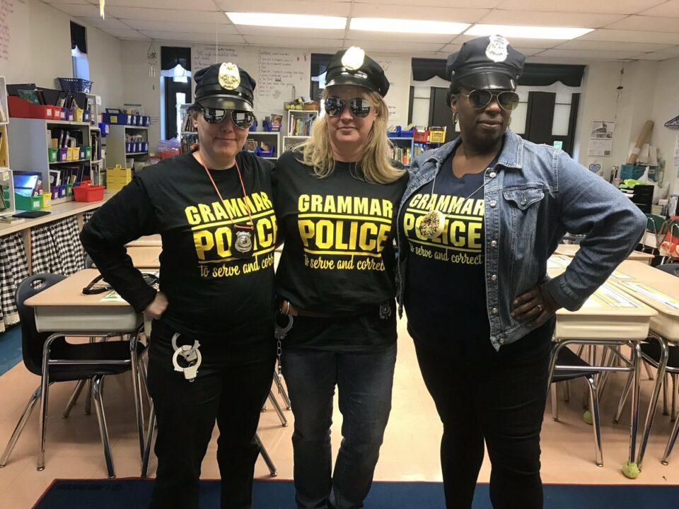

If you’re passionate about grammar and proper language usage, the “Grammar Police” is among the ideal teacher Halloween costumes. Dressing up as a grammar enforcer with a police-themed outfit and accessories like a badge and handcuffs allows for playful discussions about grammar rules. It also emphasizes the significance of effective communication in the classroom.

[Take a look!](https://www.amazon.com/Grammar-Police-Halloween-Costume-Shirt/dp/B07FZV3RJM)

#### **3\. Bookworm**

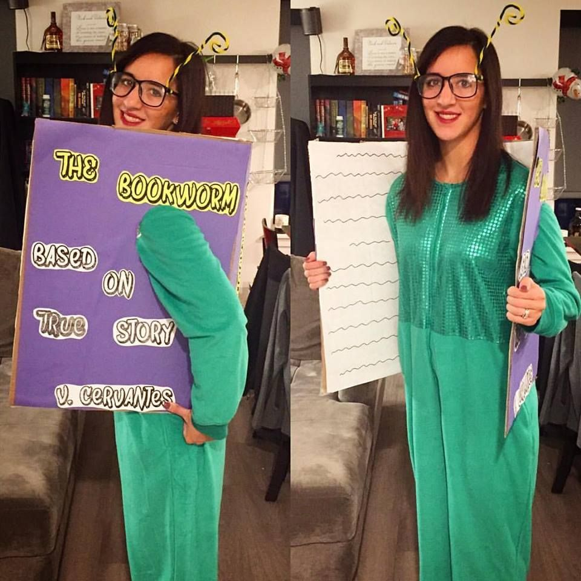

The “bookworm” costume is a fantastic choice for showcasing your love for literature and knowledge. By wearing green attire and attaching book cutouts to your outfit, you embody the spirit of a voracious reader. This costume encourages students to embrace the joy of reading and nurtures a lifelong appreciation for books.

[Take a look!](https://www.pinterest.com/pin/536702480590909193/)

#### **4\. Science Teacher (lab coat, safety goggles)**

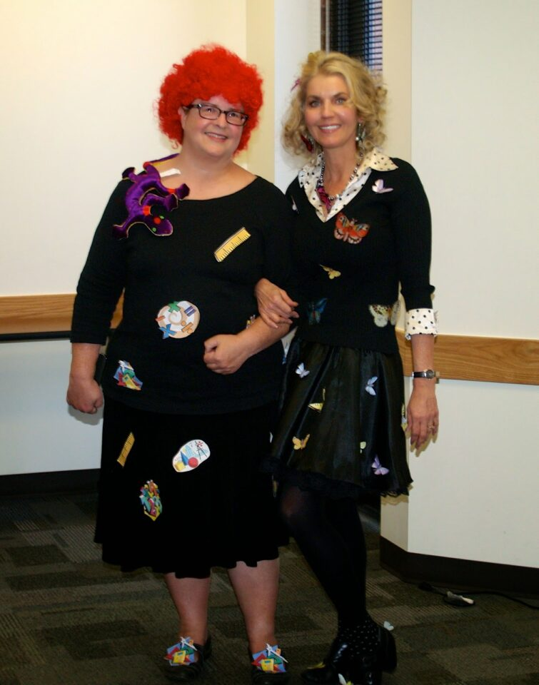

Dressing up as a science teacher with a lab coat, safety goggles, and gloves is an excellent way to highlight your expertise in the scientific realm. This costume reinforces your dedication to scientific exploration and creates excitement among students. It sets the stage for engaging experiments and discoveries in the classroom.

[Take a look!](https://www.amazon.com/UNDERWRAPS-Mad-Scientist-Couple-Costume/dp/B0B8BX4VW7)

#### **5\. Art Teacher (paint-splattered smock, palette)**

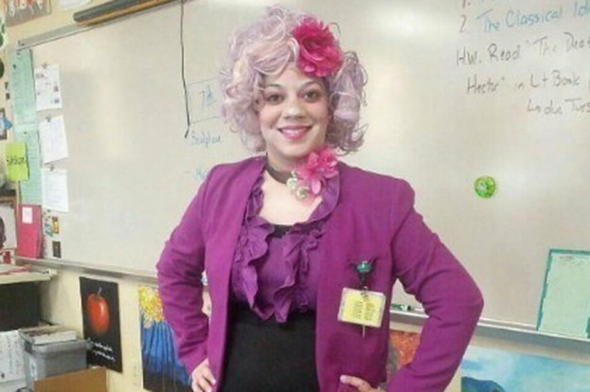

The “art teacher” costume allows you to showcase your creativity and passion for artistic expression. A paint-splattered smock and palette are the perfect accessories to embody the artistic spirit. This costume inspires students to explore their artistic abilities and initiates discussions about art techniques and renowned artists.

#### **6\. Chalkboard Costume**

Transforming into a walking chalkboard creates an interactive and visually appealing costume. By using black paint or chalkboard paint on a large piece of cardboard or fabric, you can create the appearance of a chalkboard. This costume brings the classroom environment to life and encourages student engagement with educational messages or equations.

[Take a look!](https://www.etsy.com/listing/1383984667/halloween-costume-party-chalkboard-not)

#### **7\. Giant Pencil Costume**

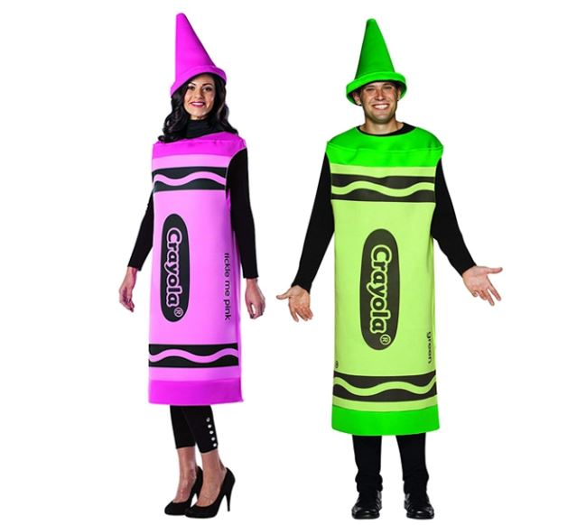

As a symbol of writing and communication, the “giant pencil” costume captures the essence of education. Crafted from a cardboard tube or fabric, a yellow pencil with an eraser and sharpened tip represents the importance of writing and learning. These teacher Halloween costumes serve as a reminder of the transformative power of education and the impact of knowledge.

[Take a look!](https://www.amazon.com/Rasta-Imposta-Pencil-Adult/dp/B00C3DIC5W)

**_Related_**:

- Best [Teacher Halloween Gifts](https://avada.io/loveable/teacher-halloween-gifts/) Will Make Them Have a fa-BOO-lous Feeling

## **Tips for Choosing and Creating Teacher Halloween Costumes**

### **1\. Consider age-appropriateness and cultural sensitivity**

When selecting or designing teacher Halloween costumes, it’s essential to consider your students’ age group and ensure that the costume is appropriate and respectful. Younger children may be easily frightened, so it’s best to avoid overly scary or menacing costumes. 

Similarly, it’s important to be mindful of cultural sensitivities and avoid costumes that could offend or appropriate a particular culture or ethnicity. Respecting diverse backgrounds and ensuring inclusivity is key to creating a positive and inclusive learning environment.

### **2\. Incorporate educational elements into the costume (e.g., props, visuals)**

Enhancing your Halloween costume with educational elements adds an extra layer of engagement and reinforces learning in a fun way. Consider incorporating props, visuals, or accessories that symbolize your subject or teaching style. 

For instance, a science teacher could wear a lab coat and carry test tubes, while a math teacher could accessorize with giant numbers or geometric shapes. By incorporating educational elements, you create a more cohesive and meaningful costume and provide an opportunity for students to make connections to their learning.

### **3\. Utilize DIY and budget-friendly options**

Creating your own teacher Halloween costume can be both cost-effective and enjoyable. DIY options allow you to personalize and customize your costume to fit your teaching style or specific needs. Look for materials you already have or can easily obtain, such as repurposing old clothing or using craft supplies. 

Embrace your creativity by exploring DIY tutorials or brainstorming unique ideas that align with your subject or educational theme. Not only does this save money, but it also showcases your resourcefulness and dedication to creating a memorable experience for your students.

### **4\. Collaborate with colleagues for group costume ideas**

Planning group costume ideas with fellow teachers can bring even more excitement and camaraderie to the Halloween festivities. Coordinate with colleagues who teach similar subjects or have complementary themes and create a unified look. Group costumes can foster a sense of community among teachers, promote collaboration, and provide opportunities for interdisciplinary learning. 

Moreover, they create memorable experiences for students and staff alike, showcasing the collective spirit of the school community. Collaborating with colleagues also allows for sharing resources, ideas, and expertise, making the costume creation process more enjoyable and inspiring.

**_See More_**:

- Best [Halloween Costumes for Dads](https://avada.io/loveable/dad-halloween-costume/)

- Best [Couples Halloween Costumes](https://avada.io/loveable/couples-halloween-costumes/)

## **To Conclude,**

Celebrating Halloween with unique and thoughtfully chosen teacher costumes adds extra fun and engagement to the classroom. By considering age-appropriateness, incorporating educational elements, opting for DIY options, and collaborating with colleagues, teachers can create costumes that reflect their subjects and teaching styles and foster a positive and inclusive learning environment. 

Whether it’s through punny costumes, subject-specific attire, or classroom-inspired ensembles, teachers have the opportunity to showcase their passion for education while embracing the spirit of Halloween. These **teacher Halloween costumes** not only bring joy and excitement to students but also create lasting memories and strengthen the sense of community within the school. So, let your creativity soar, and celebrate Halloween with style as you inspire and delight your students with your unique teacher costumes.

- [Importance of Teacher Halloween Costumes](https://avada.io/loveable/blog/teacher-halloween-costumes/#wp-block-heading-2-3)
    - [Creating a fun and engaging learning environment](https://avada.io/loveable/blog/teacher-halloween-costumes/#wp-block-heading-3-6)
    - [Promoting creativity and imagination among students](https://avada.io/loveable/blog/teacher-halloween-costumes/#wp-block-heading-3-9)
    - [Encouraging a sense of community and unity within the school](https://avada.io/loveable/blog/teacher-halloween-costumes/#wp-block-heading-3-11)
- [Creative Ideas for Teacher Halloween Costumes](https://avada.io/loveable/blog/teacher-halloween-costumes/#wp-block-heading-2-14)
    - [The Most Popular Teacher Halloween Costume Ideas](https://avada.io/loveable/blog/teacher-halloween-costumes/#wp-block-heading-3-16)
        - [1\. Crayola Crayon Box](https://avada.io/loveable/blog/teacher-halloween-costumes/#wp-block-heading-4-17)
        - [2\. Blue’s Clues & Co](https://avada.io/loveable/blog/teacher-halloween-costumes/#wp-block-heading-4-21)
        - [3\. Napoleon and Pedro](https://avada.io/loveable/blog/teacher-halloween-costumes/#wp-block-heading-4-26)
        - [4\. Bucket Fillers](https://avada.io/loveable/blog/teacher-halloween-costumes/#wp-block-heading-4-30)
        - [5\. The Princess A-Team](https://avada.io/loveable/blog/teacher-halloween-costumes/#wp-block-heading-4-34)
        - [6\. Magic School Bus](https://avada.io/loveable/blog/teacher-halloween-costumes/#wp-block-heading-4-38)
        - [7\. Beanie Babies](https://avada.io/loveable/blog/teacher-halloween-costumes/#wp-block-heading-4-43)
        - [8\. Food Groups](https://avada.io/loveable/blog/teacher-halloween-costumes/#wp-block-heading-4-47)
        - [9\. Expo Markers](https://avada.io/loveable/blog/teacher-halloween-costumes/#wp-block-heading-4-53)
        - [10\. Field Trip Survivors](https://avada.io/loveable/blog/teacher-halloween-costumes/#wp-block-heading-4-58)
        - [11\. Giraffes Can’t Dance](https://avada.io/loveable/blog/teacher-halloween-costumes/#wp-block-heading-4-63)
        - [12\. Disco Teachers](https://avada.io/loveable/blog/teacher-halloween-costumes/#wp-block-heading-4-67)
    - [Teacher Halloween Costumes – Historical Figures](https://avada.io/loveable/blog/teacher-halloween-costumes/#wp-block-heading-3-71)
        - [1\. Albert Einstein](https://avada.io/loveable/blog/teacher-halloween-costumes/#wp-block-heading-4-72)
        - [2\. Amelia Earhart](https://avada.io/loveable/blog/teacher-halloween-costumes/#wp-block-heading-4-76)
        - [3\. Abraham Lincoln](https://avada.io/loveable/blog/teacher-halloween-costumes/#wp-block-heading-4-80)
    - [Teacher Halloween Costumes – Literary Characters](https://avada.io/loveable/blog/teacher-halloween-costumes/#wp-block-heading-3-84)
        - [1\. Harry Potter](https://avada.io/loveable/blog/teacher-halloween-costumes/#wp-block-heading-4-85)
        - [2\. Miss Frizzle from “The Magic School Bus”](https://avada.io/loveable/blog/teacher-halloween-costumes/#wp-block-heading-4-90)
        - [3\. Sherlock Holmes](https://avada.io/loveable/blog/teacher-halloween-costumes/#wp-block-heading-4-94)
    - [Teacher Halloween Costumes – Pop Culture Icons](https://avada.io/loveable/blog/teacher-halloween-costumes/#wp-block-heading-3-98)
        - [1\. Superheroes (e.g., Wonder Woman, Spider-Man)](https://avada.io/loveable/blog/teacher-halloween-costumes/#wp-block-heading-4-99)
        - [2\. Disney Characters (e.g., Mary Poppins, Cruella de Vil)](https://avada.io/loveable/blog/teacher-halloween-costumes/#wp-block-heading-4-103)
        - [3\. TV Show Characters (e.g., Walter White from “Breaking Bad”)](https://avada.io/loveable/blog/teacher-halloween-costumes/#wp-block-heading-4-107)
    - [DIY Teacher Halloween Costume Ideas](https://avada.io/loveable/blog/teacher-halloween-costumes/#wp-block-heading-3-111)
        - [1\. Smartie Pants](https://avada.io/loveable/blog/teacher-halloween-costumes/#wp-block-heading-4-112)
        - [2\. Grammar Police](https://avada.io/loveable/blog/teacher-halloween-costumes/#wp-block-heading-4-115)
        - [3\. Bookworm](https://avada.io/loveable/blog/teacher-halloween-costumes/#wp-block-heading-4-119)
        - [4\. Science Teacher (lab coat, safety goggles)](https://avada.io/loveable/blog/teacher-halloween-costumes/#wp-block-heading-4-123)
        - [5\. Art Teacher (paint-splattered smock, palette)](https://avada.io/loveable/blog/teacher-halloween-costumes/#wp-block-heading-4-127)
        - [6\. Chalkboard Costume](https://avada.io/loveable/blog/teacher-halloween-costumes/#wp-block-heading-4-130)
        - [7\. Giant Pencil Costume](https://avada.io/loveable/blog/teacher-halloween-costumes/#wp-block-heading-4-134)
- [Tips for Choosing and Creating Teacher Halloween Costumes](https://avada.io/loveable/blog/teacher-halloween-costumes/#wp-block-heading-2-140)
    - [1\. Consider age-appropriateness and cultural sensitivity](https://avada.io/loveable/blog/teacher-halloween-costumes/#wp-block-heading-3-141)
    - [2\. Incorporate educational elements into the costume (e.g., props, visuals)](https://avada.io/loveable/blog/teacher-halloween-costumes/#wp-block-heading-3-144)
    - [3\. Utilize DIY and budget-friendly options](https://avada.io/loveable/blog/teacher-halloween-costumes/#wp-block-heading-3-148)
    - [4\. Collaborate with colleagues for group costume ideas](https://avada.io/loveable/blog/teacher-halloween-costumes/#wp-block-heading-3-151)
- [To Conclude,](https://avada.io/loveable/blog/teacher-halloween-costumes/#wp-block-heading-2-157)

### [Blake Simpson](https://avada.io/loveable/author/blake/)

Hi, I'm Blake from Loveable. I help people find perfect gifts for occasions like anniversaries and weddings. I also write a blog about holidays, sharing insights to make them more meaningful. Let's create unforgettable moments together!

- [Twitter](https://twitter.com/intent/tweet)
- [Facebook](https://www.facebook.com/sharer/sharer.php)
- [instagram](https://avada.io/loveable/blog/teacher-halloween-costumes/)
- [pinterest](https://www.pinterest.com/loveablellc/)

## Related Posts

[### 120+ Christian Birthday Wishes To Spread Your Love](https://avada.io/loveable/blog/christian-birthday-wishes/) 

[

### 35 Best 70th Birthday Ideas To Celebrate The Special Milestone

](https://avada.io/loveable/blog/70th-birthday-ideas/)

[

### 50 Best 30th Birthday Decorations for a Remarkable Birthday Bash

](https://avada.io/loveable/blog/30th-birthday-decorations/)

[

### 40 Delicious Vegan Christmas Desserts to Delight Your Palate

](https://avada.io/loveable/blog/vegan-christmas-desserts/)

[

### 60 Christmas Team Building Activities to Boost Workplace Spirit

](https://avada.io/loveable/blog/christmas-team-building-activities/)
