This article has been written and researched by our expert Loveable through a precise methodology. [Learn more about our methodology](https://avada.io/loveable/our-methodological.html)

[Loveable](https://avada.io/loveable/) > [Blog](https://avada.io/loveable/blog/) > [Family](https://avada.io/loveable/family/)

# What Is A Golden Birthday? Everything You Need To Know

Written by [Rose Bryne](https://avada.io/loveable/author/rose/) Last Updated on September 19, 2023

- [What is a Golden Birthday?](https://avada.io/loveable/blog/what-is-golden-birthday/#wp-block-heading-2-3)
- [Where did the idea of a Golden Birthday come from?](https://avada.io/loveable/blog/what-is-golden-birthday/#wp-block-heading-2-7)
- [Why is it called Golden Birthday?](https://avada.io/loveable/blog/what-is-golden-birthday/#wp-block-heading-2-11)
- [Does everyone get a Golden Birthday?](https://avada.io/loveable/blog/what-is-golden-birthday/#wp-block-heading-2-14)
- [Is Golden Birthday lucky?](https://avada.io/loveable/blog/what-is-golden-birthday/#wp-block-heading-2-17)
- [What if I missed my Golden Birthday?](https://avada.io/loveable/blog/what-is-golden-birthday/#wp-block-heading-2-20)
- [Some Ways To Celebrate Your Golden Birthday](https://avada.io/loveable/blog/what-is-golden-birthday/#wp-block-heading-2-28)
    - [All that glitters and decorations are “Gold”](https://avada.io/loveable/blog/what-is-golden-birthday/#wp-block-heading-3-31)
    - [Pop some bubbles](https://avada.io/loveable/blog/what-is-golden-birthday/#wp-block-heading-3-36)
    - [Night dance party](https://avada.io/loveable/blog/what-is-golden-birthday/#wp-block-heading-3-39)
    - [Celebrate pint-sized Golden Birthdays](https://avada.io/loveable/blog/what-is-golden-birthday/#wp-block-heading-3-42)
    - [Cake for a golden birthday](https://avada.io/loveable/blog/what-is-golden-birthday/#wp-block-heading-3-48)
    - [Scavenger hunt game](https://avada.io/loveable/blog/what-is-golden-birthday/#wp-block-heading-3-51)
    - [Golden birthday wishes](https://avada.io/loveable/blog/what-is-golden-birthday/#wp-block-heading-3-55)
- [Some Meaningful Golden Birthday Gifts](https://avada.io/loveable/blog/what-is-golden-birthday/#wp-block-heading-2-58)
    - [1\. Birth Month Personalized Leather Journal](https://avada.io/loveable/blog/what-is-golden-birthday/#wp-block-heading-3-60)
    - [2\. Birthday Custom 12 Zodiac Signs LED Light](https://avada.io/loveable/blog/what-is-golden-birthday/#wp-block-heading-3-63)
    - [3\. Custom Background And Name Tumbler](https://avada.io/loveable/blog/what-is-golden-birthday/#wp-block-heading-3-66)
    - [4\. Making The World Personalized Birthday Pillow](https://avada.io/loveable/blog/what-is-golden-birthday/#wp-block-heading-3-69)
    - [5\. Custom Song Name Vinyl Wood Sign](https://avada.io/loveable/blog/what-is-golden-birthday/#wp-block-heading-3-72)
- [Bottom Line](https://avada.io/loveable/blog/what-is-golden-birthday/#wp-block-heading-2-75)

Have you ever heard someone mention their “golden birthday” and wondered “**What is a Golden Birthday?”.** A golden birthday is a unique and special milestone that adds an extra layer of magic to your annual celebration.

It’s not just about blowing out candles on your cake; it’s about a once-in-a-lifetime alignment of age and date that creates a perfect harmony of significance. In this blog, we’ll delve into the intriguing concept of a golden birthday, exploring its origins, significance, and how you can make it a truly unforgettable experience.

## **What is a Golden Birthday?**

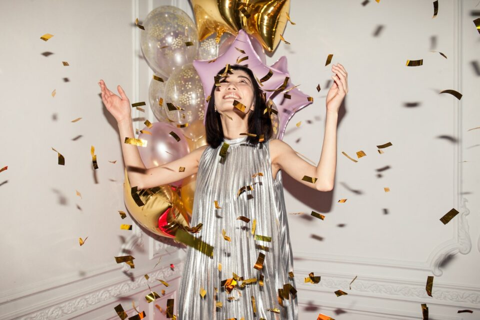

A golden birthday, often colloquially referred to as one’s “golden year,” is an intriguing and somewhat whimsical concept that centers around the alignment of an individual’s age with the numerical date of their birth.

This phenomenon, while not steeped in historical tradition or cultural significance, has gained prominence over the years, adding a layer of uniqueness and charm to the annual celebration of one’s birth. For example, if you were born on the 5th of a month, your golden birthday would be when you turn 5 years old.

## **Where did the idea of a Golden Birthday come from?**

The origins of the golden birthday concept remain somewhat elusive, as it lacks a definitive historical source. It appears to have emerged organically during the mid-20th century, a time marked by heightened interest in numerology and the symbolic implications of numbers in various cultures.

While the exact inception is uncertain, the notion of a golden birthday has since found resonance among individuals who value the alignment of age and birth date. It’s like a little birthday magic!

## **Why is it called Golden Birthday?**

The terminology “golden” within the context of a golden birthday draws upon the cherished connotations of the word. Much like the precious metal, the term signifies something highly esteemed, rare, and of significant value. Certainly, experiencing the age that matches your birthdate happens just once! While some call it Champagne or Lucky birthdays, many call it a Golden Birthday!

## **Does everyone get a Golden Birthday?**

The occurrence of a golden birthday is contingent upon the unique interplay between one’s birth date and age. Not every individual will experience a golden birthday, as it hinges on the specific day and month of birth aligning with the corresponding age. For instance, if an individual was born on the 10th day of a given month, their golden birthday would transpire when they reach the age of 10.

## **Is Golden Birthday lucky?**

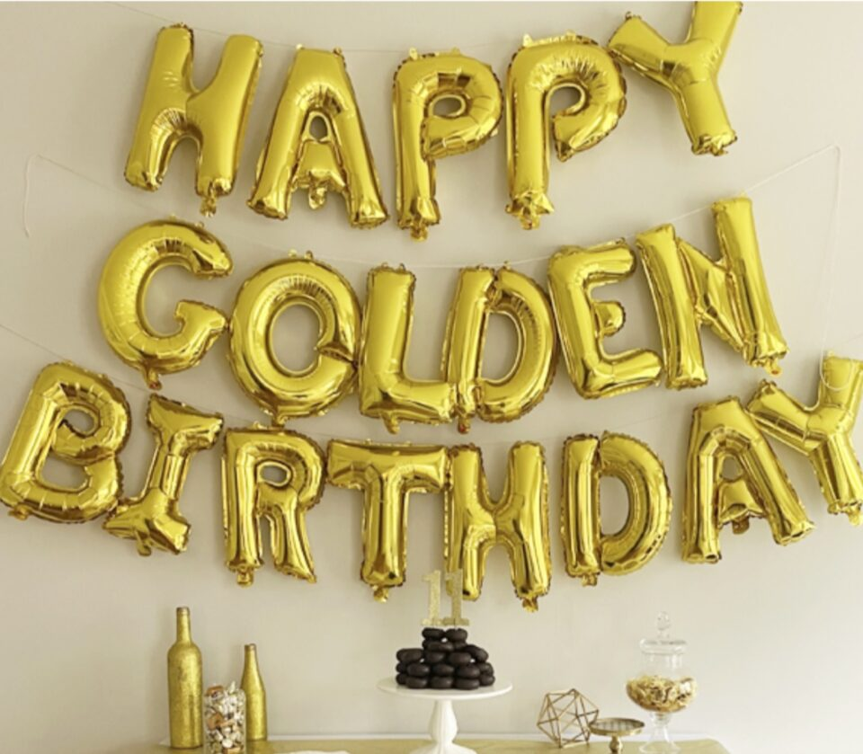

The idea of luck associated with a golden birthday depends on how you see it. For some, having your age match your birth date feels lucky and brings positive vibes to your special day. Others think it’s a chance to celebrate life’s coincidences and make cherished memories.

## **What if I missed my Golden Birthday?**

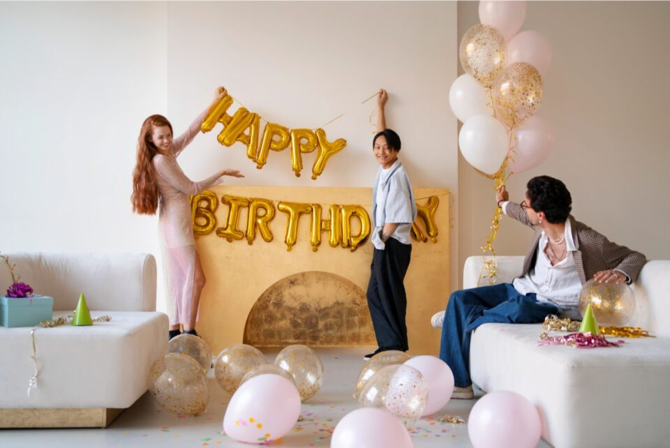

If your golden birthday occurred during your early years or slipped by unnoticed, there’s no need to worry! The concept of golden birthdays is more versatile than you might think, offering a range of celebratory possibilities that allow you to shine as bright as gold.

**Double Golden Birthday:** Also referred to as the “Golden Golden Birthday,” this variation adds an exciting twist to the tradition. It occurs when your age doubles the day you were born. It’s a fantastic opportunity to commemorate your special day memorably.

**Triple Golden Birthday:** Taking the celebration up a notch, the triple golden birthday is a truly extraordinary event. Imagine being three times your birth date age – for instance, if you were born on the 10th, your triple golden birthday would be at 30! It’s a chance to mark a significant milestone with flair.

For those whose birth date falls on the 1st of the month, where the conventional golden birthdays might be a distant memory, fear not! You can continue to multiply and anticipate a jubilant 50th birthday.

**Golden [50th Birthday](https://avada.io/loveable/50th-birthday-gift/):** The 50th birthday is often considered a golden landmark. It marks half a century and a stage of life characterized by wisdom and reflection. Embrace this occasion with a touch of gold to honor the journey’s significance thus far.

**Platinum Birthday:** While not a golden birthday, the concept of a platinum birthday adds a touch of uniqueness. It’s the age when the last two digits of your birth year match your age. For instance, if you were born in 1990, your platinum birthday would be when you turn 90. It’s an exceptional way to celebrate a numerical alignment that comes only once in a lifetime.

## **Some Ways To Celebrate Your Golden Birthday**

Celebrating a golden birthday is a once-in-a-lifetime opportunity to infuse your special day with extra sparkle and significance. As you reach the age that matches the day of your birth, it’s the perfect occasion to grasp the golden theme in various creative ways. From lavish extravagance to intimate gatherings, there are many ways to make your golden birthday truly memorable.

### **All that glitters and decorations are** “**Gold”**

To truly stand out on your special “gold” day, you can invite guests to join in the radiance by opting for neutrals like all-black outfits.

Consider selecting golden dishes and flatware if you prefer to let the decorations take center stage in adding sparkle. Infuse the tablescape with a touch of glitz using napkins and tablecloths adorned with gold dots or sparkles. If feasible, hang a shimmering disco ball from the ceiling to perfectly complement the theme.

For more gold decorations, distribute sparklers to your guests upon arrival (excluding children or people who can’t handle fireworks). When the time approaches to sing the birthday song, engage your guests in igniting the sparklers, illuminating the scene with a dazzling light display. To ensure safety, provide buckets filled with sand for guests to safely extinguish the sparklers once the celebratory moment has passed.

### **Pop some bubbles**

What better way to raise a glass to this unique milestone than by popping open a [bottle of champagne](https://avada.io/loveable/gifts-champagne-lovers/) or sparkling wine? As the effervescent bubbles dance in your glass, they mirror the effervescence of the occasion itself. The act of toasting becomes a symbol of embracing life’s joys and treasuring the experiences that have shaped you.

### **Night dance party**

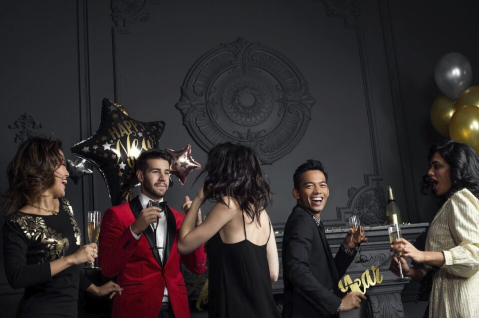

Dancing has the power to transcend time, and celebrating your golden birthday with a dance party amplifies the sense of joy and connection. The dance floor becomes a space where age is irrelevant, and the celebration takes center stage. The act of dancing becomes a reflection of the vibrant spirit that defines a golden birthday, reminding us that no matter the years that have passed, the heart remains forever young.

### **Celebrate pint-sized Golden Birthdays**

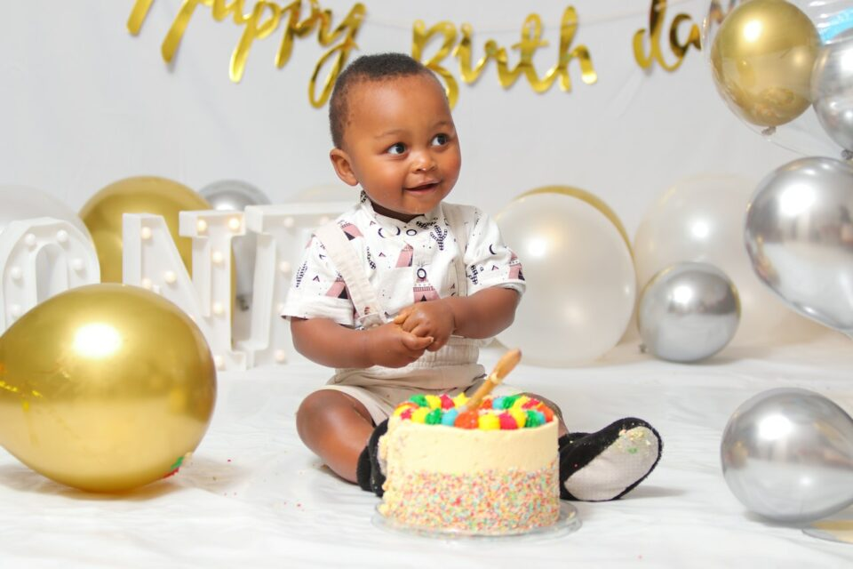

Golden birthdays hold a special allure, not only for adults but also for children. If your little one’s golden birthday is around the corner, there’s a treasure trove of exciting ways to mark the occasion.

Arranging a captivating golden birthday-themed treasure hunt, where the thrill of discovering hidden treasures adds an extra layer of excitement. Conceal gold foil-wrapped chocolate coins and candy-jewel rings pop throughout your home or yard, sending the young partygoers on a gleeful hunt for these delightful treasures.

So what’s a celebration without dancing? For those under 12, a dance-themed party promises endless fun. Organize a friendly dance-off, complete with dance routines and groovy moves, and crown the most impressive dancer with a coveted gold medal.

Regardless of age, serving slices of ice cream cake resonates with joy. Opt for a cake size that suits your gathering, whether a large crowd or an intimate group. Upgrade the cake’s festive allure by adorning it with gold decorations or a sprinkle of golden confetti, harmonizing with the golden birthday theme.

### **Cake for a golden birthday**

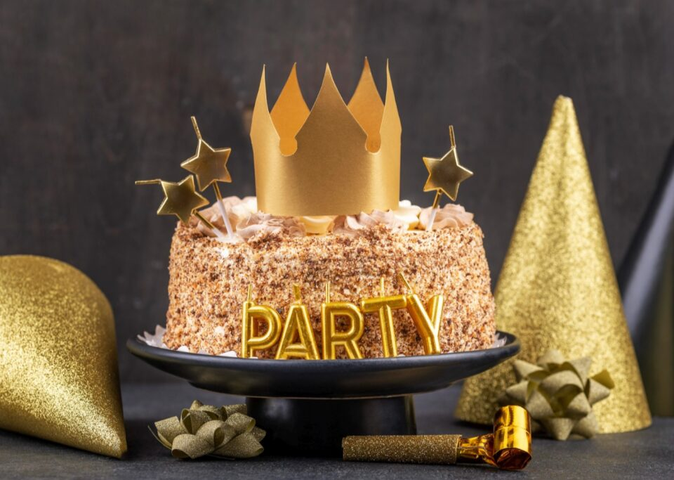

The notion of a golden birthday often evokes a sense of nostalgia and childlike wonder. Sharing a slice of ice cream cake with loved ones becomes a delightful experience that bridges the gap between the past and the present. It reminds us of the simple pleasures that make life beautiful.

### **Scavenger hunt game**

For those seeking an adventure-filled celebration, a golden-themed scavenger hunt adds an element of excitement and camaraderie. Imagine participants embarking on a treasure hunt that leads them through a series of clues and challenges.

This can be done in several different ways. You could have clever riddles that give them clues to each gift’s location or clues that lead from one clue to the next until they find all their presents at once. The journey becomes a metaphor for the celebrant’s path in life, filled with discoveries and milestones. The thrill of unraveling each clue and hidden treasures mirrors the journey of self-discovery.

### **Golden birthday wishes**

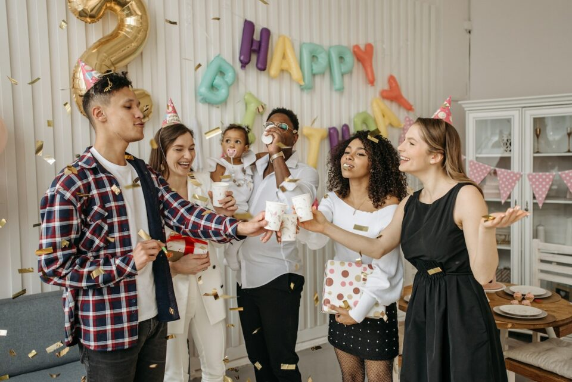

Creating a space for guests to share golden [birthday wishes](https://avada.io/loveable/blog/birthday-wishes-best-friend/) is a meaningful way to capture the essence of the celebration. A designated area is adorned with elegant stationery and pens, inviting guests to pen heartfelt messages. These wishes become a cherished collection that captures the sentiments of love, joy, and well-wishes from those who hold you dear.

## **Some Meaningful Golden Birthday Gifts**

It’s time to celebrate the milestone of a golden birthday with meaningful and heartfelt gifts that capture the essence of this special occasion. Get ready to commemorate the unique alignment of age and day with these [Golden Birthday gifts](https://avada.io/loveable/golden-birthday-gift-ideas/) that hold sentimental value below.

### **1\.** [**Birth Month Personalized Leather Journal**](https://loveable.us/products/birth-month-flowers-personalized-leather-journal-birthday-gift-307ihplnlj832)

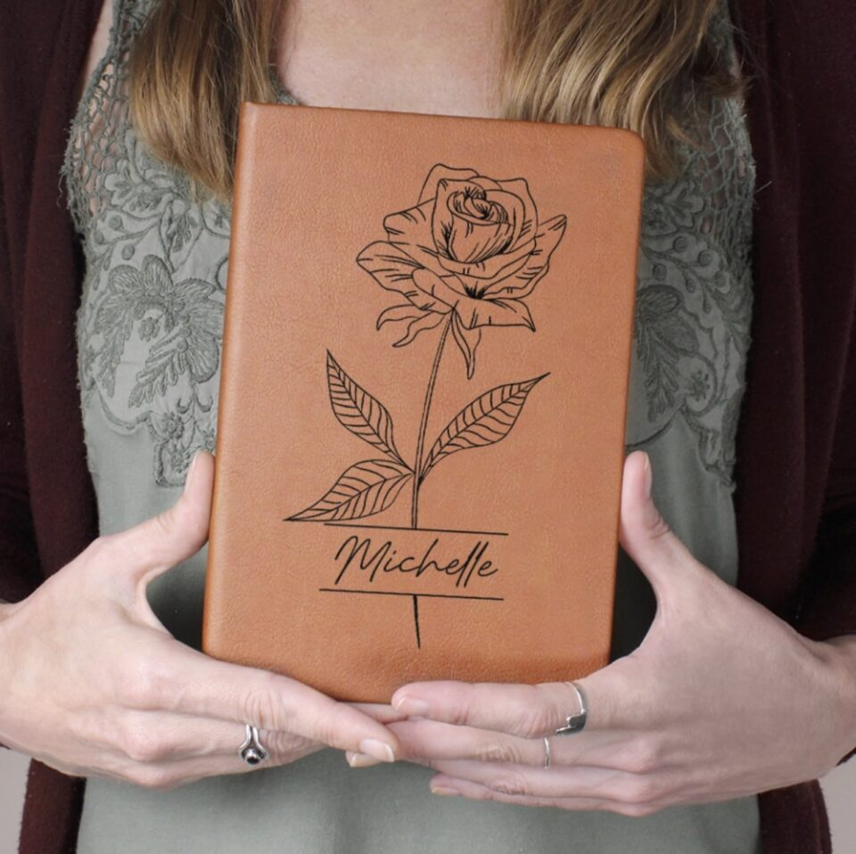

Capture your thoughts, dreams, and memories in a Birth Month Personalized Leather Journal. With your birth month flower elegantly embossed on the cover, this journal becomes a unique and meaningful companion for your thoughts and reflections.

### **2\.** [**Birthday Custom 12 Zodiac Signs LED Light**](https://loveable.us/products/12-zodiac-signs-the-astrological-signs-personalities-custom-zodiac-sign-and-name-best-birthday-gift-for-himher-for-friends-303ihpbnll278)

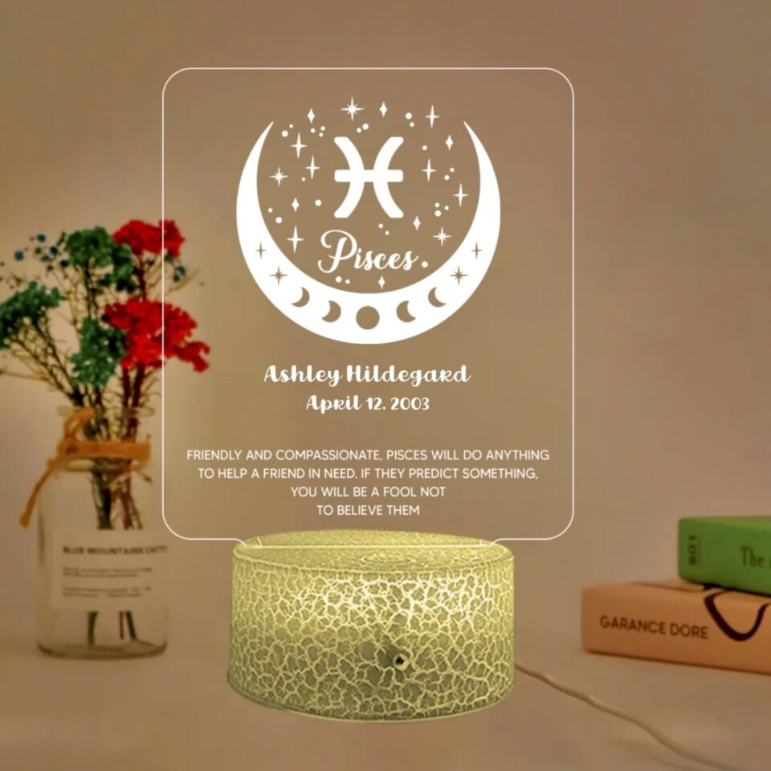

Illuminate your space with the Birthday Custom 12 Zodiac Signs LED Light. Choose your zodiac sign to be beautifully displayed on this LED light, adding a personalized touch to your decor while celebrating your Golden Birthday.

### **3\.** [**Custom Background And Name Tumbler**](https://loveable.us/collections/best-sellers/products/birthday-gifts-for-women-fabulous-skinny-tumbler-custom-background-and-name-best-birthday-gifts-301ihpbntu023)

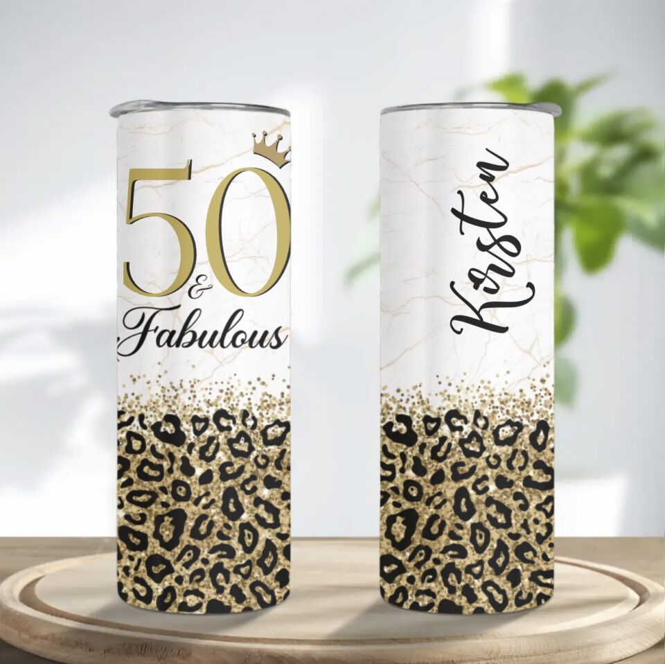

Stay hydrated in style with the Custom Background And Name Tumbler. Personalize it with your preferred background design and name, creating a one-of-a-kind tumbler that keeps your drinks at the perfect temperature.

### **4\.** [**Making The World Personalized Birthday Pillow**](https://loveable.us/collections/best-sellers/products/making-the-world-a-better-place-personalized-birthday-gifts-idea-for-her-207hnttpi330)

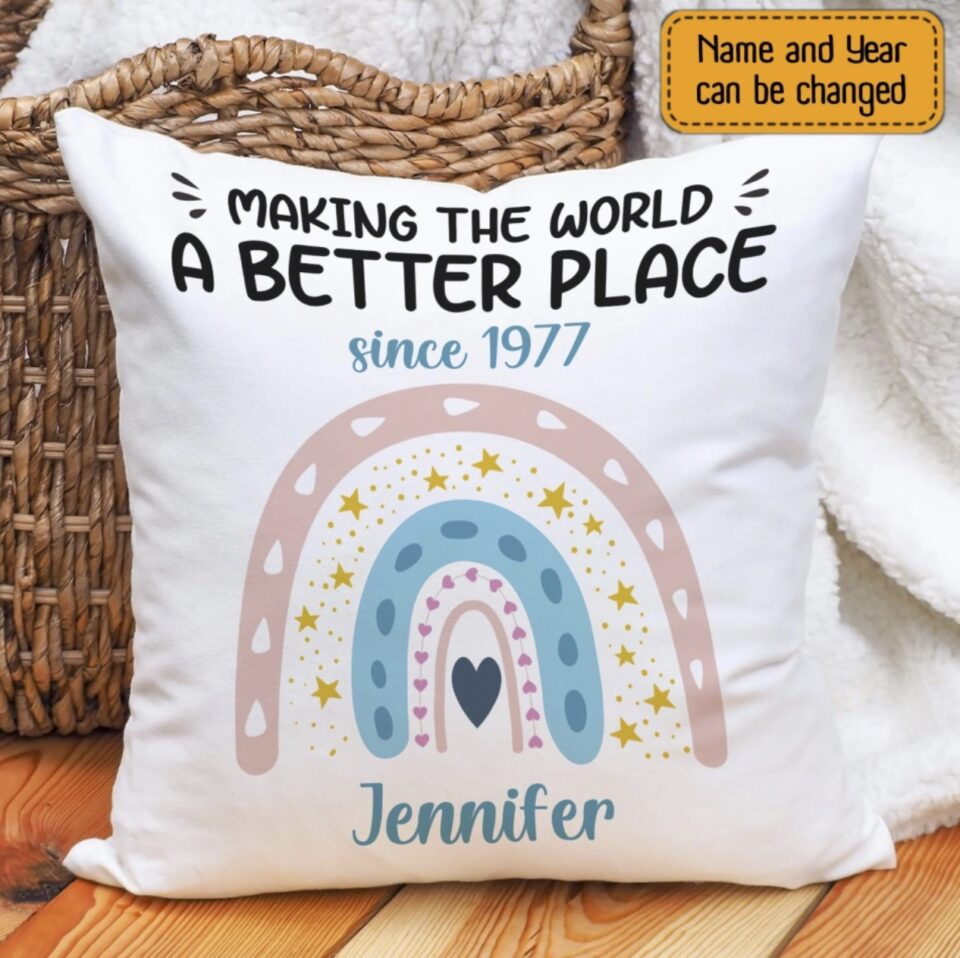

Have a cozy and personalized touch to your space with the Making The World Personalized Birthday Pillow. Featuring your name and birthdate, this pillow celebrates your special day while enhancing your decor with comfort and sentiment.

### **5\.** [**Custom Song Name Vinyl Wood Sign**](https://loveable.us/collections/best-sellers/products/custom-song-name-upload-photo-customizable-text-vinyl-record-round-wood-sign-wall-art-gifts-for-your-love-on-birthday-christmas-209ihpthrw288?variant=43936411910376)

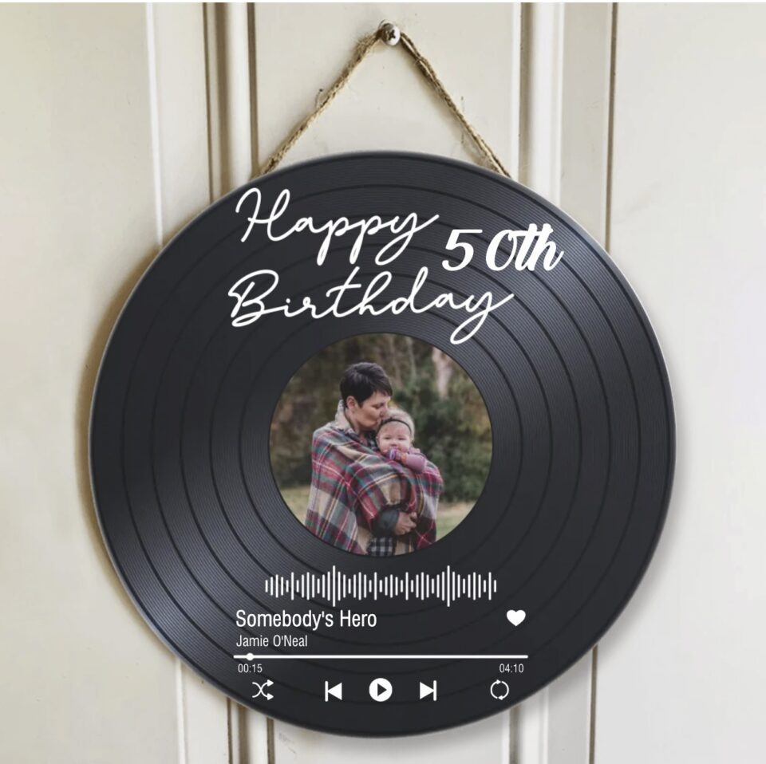

Display your favorite song with the Custom Song Name Vinyl Wood Sign. Personalize it with the name of the song that holds a special place in your heart, and hang it proudly as a decorative piece that brings joy and nostalgia to any room.

## **Bottom Line**

As the years roll by, we cherish the moments that stand out, the memories that sparkle, and the milestones that hold a unique place in our hearts. The golden birthday is one such extraordinary milestone, where age and date converge to create a once-in-a-lifetime celebration. Now the question “**What is a Golden Birthday?**” is answered. Whether you’re approaching your golden birthday or planning one for a loved one, remember that it’s a chance to infuse an extra dose of meaning and joy into the annual tradition of birthday festivities. 

- [What is a Golden Birthday?](https://avada.io/loveable/blog/what-is-golden-birthday/#wp-block-heading-2-3)
- [Where did the idea of a Golden Birthday come from?](https://avada.io/loveable/blog/what-is-golden-birthday/#wp-block-heading-2-7)
- [Why is it called Golden Birthday?](https://avada.io/loveable/blog/what-is-golden-birthday/#wp-block-heading-2-11)
- [Does everyone get a Golden Birthday?](https://avada.io/loveable/blog/what-is-golden-birthday/#wp-block-heading-2-14)
- [Is Golden Birthday lucky?](https://avada.io/loveable/blog/what-is-golden-birthday/#wp-block-heading-2-17)
- [What if I missed my Golden Birthday?](https://avada.io/loveable/blog/what-is-golden-birthday/#wp-block-heading-2-20)
- [Some Ways To Celebrate Your Golden Birthday](https://avada.io/loveable/blog/what-is-golden-birthday/#wp-block-heading-2-28)
    - [All that glitters and decorations are “Gold”](https://avada.io/loveable/blog/what-is-golden-birthday/#wp-block-heading-3-31)
    - [Pop some bubbles](https://avada.io/loveable/blog/what-is-golden-birthday/#wp-block-heading-3-36)
    - [Night dance party](https://avada.io/loveable/blog/what-is-golden-birthday/#wp-block-heading-3-39)
    - [Celebrate pint-sized Golden Birthdays](https://avada.io/loveable/blog/what-is-golden-birthday/#wp-block-heading-3-42)
    - [Cake for a golden birthday](https://avada.io/loveable/blog/what-is-golden-birthday/#wp-block-heading-3-48)
    - [Scavenger hunt game](https://avada.io/loveable/blog/what-is-golden-birthday/#wp-block-heading-3-51)
    - [Golden birthday wishes](https://avada.io/loveable/blog/what-is-golden-birthday/#wp-block-heading-3-55)
- [Some Meaningful Golden Birthday Gifts](https://avada.io/loveable/blog/what-is-golden-birthday/#wp-block-heading-2-58)
    - [1\. Birth Month Personalized Leather Journal](https://avada.io/loveable/blog/what-is-golden-birthday/#wp-block-heading-3-60)
    - [2\. Birthday Custom 12 Zodiac Signs LED Light](https://avada.io/loveable/blog/what-is-golden-birthday/#wp-block-heading-3-63)
    - [3\. Custom Background And Name Tumbler](https://avada.io/loveable/blog/what-is-golden-birthday/#wp-block-heading-3-66)
    - [4\. Making The World Personalized Birthday Pillow](https://avada.io/loveable/blog/what-is-golden-birthday/#wp-block-heading-3-69)
    - [5\. Custom Song Name Vinyl Wood Sign](https://avada.io/loveable/blog/what-is-golden-birthday/#wp-block-heading-3-72)
- [Bottom Line](https://avada.io/loveable/blog/what-is-golden-birthday/#wp-block-heading-2-75)

### [Rose Bryne](https://avada.io/loveable/author/rose/)

Hi, I'm Rose! I love animals and spending time with kids. At Loveable, I help people find unique gifts for special occasions like Valentine's Day, housewarmings, and graduations. I enjoy finding gifts for kids, teens, and animal lovers that match their interests and personalities. Making gift-giving a pleasant experience is my priority. Let me assist you in finding the perfect gift!

- [Twitter](https://twitter.com/intent/tweet)
- [Facebook](https://www.facebook.com/sharer/sharer.php)
- [instagram](https://avada.io/loveable/blog/what-is-golden-birthday/)
- [pinterest](https://www.pinterest.com/loveablellc/)

## Related Posts

[### 30 Best 4 Year Old Birthday Party Ideas For A Memorable Celebration](https://avada.io/loveable/blog/4-year-old-birthday-party-ideas/) 

[

### 16th Birthday Party Ideas to Make an Unforgettable Day

](https://avada.io/loveable/blog/16th-birthday-party-ideas/)

[

### 150+ Inspirational Birthday Quotes to Spread Joy on Special Day

](https://avada.io/loveable/blog/inspirational-birthday-quotes/)

[

### 160+ Birthday Wishes for Wife to Express Eternal Love

](https://avada.io/loveable/blog/birthday-wishes-for-wife/)

[### 90+ Heart Touching Birthday Wishes for Niece to Make Her Day Extra Special](https://avada.io/loveable/blog/birthday-wishes-for-niece/)
