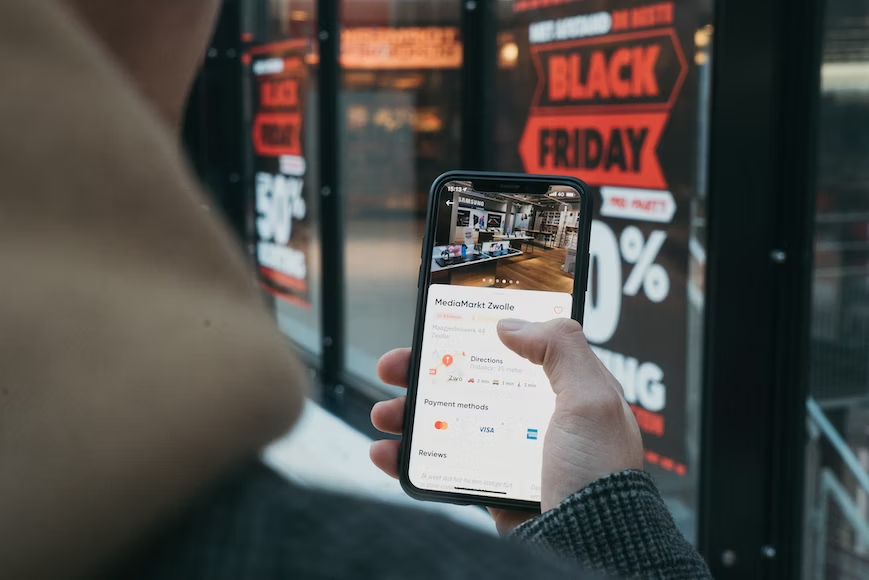

This article has been written and researched by our expert Loveable through a precise methodology. [Learn more about our methodology](https://avada.io/loveable/our-methodological.html)

[Loveable](https://avada.io/loveable/) > [Blog](https://avada.io/loveable/blog/) > [Holiday](https://avada.io/loveable/holiday/)

# What Is Black Friday? Everything You Need to Know

Written by [Blake Simpson](https://avada.io/loveable/author/blake/) Last Updated on September 07, 2023

- [What Is Black Friday?](https://avada.io/loveable/blog/what-is-black-friday/#wp-block-heading-2-3)
- [Why Is It Called Black Friday?](https://avada.io/loveable/blog/what-is-black-friday/#wp-block-heading-2-7)
- [The Origins And Evolution Of Black Friday](https://avada.io/loveable/blog/what-is-black-friday/#wp-block-heading-2-10)
    - [Early Beginnings](https://avada.io/loveable/blog/what-is-black-friday/#wp-block-heading-3-12)
    - [Growing Outside of Philadelphia](https://avada.io/loveable/blog/what-is-black-friday/#wp-block-heading-3-14)
    - [The Rise of Online Shopping in the Digital Age](https://avada.io/loveable/blog/what-is-black-friday/#wp-block-heading-3-16)
- [How Black Friday’s Impact On Businesses](https://avada.io/loveable/blog/what-is-black-friday/#wp-block-heading-2-19)
    - [Increasing Sales and Foot Traffic at Physical Stores](https://avada.io/loveable/blog/what-is-black-friday/#wp-block-heading-3-22)
    - [Challenges In Operations and Customer Experience](https://avada.io/loveable/blog/what-is-black-friday/#wp-block-heading-3-24)
    - [Online Retailers Benefit From The Digital Frontier](https://avada.io/loveable/blog/what-is-black-friday/#wp-block-heading-3-26)
    - [Competitive And Marketing Strategies](https://avada.io/loveable/blog/what-is-black-friday/#wp-block-heading-3-29)
    - [Growing More Than Just a Single Day](https://avada.io/loveable/blog/what-is-black-friday/#wp-block-heading-3-31)
- [Are The Discounts On Black Friday Genuine?](https://avada.io/loveable/blog/what-is-black-friday/#wp-block-heading-2-34)
- [How Can I Make The Most Of Black Friday Shopping?](https://avada.io/loveable/blog/what-is-black-friday/#wp-block-heading-2-37)
    - [Make A Shopping List](https://avada.io/loveable/blog/what-is-black-friday/#wp-block-heading-3-39)
    - [Do Price Comparison Research](https://avada.io/loveable/blog/what-is-black-friday/#wp-block-heading-3-42)
    - [Establish A Budget](https://avada.io/loveable/blog/what-is-black-friday/#wp-block-heading-3-44)
    - [Register For Retailer Alerts](https://avada.io/loveable/blog/what-is-black-friday/#wp-block-heading-3-46)
    - [Prioritise High-Value Purchases](https://avada.io/loveable/blog/what-is-black-friday/#wp-block-heading-3-48)
- [Black Friday FAQ in 2023](https://avada.io/loveable/blog/what-is-black-friday/#wp-block-heading-2-50)
- [Bottom line](https://avada.io/loveable/blog/what-is-black-friday/#wp-block-heading-2-67)

Black Friday, a day associated with maddening crowds and amazing discounts, has spread beyond its American roots to become a phenomenon in the world of retail. This yearly occasion, which falls the day following Thanksgiving, ushers in the holiday shopping season and generates enthusiasm among customers and businesses. In this in-depth post, we’ll explain **What is Black Friday** while also arming you with sage advice to make your shopping experiences profitable and pleasurable.

## What Is Black Friday?

Every year on the day after Thanksgiving, Black Friday is a spectacular shopping spree. The significant discounts and exclusive offers from merchants across a wide range of product categories make this day exceptional. 

The idea of Black Friday originated in the United States. Still, it has since spread across national borders, with several nations adopting the custom to appeal to the desires and purses of eager buyers. It’s a day when shoppers may get fantastic discounts on anything from household necessities to apparel and technology.

## Why Is It Called Black Friday?

In the thriving 1960s metropolis of Philadelphia, the phrase “Black Friday” first appeared. This term was first used by local law enforcement to describe the catastrophic traffic jams and pedestrian congestion that resulted on the day after Thanksgiving, but it eventually acquired a new meaning. 

Retailers used the phrase “Black Friday” since their financial ledgers changed from red (which means losses) to black (which means profits) when they saw extraordinary earnings on this day. This phrase is now associated with the beginning of the holiday shopping season and huge deals.

## The Origins And Evolution Of Black Friday

### Early Beginnings

Early in the 20th century, in particular, in the thriving American metropolis of Philadelphia, Black Friday first appeared. Thanksgiving Day parades started to become a tradition around this time and attracted many people, capturing the interest of the locals. Retailers made use of the increased foot traffic by giving special deals and discounts to enhance their sales. The day following Thanksgiving soon established a reputation as a popular shopping day.

### Growing Outside of Philadelphia

As time passed, the idea of Black Friday grew outside the city limits of Philadelphia. Retailers all around the country began to embrace the technique after seeing the potential of the post-Thanksgiving shopping boom. The day became a national event due to the increased competition among retailers to draw customers in with alluring discounts.

### The Rise of Online Shopping in the Digital Age

joined in during the late 20th and early 21st centuries, tapping into the rise of digital shopping. This expansion broadened Black Friday’s reach, letting global customers access deals from anywhere.

The focus on one-day discounts has evolved into a lengthier shopping event. Retailers now stretch Black Friday sales into the weekend, termed “Black Friday Weekend.” This shift grants shoppers more flexibility and reduces challenges from a single day of intense buying.

## How Black Friday’s Impact On Businesses

Black Friday has changed from a simple post-Thanksgiving custom to a force that greatly influences businesses in many different industries. The ramifications of this purchasing phenomenon reverberate across the whole corporate environment, changing strategy and operations for both physical stores and online merchants.

### Increasing Sales and Foot Traffic at Physical Stores

Customers are drawn out of their homes and into brick-and-mortar establishments by the promise of exclusive offers and big discounts. As a result? comparable to any other day of the year, a spike in foot traffic. With more clients, businesses will experience more sales, which will help them meet their revenue goals and perhaps make up for any lulls in the past.

### Challenges In Operations and Customer Experience

For physical stores, the increase in customers also creates operational difficulties. When lots of people suddenly want to buy things, stores need to get ready. They must have enough stuff to sell, people to help, and things like cash registers. If they don’t plan well, customers will be unhappy, and the store’s reputation could be hurt. So, making sure everything goes smoothly and customers are happy becomes really important.

### Online Retailers Benefit From The Digital Frontier

Online merchants have welcomed the trend, banking on e-commerce’s ease to draw in a new type of customer. These companies may provide a wide variety of items because of the lack of physical area restrictions, guaranteeing that customers can discover something that suits their interests. Customers may easily research several offers and compare costs thanks to the convenience of internet purchasing.

### Competitive And Marketing Strategies

Black Friday forces companies to use innovative marketing techniques in order to stand out in a competitive market. Companies begin generating interest in the event weeks in advance by teasing and previewing the upcoming discounts. Pre-event advertising not only builds anticipation for the event but also helps customers remember brands, which positions firms positively in their eyes.

### Growing More Than Just a Single Day

Black Friday’s impact has grown to include more than just one day. Businesses frequently prolong the schedule for promotions during this event in an effort to maximize its impact, turning Black Friday into a weekend-long frenzy. Because of the longer time frame, shoppers may shop in a more staggered fashion, which helps shops control crowds and keep customer satisfaction levels high.

In short, Black Friday is like a two-sided tool for companies. It can bring in a lot of money and make more people know about the brand. But, it also needs careful planning, good management, and the ability to quickly adapt to how shoppers act. Businesses must be adaptable as Black Friday develops and broadens its reach, seizing the chances it offers while overcoming the difficulties it poses.

## Are The Discounts On Black Friday Genuine?

The integrity of these offers has been questioned, although the attraction of steep discounts is a major pull for Black Friday consumers. Some people believe that certain stores purposely increase prices before Black Friday. So they can then lower them during the sale, making it seem like there are big discounts. Wise consumers should do their homework on items in advance, compare pricing, and be wary of too-good-to-be-true deals to get the most out of Black Friday.

## How Can I Make The Most Of Black Friday Shopping?

### Make A Shopping List

Begin by writing a thorough shopping list. Decide which goods you actually require or have been coveting for some time. You’ll be able to stay on task and avoid making rash purchases if you do this.

**_Check Out:_** Best [Black Friday Christmas Gifts For Mom](https://avada.io/loveable/black-friday-christmas-gifts-mom/)

### Do Price Comparison Research

Before Black Friday, do price comparison research on the items on your shopping list. To get real discounts and avoid being duped by fake ones, compare these prices with other merchants

### Establish A Budget

Select a spending limit for your Black Friday purchases and adhere to it. Having a set spending limit can assist you to avoid making poor choices because the thrill of the discounts might tempt you to overpay.

### Register For Retailer Alerts

Sign up for newsletters and alerts from your preferred merchants. You get a head start on the finest prices thanks to the several stores that provide members with unique offers and early access.

### Prioritise High-Value Purchases

Concentrate on making high-value purchases that result in large savings. Although minor reductions may be alluring, give priority to purchases that will have a significant influence on your budget.

## Black Friday FAQ in 2023

1. **How many Black Friday in 2023?**

There is one Black Friday in 2023. It falls on November 24th.

2. **Is there a Black Friday in April 2023?**

No, Black Friday always falls on the day following Thanksgiving in November. Black Friday is not observed in April.

3. **When Black Friday deals will start?**

Traditionally, Black Friday sales begin on the Friday after Thanksgiving, which falls on November 24 in 2023. In contrast, some merchants could provide early-bird or pre-Black Friday discounts in the days preceding the occasion.

4. **How long will Black Friday deals last?**

Deals from Black Friday frequently last all weekend, including Cyber Monday (November 27 in 2023). Some stores could even extend their sales into the whole week that follows Black Friday.

5. **Does Black Friday discount everything?**

Discounts are available on a variety of things during Black Friday, including electronics, apparel, household goods, and more. However, not every item will always be discounted. In order to draw customers, retailers frequently concentrate on well-liked goods and categories.

6. **Is Black Friday online only?**

No, Black Friday began as an in-person shopping occasion but has now expanded to provide in-person and online offers. Several businesses provide a mix of in-store and online promotions to accommodate different tastes.

**_See More:_**

- [Why Black Friday is Bad?](https://avada.io/loveable/blog/why-black-friday-bad/) 15 Reasons Behind You Must Know 

- [Is Cyber Monday Better Than Black Friday?](https://avada.io/loveable/blog/cyber-monday-vs-black-friday/) – Unmasking the Hidden Factors

## **Bottom line**

If you’ve ever wondered **What is Black Friday**, you’re in for a treat! Our post spills the beans on all things Black Friday. Starting from its humble origins, Black Friday has transformed into a global shopping extravaganza that impacts both customers and companies. Digging into its importance, effects, and historical journey can unlock valuable insights into how the retail world and consumer behaviour intertwine. Discover the secrets behind the allure of Black Friday and how it shapes our shopping habits

- [What Is Black Friday?](https://avada.io/loveable/blog/what-is-black-friday/#wp-block-heading-2-3)
- [Why Is It Called Black Friday?](https://avada.io/loveable/blog/what-is-black-friday/#wp-block-heading-2-7)
- [The Origins And Evolution Of Black Friday](https://avada.io/loveable/blog/what-is-black-friday/#wp-block-heading-2-10)
    - [Early Beginnings](https://avada.io/loveable/blog/what-is-black-friday/#wp-block-heading-3-12)
    - [Growing Outside of Philadelphia](https://avada.io/loveable/blog/what-is-black-friday/#wp-block-heading-3-14)
    - [The Rise of Online Shopping in the Digital Age](https://avada.io/loveable/blog/what-is-black-friday/#wp-block-heading-3-16)
- [How Black Friday’s Impact On Businesses](https://avada.io/loveable/blog/what-is-black-friday/#wp-block-heading-2-19)
    - [Increasing Sales and Foot Traffic at Physical Stores](https://avada.io/loveable/blog/what-is-black-friday/#wp-block-heading-3-22)
    - [Challenges In Operations and Customer Experience](https://avada.io/loveable/blog/what-is-black-friday/#wp-block-heading-3-24)
    - [Online Retailers Benefit From The Digital Frontier](https://avada.io/loveable/blog/what-is-black-friday/#wp-block-heading-3-26)
    - [Competitive And Marketing Strategies](https://avada.io/loveable/blog/what-is-black-friday/#wp-block-heading-3-29)
    - [Growing More Than Just a Single Day](https://avada.io/loveable/blog/what-is-black-friday/#wp-block-heading-3-31)
- [Are The Discounts On Black Friday Genuine?](https://avada.io/loveable/blog/what-is-black-friday/#wp-block-heading-2-34)
- [How Can I Make The Most Of Black Friday Shopping?](https://avada.io/loveable/blog/what-is-black-friday/#wp-block-heading-2-37)
    - [Make A Shopping List](https://avada.io/loveable/blog/what-is-black-friday/#wp-block-heading-3-39)
    - [Do Price Comparison Research](https://avada.io/loveable/blog/what-is-black-friday/#wp-block-heading-3-42)
    - [Establish A Budget](https://avada.io/loveable/blog/what-is-black-friday/#wp-block-heading-3-44)
    - [Register For Retailer Alerts](https://avada.io/loveable/blog/what-is-black-friday/#wp-block-heading-3-46)
    - [Prioritise High-Value Purchases](https://avada.io/loveable/blog/what-is-black-friday/#wp-block-heading-3-48)
- [Black Friday FAQ in 2023](https://avada.io/loveable/blog/what-is-black-friday/#wp-block-heading-2-50)
- [Bottom line](https://avada.io/loveable/blog/what-is-black-friday/#wp-block-heading-2-67)

### [Blake Simpson](https://avada.io/loveable/author/blake/)

Hi, I'm Blake from Loveable. I help people find perfect gifts for occasions like anniversaries and weddings. I also write a blog about holidays, sharing insights to make them more meaningful. Let's create unforgettable moments together!

- [Twitter](https://twitter.com/intent/tweet)
- [Facebook](https://www.facebook.com/sharer/sharer.php)
- [instagram](https://avada.io/loveable/blog/what-is-black-friday/)
- [pinterest](https://www.pinterest.com/loveablellc/)

## Related Posts

[### 120+ Christian Birthday Wishes To Spread Your Love](https://avada.io/loveable/blog/christian-birthday-wishes/) 

[

### 35 Best 70th Birthday Ideas To Celebrate The Special Milestone

](https://avada.io/loveable/blog/70th-birthday-ideas/)

[

### 50 Best 30th Birthday Decorations for a Remarkable Birthday Bash

](https://avada.io/loveable/blog/30th-birthday-decorations/)

[

### 40 Delicious Vegan Christmas Desserts to Delight Your Palate

](https://avada.io/loveable/blog/vegan-christmas-desserts/)

[

### 60 Christmas Team Building Activities to Boost Workplace Spirit

](https://avada.io/loveable/blog/christmas-team-building-activities/)
