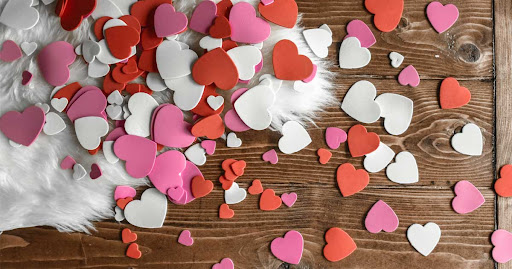

This article has been written and researched by our expert Loveable through a precise methodology. [Learn more about our methodology](https://avada.io/loveable/our-methodological.html)

[Loveable](https://avada.io/loveable/) > [Blog](https://avada.io/loveable/blog/) > [Holiday](https://avada.io/loveable/holiday/)

# What Is Valentine’s Day – Time for Love

Written by [Blake Simpson](https://avada.io/loveable/author/blake/) Last Updated on August 17, 2023

- [What Is Valentine’s Day?](https://avada.io/loveable/blog/what-is-valentines-day/#wp-block-heading-2-3)
- [The History of Valentine’s Day](https://avada.io/loveable/blog/what-is-valentines-day/#wp-block-heading-2-6)
    - [1\. The original Valentine’s day](https://avada.io/loveable/blog/what-is-valentines-day/#wp-block-heading-3-8)
    - [2\. Valentine’s day development](https://avada.io/loveable/blog/what-is-valentines-day/#wp-block-heading-3-14)
    - [3\. Valentine’s day meaning](https://avada.io/loveable/blog/what-is-valentines-day/#wp-block-heading-3-19)
- [Valentine’s Day Classification](https://avada.io/loveable/blog/what-is-valentines-day/#wp-block-heading-2-23)
    - [1\. Red Valentine](https://avada.io/loveable/blog/what-is-valentines-day/#wp-block-heading-3-26)
    - [2\. White Valentine](https://avada.io/loveable/blog/what-is-valentines-day/#wp-block-heading-3-28)
    - [3\. Black Valentine](https://avada.io/loveable/blog/what-is-valentines-day/#wp-block-heading-3-31)
- [Why Do People Give Gifts on Valentine’s Day?](https://avada.io/loveable/blog/what-is-valentines-day/#wp-block-heading-2-34)
    - [1\. Improve Relationships and Connections](https://avada.io/loveable/blog/what-is-valentines-day/#wp-block-heading-3-37)
    - [2\. Distribute Special Messages](https://avada.io/loveable/blog/what-is-valentines-day/#wp-block-heading-3-40)
    - [3\. Enhance Romantic Feelings](https://avada.io/loveable/blog/what-is-valentines-day/#wp-block-heading-3-43)
- [Ideas for Romantic Valentine’s Day Gifts](https://avada.io/loveable/blog/what-is-valentines-day/#wp-block-heading-2-47)
    - [Song 3D LED Night Lamp for Music Lovers](https://avada.io/loveable/blog/what-is-valentines-day/#wp-block-heading-3-49)
    - [Gnome Couple with Heart Valentine Style](https://avada.io/loveable/blog/what-is-valentines-day/#wp-block-heading-3-52)
    - [Personalized Steel Keychain](https://avada.io/loveable/blog/what-is-valentines-day/#wp-block-heading-3-55)
    - [Custom Name Necklace](https://avada.io/loveable/blog/what-is-valentines-day/#wp-block-heading-3-58)
    - [Song Wooden Plaque for Music Lovers](https://avada.io/loveable/blog/what-is-valentines-day/#wp-block-heading-3-61)
    - [Chocolates](https://avada.io/loveable/blog/what-is-valentines-day/#wp-block-heading-3-64)
    - [Flowers](https://avada.io/loveable/blog/what-is-valentines-day/#wp-block-heading-3-68)
- [The Bottom Line](https://avada.io/loveable/blog/what-is-valentines-day/#wp-block-heading-2-71)

Valentine’s Day is a day set aside to honor love and devotion – a day when many individuals show their love toward one another. It’s often known that people prepare appointments and secret gifts to [surprise their lovers](https://avada.io/loveable/valentines-day-gifts/). Many couples are expecting this special occasion to enjoy their beloved’s company and surprise presents. But, as history changes, Valentine is no longer just for couples.

Valentine’s has been existing for a long time, and it is witnessed many changes from culture to awareness. But, do you truly understand its meaning and history? **What is Valentine’s Day?** What should we choose as a perfect gift for the lover? In this article, we will answer them and give useful tips to help you win your mate’s heart.

## **What Is Valentine’s Day?**

We have to answer this basic question first to have a general insight, so “What is Valentine’s day?”. Valentine’s Day (English name is Valentine’s Day, Saint Valentine’s Day), known as Valentine’s Day is named after Saint Valentine – one of the first Christian martyrs. 

It is often celebrated on the 14th of Feb. Almost every country has adopted the custom of this love festival. Valentine’s Day is a wonderful day for us to express our love and appreciation for those we care about.

## **The History of Valentine’s Day**

There are several legends about Valentine’s day, which evolved into the mythology we know today. Let’s find out a little bit of information and its formation.

### **1\. The original Valentine’s day**

Valentine’s Day is named after Saint Valentine. Whereas the tale of Valentine’s Day remains a mystery, the most well-known version originates from Rome. Many legends about St Valentine evolved into the mythology we know today.

In the third century, there was a priest named Valentinus who resided in Rome. During this time, Emperor Claudius II (a pagan Catholic) enacted laws prohibiting marriage. He contended that Christians should concentrate on paying homage to Rome. Many brutal battles and unpopular backing forced the Roman Empire to join. Due to the difficulty in recruiting young men for the army at the time, Emperor Claudius II said that Roman men were reluctant to leave their families or lovers, and that marriage simply weakened men.

Many objected to the King’s decision once more, particularly Valentine priests at Rome and St. Marius. Despite this ridiculous rule, the priest surreptitiously performed a marriage for two lovers. Regrettably, he was apprehended and executed. On February 14, 273, Father Valentine was imprisoned and sentenced to death by pulling and stoned. Every year, February 14 has been becoming the day for couples to send love messages. Therefore, St. Valentine is now the patron saint of couples.

According to another narrative, this guy was a bishop of Terni who was murdered for attempting to rescue Christians imprisoned. It claims that before his death, he left a note signed “From your Valentine” to his girlfriend. 

### **2\. Valentine’s day development**

The 14th of February was not declared St Valentine’s Day until more than 200 years later. By this time, Rome had converted to Christianity, and the Catholic Church was on a mission to eradicate all lingering paganism.

Valentine’s Day was once only an event in North America and Europe. However, it later became famous in most places throughout the world.

The event was not connected with romantic themes until the 1500s. Chaucer used the term “lover” to designate the romantic figure in poetry and song. Courtly love has been starting from this time to express sincerity.

The first commercial cards were created in the late 1700s. From here, this anniversary of love is progressively expanding its influence globally.

### **3\. Valentine’s day meaning**

Valentine’s Day has evolved much beyond the significance of a religious rite throughout the years. The event has various variants and forms in different countries based on cultural variety.

The couple’s romance is the most typical type. Valentine’s Day is an occasion for the entire globe to recognize couples’ love, affection amongst couples, and friendships. People show their love for one another on Valentine’s Day by sending heartfelt greetings or significant presents such as letters, bouquets, mostly popular chocolates, and other special items.

Furthermore, other nations express thanks for all the tight partnerships. You can [express your feelings to friends](https://avada.io/loveable/valentines-day-gift-ideas-friends/), coworkers, or family members. Generally, it is a special day of love. 

## **Valentine’s Day Classification**

Traditionally, Valentine only has 1 single day on February 14th every year. But there are probably more times than you don’t know. Besides the main time, many variant types of Valentine’s Day have been celebrated to give more extra time for couples’ love expression. Therefore, in addition to February 14 every year, people have organized two more Valentine’s Days on March 14 and April 14. However, how would we distinguish between them? 

### **1\. Red Valentine**

As we all know, the most popular Valentine’s day we recognize is also known as Red Valentine. Celebrate on the Feb of 14th annually, This is a chance for people to demonstrate for the other half by giving presents and making nice wishes. Especially, Red Valentine is believed to [express love for boys from girls](https://avada.io/loveable/valentine-gift-boyfriend/). Therefore, the lovers who need to prepare gifts on that day are often girls. 

### **2\. White Valentine**

In actuality, [White Valentine](https://en.wikipedia.org/wiki/White_Day#:~:text=White%20Day%20is%20celebrated%20annually,Asian%20nations%20and%20countries%20worldwide.) is celebrated on March 14th annually, one month following Red Valentine’s Day. White Valentine is a tradition that originated in Japan. According to legend, on Red Valentine’s Day in 1965, a lad selling marshmallows offered his lover a giant, pristine white [candy box](https://avada.io/loveable/valentines-day-candy-ideas/) in exchange for her love.

It was quickly embraced by young people to expect for that day. Different from Red Valentines – The day boys receive love messages from girls. Our girls also hope to get responses from their boys, so this day was born. The males will reciprocate the sincerity of the female with meaningful gifts or heartfelt words. Therefore, it is largely expected by the girls falling in love to look for a special surprise.

### **3\. Black Valentine**

This occasion is maybe quite strange because of rarely mentioned, so what is Valentine’s day in black? Black is a pretty dark color that often represents bad luck and failure. Is it right? The answer is no.

Black Valentine originated in Korea on April 14. Black Valentine, as opposed to Red and White Valentine, is a day dedicated to members of the Single Society (FA). During this time, lonely young people in the Korean homeland will invite one another to eat black noodles to enjoy each other’s company. Therefore, even if you are single, it will be a day to celebrate. 

## **Why Do People Give Gifts on Valentine’s Day?**

Who is not happy when getting presents? No one for sure. Giving has been an important part of special occasions, including Valentine’s Day. How do you feel when your lover gives you a secret gift? Your answer is also the feeling of the one who receives a surprise from you. 

### **1\. Improve Relationships and Connections**

It’s certain that a gift cannot fully represent the love of someone and is used to judge the receiver. However, it is necessary to support givers in talking about their sincerity nonverbally. We just take advantage of a normal day and make it special by creating a compelling reason. 

Choosing a [romantic gift](https://avada.io/loveable/romantic-valentines-day-gifts/) can be the best method to thrill your partner. He/she would probably think of having a perfect companion. “Give love to receive love back”, so the two of your relationship are being consolidated. 

### **2\. Distribute Special Messages**

As mentioned above, a gift cannot show full sincerity, but it’s a good way to express love instead of only talking like “I love you”. You love your partner, sure, but you should act more. A surprise box, for example, is fantastic to be attached with love notes or words to convey confession. 

Remember that you are the best gift from God to your partner. Therefore, the value of presents doesn’t come from themself, it’s just a way to express love. The most important thing is your deep heart to convince others. 

### **3\. Enhance Romantic Feelings**

A present shouldn’t lack on an important date. It’s optional, but it’s really disappointing if you don’t have it. A date in a luxurious restaurant, but you and your partner find it hard to start a conversation because of shyness. A beautiful bouquet will eliminate the awkward atmosphere and bring a romantic feeling for both. 

It’s also useful in case you cannot make an appointment with that person. A gift is to replace an apology for the absence and remind the partner of your love.

On the other hand, it shows good preparation and how you respect this love. Who are not happy about this romance? 

## **Ideas for Romantic Valentine’s Day Gifts**

What is Valentine’s Day gift to express love effectively? I know that it’s always hard to choose the best one for lovers. You may think about whether they will satisfy with it or judge your choice. Whatever gift you choose will be a symbol that does contain not only your love messages but also the gift’s meaning. Therefore, be selective in picking up the best one. There are some recommendations to refer for best on this next Valentine.

### [**Song 3D LED Night Lamp for Music Lovers**](https://loveable.ai/products/custom-photo-song-3d-led-night-lamp-for-music-lovers-valentine-gift-anniversary-gifts-for-her-him-210ihplnll474?variant=44037848826088)

Giving this best gift love symbol will be the best keepsake for your lover this Valentine, it’s an amazing product to remind your partner of beautiful moments. Do you and the receiver have the same favorite or memorable song? Paste it into this item along with the best photo of the two to decorate somewhere in the private space. Romantic feelings come from its colorful light help to relax after a long-time working day.

### [**Gnome Couple with Heart Valentine Style**](https://loveable.ai/products/gnome-couple-with-heart-valentine-style-square-pillow-personalized-his-name-her-name-custom-nicknames-valentine-gift-for-girlfriend-boyfriend-husband-wife-anniversary-gifts-301icnnppi040?variant=44230596755688)

The lovely design of Gnome couples in this square pillow is the best way to describe your heartwarming message. We all know that the heart shape is a love symbol and how fantastic it is when adding you and his/her name to it. Besides using to bring good experiences for sleep quality, it also leaves romantic dreams for users. Unique, cozy and multi-functional are some characteristics of this product. 

### [**Personalized Steel Keychain**](https://loveable.ai/products/my-soulmate-my-everything-custom-name-and-photo-personalized-steel-keychain-best-gifts-for-couple-208ihpthkc070-1?variant=43855041790184)

Are your lovers absent-minded people? There is an ideal Valentine’s gift for them to remind important things like keys or small objects in general. This keychain will remind the owners to take care of their items. It’s special because you can leave personalized messages and the receiver’s name on a small wooden board. The other side is printed with a private photo to remind him/her of an unforgettable Anniversary. 

### [**Custom Name Necklace**](https://loveable.ai/products/you-won-my-heart-funny-valentines-day-gift-for-her-custom-name-necklace-valentines-day-gifts-for-girlfriend-212ihpvsje683?variant=44193521729768)

If you are looking for a perfect gift for her this Valentine, this romantic necklace should be considered to add to your list. Love red messages are printed inside the gift box to show how you respect her. Every girl loves gorgeous jewelry because it enhances their elegant and luxurious look. An exquisite gift choice to keep this always by her side as a mark of your sovereignty in her.

### [**Song Wooden Plaque for Music Lovers**](https://loveable.ai/products/custom-photo-song-wooden-plaque-for-music-lovers-valentine-gift-anniversary-gifts-for-her-him-212ihnlnwp881?variant=44146405212392)

Basic and unique, an environmentally-friendly product is put in your partner’s private room as decoration. Handmade gifts never go out trending, it’s also the best souvenir representing rustic love. It is amazing to give this product and tell your lover that “I make it special for you”. Whenever looking at this wooden plaque, your lover will immediately think about you. 

### **Chocolates**

It is certainly the most common and popular gift on Valentine. It has become an indispensable symbol of Valentine for a long time. Despite the debate concerning the significance of this gift, offering chocolates is firmly founded in tradition. Bakers frequently create rose-shaped chocolates that are placed in heart-shaped boxes.

**_Related_**: [35 Best Valentine’s Day Chocolate Bouquet For Your Lover](https://avada.io/loveable/valentine's-day-chocolate-bouquet/)

### **Flowers**

Not only on Valentine, but flowers are also forever gifts for any special occasion to express love. The number of flowers in the market suddenly increases on that days to serve large demand. Especially for roses, the red flower is believed to strengthen the relationship of couples. The types of flowers will change for your purpose that whom you tend to send them. Friends, family members, or relatives have other unique colors to select from.

## **The Bottom Line**

If you still don’t know anything about Valentine’s meaning before the holiday that we regularly celebrate, it’s ridiculous, isn’t it? This article provides some basic understanding of this special occasion. So, **What is Valentine’s Day** – Time for love?  

We need a time in a year to show off love with our lovers, so Valentine’s Day was recognized. It’s OK to give presents on a normal day but no special. We agree with an Anniversary to make it reasonable. Gifts are amazing and romantic, but keep in mind that they are just representatives of love. The most romantic has to come from your deep sincerity to warm up your lover’s heart. We only have someday in a long year to reveal them someday, so take the chance.

- [What Is Valentine’s Day?](https://avada.io/loveable/blog/what-is-valentines-day/#wp-block-heading-2-3)
- [The History of Valentine’s Day](https://avada.io/loveable/blog/what-is-valentines-day/#wp-block-heading-2-6)
    - [1\. The original Valentine’s day](https://avada.io/loveable/blog/what-is-valentines-day/#wp-block-heading-3-8)
    - [2\. Valentine’s day development](https://avada.io/loveable/blog/what-is-valentines-day/#wp-block-heading-3-14)
    - [3\. Valentine’s day meaning](https://avada.io/loveable/blog/what-is-valentines-day/#wp-block-heading-3-19)
- [Valentine’s Day Classification](https://avada.io/loveable/blog/what-is-valentines-day/#wp-block-heading-2-23)
    - [1\. Red Valentine](https://avada.io/loveable/blog/what-is-valentines-day/#wp-block-heading-3-26)
    - [2\. White Valentine](https://avada.io/loveable/blog/what-is-valentines-day/#wp-block-heading-3-28)
    - [3\. Black Valentine](https://avada.io/loveable/blog/what-is-valentines-day/#wp-block-heading-3-31)
- [Why Do People Give Gifts on Valentine’s Day?](https://avada.io/loveable/blog/what-is-valentines-day/#wp-block-heading-2-34)
    - [1\. Improve Relationships and Connections](https://avada.io/loveable/blog/what-is-valentines-day/#wp-block-heading-3-37)
    - [2\. Distribute Special Messages](https://avada.io/loveable/blog/what-is-valentines-day/#wp-block-heading-3-40)
    - [3\. Enhance Romantic Feelings](https://avada.io/loveable/blog/what-is-valentines-day/#wp-block-heading-3-43)
- [Ideas for Romantic Valentine’s Day Gifts](https://avada.io/loveable/blog/what-is-valentines-day/#wp-block-heading-2-47)
    - [Song 3D LED Night Lamp for Music Lovers](https://avada.io/loveable/blog/what-is-valentines-day/#wp-block-heading-3-49)
    - [Gnome Couple with Heart Valentine Style](https://avada.io/loveable/blog/what-is-valentines-day/#wp-block-heading-3-52)
    - [Personalized Steel Keychain](https://avada.io/loveable/blog/what-is-valentines-day/#wp-block-heading-3-55)
    - [Custom Name Necklace](https://avada.io/loveable/blog/what-is-valentines-day/#wp-block-heading-3-58)
    - [Song Wooden Plaque for Music Lovers](https://avada.io/loveable/blog/what-is-valentines-day/#wp-block-heading-3-61)
    - [Chocolates](https://avada.io/loveable/blog/what-is-valentines-day/#wp-block-heading-3-64)
    - [Flowers](https://avada.io/loveable/blog/what-is-valentines-day/#wp-block-heading-3-68)
- [The Bottom Line](https://avada.io/loveable/blog/what-is-valentines-day/#wp-block-heading-2-71)

### [Blake Simpson](https://avada.io/loveable/author/blake/)

Hi, I'm Blake from Loveable. I help people find perfect gifts for occasions like anniversaries and weddings. I also write a blog about holidays, sharing insights to make them more meaningful. Let's create unforgettable moments together!

- [Twitter](https://twitter.com/intent/tweet)
- [Facebook](https://www.facebook.com/sharer/sharer.php)
- [instagram](https://avada.io/loveable/blog/what-is-valentines-day/)
- [pinterest](https://www.pinterest.com/loveablellc/)

## Related Posts

[### 120+ Christian Birthday Wishes To Spread Your Love](https://avada.io/loveable/blog/christian-birthday-wishes/) 

[

### 35 Best 70th Birthday Ideas To Celebrate The Special Milestone

](https://avada.io/loveable/blog/70th-birthday-ideas/)

[

### 50 Best 30th Birthday Decorations for a Remarkable Birthday Bash

](https://avada.io/loveable/blog/30th-birthday-decorations/)

[

### 40 Delicious Vegan Christmas Desserts to Delight Your Palate

](https://avada.io/loveable/blog/vegan-christmas-desserts/)

[

### 60 Christmas Team Building Activities to Boost Workplace Spirit

](https://avada.io/loveable/blog/christmas-team-building-activities/)
