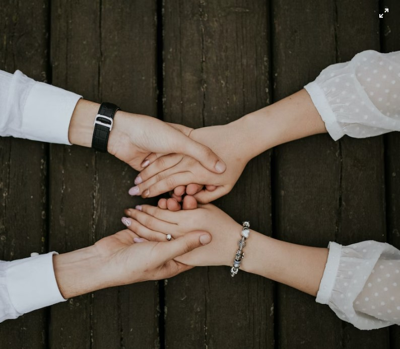
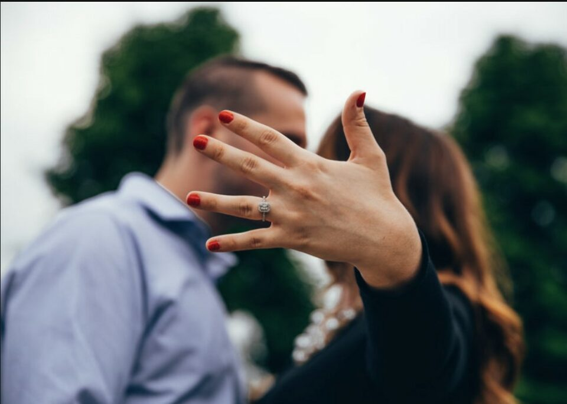
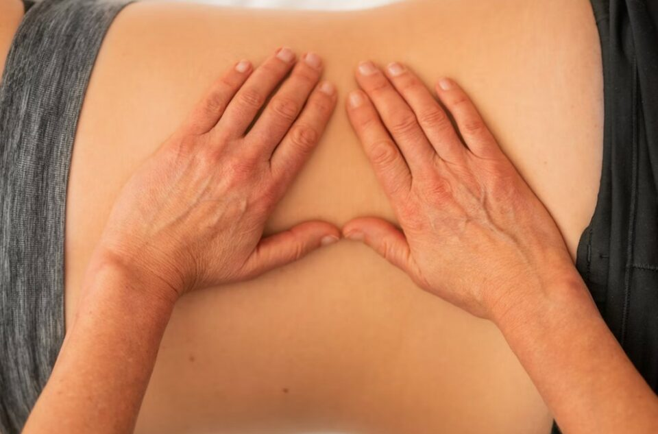

This article has been written and researched by our expert Loveable through a precise methodology. [Learn more about our methodology](https://avada.io/loveable/our-methodological.html)

[Loveable](https://avada.io/loveable/) > [Blog](https://avada.io/loveable/blog/) > [Holiday](https://avada.io/loveable/holiday/)

# What To Do On Valentine’s Day: 20 Romantic Ideas For Couples

Written by [Blake Simpson](https://avada.io/loveable/author/blake/) Last Updated on August 22, 2023

- [Go Stargazing Together](https://avada.io/loveable/blog/what-to-do-on-valentines-day/#wp-block-heading-2-2) 
- [Go Camping](https://avada.io/loveable/blog/what-to-do-on-valentines-day/#wp-block-heading-2-5)
- [Take a Sex Workshop Together](https://avada.io/loveable/blog/what-to-do-on-valentines-day/#wp-block-heading-2-7)
- [Have a Karaoke Night](https://avada.io/loveable/blog/what-to-do-on-valentines-day/#wp-block-heading-2-10)
- [Prepare A Personalized Gift For Your Lover](https://avada.io/loveable/blog/what-to-do-on-valentines-day/#wp-block-heading-2-12)
- [Go For a Coffee Date](https://avada.io/loveable/blog/what-to-do-on-valentines-day/#wp-block-heading-2-17)
- [Prepare for a picnic at home with a romantic DIY fort](https://avada.io/loveable/blog/what-to-do-on-valentines-day/#wp-block-heading-2-20) 
- [Go to a bookstore and enjoy reading together](https://avada.io/loveable/blog/what-to-do-on-valentines-day/#wp-block-heading-2-22)
- [Relieve stress in a rage room](https://avada.io/loveable/blog/what-to-do-on-valentines-day/#wp-block-heading-2-25)
- [Go shopping at vintage stores](https://avada.io/loveable/blog/what-to-do-on-valentines-day/#wp-block-heading-2-27)
- [Give each other a massage.](https://avada.io/loveable/blog/what-to-do-on-valentines-day/#wp-block-heading-2-29)
- [Playing Card Together](https://avada.io/loveable/blog/what-to-do-on-valentines-day/#wp-block-heading-2-32) 
- [Go To The Theater](https://avada.io/loveable/blog/what-to-do-on-valentines-day/#wp-block-heading-2-34) 
- [Spend The Night On A Hotel](https://avada.io/loveable/blog/what-to-do-on-valentines-day/#wp-block-heading-2-37) 
- [Take A Morning Walk Together](https://avada.io/loveable/blog/what-to-do-on-valentines-day/#wp-block-heading-2-40) 
- [Dancing along with the romantic melody](https://avada.io/loveable/blog/what-to-do-on-valentines-day/#wp-block-heading-2-42)
- [Enjoy Breakfast In Bed Together](https://avada.io/loveable/blog/what-to-do-on-valentines-day/#wp-block-heading-2-44) 
- [Write Him/Her A Love Letter](https://avada.io/loveable/blog/what-to-do-on-valentines-day/#wp-block-heading-2-47) 
- [Go Ice Skating](https://avada.io/loveable/blog/what-to-do-on-valentines-day/#wp-block-heading-2-49)
- [Plan Your Dream Vacation](https://avada.io/loveable/blog/what-to-do-on-valentines-day/#wp-block-heading-2-51)
- [Final Thoughts](https://avada.io/loveable/blog/what-to-do-on-valentines-day/#wp-block-heading-2-54) 

Valentine’s is perfect for you and your significant other to express your feelings and do romantic things together. Even though [Valentine chocolate](https://avada.io/loveable/chocolate-day-gifts/) and roses are great Valentine’s Day gifts, the best gift you can give your loved one is time together. You could make a special Valentine’s Day dinner for two or a sweet treat if food means “love” to your significant other. Sometimes, a Valentine’s Day movie marathon is the perfect choice for a night spent cuddling with your love. Whatever it is, to help you plan your Valentine’s Day celebration with your special someone, we’ve compiled a [list of Valentine’s activities](https://avada.io/loveable/things-to-do-on-valentine-day/). Some are on a tight budget, while others cost nothing at all. All are sure to make for a romantic date night. With these practical suggestions, you’ll no longer have to worry about **what to do on valentine’s day**. 

## Go Stargazing Together 

This list includes activities that won’t cost you a dime, and stargazing hand in hand is one of them. Stargazing together gives you a private space with no noise, away from the city lights. It’s also a time when you can confess your feelings to them. You can watch the stars in your backyard; all you need is a [warm outdoor blanket](https://avada.io/loveable/personalized-blankets/). 

## Go Camping

Take your loved one to a place with beautiful scenery and refreshing air to camp. If you haven’t had an impromptu trip together for a long time, this Valentine’s Day will be suitable for it. With this [camping trip](https://avada.io/loveable/gifts-campers/), you can spend more time together, cook together, make a campfire or go stargazing.

## Take a Sex Workshop Together

Valentine’s Day is the perfect occasion for you and your partner to try to make love in a different way. Try a different pose than what you’re used to. This will bring newness and strengthen your feelings. It’s also possible to find classes in person or online, depending on how “hands-on” you prefer your learning experience to be.

## Have a Karaoke Night

Karaoke is a great idea for a date on Valentine’s Day. There are millions of songs about love in the world, so why don’t you try using songs to express your feelings? Singing will make you both tired, and you will have a good time together, ready for a great night in bed.

## Prepare A Personalized Gift For Your Lover

Valentine’s Day is a great occasion for gifts, but if you’re still wondering between hundreds of offerings out there and want a gift specially designed for your loved one, then we have a suggestion. Loveable gives you a wide range of choices with a hundred of gifts, from cute little mugs to meaningful decorations and accessories that they can bring along anytime, anywhere.Even better, each of these presents can be tailored to the recipient. Personalized gifts allow you to feature an image, message, and recipient’s name of your choosing. Make sure you don’t miss out on a single item from these lists

- [35 Best Valentine’s Gifts For Boys (He’ll Surprise)](https://avada.io/loveable/valentine-gifts-boys/)
- [33 Best Last Minute Valentine’s Gifts That Will Bring Suprise To Your Love](https://avada.io/loveable/last-minute-valentine-gifts/)
- [34 Best Valentine Combo Gifts For Her That Are Amazing](https://avada.io/loveable/valentine-combo-gift/)

## Go For a Coffee Date

Unfortunately, this year Valentine’s Day is not on the weekend, which is not the most romantic day of the week. You may need to squeeze in some romantic downtime between shifts at the office and running errands with the kids. Have a good beginning with a romantic coffee for two. Grab some coffee from Starbucks, arrange to meet in a cafe, or just relax for a while in the same room.

## Prepare for a picnic at home with a romantic DIY fort 

This Valentine’s Day, you and your boyfriend can do things inside. You can build a fort with sheets, just like when you were a kid, using an L-shaped couch and some counter chairs. Every good fort builder knows that different heights are important. Then you two can have a picnic with homemade chocolate-covered strawberries, a cheese and charcuterie board, and beer for him and wine for you.

## Go to a bookstore and enjoy reading together

You and your partner read a lot, right? Go to your favorite local bookstore and spend some time picking out a book for your loved one to read. You and your boyfriend can read a book of the romance genre together and discuss it together. Or you can also buy books to read in bed at home and treat it as part of your valentine’s date at home.

## Relieve stress in a rage room

Going to a rage room might seem like an odd way to celebrate a romantic occasion, but it’s actually a great way to let off steam! If you and your partner have been feeling stressed lately, going to a rage room gives you both a chance to let all your worries out. [Healthline](https://www.healthline.com/health/mental-health/from-rage-rooms-to-scream-clubs-can-they-help-your-mental-health#Potential-benefits) says that smashing things together is a “great way to talk about what’s making us so upset in our lives.” It will not only bring you and your partner closer, but it will also be an energizing and empowering activity that gets you out of your emotional comfort zone.

## Go shopping at vintage stores

If you and your lover are both nostalgic people, shopping at vintage or second-hand stores is definitely not a bad choice. The right thrift store is like a treasure chest full of old things waiting to be found again. Grab a friend and go on a scavenger hunt in your local vintage shop. Even if you don’t find anything to buy, the things you find might start a conversation or remind you of good times from the past.

## Give each other a massage.

Grab a bottle of body oil, light some candles and play some relaxing music in the background, and give your partner a massage for at least 30 minutes. They can say “thank you” by doing the same for you.

## Playing Card Together 

Hold a Valentine’s Day poker tournament with your significant other or a group of other couples. While it’s not recommended in personal relationships, bluffing is perfectly acceptable when playing poker. Do you wish to make it more suitable for children? There is no need to worry. Plan a night of simple games.

## Go To The Theater 

Going to the theater for the evening is guaranteed to be a fun and exciting time. Whether you want to see what’s playing at the theater down the street or travel to one of the nearby big cities, there are plenty of options.

On the other hand, if you like rock or classical music, you two can also go to a music concert; Or; there are ways you can watch a live show from your own home. You can go to YouTube to find a recorded concert or to see if you can watch a live stream.

## Spend The Night On A Hotel 

You and your special someone deserve to treat yourselves to a luxurious hotel room for the night. What’s more, there’s no requirement for travel! Getting a hotel room in your city is a simple way to have a memorable date.

## Take A Morning Walk Together 

Enjoy a romantic run along a scenic trail while you and your date catch up and work up an appetite for a romantic dinner.

## Dancing along with the romantic melody

Valentine’s Day is a wonderful time to get your groove on, whether you’re in a committed relationship or as single as they come. Dancing, whether with a partner or by yourself, is a great way to release stress and feel good at the end of the day.

## Enjoy Breakfast In Bed Together 

It seemed that the meal served at the bed only existed in the TV series. Imagine how romantic it would be if you prepared your loved one his/her favorite dish right in bed. Your partner will feel like they are a queen. Don’t hesitate to give them that feeling!

## Write Him/Her A Love Letter 

What more appropriate way could there be to declare your unending love for one another than to put it in writing? Spend a lot of money on posh stationery and even a wax seal. Go all out. It’s the kind of thoughtful action that would really speak to a couple’s old-fashioned sensibilities.

## Go Ice Skating

This Valentine’s Day, go ice skating with your significant other to stay active and have a lot of fun. No matter if it’s cold enough to go to a nearby pond or a nearby rink, you’re sure to have a lot of fun.

## Plan Your Dream Vacation

Even if you can’t go anywhere right now, daydreaming is a great way to satisfy your need to see the world. You and your partner can plan your dream trip by making a Pinterest board, looking at hotels, and maybe even making a dish or two from the area.

## Final Thoughts 

You probably know that Valentine’s Day is coming up, no matter what kind of relationship you’re in or how you feel about the holiday. February 14 is a day to celebrate all kinds of love, not just romantic love. This means that you can go on dates with friends or with yourself. So with our recommendation we hope that you can have an idea of **what to do on valentine’s day**. 

- [Go Stargazing Together](https://avada.io/loveable/blog/what-to-do-on-valentines-day/#wp-block-heading-2-2) 
- [Go Camping](https://avada.io/loveable/blog/what-to-do-on-valentines-day/#wp-block-heading-2-5)
- [Take a Sex Workshop Together](https://avada.io/loveable/blog/what-to-do-on-valentines-day/#wp-block-heading-2-7)
- [Have a Karaoke Night](https://avada.io/loveable/blog/what-to-do-on-valentines-day/#wp-block-heading-2-10)
- [Prepare A Personalized Gift For Your Lover](https://avada.io/loveable/blog/what-to-do-on-valentines-day/#wp-block-heading-2-12)
- [Go For a Coffee Date](https://avada.io/loveable/blog/what-to-do-on-valentines-day/#wp-block-heading-2-17)
- [Prepare for a picnic at home with a romantic DIY fort](https://avada.io/loveable/blog/what-to-do-on-valentines-day/#wp-block-heading-2-20) 
- [Go to a bookstore and enjoy reading together](https://avada.io/loveable/blog/what-to-do-on-valentines-day/#wp-block-heading-2-22)
- [Relieve stress in a rage room](https://avada.io/loveable/blog/what-to-do-on-valentines-day/#wp-block-heading-2-25)
- [Go shopping at vintage stores](https://avada.io/loveable/blog/what-to-do-on-valentines-day/#wp-block-heading-2-27)
- [Give each other a massage.](https://avada.io/loveable/blog/what-to-do-on-valentines-day/#wp-block-heading-2-29)
- [Playing Card Together](https://avada.io/loveable/blog/what-to-do-on-valentines-day/#wp-block-heading-2-32) 
- [Go To The Theater](https://avada.io/loveable/blog/what-to-do-on-valentines-day/#wp-block-heading-2-34) 
- [Spend The Night On A Hotel](https://avada.io/loveable/blog/what-to-do-on-valentines-day/#wp-block-heading-2-37) 
- [Take A Morning Walk Together](https://avada.io/loveable/blog/what-to-do-on-valentines-day/#wp-block-heading-2-40) 
- [Dancing along with the romantic melody](https://avada.io/loveable/blog/what-to-do-on-valentines-day/#wp-block-heading-2-42)
- [Enjoy Breakfast In Bed Together](https://avada.io/loveable/blog/what-to-do-on-valentines-day/#wp-block-heading-2-44) 
- [Write Him/Her A Love Letter](https://avada.io/loveable/blog/what-to-do-on-valentines-day/#wp-block-heading-2-47) 
- [Go Ice Skating](https://avada.io/loveable/blog/what-to-do-on-valentines-day/#wp-block-heading-2-49)
- [Plan Your Dream Vacation](https://avada.io/loveable/blog/what-to-do-on-valentines-day/#wp-block-heading-2-51)
- [Final Thoughts](https://avada.io/loveable/blog/what-to-do-on-valentines-day/#wp-block-heading-2-54) 

### [Blake Simpson](https://avada.io/loveable/author/blake/)

Hi, I'm Blake from Loveable. I help people find perfect gifts for occasions like anniversaries and weddings. I also write a blog about holidays, sharing insights to make them more meaningful. Let's create unforgettable moments together!

- [Twitter](https://twitter.com/intent/tweet)
- [Facebook](https://www.facebook.com/sharer/sharer.php)
- [instagram](https://avada.io/loveable/blog/what-to-do-on-valentines-day/)
- [pinterest](https://www.pinterest.com/loveablellc/)

## Related Posts

[### 120+ Christian Birthday Wishes To Spread Your Love](https://avada.io/loveable/blog/christian-birthday-wishes/) 

[

### 35 Best 70th Birthday Ideas To Celebrate The Special Milestone

](https://avada.io/loveable/blog/70th-birthday-ideas/)

[

### 50 Best 30th Birthday Decorations for a Remarkable Birthday Bash

](https://avada.io/loveable/blog/30th-birthday-decorations/)

[

### 40 Delicious Vegan Christmas Desserts to Delight Your Palate

](https://avada.io/loveable/blog/vegan-christmas-desserts/)

[

### 60 Christmas Team Building Activities to Boost Workplace Spirit

](https://avada.io/loveable/blog/christmas-team-building-activities/)
