This article has been written and researched by our expert Loveable through a precise methodology. [Learn more about our methodology](https://avada.io/loveable/our-methodological.html)

[Loveable](https://avada.io/loveable/) > [Blog](https://avada.io/loveable/blog/) > [Holiday](https://avada.io/loveable/holiday/)

# What To Wear On Valentine’s Day – 30 Best Ideas  

Written by [Blake Simpson](https://avada.io/loveable/author/blake/) Last Updated on August 21, 2023

- [Go For A Classical Romantic Outfit](https://avada.io/loveable/blog/what-to-wear-on-valentines-day/#wp-block-heading-2-3) 
- [Use a color scheme relevant to Valentine’s Day.](https://avada.io/loveable/blog/what-to-wear-on-valentines-day/#wp-block-heading-2-38)
- [Choose prints that relate to Valentine’s Day to stay on theme.](https://avada.io/loveable/blog/what-to-wear-on-valentines-day/#wp-block-heading-2-72)
- [Valentine’s Wearing Tips](https://avada.io/loveable/blog/what-to-wear-on-valentines-day/#wp-block-heading-2-105)
- [Bottom line](https://avada.io/loveable/blog/what-to-wear-on-valentines-day/#wp-block-heading-2-108)

[Valentine Day](https://avada.io/loveable/what-is-valentines-day/) has come very close! And this holiday has brought about many worries for women. As they always wonder how to choose Valentine’s outfits to become the most attractive in their man’s eyes.

Valentine’s Day is always a great [time for couples](https://avada.io/loveable/what-to-do-on-valentines-day/) to date and plans a memorable anniversary. Whether dining at a luxurious restaurant or simply walking around the streets, women still have to make sure that they appear beautiful in front of their man eyes. With the following suggestions, Loveable hopes every woman will find their fashion style, with something new and different from what you wear on a typical day, but still create an unforgettable impression. We hope that with this amazing suggestion, you’ll never have to wonder **what to wear on Valentine’s Day.**

## Go For A Classical Romantic Outfit 

It’s appropriate to sport a more traditional romantic look on Valentine’s Day since the holiday is dedicated to celebrating love. It’s Valentine’s Day, so it’s time to go shopping for a new outfit! Keep an eye out for frilly or puffed sleeves, lace, or ribbons for added romance.

On the one hand, wear crisp, simple winter whites for a romantic look that will never go out of style on Valentine’s Day. Wearing all white during the winter months is a beautiful look, but be careful when selecting the same shade of white for each component of your outfit. Instead, combine various white tones with creams and beiges.

On the other hand, a little black dress is an excellent choice for practically any event. Or you can try both to see which colors suit you better.

Here are some classical Valentine’s Outfits for you to check out!

1. [Bell-Sleeve Dress with Rose-Print](https://www.amazon.com/Topdress-WomensVintage-Audrey-Halter-Cocktail/dp/B07GSWRYX8/) 

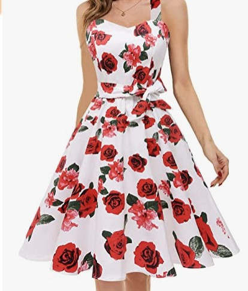

In a lovely printed pattern all over, this dress features the ultimate [symbol of love](https://avada.io/loveable/love-paragraphs-for-her/), the rose. This dress has a sense of motion and understated drama thanks to the draping fabric and bell sleeves.

2. [Sanctuary-Cuff Detail Wrap](https://www.zappos.com/p/sanctuary-cuff-detail-wrap/product/9842375/?PID=100102749&AID=14044464&utm_source=Skimlinks&splash=none&utm_medium=affiliate&cjevent=aa288de0a78011ed812818e80a18b8f9&utm_campaign=5370367&utm_term=100102749&utm_content=14044464&zap_placement=74968X1583755X21fddbb60550120268e54538e0019b0c)

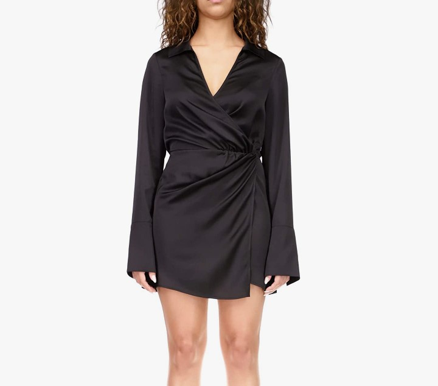

When you wear the gorgeous SanctuaryTM Cuff Detail Wrap dress, everyone will be looking at you. A wrap dress is a great piece to wear between seasons. If you are going straight from work to date, all you have to do is switch out your ballet flats for stilettos.

3. [EMPORIO ARMANI Sleeveless Stretch Velvet Mini Dress](https://www.neimanmarcus.com/en-vn/p/emporio-armani-sleeveless-stretch-velvet-mini-dress-prod254470031?ecid=NMAF_RK_Hearst+Magazines&CS_003=5630585&utm_medium=affiliate&utm_source=NMAF__Hearst+Magazines)

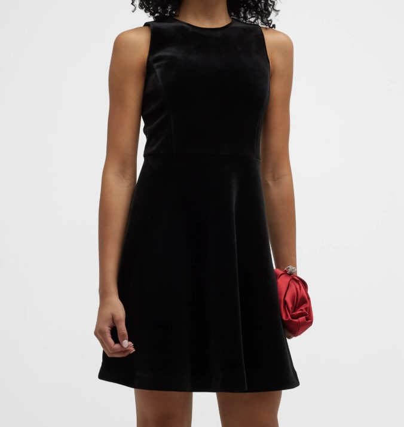

This is Giorgio Armani’s diffusion line for professionals. It has well-tailored clothes, stylish sportswear, eveningwear, outerwear, and accessories that are all very well-made. It has all of Giorgio Armani’s trademark features, like clean lines and soft colors, exclusive fabrics, and a great fit and finish. Emporio Armani shows the newest and most popular additions to Armani’s style vocabulary.

4. [Off-Shoulder Lasercut Fit-&-Flare Dress](https://www.zappos.com/p/karl-lagerfeld-paris-womens-tulip-sleeve-crepe-dress-dark-black/product/9631972/color/134714?zlfid=191&ref=pd_detail-3-sims_vis)

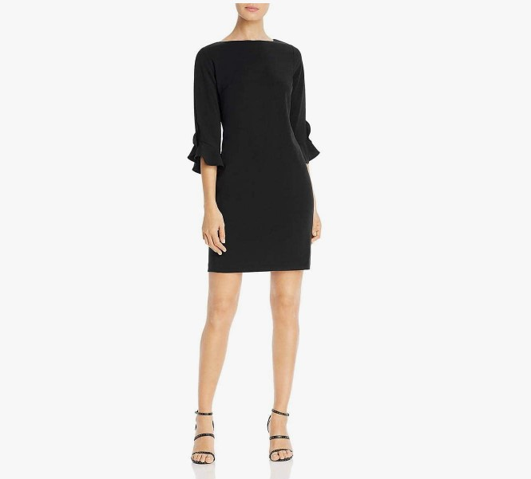

Emporio Armani knit dress with laser cutouts and scalloped edges, which brings about a noble look. Fit-and-flare silhouette

5. [Women Hollow Knitted Sweater Valentine’s Day Long Sleeve V-neck Heart](http://amazon.com/Chang-Yun-Shoulder-Knitted-Pullovers/dp/B07SBMWT1Z)

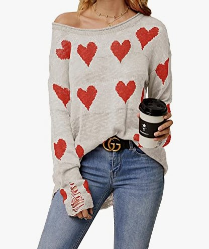

A sweater with a heart pattern is the way to go if you’re not looking for anything particularly fancy but still want to join in on the fun and make the most of the day nonetheless. It’s simple to put on, and people will be smiling all day long because of you.

6. [Guipure Lace Mini Dress](https://www.self-portrait.com/products/red-buttoned-guipure-lace-mini-dress?country=VN&currency=gbp)

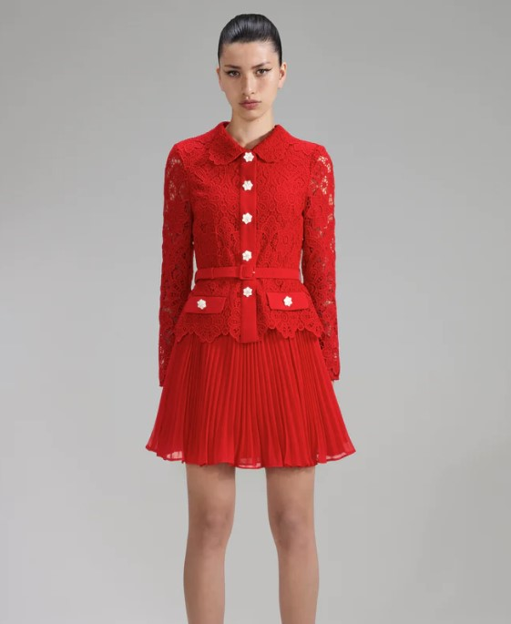

This dress’s feminine charm comes from the way the color, texture, and fit all work together. It is made of crimson guipure lace and has a collared bodice with diamanté buttons and a belt to show off your figure. A peplum tops a pleated mini skirt. For your next party, you can wear it with kitten heels. 

7. [Cupro Slip Dress](https://www.amazon.com/Drop-Womens-Silky-V-Neck-Dress/dp/B07KYRSMNN)

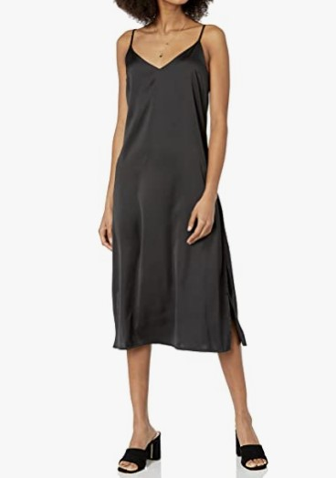

The color black is a safe choice for a formal Valentine’s Day party. Pairing a black slip dress with embellished heels is the epitome of elegant sophistication. Oversized black blazers are perfect for when you need an extra layer but want to shed it before dinner.

8. [Elegant Velvet Long Sleeve Wrap V Neck Dress](https://www.amazon.com/GUBERRY-Christmas-Bodycon-Wedding-Dresses/dp/B08FFGNZPLappend-20&ascsubtag=%5Bartid%7C2164.g.42300429%5Bsrc%7C%5Bch%7C%5Blt%7C%5Bpid%7Caf159062-dd80-40d9-9ccf-742209605c8a)

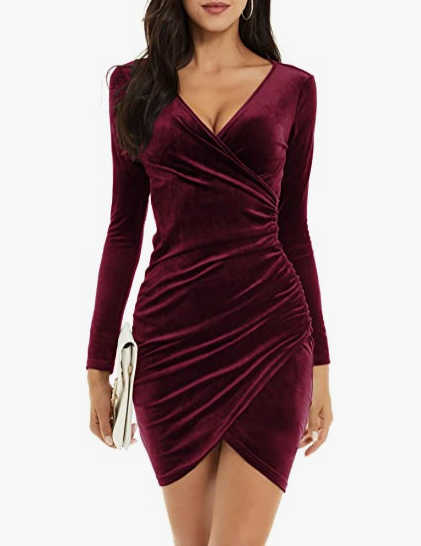

This dress practically prepares for a romantic evening out. If you want to look ultra-flattering and fun on [your date night](https://avada.io/loveable/will-you-be-my-valentine-ideas/), choose a wrap dress with a v-neck and ruched details.

9. [Lornie Halter Maxi Dress](https://www.redonline.co.uk/fashion/g38972306/valentines-day-outfits/)

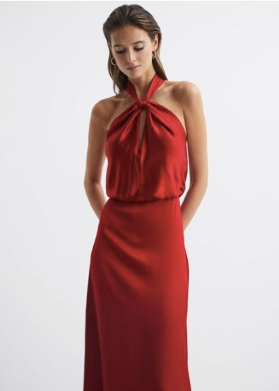

Despite its bold appearance, the statement dress by Reiss is surprisingly refined. The ideal ensemble for a night out at a candlelit restaurant with your special someone.

10. [Alita Mini Dress](https://zsupplyclothing.com/collections/what-to-wear-valentines-day/products/alita-mini-dress?variant=40897057161316)

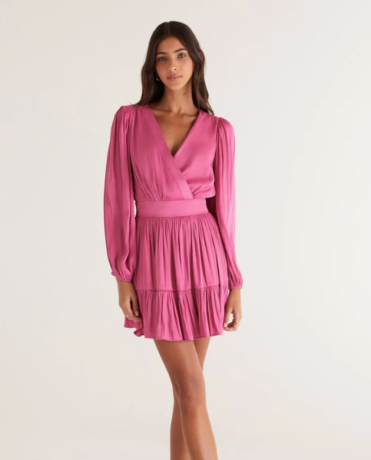

Here is the dress you’ve been waiting to wear to your holiday celebration! Balloon sleeves and a ruffled hem with smocking at the back waistband are just two of the many fun, feminine details included in the Alita Mini Dress. This already incredible dress is elevated by the addition of a flattering faux wrap neckline. Oh, and did we mention the pockets?

## Use a color scheme relevant to Valentine’s Day.

Dressing in traditional Valentine’s Day colors, such as shades of pink or red, is a nice touch to get into the holiday spirit. You can also go for a more traditional and elegant look by donning a long crimson gown, or you can have some fun by donning a hot pink sweater and jeans. 

Wearing only one traditional Valentine’s Day color, like a red shoe with a black dress or a pink dress with black pumps, is a great way to subtly celebrate the holiday.

Here are some beautiful color schemes for Valentine’s Day 

1. [Tweet Skirt from Shopbop](https://www.shopbop.com/tweet-skirt-simon-miller/vp/v=1/1506725398.htm?extid=affprg_linkshare_SB-SyrN4SGJMyU&cvosrc=affiliate.linkshare.SyrN4SGJMyU&affuid=%5Bartid%7C10049.g.4586%5Bsrc%7C%5Bch%7C&sharedid=42352&subid1=SyrN4SGJMyU-xzJqXCpe28GSBkwtpfa7xA) 

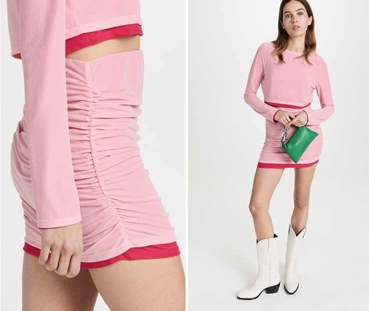

There is no more Valentine’s Day lovely outfit than a pink and red coordinating top and skirt. You must definitely try!

2. [Imogene Corset](https://miaou.com/products/7023-cl-2?sscid=21k7_9uema&utm_source=shareasale&utm_medium=affiliate&utm_campaign=314743&variant=41997004964019)

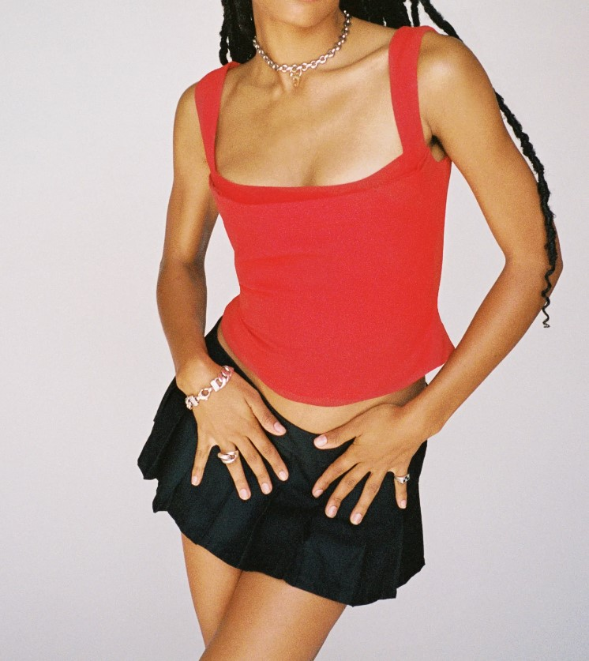

Introducing Imogene, the newest member of our Red family of silhouettes. The Imogene has a cowl neckline and boning at the back, and it is a fully lined corset. Absolutely no one else is like her. She will look great with your go-to pair of jeans or paired with the Moni Skirt.

3. [The Ex-Boyfriend Shirt](https://shopfavoritedaughter.com/collections/tops/products/the-ex-boyfriend-shirt-copper?variant=41385170370743&utm_source=pepperjam&utm_medium=affiliate&utm_campaign=21181&clickId=4277848571) 

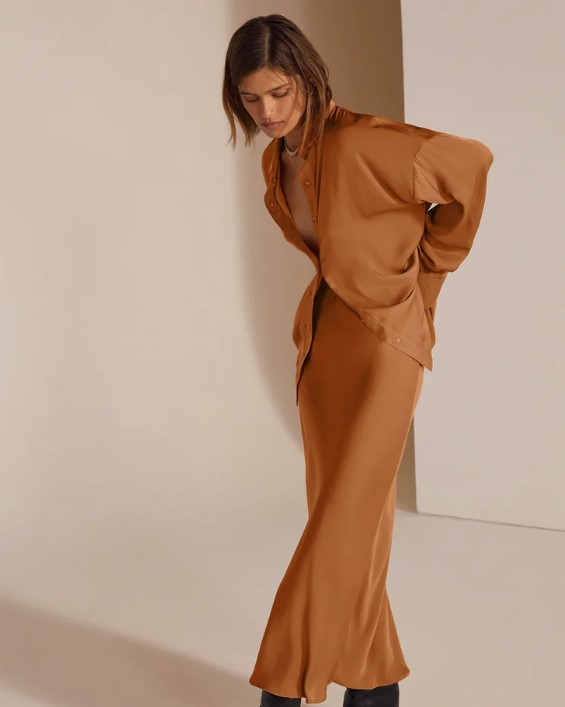

The Ex-Boyfriend Shirt is a best-seller. It has a loose fit, a pointed collar, and a back box pleat. The oversized button-up is made of silky-soft copper satin, and our favorite way to wear it is actually any way: tied, tucked, half-tucked, or unbuttoned.

4. [Anna Quan Satin Maxi Dress](https://www.amazon.com/Cantonwalker-Halterneck-Wedding-Cocktail-Malachite/dp/B09XLNZLHX/)

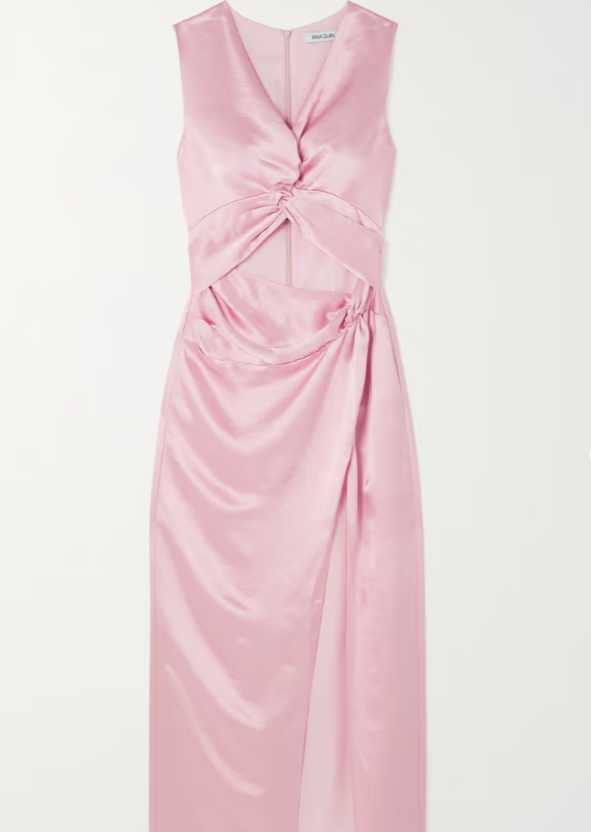

The ‘Violeta’ dress from ANNA QUAN has all the glitz of traditional eveningwear while still evoking a lingerie aesthetic. You can feel the ‘Rosa’ satin float against your skin thanks to the column shape, which is accentuated by the knot and cutout at the bodice. You can pair it with flats, heels, or boots.

5. [High-Rise Midi Skirt](https://www.modaoperandi.com/women/p/rotate/sequin-high-waisted-pencil-skirt/556184?AID=14544922&PID=100030509&SID=74968X1525071X0c30a8ef23585b3af21844c2c05ac958&cjevent=d9e22bf1a78711ed810e00de0a18b8fc&utm_medium=affiliate&medium=affiliate&source=Skimlinks&utm_source=Skimlinks)

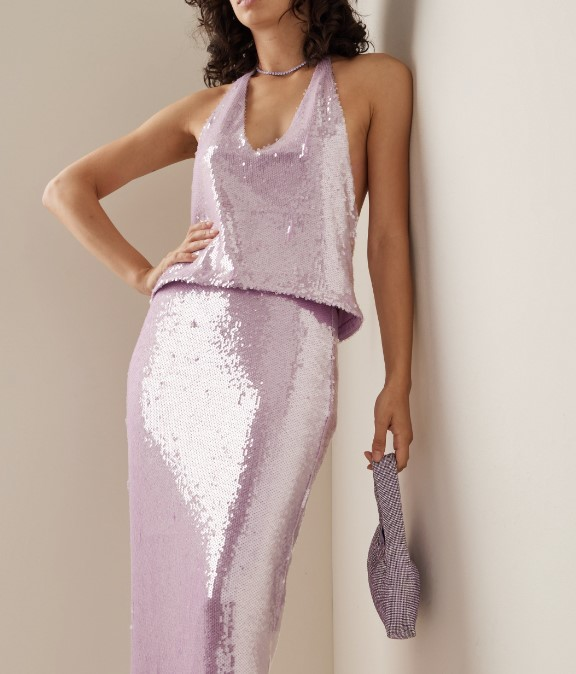

The influencers and stylists Jeanette Madsen and Thora Valdimarsdottir started the cult brand Rotate. The Scandi talents’ sexy take on everything from miniskirts to suits is what makes Rotate’s styles so popular. The back of this fully sequined pencil skirt has a zipper, and it is fully lined for comfort. Pair it with the brand’s matching sequined top and a fur coat for a party-ready look that sparkles.

6. [Viscose-blend Cardigan](https://www2.hm.com/en_us/productpage.1149878001.html?utm_source=rakuten&utm_medium=affiliate&utm_campaign=2575853_LTK&utm_content=10&utm_term=US_Network&ranMID=43148&ranEAID=QFGLnEolOWg&ranSiteID=QFGLnEolOWg-3jNiB5LQjSw9FugutizJCA)

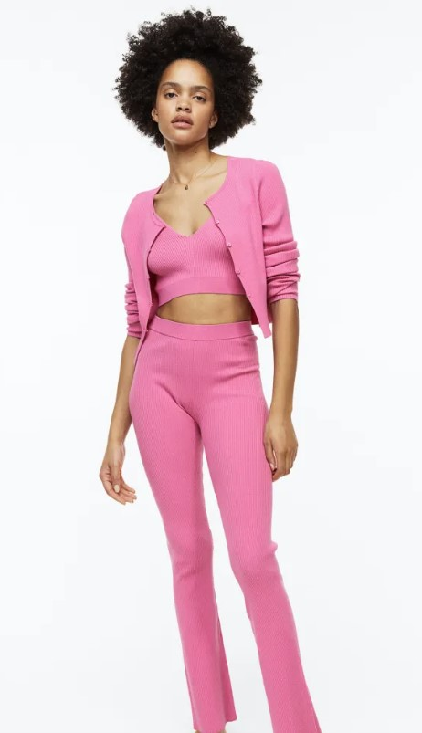

Even if you and your partner are going to stay in for the night, you should still do something fun. Whether you’re making a fancy dinner or ordering in and watching a movie, a cute pink knit set and cozy slippers can take you from making cocktails to relaxing on the couch. All while making sure you feel hot. This set is a perfect choice for a romantic Valentine’s date at home. 

7. [Red Long Sleeve Maxi Dress](https://www.lulus.com/products/dreaming-about-you-red-long-sleeve-maxi-dress/1653636.html?utm_source=pepperjam&utm_medium=textlink&utm_content=21181&utm_campaign=8-11575&clickId=4283079384)

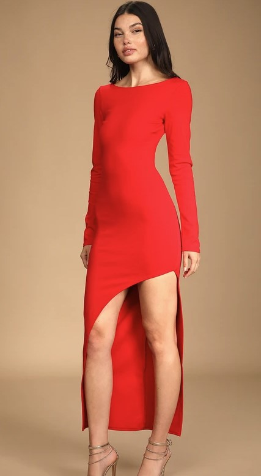

If you want to spice up your dinner plans, this figure-flaunting dress with an asymmetrical slit cutout will do just that. The stretch knit fabric is also comfortable, so you can look and feel great all night.

8. [Red Satin Square-Neck Mini Dress](https://www.amazon.com/Sleeveless-Spaghetti-Bodycon-Camisole-Dresses/dp/B0B1YBCTDZ/ref=sr_1_30?crid=3E08OAVYZ7OEX&keywords=Red+Satin+Square-Neck+Mini+Dress&qid=1679276318&sprefix=red+satin+square-neck+mini+dress%2Caps%2C360&sr=8-30)

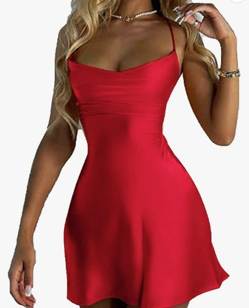

This stunning A-line dress is exactly what it sounds like it is. You certainly merit some red roses to match all that adoration. Also, they would look great with this dark, glossy satin color.

9. [Cuffs of Feather on a Beautiful blazer Dress](https://www.nastygal.com/ca/bridal-feather-cuff-blazer-mini-dress/AGG02526.html)

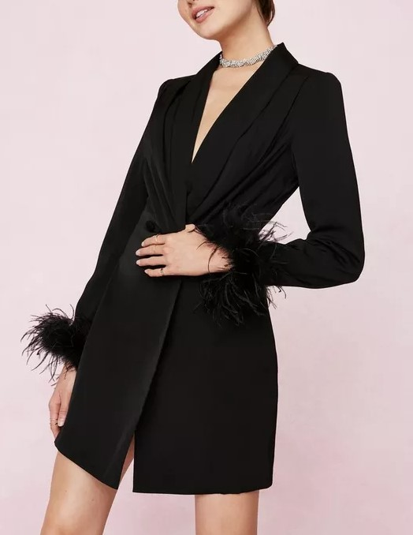

The flirty and fun vibes of this blazer dress make it essential for the Valentine’s Day season. What’s not to like about this dress, with its plunging V-neck, mini length, and feathered faux sleeves?

10. [Keyhole Mini Dress](https://www.amazon.com/BCBGeneration-Womens-Sleeve-Keyhole-X-Small/dp/B09W5GYQC9/ref=sr_1_14?crid=2HJGYCUDEQFK8&keywords=Keyhole+Mini+Dress&qid=1679276453&sprefix=keyhole+mini+dress%2Caps%2C980&sr=8-14)

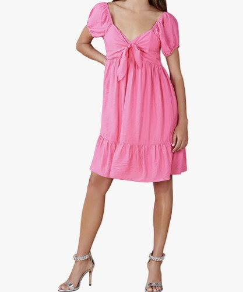

We are big fans of Rixo’s Lolita dress, which features a fun “Geometric Heart” print reminiscent of the 1960s. It’s perfect for a date or a night out with friends because it’s sure to get you compliments either way. 

## Choose prints that relate to Valentine’s Day to stay on theme.

You can have a lot of fun with your outfit by wearing a printed item or an entire outfit that is related to the holiday, such as a heart-shaped top and jeans or a dress covered in roses. Be on the lookout for early Valentine’s Day offerings from some stores, as they may feature appropriate imagery (such as conversation hearts) for a holiday.

1. [Women’s V Neck Sweater with Valentine’s Heart](https://www.amazon.com/ECOWISH-Embroidery-Sweater-Casual-Sweaters/dp/B08KY6ZF8F/ref=sr_1_40?asc_campaign=&asc_source=&asc_refurl=https%3A%2F%2Fwww.teenvogue.com%2Fstory%2Fvalentines-day-outfit-ideas&ascsubtag=63a20d48f34855a025d4b179&tag=teevog-20) 

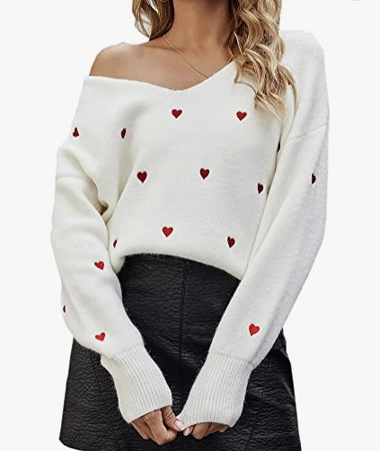

This otherwise boring sweater is made much more interesting by the addition of a heart print.

The ribbed hem and cuffs of this sweater will help you retain heat without losing your shape. This pullover sweater features a V-neck and is cut in a loose silhouette, making it suitable for wear by anyone and complementing any wardrobe.

2. [Sweater Long Sleeve with Lovely Heart Print](https://www.amazon.com/Drvitor-Womens-Pullover-Sweaters-Crewneck/dp/B0B4MGS3N2/?asc_campaign=&asc_source=&asc_refurl=https%3A%2F%2Fwww.teenvogue.com%2Fstory%2Fvalentines-day-outfit-ideas&ascsubtag=63a20d48f34855a025d4b179&tag=teevog-20) 

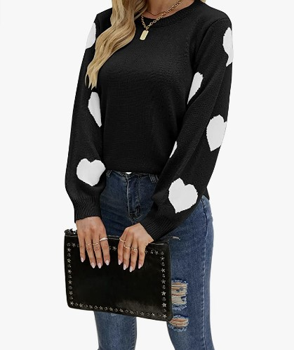

Wearing this adorable heart-print sweater is a great way to spread holiday vibes. It’s available in a range of colors and is designed from a comfy cotton blend fabric. Use it as a top with these faux leather pants and booties for a Valentine’s Day-worthy ensemble.

3. [Black mini Dress with Bow Back Body](https://www.asos.com/us/asos-luxe/asos-luxe-sweetheart-neck-contrast-bow-back-body-conscious-mini-dress-in-black/prd/203187376?&af_sub1=35719&MID=35719&ranMID=35719&pubref=lYYSEIC9SjY&af_adset_id=35719&af_sub_siteID=lYYSEIC9SjY-mFyyIBmYjkSAUuU3MLF28Q&siteID=lYYSEIC9SjY-mFyyIBmYjkSAUuU3MLF28Q&pid=rakuten_int&is_retargeting=true&ranSiteID=lYYSEIC9SjY-mFyyIBmYjkSAUuU3MLF28Q&af_click_lookback=30d&utm_content=USNetwork.1&utm_source=Affiliate&affid=2135&utm_medium=LinkShare&channelref=Affiliate&link=10&source=linkshare&publisher=Teen%20Vogue&AFFID=26431&utm_campaign=lYYSEIC9SjY&ranEAID=lYYSEIC9SjY&deep_link_value=https%3A%2F%2Fwww.asos.com%2Fus%2Fasos-luxe%2Fasos-luxe-sweetheart-neck-contrast-bow-back-body-conscious-mini-dress-in-black%2Fprd%2F203187376%3F&clickid=lYYSEIC9SjY-mFyyIBmYjkSAUuU3MLF28QA&af_reengagement_window=30d&promo=1156308&af_inactivity_window=0d&c=Rakuten%20Affiliates)

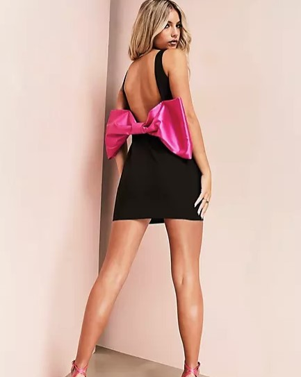

In this sleek LBD, no one will doubt your intention to kill. Take a look at the back and notice the adorably cute oversized hot pink bow. Accessorize the look with some sparkly platform heels in a Barbie pink hue and a matching clutch.

4. [Long Pyjama Set](https://www.victoriassecret.com/us/vs/sleepwear-and-lingerie-catalog/5000000056?affid=100089915&vendor=100089915&cm_mmc=AFF-_-CJ-_-VSD_TB_5370367-_-13901917&cjevent=00978804a91711ed82f178f40a18b8fc&cjdata=MXxOfDB8WXww&dclid=CP3Lmou7iv0CFYzKFgUdpq0EhQ) 

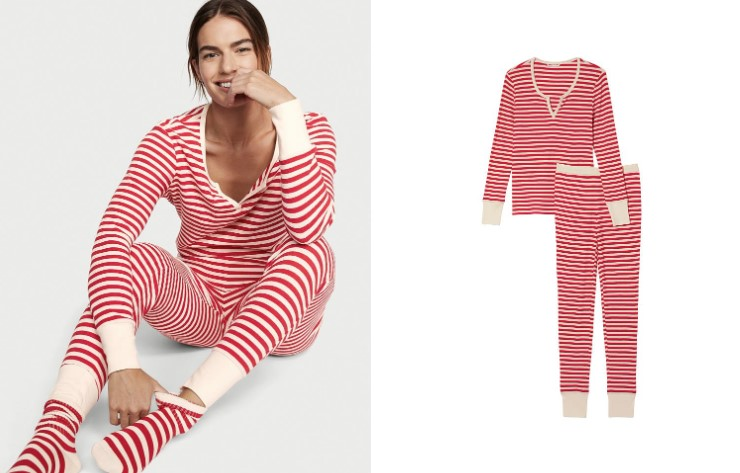

This pajama set is a step up from your standard long johns. A gentle cotton fabric was used for both the top and bottom, which also provides a little bit of stretch. In addition to the pictured color and pattern combinations, this set is also available in five others.

5. [Women’s Pajamas Playsuit](https://www.amazon.com/SofiePJ-Printed-Holiday-Christmas-Gray/dp/B09598GKGW/ref=sr_1_2?th=1&psc=1&asc_campaign=&asc_source=&asc_refurl=https%3A%2F%2Fwww.teenvogue.com%2Fstory%2Fvalentines-day-outfit-ideas&ascsubtag=63a20d48f34855a025d4b179&tag=teevog-20)

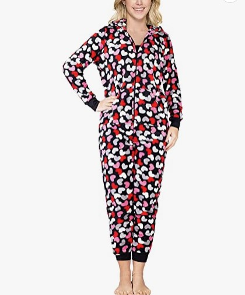

What could be cozier than a onesie? That’s not what we figured! This ensemble, featuring a heart-shaped zipper, is ideal for matching with your BFFs or significant others on movie nights. It’s made with a half-zip placket and two kangaroo pouches that make it suitable for either sex.

6. [Kiona Dress](https://www.revolve.com/dp/LIKR-WD586/?AID=12527506&PID=100543838&utm_medium=affiliate&utm_source=cj&source=cj&utm_campaign=glob_p_6007890&cjevent=19f9cdddab6e11ed81652a440a18ba74&cjdata=MXxOfDB8WXww)

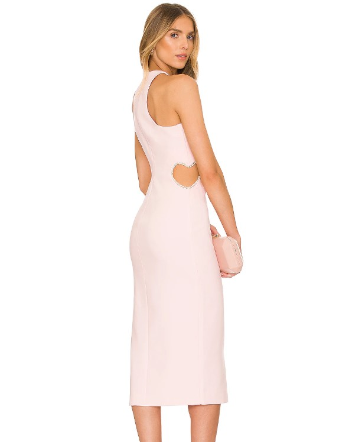

What first drew our attention was the underlying sense of celebration in this piece. An elegant light-pink silhouette is topped with heart-shaped cut-outs that are embellished with faux pearls.

7. [Dress with a sweetheart neckline in a heart print](https://www.asos.com/us/sister-jane/sister-jane-puff-sleeve-maxi-dress-with-sweetheart-neckline-in-heart-print/prd/203292127?irgwc=1&clickid=_rvyj26ljlckfbg9stode3xyhfm2xcbapktesl0fy00&affid=25376&pubref=10078)

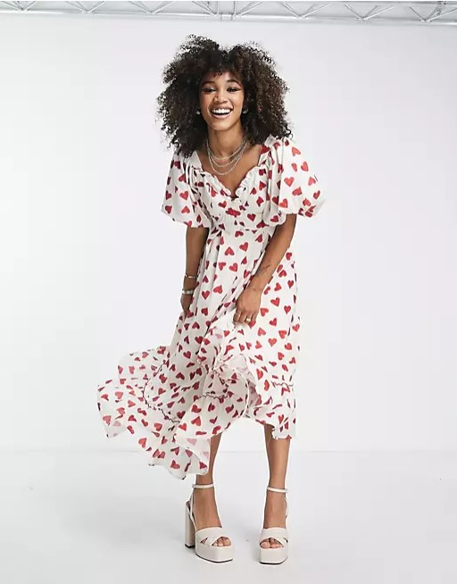

You should prepare for Valentine’s Day plans immediately to wear this dress covered in hearts. The sweetheart neckline and puffy sleeves are two features of the adorable details found on this dress. Style it with a pair of flat sandals, and you’re set.

8. [Adidas Graphic Crop Tee](https://www.adidas.ca/en/shirts?cm_mmc=AdieAffiliates_IR-_-KO%20MEDIA%20II-_-Online%20Tracking%20Link-_-ONLINE_TRACKING_LINK-_-&irclickid=3xtSQuWH0xyNU4N11O2HF3J-UkA36d3ld0GzQA0&irgwc=1) 

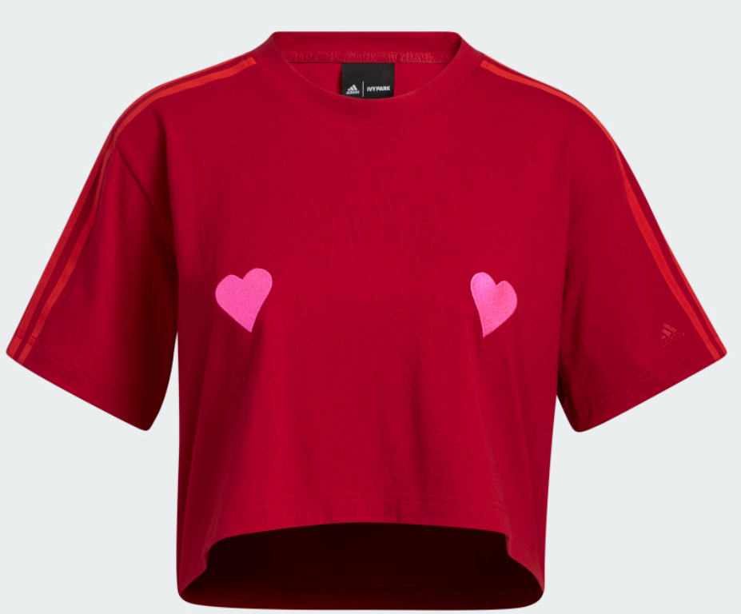

Put on the love and show it to the world! Adidas designed this sweet crop top with subtle heart patterns and a color scheme that is both cheery and romantic.

9. [Love Sweatshirt](https://www.freepeople.com/shop/tricia-fix-love-sweatshirt/?color=020&source=CATEGORYPRODUCTTRAY&type=REGULAR&quantity=1)

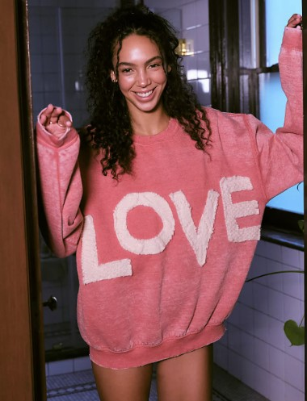

This vintage-inspired sweatshirt is sure to become a closet staple due to its comfortable slouchy fit, knit love graphic at the front, and subtle wear and tear throughout.

10. [Shorts Pyjama Set](https://www.primark.com/en-gb/p/satin-shirt-and-shorts-pyjama-set-pink-991055070306)

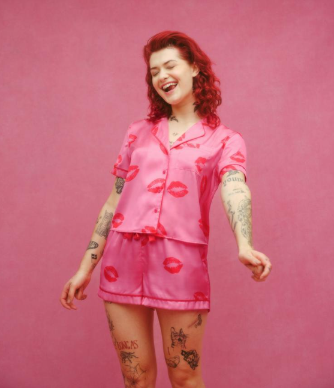

This satin bedding set makes going to bed a true pleasure. It’s also a sweet little surprise for your significant other on a romantic Valentine’s Day at home. 

## Valentine’s Wearing Tips

Find out what will work best with your holiday plan. If you’re having trouble deciding **what to wear on Valentine’s Day**, think about the activities you’ll be participating in and the associated dress code. Going out for a romantic comedy with friends requires a different kind of outfit than going out for a nice dinner with a significant other.

Like New Year’s Eve, Valentine’s Day comes with a lot of pressure to impress your significant other. However, you shouldn’t worry too much because Valentine’s Day is all about sprucing up for a great date.

## Bottom line

There are many options available to help you look your best and feel confident on this special day, whether you prefer casual, romantic, or elegant attire. It’s important to choose something that makes you feel comfortable and expresses your personal style, while also considering the occasion and your partner’s preferences. Ultimately, the most important thing is to enjoy the day with your loved one and create lasting memories.

- [Go For A Classical Romantic Outfit](https://avada.io/loveable/blog/what-to-wear-on-valentines-day/#wp-block-heading-2-3) 
- [Use a color scheme relevant to Valentine’s Day.](https://avada.io/loveable/blog/what-to-wear-on-valentines-day/#wp-block-heading-2-38)
- [Choose prints that relate to Valentine’s Day to stay on theme.](https://avada.io/loveable/blog/what-to-wear-on-valentines-day/#wp-block-heading-2-72)
- [Valentine’s Wearing Tips](https://avada.io/loveable/blog/what-to-wear-on-valentines-day/#wp-block-heading-2-105)
- [Bottom line](https://avada.io/loveable/blog/what-to-wear-on-valentines-day/#wp-block-heading-2-108)

### [Blake Simpson](https://avada.io/loveable/author/blake/)

Hi, I'm Blake from Loveable. I help people find perfect gifts for occasions like anniversaries and weddings. I also write a blog about holidays, sharing insights to make them more meaningful. Let's create unforgettable moments together!

- [Twitter](https://twitter.com/intent/tweet)
- [Facebook](https://www.facebook.com/sharer/sharer.php)
- [instagram](https://avada.io/loveable/blog/what-to-wear-on-valentines-day/)
- [pinterest](https://www.pinterest.com/loveablellc/)

## Related Posts

[### 120+ Christian Birthday Wishes To Spread Your Love](https://avada.io/loveable/blog/christian-birthday-wishes/) 

[

### 35 Best 70th Birthday Ideas To Celebrate The Special Milestone

](https://avada.io/loveable/blog/70th-birthday-ideas/)

[

### 50 Best 30th Birthday Decorations for a Remarkable Birthday Bash

](https://avada.io/loveable/blog/30th-birthday-decorations/)

[

### 40 Delicious Vegan Christmas Desserts to Delight Your Palate

](https://avada.io/loveable/blog/vegan-christmas-desserts/)

[

### 60 Christmas Team Building Activities to Boost Workplace Spirit

](https://avada.io/loveable/blog/christmas-team-building-activities/)
