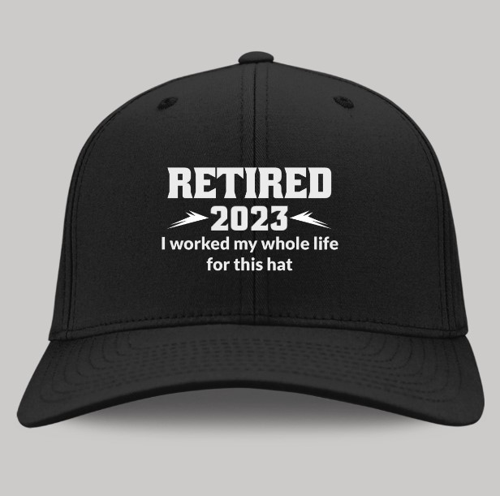

This article has been written and researched by our expert Loveable through a precise methodology. [Learn more about our methodology](https://avada.io/loveable/our-methodological.html)

[Loveable](https://avada.io/loveable/) > [Blog](https://avada.io/loveable/blog/) > [Relationship](https://avada.io/loveable/relationship/)

# What To Wear To A Retirement Party – Tips And Advice

Written by [Luna Miller](https://avada.io/loveable/author/luna/) Last Updated on August 24, 2023

- [What To Wear To A Retirement Party – Tips And Consideration](https://avada.io/loveable/blog/what-wear-retirement-party/#wp-block-heading-2-4)
    - [1\. Indoor Retirement Party](https://avada.io/loveable/blog/what-wear-retirement-party/#wp-block-heading-3-5)
        - [For Men](https://avada.io/loveable/blog/what-wear-retirement-party/#wp-block-heading-4-7) 
        - [For Women](https://avada.io/loveable/blog/what-wear-retirement-party/#wp-block-heading-4-18)
    - [2\. Outdoor Retirement Party](https://avada.io/loveable/blog/what-wear-retirement-party/#wp-block-heading-3-30)
    - [3\. Consider the Type of Retirement Party To Go for a Dress Code](https://avada.io/loveable/blog/what-wear-retirement-party/#wp-block-heading-3-43) 
        - [Formal Retirement Party](https://avada.io/loveable/blog/what-wear-retirement-party/#wp-block-heading-4-45)
        - [Casual Retirement Party](https://avada.io/loveable/blog/what-wear-retirement-party/#wp-block-heading-4-47)
        - [Themed Retirement Party](https://avada.io/loveable/blog/what-wear-retirement-party/#wp-block-heading-4-49)
    - [4\. Choose Suitable Accessories and Footwear](https://avada.io/loveable/blog/what-wear-retirement-party/#wp-block-heading-3-52)
        - [Shoes](https://avada.io/loveable/blog/what-wear-retirement-party/#wp-block-heading-4-53)
        - [Jewelry](https://avada.io/loveable/blog/what-wear-retirement-party/#wp-block-heading-4-56)
        - [Handbags or Clutch](https://avada.io/loveable/blog/what-wear-retirement-party/#wp-block-heading-4-63)
        - [Watches](https://avada.io/loveable/blog/what-wear-retirement-party/#wp-block-heading-4-65)
        - [Hats or Fascinators](https://avada.io/loveable/blog/what-wear-retirement-party/#wp-block-heading-4-72)
    - [5\. Coordinating by Color and Pattern](https://avada.io/loveable/blog/what-wear-retirement-party/#wp-block-heading-3-78) 
        - [Choose a color scheme.](https://avada.io/loveable/blog/what-wear-retirement-party/#wp-block-heading-4-80)
        - [Incorporate patterns strategically](https://avada.io/loveable/blog/what-wear-retirement-party/#wp-block-heading-4-83)
- [Bottom Line](https://avada.io/loveable/blog/what-wear-retirement-party/#wp-block-heading-2-87) 

As retirement marks the culmination of a long and successful career, it is an occasion worth celebrating with family, friends, and colleagues. Attending a retirement party is not only an opportunity to honor and congratulate the retiree but also a chance to enjoy a joyous and memorable event. 

While planning to attend such an important milestone, one question often arises “**what to wear to a retirement party?**” Deciding on the perfect outfit can be a bit daunting, as you want to strike the right balance between professionalism and celebration. 

This guide will bring about valuable tips and advice on what to wear to a retirement party, ensuring that you make a stylish and appropriate impression while enjoying the festivities. Whether you’re a coworker, friend, or family member, these guidelines will help you confidently navigate the dress code and contribute to a special evening honoring the retiree’s remarkable achievements.

## **What To Wear To A Retirement Party – Tips And Consideration**

### **1\. Indoor Retirement Party**

When attending an indoor retirement party, selecting an outfit that is both comfortable and suitable for the occasion is essential. Here are some suggestions for dressing

#### **For Men** 

For most indoor retirement parties, smart or business casual attire is appropriate. Opt for dress pants paired with a button-up shirt. Consider adding a blazer to your ensemble to elevate your look for a more formal setting. If the party is held in a fancy hotel or ballroom, it would be fitting to wear a suit and tie.

**😃Recommend for you**: 

[**Flat-Front Dress Pant**](https://www.amazon.com/Amazon-Essentials-Expandable-Classic-Fit-Flat-Front/dp/B079D2JPKH/ref=sr_1_4?crid=1WOI5HFSUJBFB&keywords=dress%2Bpants&qid=1686036567&sprefix=dress%2Bpants%2Caps%2C301&sr=8-4&th=1)

The classic-fit design of these dress pants is a standout feature. They offer a timeless and versatile style that can easily be worn on various occasions. Whether you’re attending a formal retirement party or a business event, these pants will make you look sharp and well-put-together.

One of the key advantages of these dress pants is the expandable waistband. It gives a comfortable fit and allows for easy adjustment, ensuring that you can move freely and comfortably throughout the day. This is particularly useful during a retirement party where you might be sitting, standing, or enjoying a meal.

[**Men’s Regular-Fit Long-Sleeve**](https://www.amazon.com/Amazon-Essentials-Regular-Fit-Long-Sleeve-Casual/dp/B06XWMLJ94/ref=sr_1_1_ffob_sspa?crid=UDDQ42PM78UW&keywords=button+up+shirt&qid=1686036839&sprefix=buton+up+shirt%2Caps%2C349&sr=8-1-spons&psc=1&spLa=ZW5jcnlwdGVkUXVhbGlmaWVyPUE3VTdYRVUzUEo3WFEmZW5jcnlwdGVkSWQ9QTAyODIxODkzNEhHNklPQkNDVllaJmVuY3J5cHRlZEFkSWQ9QTA5NTM1MTFFV1lFSUZIWFczM1Mmd2lkZ2V0TmFtZT1zcF9hdGYmYWN0aW9uPWNsaWNrUmVkaXJlY3QmZG9Ob3RMb2dDbGljaz10cnVl)

The fit of this shirt is spot-on. The regular-fit design strikes the perfect balance between a relaxed and tailored look. It provides a comfortable and flattering silhouette without being too loose or too tight. I love the attention to detail in the sizing, which ensured a great fit for me.

The material of the shirt is of excellent quality. The main material is cotton and polyester, offering a soft and breathable feel against the skin. The fabric has high durability and holds up well after multiple washes, maintaining its shape and color.

#### **For Women**

Choose a smart or business casual outfit when dressing for an indoor retirement party. You can choose between a dress or a skirt paired with a blouse. Alternatively, dress pants paired with a blouse are also a suitable choice. A floor-length dress will be an appropriate option if the party is being held in an upscale venue, such as a fancy hotel or ballroom.

Remember to consider the dress code specified on the invitation and the nature of the venue. By following these guidelines, you will be dressed comfortably and appropriately for the indoor retirement party.

😃Recommend for you:

[**Women’s Waisted Maxi Dress**](https://www.amazon.com/Amazon-Essentials-Womens-Solid-Surplice/dp/B07JMVR485/ref=sr_1_1?crid=1N9PW2HD9TQNM&keywords=women+dress&qid=1686037161&sprefix=womn+dress%2Caps%2C302&sr=8-1)

It is a fantastic addition to any woman’s wardrobe. The design is simple and sophisticated at the same time. The solid color adds versatility, making it suitable for a variety of occasions. You can wear this to nearly any party, depending on the event. 

The surplice neckline adds a touch of elegance and complements different body types. The dress is also available in multiple color options, allowing women to choose one that suits their personal style and preferences.

[**Straight-Leg Classic Business Casual Pants**](https://www.amazon.com/Calvin-Klein-Womens-Classic-Fit-Black/dp/B00D2TT1PG/ref=sr_1_1?crid=1O0AQQBXB1A6E&keywords=business+casual+outfit&qid=1686037448&sprefix=business+casual+outfit%2Caps%2C337&sr=8-1)

The classic-fit design of the pants offers a tailored, polished look that flatters various body types. The pants sit comfortably at the waist, providing a relaxed yet professional silhouette. The length is just right, hitting at the ankles, allowing for versatility in styling with different footwear.

The material used in these suit pants is of excellent quality. The blend of polyester and spandex offers a comfortable stretch and ensures a wrinkle-resistant finish.

### **2\. Outdoor Retirement Party**

When preparing for an outdoor retirement party, selecting the right attire is essential to ensure both comfort and style. The point is to dress appropriately for the weather and the outdoor setting. 

On warm and sunny days, opt for lightweight and breathable clothing such as a sundress or a skirt paired with a stylish blouse for women, while men can go for khaki pants and a button-up shirt. In case of cooler temperatures, layering is the way to go. Consider adding a light sweater or jacket to your ensemble, paired with pants or a skirt and blouse. Don’t forget to wear comfortable shoes that can handle walking on grass or uneven surfaces. 

By paying attention to the weather and adapting your outfit accordingly, you’ll be ready to enjoy the festivities with comfort, confidence, and a touch of outdoor elegance.

😍Recommend for you:

[**Short-Sleeve Crewneck T-Shirt**](https://www.amazon.com/Amazon-Essentials-Classic-Crewneck-T-Shirt/dp/B08P4SLHGF/ref=sr_1_35?crid=11EOP1TZ2HFOK&keywords=women+blouse&qid=1686037754&sprefix=women+blouse%2Caps%2C374&sr=8-35)

The material used in this T-shirt is of good quality. It is made from a blend of cotton and polyester, offering a soft and breathable feel against the skin. The fabric has lightweight, neither too thin nor too heavy, ensuring comfort throughout the day. I found it to be durable and able to withstand regular wear and washing without losing its shape or color.

The design is simple and versatile. It comes in many classic colors, allowing for easy pairing with different bottoms and layering options. 

[**Funny Retirement T-Shirt**](https://loveable.ai/products/retired-under-new-management-see-wife-for-details-personalized-shirt-retired-gift-for-dad-for-husband-for-grandpa-retirement-gift-for-anniversary-301icnvsts081?variant=44263368392936&ranking=&utm_source=&utm_campaign=best-retirement-gifts-for-men-who-has-everything)

The “Retired Under New Management – See Wife For Details” shirt is a perfect [gift for someone who is retiring](https://avada.io/loveable/funny-retirement-gifts/) from their job. 

This shirt is not only durable, but it also adds a touch of humor to their special occasion. It’s designed to bring a smile to your dad’s or any man’s face, making them happy and feeling appreciated. Additionally, you have the freedom to customize the saying to make it even more personal and fitting for the recipient.

### **3\. Consider the Type of Retirement Party To Go for a Dress Code** 

Retirement parties come in various forms, each with its own unique style and dress code. Understanding the different types of retirement parties will help you choose the appropriate attire for the occasion. Here are some common types of retirement parties and what to wear for each

#### **Formal Retirement Party**

A formal retirement party calls for more sophisticated attire. For men, a black tie or black tie optional dress code is usually expected. This means wearing a dark suit or tuxedo. Women can opt for a floor-length gown, cocktail, or tailored dress. Accessorize with elegant pieces like cufflinks or a clutch bag to add a touch of glamour to your outfit.

#### **Casual Retirement Party**

A casual retirement party has a relaxed and informal atmosphere. For men, wearing jeans or khakis paired with a polo shirt or a casual t-shirt is acceptable. Women can go for jeans, skirts, or simple dresses. Comfortable footwear like flat sandals or ankle boots is appropriate for this type of event.

#### **Themed Retirement Party**

Themed retirement parties provide an opportunity for creativity and fun. The attire for these parties will depend on the specific theme mentioned in the invitation. Whether it’s a Hawaiian luau, a 1920s Gatsby-themed party, or a celebration centered around a favorite sports team, be sure to dress accordingly. Incorporate these elements into your outfit while following the general dress code guidelines.

**Related:** [What Is Leave Preparatory To Retirement?](https://avada.io/loveable/leave-preparatory-to-retirement/)

### **4\. Choose Suitable Accessories and Footwear**

#### **Shoes**

Choosing the right shoes is important as they can significantly influence your overall appearance. Ballet flats, loafers, or low-heeled pumps are excellent options for women attending a retirement party. 

These pair of shoes are both comfortable and stylish, and they can be easily paired with various outfits. Men, on the other hand, should go for well-maintained dress shoes in either black or brown. Ensuring the shoes are polished and in good condition adds a polished touch to their attire.

#### **Jewelry**

Opt for elegant and tasteful pieces that match the formality of the event. Consider wearing classic accessories like pearl or diamond earrings, a beautiful necklace, or a stylish bracelet for formal parties. For casual or themed parties, you can be more creative with your choices, incorporating accessories that align with the theme.

🥳Recommend for you:

[**Men Chain Retirement Theme**](https://loveable.ai/products/congratulation-on-your-retirement-may-your-retirement-be-enjoyable-cuban-chain-mens-jewelry-retirement-gift-for-mentor-boss-coworker-for-bff-301icnvsje0017?_pos=9&_sid=f4255b324&_ss=r&variant=44221065986280)

This unique keychain is a perfect item for men to use or give as a gift at a retirement party. The necklace itself is made of durable materials, ensuring longevity and durability. The Cuban chain design adds a touch of elegance, making it suitable for both formal and casual occasions. The necklace is comfortable to wear and sits nicely around the neck.

What sets this jewelry piece apart is its heartfelt message. The inscription “Congratulations on Your Retirement” serves as a constant reminder of the retiree’s achievement and marks the beginning of a new and enjoyable chapter in their life. It is a thoughtful gesture that shows appreciation and care for their hard work and dedication.

#### **Handbags or Clutch**

Choose a handbag or clutch that complements your outfit and is appropriate for the occasion. Select a style and size that allows you to carry your essentials comfortably without overpowering your overall look.

#### **Watches**

A stylish watch adds a sophisticated touch to your attire. Choose a watch that matches the formality of the event and coordinates well with your outfit.

🙂Recommend for you:

[**Retirement Theme Watch**](https://loveable.ai/products/retired-2023-not-my-problem-anymore-personalized-watch-retired-gift-for-fad-retirement-gift-301icnvswa083?_pos=2&_sid=60e488240&_ss=r&variant=44263328350440) 

This watch is well-crafted with attention to detail, ensuring durability and longevity. The stainless steel case and band give the watch a stylish and polished look, suitable for both formal and casual occasions.

What makes this watch truly special is the option for personalization. You can customize it with your dad’s name or any other retiree’s name, making it a unique and thoughtful gift. The personalization adds a personal touch and makes the watch even more meaningful and sentimental.

#### **Hats or Fascinators**

Depending on the type of retirement party, a hat or fascinator can be a stylish accessory choice. For outdoor events, consider a wide-brimmed hat to protect yourself from the sun, while for themed parties, choose headwear that complements the theme.

🤗Recommend for you: 

[**Funny Retirement Hat**](https://loveable.ai/products/retired-2023-i-worked-my-whole-life-for-this-hat-special-gift-for-himher-for-parents-for-co-worker-retirement-gift-305ihpnpcc598?_pos=1&_sid=ddcc27447&_ss=r&variant=44526071054568) 

This top-notch hat is designed to fit everyone with its adjustable size feature comfortably. Crafted from premium materials, it boasts exceptional durability. The hat’s sophisticated style and meticulously stitched wording make it a standout accessory for retirees. It’s not just an ordinary hat; it’s a testament to years of effort and a well-deserved tribute to the joys of retirement.

### **5\. Coordinating by Color and Pattern** 

When it comes to attending a retirement party, coordinating your outfit by color and pattern can elevate your overall look and create a cohesive and polished appearance. Here are some advice to help you in this regard

#### **Choose a color scheme.**

Selecting a color scheme can help you create a harmonious and put-together outfit. Consider the season, the venue, and any theme or dress code specified for the retirement party. Opt for colors that flatter your skin tone and suit the occasion. 

For a timeless and elegant look, neutrals like black, white, navy, or gray are always a safe choice. Alternatively, you can choose a complementary color scheme by pairing colors opposite each other on the color wheel, such as purple and yellow.

#### **Incorporate patterns strategically**

Adding patterns to your attire can bring visual interest and personality to your outfit. However, it’s important to use them strategically to avoid overwhelming your look. If you opt for a patterned piece, such as a dress or a shirt, balance it with solid-colored items. 

For example, pair a patterned blouse with neutral-colored pants or a patterned tie with a solid-colored suit. Mixing patterns can also be made, but it requires a careful eye for coordination. 

**Related:** 11 Best [Poems About Retirement](https://avada.io/loveable/poems-about-retirement/)

## Bottom Line 

In conclusion, **what to wear to a retirement party?** Dressing appropriately for the occasion is essential while considering the party’s location, theme, and dress code. Opt for comfortable and stylish outfits that reflect your personal style while keeping in mind the weather and venue. Coordinate your clothing choices by considering color combinations and patterns to create a polished look. Don’t forget to accessorize with appropriate shoes and accessories that complement your outfit. Following these tips and advice will prepare you to attend a retirement party and make a memorable impression while honoring the retiree’s special milestone.

- [What To Wear To A Retirement Party – Tips And Consideration](https://avada.io/loveable/blog/what-wear-retirement-party/#wp-block-heading-2-4)
    - [1\. Indoor Retirement Party](https://avada.io/loveable/blog/what-wear-retirement-party/#wp-block-heading-3-5)
        - [For Men](https://avada.io/loveable/blog/what-wear-retirement-party/#wp-block-heading-4-7) 
        - [For Women](https://avada.io/loveable/blog/what-wear-retirement-party/#wp-block-heading-4-18)
    - [2\. Outdoor Retirement Party](https://avada.io/loveable/blog/what-wear-retirement-party/#wp-block-heading-3-30)
    - [3\. Consider the Type of Retirement Party To Go for a Dress Code](https://avada.io/loveable/blog/what-wear-retirement-party/#wp-block-heading-3-43) 
        - [Formal Retirement Party](https://avada.io/loveable/blog/what-wear-retirement-party/#wp-block-heading-4-45)
        - [Casual Retirement Party](https://avada.io/loveable/blog/what-wear-retirement-party/#wp-block-heading-4-47)
        - [Themed Retirement Party](https://avada.io/loveable/blog/what-wear-retirement-party/#wp-block-heading-4-49)
    - [4\. Choose Suitable Accessories and Footwear](https://avada.io/loveable/blog/what-wear-retirement-party/#wp-block-heading-3-52)
        - [Shoes](https://avada.io/loveable/blog/what-wear-retirement-party/#wp-block-heading-4-53)
        - [Jewelry](https://avada.io/loveable/blog/what-wear-retirement-party/#wp-block-heading-4-56)
        - [Handbags or Clutch](https://avada.io/loveable/blog/what-wear-retirement-party/#wp-block-heading-4-63)
        - [Watches](https://avada.io/loveable/blog/what-wear-retirement-party/#wp-block-heading-4-65)
        - [Hats or Fascinators](https://avada.io/loveable/blog/what-wear-retirement-party/#wp-block-heading-4-72)
    - [5\. Coordinating by Color and Pattern](https://avada.io/loveable/blog/what-wear-retirement-party/#wp-block-heading-3-78) 
        - [Choose a color scheme.](https://avada.io/loveable/blog/what-wear-retirement-party/#wp-block-heading-4-80)
        - [Incorporate patterns strategically](https://avada.io/loveable/blog/what-wear-retirement-party/#wp-block-heading-4-83)
- [Bottom Line](https://avada.io/loveable/blog/what-wear-retirement-party/#wp-block-heading-2-87) 

### [Luna Miller](https://avada.io/loveable/author/luna/)

I'm Luna Miller, a helpful employee at Loveable. I excel at giving great advice on birthday gifts. I love suggesting memorable experiences like concerts, spas, and getaways. As a reliable and supportive colleague, I'm always there to assist.

- [Twitter](https://twitter.com/intent/tweet)
- [Facebook](https://www.facebook.com/sharer/sharer.php)
- [instagram](https://avada.io/loveable/blog/what-wear-retirement-party/)
- [pinterest](https://www.pinterest.com/loveablellc/)

## Related Posts

[

### 35 Unforgettable Exciting Adult Birthday Party Ideas

](https://avada.io/loveable/blog/adult-birthday-party-ideas/)

[

### 42 Best 21st Birthday Outfits to Rock the Party

](https://avada.io/loveable/blog/21st-birthday-outfits/)

[

### 50+ Happy 40th Anniversary Quotes, Messages, and Wishes

](https://avada.io/loveable/blog/happy-40th-anniversary-quotes/)

[

### 100+ Heartwarming Happy 30th Anniversary Quotes, Messages, and Wishes

](https://avada.io/loveable/blog/happy-30th-anniversary-quotes/)

[

### 120+ Heartfelt Thank You Messages for The Birthday Wishes

](https://avada.io/loveable/blog/thank-you-messages-birthday-wishes/)
