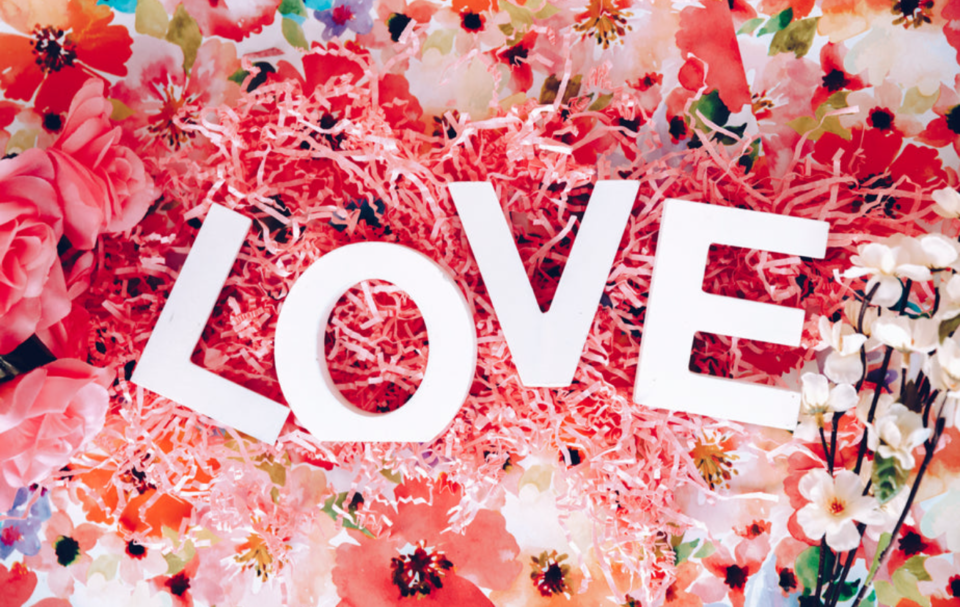
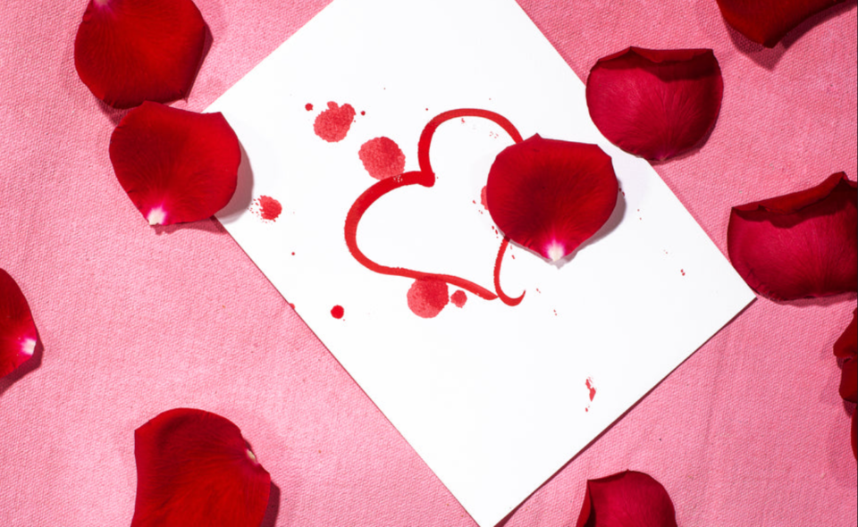
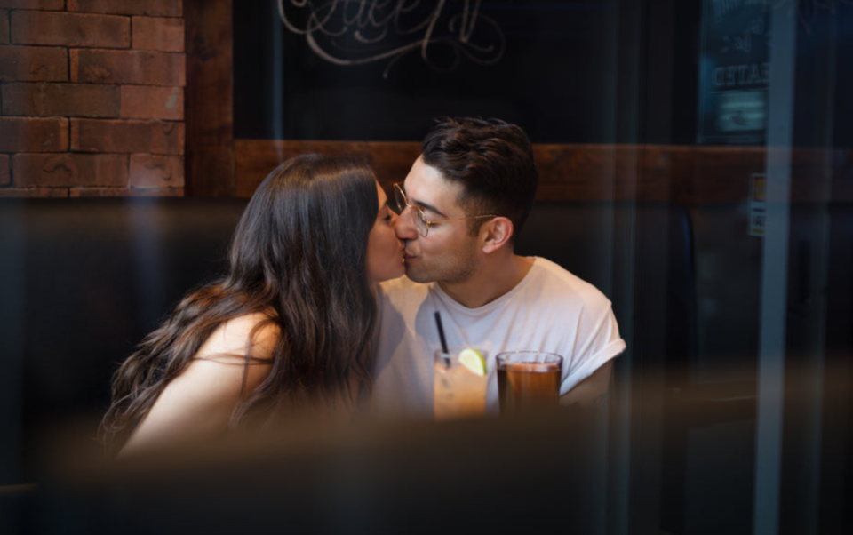

This article has been written and researched by our expert Loveable through a precise methodology. [Learn more about our methodology](https://avada.io/loveable/our-methodological.html)

[Loveable](https://avada.io/loveable/) > [Blog](https://avada.io/loveable/blog/) > [Holiday](https://avada.io/loveable/holiday/)

# What To Write In Valentines Card: 20 Best Ideas

Written by [Blake Simpson](https://avada.io/loveable/author/blake/) Last Updated on August 18, 2023

- [Valentines Card Ideas For New Relationships or Dating](https://avada.io/loveable/blog/what-to-write-in-valentines-card/#wp-block-heading-2-2)
- [Valentine’s Card Ideas For Fiance](https://avada.io/loveable/blog/what-to-write-in-valentines-card/#wp-block-heading-2-15)
- [Romantic Quotes For Valentines Card](https://avada.io/loveable/blog/what-to-write-in-valentines-card/#wp-block-heading-2-26)
- [Valentines Card Ideas For a Longtime Love](https://avada.io/loveable/blog/what-to-write-in-valentines-card/#wp-block-heading-2-38)
- [Funny Valentine’s Day Messages](https://avada.io/loveable/blog/what-to-write-in-valentines-card/#wp-block-heading-2-50)
- [Valentine’s Card Ideas For Boyfriend](https://avada.io/loveable/blog/what-to-write-in-valentines-card/#wp-block-heading-2-61)
- [Cute Valentine’s Day Messages](https://avada.io/loveable/blog/what-to-write-in-valentines-card/#wp-block-heading-2-74) 
- [Bottom line](https://avada.io/loveable/blog/what-to-write-in-valentines-card/#wp-block-heading-2-85) 

Rather than just getting the regular flowers and [Valentine chocolates](https://avada.io/loveable/valentines-day-chocolate-gifts/), you could make your gift even more meaningful by including a handwritten note from the sender that expresses how you feel. Need help with what to write on your significant other’s Valentine’s Day card? There are plenty of ways to express your feelings for them. It’s unnecessary to be in a relationship to enjoy Valentine’s Day or create your own Valentine’s Day poem. You can find a message of love that will impress them this Valentine’s Day, whether you’re trying to let your mom know how loved she is, celebrating your first [Valentine’s Day as an engaged couple](https://avada.io/loveable/valentines-day-gifts-couples/), or just trying to find a funny message that will make your other half laugh or maybe a single poem. Check out our collection of Valentine’s Day card messages for some Romeo and Juliet because not everyone has a way with words, especially romantic ones. After the article, you will master **what to write on Valentine’s cards**.

## Valentines Card Ideas For New Relationships or Dating

When you’ve only been dating for a short time, it can be difficult to know what to say in a Valentine’s Day card. Don’t worry; our writers have you covered with plenty of ideas for what to put in a Valentine’s Day card for [a first date](https://avada.io/loveable/what-to-talk-about-on-first-date/).

1. It makes me incredibly happy that we will be spending our first Valentine’s Day together. I certainly hope this won’t be the last…

2. I have no idea what lies ahead for the both of us, but I can’t wait to see what it is.

3. We’re not single today! Yay!

4. You helped me remember how much fun dating is.

5. I really enjoy being with you.

6. We’re not very experienced with Valentine’s Day yet, but I want you to know how exciting you are to me and how much fun I have when I’m with you.

7. I’m really looking forward to our first Valentine’s Day together. I hope it’s not the last…

8. I’m excited for us.

9. You make me want to be a better person.

10. People say that dating is hard, but you make it look easy to me.

## Valentine’s Card Ideas For Fiance

1. Although we are not yet legally married, in my heart, you are.

2. I still can’t believe we’re engaged.

3. Yes, Be my king today 

4. I just can’t wait to say “I do”

5. You and I, let’s write a happy ending story 

6. This is the best decision I’ve ever made 

7. You’re my forever +1.

8.  From Baby in Dirty Dancing, “I’m scared of walking out of this room and never feeling the rest of my whole life the way I feel when I’m with you.” 

9. The Wedding Date, “I think I’d miss you even if we’d never met.” 

10. Charles Darwin, “Much love, much trial, but what an utter desert is a life without love.” 

## Romantic Quotes For Valentines Card

1. Edward in Sense and Sensibility, “I’ve come here with no expectations, only to profess now that I am at liberty to do so, that my heart is, and always will be, yours.” 

2. Mr. Darcy in Pride & Prejudice, “You have bewitched me, body and soul. I love, I love, I love you. I never wish to be parted from you from this day on.” 

3. Edward in Sense and Sensibility, “I’ve come here with no expectations, only to profess now that I am at liberty to do so, that my heart is, and always will be, yours.” 

4. Bertrand Russell, “Of all forms of caution, caution in love is perhaps most fatal to true happiness.” 

5. Mignon McLaughlin, “When first we fall in love, we feel that we know all there is to know about life, and perhaps we are right.”

6. “If I know what love is, it is because of you.”

7. “[Valentine’s Day](https://avada.io/loveable/what-is-valentines-day/) is just another day to truly love like there is no tomorrow.” 

8. “Love yourself first, and everything else falls into line. You really have to love yourself to get anything done in this world.”

9.  “Love is a game that two can play, and both win.”

10.  “I love her, and that’s the beginning and end of everything.”

## Valentines Card Ideas For a Longtime Love

1. The title “Valentine” describes you in my heart for so many wonderful reasons.

2. Most people today don’t remember us ever being anyone but who we are now. That’s a very nice thing to hear.

3. We’re friends first and foremost. In a word, yes! What can I say?

4. Celebrate the wonderful life we have created for ourselves. Respect everything that we are as a unit.

5. I still find great humor in your company. True love looks like that.

6. Happy Valentine’s Day! Thanks for being my person.

7. When you’re an adult, it’s not easy to meet new people and form friendships. Thank you for making it easy.

8. We complement one another like a fine bottle of wine on a lazy Sunday afternoon.

9. Best wishes on Valentine’s Day! I just wanted you to know that I love you.

10. I don’t want to live—I want to love first and live incidentally.

## Funny Valentine’s Day Messages

1. Even though you have terrible taste in television, I still adore you. So that’s how you know it’s legit.

2. Yes, I understand that loving me isn’t always simple. But believe me; it will be worth it.

3. Simply put, my heart is in love with you. But after my morning coffee, I really appreciate you.

4. Just the two of us are enough for me. WiFi, too, by the way. additionally wine. As well as some snacks. Nonetheless, I promise that’s the last of it.

5. Finding another person who thinks and acts just like me has made me so happy and grateful.

6. Take me as your own. There will be no exchanges or refunds.

7. You’re the only thing I love more than cheese.

8. I hope you have a lovely Valentine’s Day! Tell me you’re not getting tired of me.

9. I’m relieved that we both made it to the “right” page.
10. I love that you’re my emergency contact.

## Valentine’s Card Ideas For Boyfriend

1. I still get butterflies.

2. Before I met you, Valentine’s Day was always a miserable experience.

3. I’m crazy about you.

4. I love being with you more than anything else.

5. You’re very cute, you know that, right?

6. I’m proud to have a boyfriend like you.

7. You’re the best boyfriend ever.

8. You make my heart go ah-oooh.

9. Holy crap, I’m so lucky right now!

10. Do you have any idea how handsome you are? Let me tell you…

**_Related_**: [36 Best Valentine Card Ideas To Show Your Wonderful Love](https://avada.io/loveable/valentine-card-ideas/)

## Cute Valentine’s Day Messages 

1. To the moon and back, my love. You mean the world to me, and I can’t believe we get to spend our lives together. Best wishes on this day dedicated to romantic love.

2. You have taught me what love is, and now I can’t wait to spend the rest of my life with you. Best wishes on this day dedicated to romantic love.

3. This is the essence of love! Cheers to sharing a lifetime of laughter and excitement!

4. Hope today is as gorgeous as you

5. A lot of love is coming your way!

6. You mean the world to me, and I can’t picture my life without you.
7. You are the best thing about me.

8. Our love story is my favorite.

9. My heart belongs to you today and always.

10. We make the perfect couples.

## Bottom line 

You have it! You can share as much or as little as you like in your Valentine’s Day notes. Everything is acceptable as long as it is uniquely yours. What matters are a few well-chosen sentences expressing your gratitude and love for that person. We hope that after this article, you’ve prepared well for what to write on Valentine’s Card.

- [Valentines Card Ideas For New Relationships or Dating](https://avada.io/loveable/blog/what-to-write-in-valentines-card/#wp-block-heading-2-2)
- [Valentine’s Card Ideas For Fiance](https://avada.io/loveable/blog/what-to-write-in-valentines-card/#wp-block-heading-2-15)
- [Romantic Quotes For Valentines Card](https://avada.io/loveable/blog/what-to-write-in-valentines-card/#wp-block-heading-2-26)
- [Valentines Card Ideas For a Longtime Love](https://avada.io/loveable/blog/what-to-write-in-valentines-card/#wp-block-heading-2-38)
- [Funny Valentine’s Day Messages](https://avada.io/loveable/blog/what-to-write-in-valentines-card/#wp-block-heading-2-50)
- [Valentine’s Card Ideas For Boyfriend](https://avada.io/loveable/blog/what-to-write-in-valentines-card/#wp-block-heading-2-61)
- [Cute Valentine’s Day Messages](https://avada.io/loveable/blog/what-to-write-in-valentines-card/#wp-block-heading-2-74) 
- [Bottom line](https://avada.io/loveable/blog/what-to-write-in-valentines-card/#wp-block-heading-2-85) 

### [Blake Simpson](https://avada.io/loveable/author/blake/)

Hi, I'm Blake from Loveable. I help people find perfect gifts for occasions like anniversaries and weddings. I also write a blog about holidays, sharing insights to make them more meaningful. Let's create unforgettable moments together!

- [Twitter](https://twitter.com/intent/tweet)
- [Facebook](https://www.facebook.com/sharer/sharer.php)
- [instagram](https://avada.io/loveable/blog/what-to-write-in-valentines-card/)
- [pinterest](https://www.pinterest.com/loveablellc/)

## Related Posts

[### 120+ Christian Birthday Wishes To Spread Your Love](https://avada.io/loveable/blog/christian-birthday-wishes/) 

[

### 35 Best 70th Birthday Ideas To Celebrate The Special Milestone

](https://avada.io/loveable/blog/70th-birthday-ideas/)

[

### 50 Best 30th Birthday Decorations for a Remarkable Birthday Bash

](https://avada.io/loveable/blog/30th-birthday-decorations/)

[

### 40 Delicious Vegan Christmas Desserts to Delight Your Palate

](https://avada.io/loveable/blog/vegan-christmas-desserts/)

[

### 60 Christmas Team Building Activities to Boost Workplace Spirit

](https://avada.io/loveable/blog/christmas-team-building-activities/)
