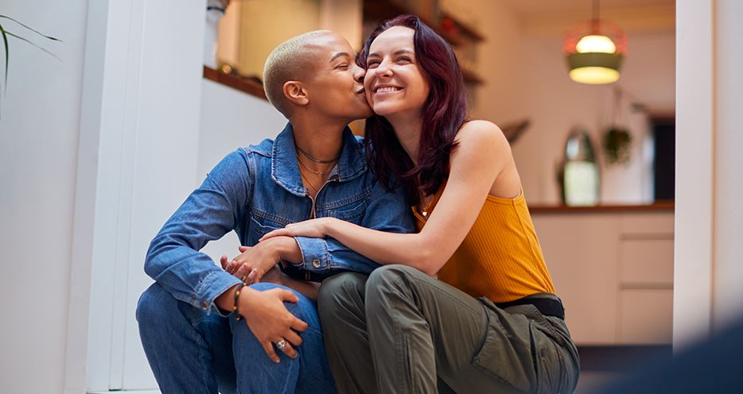

This article has been written and researched by our expert Loveable through a precise methodology. [Learn more about our methodology](https://avada.io/loveable/our-methodological.html)

[Loveable](https://avada.io/loveable/) > [Blog](https://avada.io/loveable/blog/) > [Relationship](https://avada.io/loveable/relationship/)

# When To Say I Love You? Are You Ready To Say Them?

Written by [Luna Miller](https://avada.io/loveable/author/luna/) Last Updated on August 22, 2023

- [General stages of romantic love](https://avada.io/loveable/blog/when-to-say-i-love-you/#wp-block-heading-2-4)
- [What are the times when you knew you were in love?](https://avada.io/loveable/blog/when-to-say-i-love-you/#wp-block-heading-2-16)
- [When is it okay to say I love you?](https://avada.io/loveable/blog/when-to-say-i-love-you/#wp-block-heading-2-25)
    - [Does it matter who says it first?](https://avada.io/loveable/blog/when-to-say-i-love-you/#wp-block-heading-3-27)
    - [How do you know that when it’s time to say it?](https://avada.io/loveable/blog/when-to-say-i-love-you/#wp-block-heading-3-31)
    - [What to do if they don’t say it back?](https://avada.io/loveable/blog/when-to-say-i-love-you/#wp-block-heading-3-43)
- [When to say I love you – The bottom line](https://avada.io/loveable/blog/when-to-say-i-love-you/#wp-block-heading-2-51)

We’re sorry to disappoint you if you were looking for a speedy response to the question, “when to say I love you?” Unfortunately, as with most topics involving the heart, there is no simple answer.

Everyone’s definition of love is different. For some, declaring their love is a momentous occasion that deserves careful thought. Others speak the words without hesitation or worry about how they may be received.

So, no, there isn’t a defined period of time for speaking those three simple yet effective words. Nevertheless, a few crucial cues will help you better understand whether your companion is prepared to hear your words as well as when is the right time to say I love you. Keep reading.

## General stages of romantic love

General stages of romantic love

Stage 1- Lust

The early stages of a romantic encounter can be quite lusty. Testosterone and estrogen may increase your libido, fueling the first few weeks or months when you can’t stop touching.

Lust does not necessarily turn into love or mutual attraction. Some mainly physical relationships quickly lose their luster and peter away. Similarly, love does not have to arise from lust. Many asexual persons may bypass this period entirely.

Stage 2 – Attraction

Your brain produces more dopamine, a hormone associated with rewards and motivation, and norepinephrine, a hormone of fight or flight response, during this phase. But, simultaneously, it creates less serotonin, which influences mood, hunger, sleep, and sexual function.

These fluctuating hormone levels might leave you feeling motivated despite a decreased appetite or desire for sleep. You may also feel joyful, lightheaded, and excited just thinking about the person you’ve fallen for.

You may also feel joyful, lightheaded, and excited just thinking about the person you’ve fallen for

Stage 3 – Attachment

Your love sentiments may gradually establish a more long-lasting bond, aided by chemicals like oxytocin. When you start choosing commitment over “just having fun” or “seeing what happens,” you’ll know you’ve reached this stage.

Even if the first sheer joy may have gone, emotions of connection and deeper affection have replaced it. If a tie starts to grow, you should maintain it over time. If you’ve come to this point, you could be in a love relationship.

## What are the times when you knew you were in love?

Although it might be difficult to convey affection to someone, you should do so when you see the following signals. That’s likely the right time when to say I love you.

- You are at ease and open out to your companion without fear of being judged.

- The interaction with them strengthened your sense of desire, connection, and attraction.

- When you feel happy being with them and can still obtain a laugh even when things are not going well.

- Their annoying behaviors less affect you and you become more concerned about their lives.

- Even when they are far away, you enjoy their companionship, feel safer, and trust them.

- In front of them and your loved ones can no longer cover your sentiments.

- You have plans for them and are prepared to present them to your close relatives.

## When is it okay to say I love you?

When is it okay to say I love you?

### Does it matter who says it first?

It doesn’t matter who says “I love you” first if two persons adore one other. But if you are unsure whether your companion feels the same way you do, you may still express your feelings to them—just be thoughtful of why you are doing so. Go forward if you just want to express your sentiments to them without worrying about whether they will be returned.

Many stigmas are attached to the phrase “I love you” and to who we say it—taking some time to inventory your emotions. Showing your sense of vulnerability is hurtful and can be frightening. On the other hand, it is a method of increasing closeness.

**_Related_**: Important [Questions for A New Relationship](https://avada.io/loveable/questions-new-relationship/)

### How do you know that when it’s time to say it?

Some people open out about their emotions the moment they feel the first stirrings. There is nothing wrong with it, but it also doesn’t hurt to stop and consider your decisions.

When to say I love you? First, check if you’ve seen any of these obvious indications of love while you explore your emotions:

- They are a whole person in your eyes. In other words, you embrace and appreciate both their positive and somewhat less favorable aspects. They could frequently give lengthy tales when you actually only want to hear the highlights.

- You are really interested in every facet of your companion. This encompasses their existing likes and dislikes, family, childhood, prior relationships, and future ambitions and aims.

- Without attempting to change them, you just want to be there for them.

- You miss them while you’re apart and wish to spend time together. However, you also acknowledge that you have personal interests and appreciate their desire to have alone time or time with other friends.

- You like your time together despite the fact that it includes life’s obligations, such as housework and errands, as well as leisure and enjoyment.

- You can trust them when they aren’t around, and when they are, you feel secure.

- Not only do you want to express your sentiments to them, you also want to tell everyone you know about them.

- You want them to meet your friends and family so they may share your respect for them.

When they aren’t around, you can trust them, and when they are, you feel secure.

### What to do if they don’t say it back?

You know when to say I love you, and you have done it. But what to do if they don’t say it back?

Just because your lover doesn’t accept your words “I love you” after the first time doesn’t mean your relationship is finished. Of course, rejection hurts if it occurs. However, it does not imply that the relationship must stop immediately. Instead, the feeling for a person may take some time to develop.

Since there is no way to force someone to fall in love with you, refrain from attempting to hasten the process since it may make the other person uncomfortable. However, there are techniques to strengthen your emotional bond with someone, which can support the development of emotions of closeness.

However, if ultimate mutual love is not conveyed, it is crucial to pay attention. How long to say I love you? After eight to a year of serious dating, if neither partner has spoken the first “I love you,” it is a clue that something is wrong with the path of the relationship or the emotional openness of one or both sides.

_**See More:**_

- How To [Write A Love Letter](https://avada.io/loveable/write-a-love-letter/)

- Best [Love Paragraphs For Her](https://avada.io/loveable/love-paragraphs-for-her/)

## When to say I love you – The bottom line

When to say I love you depends on the nature of the relationship, what you hope will happen after you confess, and how sincere your feelings are for them.

In general, the amount of time that has passed does not determine whether it is appropriate to declare your love for someone. Most importantly, you truly understand that these emotions go beyond infatuation.

- [General stages of romantic love](https://avada.io/loveable/blog/when-to-say-i-love-you/#wp-block-heading-2-4)
- [What are the times when you knew you were in love?](https://avada.io/loveable/blog/when-to-say-i-love-you/#wp-block-heading-2-16)
- [When is it okay to say I love you?](https://avada.io/loveable/blog/when-to-say-i-love-you/#wp-block-heading-2-25)
    - [Does it matter who says it first?](https://avada.io/loveable/blog/when-to-say-i-love-you/#wp-block-heading-3-27)
    - [How do you know that when it’s time to say it?](https://avada.io/loveable/blog/when-to-say-i-love-you/#wp-block-heading-3-31)
    - [What to do if they don’t say it back?](https://avada.io/loveable/blog/when-to-say-i-love-you/#wp-block-heading-3-43)
- [When to say I love you – The bottom line](https://avada.io/loveable/blog/when-to-say-i-love-you/#wp-block-heading-2-51)

### [Luna Miller](https://avada.io/loveable/author/luna/)

I'm Luna Miller, a helpful employee at Loveable. I excel at giving great advice on birthday gifts. I love suggesting memorable experiences like concerts, spas, and getaways. As a reliable and supportive colleague, I'm always there to assist.

- [Twitter](https://twitter.com/intent/tweet)
- [Facebook](https://www.facebook.com/sharer/sharer.php)
- [instagram](https://avada.io/loveable/blog/when-to-say-i-love-you/)
- [pinterest](https://www.pinterest.com/loveablellc/)

## Related Posts

[

### 35 Unforgettable Exciting Adult Birthday Party Ideas

](https://avada.io/loveable/blog/adult-birthday-party-ideas/)

[

### 42 Best 21st Birthday Outfits to Rock the Party

](https://avada.io/loveable/blog/21st-birthday-outfits/)

[

### 50+ Happy 40th Anniversary Quotes, Messages, and Wishes

](https://avada.io/loveable/blog/happy-40th-anniversary-quotes/)

[

### 100+ Heartwarming Happy 30th Anniversary Quotes, Messages, and Wishes

](https://avada.io/loveable/blog/happy-30th-anniversary-quotes/)

[

### 120+ Heartfelt Thank You Messages for The Birthday Wishes

](https://avada.io/loveable/blog/thank-you-messages-birthday-wishes/)
