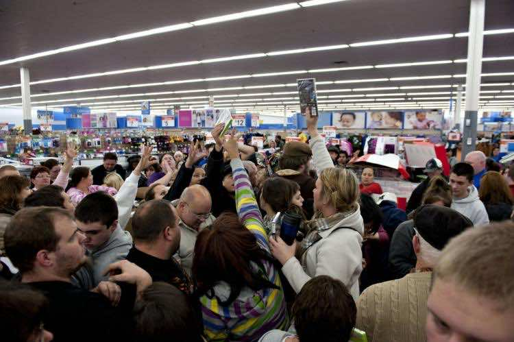

This article has been written and researched by our expert Loveable through a precise methodology. [Learn more about our methodology](https://avada.io/loveable/our-methodological.html)

[Loveable](https://avada.io/loveable/) > [Blog](https://avada.io/loveable/blog/) > [Holiday](https://avada.io/loveable/holiday/)

# Why Black Friday is Bad? 15 Reasons Behind You Must Know 

Written by [Blake Simpson](https://avada.io/loveable/author/blake/) Last Updated on September 07, 2023

- [15 Reasons You Need To Know Why Black Friday Is Bad?](https://avada.io/loveable/blog/why-black-friday-bad/#wp-block-heading-2-2)
    - [1\. Overconsumption And Waste](https://avada.io/loveable/blog/why-black-friday-bad/#wp-block-heading-3-3)
    - [2\. Environmental Impact](https://avada.io/loveable/blog/why-black-friday-bad/#wp-block-heading-3-7)
    - [3\. Pressure On Workers](https://avada.io/loveable/blog/why-black-friday-bad/#wp-block-heading-3-11)
    - [4\. Stampedes And Safety Hazards](https://avada.io/loveable/blog/why-black-friday-bad/#wp-block-heading-3-15)
    - [5\. Devaluation Of Thanksgiving](https://avada.io/loveable/blog/why-black-friday-bad/#wp-block-heading-3-19)
    - [6\. Low-Quality Products](https://avada.io/loveable/blog/why-black-friday-bad/#wp-block-heading-3-23)
    - [7\. Economic Pressure](https://avada.io/loveable/blog/why-black-friday-bad/#wp-block-heading-3-26)
    - [8\. Shallow Discounts](https://avada.io/loveable/blog/why-black-friday-bad/#wp-block-heading-3-29)
    - [9\. Emotional Toll](https://avada.io/loveable/blog/why-black-friday-bad/#wp-block-heading-3-32)
    - [10\. Shift Away from Local Businesses](https://avada.io/loveable/blog/why-black-friday-bad/#wp-block-heading-3-36)
    - [11\. Short-Lived Satisfaction](https://avada.io/loveable/blog/why-black-friday-bad/#wp-block-heading-3-40)
    - [12\. Waste of Time and Energy](https://avada.io/loveable/blog/why-black-friday-bad/#wp-block-heading-3-44)
    - [13\. Negative Social Behavior](https://avada.io/loveable/blog/why-black-friday-bad/#wp-block-heading-3-48)
    - [14\. Promotion Of Materialism To Children](https://avada.io/loveable/blog/why-black-friday-bad/#wp-block-heading-3-52)
    - [15\. Promotion Of Short-Term Thinking](https://avada.io/loveable/blog/why-black-friday-bad/#wp-block-heading-3-56)
- [Final words,](https://avada.io/loveable/blog/why-black-friday-bad/#wp-block-heading-2-63)

Originally associated with alluring discounts and tempting offers, Black Friday has evolved into a cultural phenomenon that is more than simply a day for shopping. There are several convincing reasons why many people believe Black Friday to be harmful, even though it may appear to be a shoppers’ paradise. In this post, we’ll examine 15 reasons why Black Friday is bad and why it’s crucial to understand its negative effects.

## **15 Reasons You Need To Know Why Black Friday Is Bad?**

### **1\. Overconsumption And Waste**

Think of Black Friday as a huge shopping event where everyone “fights” for the greatest bargains. It resembles a shopping party, complete with flashing signs and specials throughout. But here’s the thing: all this enthusiasm may result in overconsumption and waste, a significant issue.

Overconsumption means buying way more stuff than we need. It’s like getting carried away at a buffet and taking more food than we can eat. On Black Friday, the thrill of discounts can make us buy things we don’t need, and that’s where the trouble begins.

### **2\. Environmental Impact**

Now consider all the items we purchase: clothing, technology, and toys; they are all packaged extensively. plastic, boxes, and other things. The remaining materials accumulate as garbage after we have torn open the packaging and used the contents. And that garbage doesn’t just dissolve; it also travels to landfills, which may harm the environment.

However, there’s still more. It requires energy and resources to make anything we purchase. Consider making a toy. You would require plastic, and factories would use pollution-producing machinery.  The real sting is that we frequently forget what we already own when buying new items. This buying-and-forgetting cycle generates a lot of garbage and may harm the environment.

### **3\. Pressure On Workers**

Black Friday, the day of incredible discounts and a shopping frenzy, has a secret aspect that sometimes goes overlooked in the excitement – the tremendous strain it puts on employees.

Think of the mayhem that will ensue as customers swarm stores and the internet in anticipation of price reductions. While shoppers look for bargains, Black Friday workers frequently struggle with stress, exhaustion, and difficult working conditions. Besides, longer shifts give employees less time for relaxation or personal obligations. Beyond the holiday season, this stress may continue negatively impacting employees’ overall job satisfaction and mental health.

### **4\. Stampedes And Safety Hazards**

Many people rush into stores on Black Friday to get the greatest prices, creating huge crowds. Individuals jostle to get reduced goods, so this frenzy might easily become [stampedes](https://www.moroccoworldnews.com/2017/11/234717/essaouira-stampede-americans-black-friday). The possibility of injuries or fatalities makes stampedes risky and perhaps lethal. During the commotion, people might be trampled or crushed, causing serious injury.

Crowded stores during Black Friday can lead to accidents like stumbles, falls, and pushing. The chaos may result in increased incidents. Stores overwhelmed with shoppers might face problems like blocked exits and limited movement, risking safety in emergencies. Black Friday’s competitiveness can also spark customer disputes, potentially escalating to verbal or physical conflicts.

### **5\. Devaluation Of Thanksgiving**

Thanksgiving has historically been a time when friends and family get together, eat together, and give thanks for what they have. However, some stores start opening on Thanksgiving because of the enormous payment on Black Friday sales. As a result, less time is spent with families collectively than would otherwise be the case. 

The growing influence of Black Friday can pressure individuals and families to participate in the shopping frenzy. The FOMO (fear of missing out) on deals and discounts may lead people to prioritize shopping over spending quality time with loved ones on Thanksgiving. This trend can erode the sense of togetherness and gratitude that Thanksgiving aims to foster.

### **6\. Low-Quality Products**

Retailers may seek to get rid of low-quality or old items by offering Black Friday prices. It’s possible that there isn’t much demand for these items or that their price has been reduced due to their subpar quality. Customers who buy these products merely because of the apparent discount run the risk of receiving things that fall short of their expectations or have a limited lifespan.

### **7\. Economic Pressure**

Marketing strategies on Black Friday, such as time-limited offers and significant discounts, may encourage impulsive purchasing. To avoid losing out on a fantastic offer, consumers may feel pressured to make purchases that are outside of their budgets or that are unexpected. This unplanned expenditure can burden individual resources, increasing credit card debt and financial stress. Long after the holiday season has passed, people’s finance might be negatively impacted by high credit card balances and interest payments.

### **8\. Shallow Discounts**

Retailers frequently highlight Black Friday as a chance to find huge discounts and once-in-a-lifetime offers in the weeks before the holiday. The reductions might not always be as significant as promised, though. Once customers learn that the savings are not as substantial as they had anticipated, it might cause them to feel disappointed and frustrated.

### **9\. Emotional Toll**

There may be more tension and anxiety on Black Friday due to the pressure to get deals and discounts. Expecting these difficulties might lead to a tense atmosphere that is bad for one’s mental health.

Many customers skip sleep and relaxation to take advantage of early-morning doorbuster discounts or late-night retail openings. Frustration and disappointment may result from the rush to get popular products and the battle for offers. When customers enter the store, they can discover that the items they want to buy are already out of stock or that the lines are too lengthy to wait. Emotional discomfort can be increased by these unpleasant situations.

### **10\. Shift Away from Local Businesses**

Large shops frequently have the means to conduct aggressive Black Friday marketing and offer steep discounts. This may make it difficult for small neighborhood companies to compete. Black Friday’s price-driven mentality can make it challenging for small firms to match rival discounts, resulting in lower sales and income.

On Black Friday, when customers opt to shop at big-box stores, a large percentage of that money may leave the neighborhood and go to corporate offices or supply networks situated elsewhere. The local economy, including employment prospects, tax receipts, and general economic expansion, may suffer.

### **11\. Short-Lived Satisfaction**

Black Friday is sometimes accused of encouraging fleeting happiness. This is because it tempts customers to buy things on the spur of the moment without carefully weighing their actual needs or the quality of the goods. 

Consequently, people may feel momentarily satisfied after finding a good price, but this feeling might rapidly go once they realize they’ve bought something they don’t really need or won’t use for very long. The cycle continues as the next Black Friday draws near, pushing consumers to replace their prior purchases with new ones and fostering a culture of wasteful overconsumption. 

### **12\. Waste of Time and Energy**

Many Black Friday discounts begin early in the morning, and some even start on Thanksgiving Day. Consumers sacrifice sleep and spend hours waiting in line, even under bad weather conditions, to take advantage of the offers. The constant concentration on shopping might interfere with people’s sleep and scheduling routines, leaving them exhausted and with lower levels of well-being.

The time and energy spent on Black Friday shopping could be better utilized on more meaningful activities, such as being with family and friends, engaging in hobbies, or contributing to the community. The frenzied shopping atmosphere may detract from these important aspects of life.

### **13\. Negative Social Behavior**

There may be tension among customers during Black Friday sales due to the fierce rivalry for the few heavily reduced items. It’s possible for this increased sense of urgency and the need to get the greatest prices to produce unfavorable relationships and conduct. 

Shoppers may become more aggressive in their pursuit of deals, rushing and even pushing or shoving others to get to products first.  This can result in verbal disagreements and even escalate to physical altercations. They might physically fight over products, putting themselves and others at risk.

### **14\. Promotion Of Materialism To Children**

During the Black Friday season, many adverts, commercials, and online promos are frequently made to grab kids’ interest. These advertisements often showcase dazzling goods, toys, gadgets, and other consumer goods being marketed as must-have things at reduced costs.

The constant exposure to these commercials might provide the false sense that pleasure is a direct result of possessing these worldly items. The newest toys, devices, or clothing may cause kids to begin to assume that happiness is based on having them. Children could begin to think that having the newest toys, technology, or clothing will make them happy.

### **15\. Promotion Of Short-Term Thinking**

Promoting short-term thinking means that Black Friday’s discounts and savings can influence consumers to prioritize immediate pleasure or satisfaction over their long-term financial well-being.

Shoppers are also bombarded with advertisements for limited-time deals, which can create a sense of urgency and excitement to make purchases right away. This sense of urgency can lead people to make buying decisions based on the immediate benefit of getting a good deal rather than considering whether the purchase aligns with their broader financial goals or needs.

**_See More:_**

- [What Is Black Friday?](https://avada.io/loveable/blog/what-is-black-friday/) Everything You Need to Know

- [Is Cyber Monday Better Than Black Friday?](https://avada.io/loveable/blog/cyber-monday-vs-black-friday/) – Unmasking the Hidden Factors

## **Final words,**

Even while Black Friday may provide fantastic discounts, it’s important to consider the holiday’s wider ramifications to understand why Black Friday is bad. There are numerous reasons to question Black Friday’s actual value, including the cost to employees, the promotion of materialism, overconsumption, and environmental harm. We as consumers must weigh the positive results against the bad ones to make judgments that are consistent with our values, the welfare of our globe, and society.

- [15 Reasons You Need To Know Why Black Friday Is Bad?](https://avada.io/loveable/blog/why-black-friday-bad/#wp-block-heading-2-2)
    - [1\. Overconsumption And Waste](https://avada.io/loveable/blog/why-black-friday-bad/#wp-block-heading-3-3)
    - [2\. Environmental Impact](https://avada.io/loveable/blog/why-black-friday-bad/#wp-block-heading-3-7)
    - [3\. Pressure On Workers](https://avada.io/loveable/blog/why-black-friday-bad/#wp-block-heading-3-11)
    - [4\. Stampedes And Safety Hazards](https://avada.io/loveable/blog/why-black-friday-bad/#wp-block-heading-3-15)
    - [5\. Devaluation Of Thanksgiving](https://avada.io/loveable/blog/why-black-friday-bad/#wp-block-heading-3-19)
    - [6\. Low-Quality Products](https://avada.io/loveable/blog/why-black-friday-bad/#wp-block-heading-3-23)
    - [7\. Economic Pressure](https://avada.io/loveable/blog/why-black-friday-bad/#wp-block-heading-3-26)
    - [8\. Shallow Discounts](https://avada.io/loveable/blog/why-black-friday-bad/#wp-block-heading-3-29)
    - [9\. Emotional Toll](https://avada.io/loveable/blog/why-black-friday-bad/#wp-block-heading-3-32)
    - [10\. Shift Away from Local Businesses](https://avada.io/loveable/blog/why-black-friday-bad/#wp-block-heading-3-36)
    - [11\. Short-Lived Satisfaction](https://avada.io/loveable/blog/why-black-friday-bad/#wp-block-heading-3-40)
    - [12\. Waste of Time and Energy](https://avada.io/loveable/blog/why-black-friday-bad/#wp-block-heading-3-44)
    - [13\. Negative Social Behavior](https://avada.io/loveable/blog/why-black-friday-bad/#wp-block-heading-3-48)
    - [14\. Promotion Of Materialism To Children](https://avada.io/loveable/blog/why-black-friday-bad/#wp-block-heading-3-52)
    - [15\. Promotion Of Short-Term Thinking](https://avada.io/loveable/blog/why-black-friday-bad/#wp-block-heading-3-56)
- [Final words,](https://avada.io/loveable/blog/why-black-friday-bad/#wp-block-heading-2-63)

### [Blake Simpson](https://avada.io/loveable/author/blake/)

Hi, I'm Blake from Loveable. I help people find perfect gifts for occasions like anniversaries and weddings. I also write a blog about holidays, sharing insights to make them more meaningful. Let's create unforgettable moments together!

- [Twitter](https://twitter.com/intent/tweet)
- [Facebook](https://www.facebook.com/sharer/sharer.php)
- [instagram](https://avada.io/loveable/blog/why-black-friday-bad/)
- [pinterest](https://www.pinterest.com/loveablellc/)

## Related Posts

[### 120+ Christian Birthday Wishes To Spread Your Love](https://avada.io/loveable/blog/christian-birthday-wishes/) 

[

### 35 Best 70th Birthday Ideas To Celebrate The Special Milestone

](https://avada.io/loveable/blog/70th-birthday-ideas/)

[

### 50 Best 30th Birthday Decorations for a Remarkable Birthday Bash

](https://avada.io/loveable/blog/30th-birthday-decorations/)

[

### 40 Delicious Vegan Christmas Desserts to Delight Your Palate

](https://avada.io/loveable/blog/vegan-christmas-desserts/)

[

### 60 Christmas Team Building Activities to Boost Workplace Spirit

](https://avada.io/loveable/blog/christmas-team-building-activities/)
