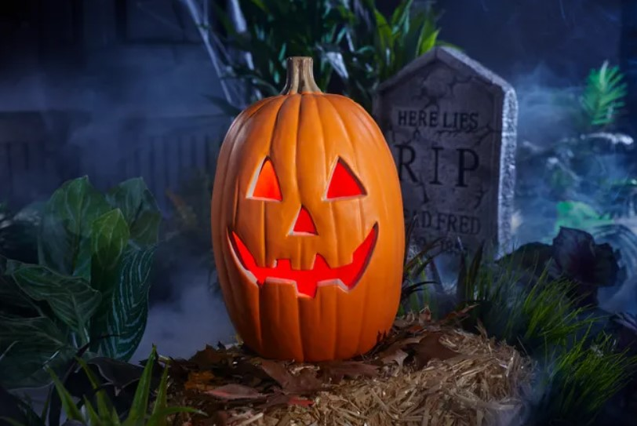
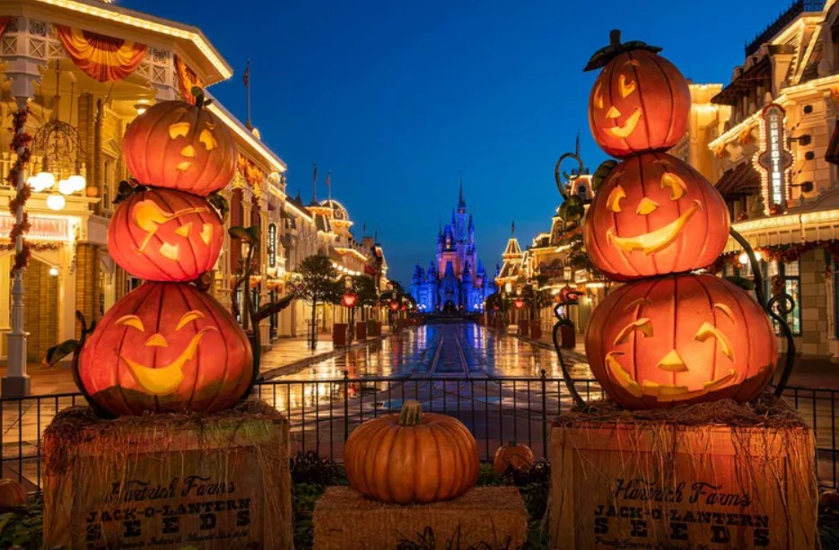
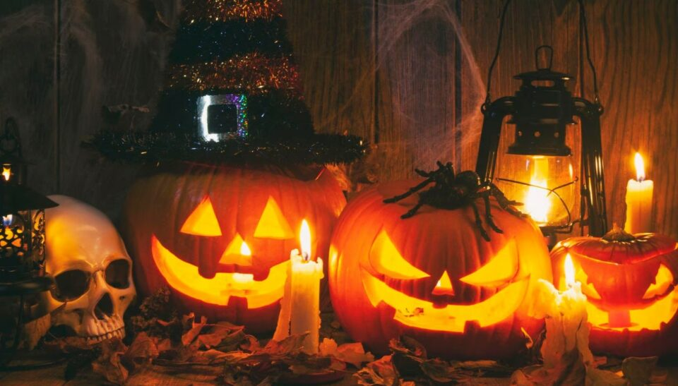
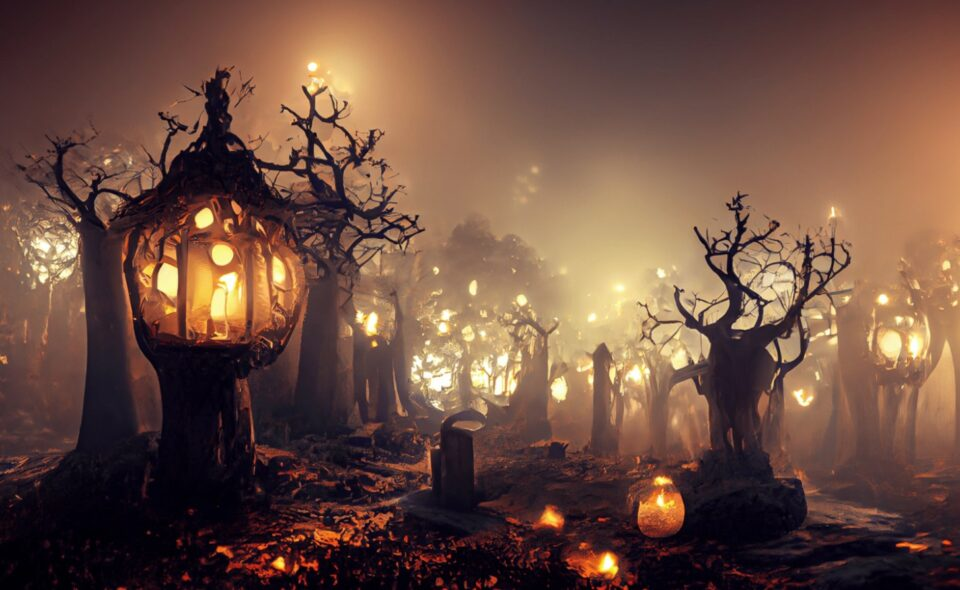
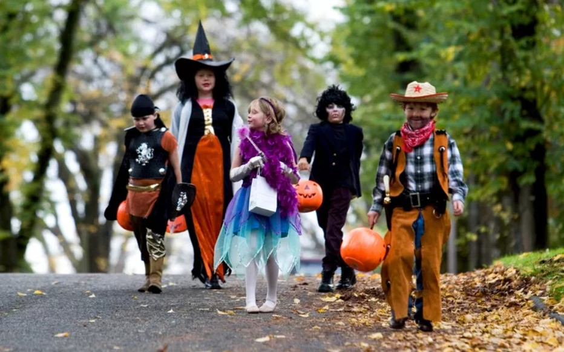
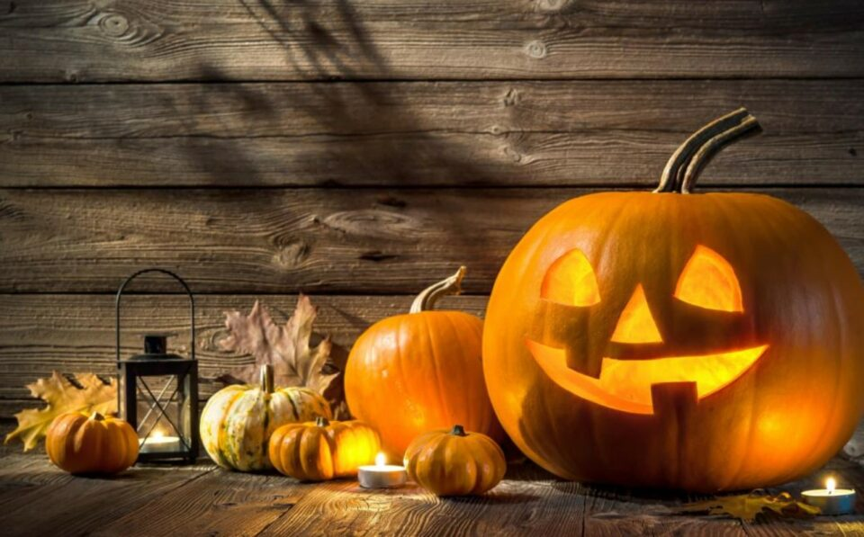
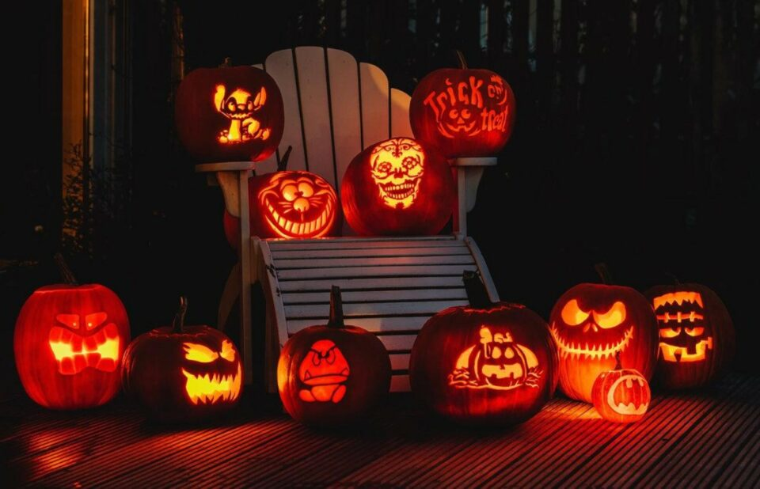

This article has been written and researched by our expert Loveable through a precise methodology. [Learn more about our methodology](https://avada.io/loveable/our-methodological.html)

[Loveable](https://avada.io/loveable/) > [Blog](https://avada.io/loveable/blog/) > [Holiday](https://avada.io/loveable/holiday/)

# Why Do We Celebrate Halloween? Everything You Need to Know About Halloween

Written by [Blake Simpson](https://avada.io/loveable/author/blake/) Last Updated on September 07, 2023

- [What is Halloween?](https://avada.io/loveable/blog/why-do-we-celebrate-halloween/#wp-block-heading-2-3)
- [When is Halloween?](https://avada.io/loveable/blog/why-do-we-celebrate-halloween/#wp-block-heading-2-7)
- [What are the ancient origins of Halloween?](https://avada.io/loveable/blog/why-do-we-celebrate-halloween/#wp-block-heading-2-11)
- [Why do we celebrate Halloween?](https://avada.io/loveable/blog/why-do-we-celebrate-halloween/#wp-block-heading-2-14)
    - [1\. Be an Important Day in the Pagan Calendar](https://avada.io/loveable/blog/why-do-we-celebrate-halloween/#wp-block-heading-3-16)
    - [2\. Be a Religious Celebration](https://avada.io/loveable/blog/why-do-we-celebrate-halloween/#wp-block-heading-3-20)
    - [3\. Mark a Pivotal Time of Year](https://avada.io/loveable/blog/why-do-we-celebrate-halloween/#wp-block-heading-3-24)
- [FAQs](https://avada.io/loveable/blog/why-do-we-celebrate-halloween/#wp-block-heading-2-29)
    - [1\. How did the tradition of wearing costumes on Halloween start?](https://avada.io/loveable/blog/why-do-we-celebrate-halloween/#wp-block-heading-3-30)
    - [2\. What is trick-or-treating, and how did it begin?](https://avada.io/loveable/blog/why-do-we-celebrate-halloween/#wp-block-heading-3-32)
    - [3\. What are some common Halloween symbols and their meanings?](https://avada.io/loveable/blog/why-do-we-celebrate-halloween/#wp-block-heading-3-34)
    - [4\. How did the tradition of carving pumpkins into jack-o’-lanterns start?](https://avada.io/loveable/blog/why-do-we-celebrate-halloween/#wp-block-heading-3-36)
    - [5\. Are there any cultural variations of Halloween around the world?](https://avada.io/loveable/blog/why-do-we-celebrate-halloween/#wp-block-heading-3-38)
    - [6\. Is Halloween only for children, or do adults also participate?](https://avada.io/loveable/blog/why-do-we-celebrate-halloween/#wp-block-heading-3-41)
    - [7\. Are there safety tips for Halloween, especially for children?](https://avada.io/loveable/blog/why-do-we-celebrate-halloween/#wp-block-heading-3-43)
    - [8\. How can I create Halloween decorations or costumes on a budget?](https://avada.io/loveable/blog/why-do-we-celebrate-halloween/#wp-block-heading-3-45)
- [Conclusion](https://avada.io/loveable/blog/why-do-we-celebrate-halloween/#wp-block-heading-2-50)

Halloween, often referred to as All Hallows’ Eve, is a captivating and widely celebrated holiday that has captivated people’s imaginations for generations. Rooted in a rich tapestry of ancient customs and beliefs, it has become an annual tradition that transcends borders and generations. But why do we celebrate Halloween? Halloween’s origins can be traced back to the ancient Celtic festival of Samhain, a pivotal time of year when the harvest season concluded, and winter’s chill began to set in.

It marked a moment when the boundary between the living and the spirit world was believed to be at its thinnest, enabling spirits to roam freely. To ward off these otherworldly visitors, people lit bonfires, dressed in disguises, and carved eerie faces into turnips and later, pumpkins. Today, Halloween continues to thrive as a delightful blend of tradition and modernity, providing an opportunity for people of all ages to engage in imaginative costume play, create spooky decorations, and share in the communal joy of trick-or-treating. Now, do not hesitate to delve into “Why do we celebrate Halloween?” and things you need to know about it.

## **What is Halloween?**

Halloween, short for All Hallows’ Eve, is a widely celebrated holiday with roots in various cultures. It falls on the night of October 31st and is primarily observed in the United States, Canada, and some parts of Europe. Halloween is known for its distinctive traditions, including costume parties, trick-or-treating, haunted houses, and the carving of jack-o’-lanterns.

It is a time when people of all ages embrace the spooky and supernatural, often donning costumes that range from cute and whimsical to eerie and frightening. Halloween is a festive occasion marked by the sharing of candy, ghost stories, and a sense of playful escapism.

## **When is Halloween?**

The ancient origins of Halloween can be traced back to the Celtic festival of Samhain, which was celebrated by the Celts in Ireland, Scotland, and parts of Britain over 2,000 years ago. Samhain marked the end of the harvest season and the beginning of winter, a time associated with death and darkness.

The Celts believed that on the night of October 31st, the boundary between the living and the dead blurred, allowing spirits to roam the Earth. To ward off these spirits, people would light bonfires and wear costumes made of animal skins. When Christianity spread to these regions, November 1st was designated as All Saints’ Day, and October 31st became All Hallows’ Eve, a night to honor saints and pray for the souls of the departed.

## **What are the ancient origins of Halloween?**

Over time, Halloween incorporated elements from other cultures, such as the Roman festival of Pomona, which celebrated the goddess of fruit and trees. This is where the tradition of bobbing for apples may have originated. In the Middle Ages, Halloween evolved into a time for communal gatherings, storytelling, and fortune-telling games. Irish immigrants brought their Halloween customs to America in the 19th century, where it gradually evolved into the modern holiday we know today. So, while Halloween may seem like a purely modern celebration, it carries with it a rich tapestry of ancient traditions and cultural influences.

## **Why do we celebrate Halloween?**

Halloween allows us to express our imagination through costumes and decorations, fostering a sense of playfulness and wonder. It also pays homage to ancient customs, such as the Celtic festival of Samhain, and provides a platform to remember loved ones and acknowledge the changing seasons. Ultimately, Halloween brings people together, encouraging a sense of community and shared enjoyment, making it a cherished and fun-filled holiday for many. Go with us to explore the three most significant reasons for this.

### **1\. Be an Important Day in the Pagan Calendar**

Halloween is celebrated because it holds significant historical roots in the pagan calendar. In ancient Celtic traditions, the festival of Samhain, which later evolved into Halloween, marked the end of the harvest season and the beginning of winter. It was a time when people believed that the veil between the living and the spirit world was at its thinnest, allowing for communication with the deceased. Celebrating Halloween today is a way to honor and carry forward these age-old customs, even though they have evolved and merged with other traditions over time.

Today, Halloween retains echoes of these ancient traditions. People still dress up in costumes, carve pumpkins into jack-o’-lanterns, and gather around bonfires or fireplaces. These activities are a way of connecting with the past and carrying forward the spirit of Samhain, even if the original beliefs have faded. For instance, carving pumpkins can be seen as a modern twist on the ancient practice of carving turnips or potatoes to ward off spirits. The desire to maintain this historical connection contributes to the continued celebration of Halloween.

### **2\. Be a Religious Celebration**

For some, Halloween is a religious celebration. It coincides with the Christian holiday of All Saints’ Day (or All Hallows’ Day) on November 1st. All Saints’ Day is dedicated to honoring saints and martyrs. Halloween, or All Hallows’ Eve, is seen as the night before this holy day when people prepare to remember and pray for the souls of departed loved ones. In this context, Halloween serves as a religious reminder of mortality and the spiritual realm, making it a day of reflection and reverence.

Let’s take a detailed example of this. In many Catholic and Anglican churches, All Saints’ Day includes special services and prayers for the departed. In Mexico, the celebration extends to Dia de los Muertos (Day of the Dead), where families create ofrendas (altars) to honor and remember their loved ones who have passed away. These ofrendas often include candles, photographs, and the deceased’s favorite foods. Thus, Halloween, in its religious context, becomes a time for reflection on mortality and the eternal, reinforcing the interconnectedness of life and death.

### **3\. Mark a Pivotal Time of Year**

Halloween is celebrated because it marks a pivotal time of the year. As the last day of October, it symbolizes the transition from the warmth of summer to the cold of winter. It’s a time when the days grow shorter, the nights longer, and the natural world undergoes significant changes. This seasonal shift has been historically associated with themes of death and rebirth, making Halloween a time to acknowledge the cyclical nature of life. By celebrating Halloween, we embrace this change and find comfort in the continuity of traditions that have been passed down through generations.

For instance, the custom of decorating with autumn leaves, cornstalks, and pumpkins during Halloween is a reflection of the changing landscape as fall settles in. Similarly, the ancient practice of lighting bonfires to ward off evil spirits was a way to provide warmth and light during the darkening days of late October. These customs symbolize the human need to acknowledge and celebrate the natural world’s cycles, despite the challenges that the changing seasons may bring.

In many cultures, Halloween is a time for communal gatherings and festivities that mark the harvest’s completion and the preparation for the harsh winter months. By celebrating Halloween, people find solace in the familiarity of these traditions and the assurance that life, like the seasons, will continue to unfold in its cyclical pattern.

## **FAQs**

### 1\. How did the tradition of wearing costumes on Halloween start?

The tradition of wearing costumes on Halloween dates back to ancient Celtic and European customs. People dressed in costumes to ward off or confuse malevolent spirits that were thought to be active on Halloween night.

### 2\. What is trick-or-treating, and how did it begin?

Trick-or-treating is a popular [Halloween tradition](https://avada.io/loveable/blog/halloween-traditions/) where children go door-to-door, asking for candy or treats. The practice is believed to have originated from medieval “souling,” where the poor went door-to-door on All Souls’ Day, receiving food in exchange for prayers for the deceased.

### 3\. What are some common Halloween symbols and their meanings?

Common Halloween symbols include jack-o’-lanterns (carved pumpkins), witches, black cats, bats, ghosts, and skeletons. These symbols are often associated with the spooky and supernatural aspects of the holiday.

### 4\. How did the tradition of carving pumpkins into jack-o’-lanterns start?

The tradition of carving pumpkins into jack-o’-lanterns is believed to have originated from an Irish folktale about a man named Jack who tricked the Devil. When Jack died, he was neither accepted into heaven nor hell and was left to wander with a lantern made from a carved turnip. In America, pumpkins were readily available, leading to the adoption of pumpkin carving.

### 5\. Are there any cultural variations of Halloween around the world?

Yes, there are variations of Halloween-like celebrations in different countries. For example, Mexico celebrates Dia de los Muertos (Day of the Dead), and in some parts of Asia, the Hungry Ghost Festival is observed. These celebrations share similarities with Halloween but have unique cultural elements.

### 6\. Is Halloween only for children, or do adults also participate?

Halloween is enjoyed by people of all ages. While children often participate in trick-or-treating and costume parties, adults commonly celebrate with costume parties, haunted house visits, and other themed events.

### 7\. Are there safety tips for Halloween, especially for children?

Yes, safety is a crucial aspect of Halloween. Children should be accompanied by adults while trick-or-treating, use reflective clothing or accessories for visibility, and check their candy for any tampering before consuming it. It’s also essential to follow local guidelines and recommendations regarding Halloween activities.

### 8\. How can I create Halloween decorations or costumes on a budget?

You can create budget-friendly Halloween decorations and costumes by using recycled materials, DIY crafting, and shopping at thrift stores. There are plenty of online resources and tutorials to help you get creative without breaking the bank.

**_See More:_**

- [Halloween in Japan](https://avada.io/loveable/blog/halloween-in-japan/)

- [Halloween Symbols](https://avada.io/loveable/blog/halloween-symbols-explained/) Explained

## Conclusion

In conclusion, Halloween is more than just a night of spooky costumes and sweet treats. It has deep historical roots, blending ancient Celtic traditions with Christian observances and evolving into a celebration of fear, fun, and community. Understanding the history and symbolism behind Halloween adds depth to our enjoyment of this captivating holiday.

- [What is Halloween?](https://avada.io/loveable/blog/why-do-we-celebrate-halloween/#wp-block-heading-2-3)
- [When is Halloween?](https://avada.io/loveable/blog/why-do-we-celebrate-halloween/#wp-block-heading-2-7)
- [What are the ancient origins of Halloween?](https://avada.io/loveable/blog/why-do-we-celebrate-halloween/#wp-block-heading-2-11)
- [Why do we celebrate Halloween?](https://avada.io/loveable/blog/why-do-we-celebrate-halloween/#wp-block-heading-2-14)
    - [1\. Be an Important Day in the Pagan Calendar](https://avada.io/loveable/blog/why-do-we-celebrate-halloween/#wp-block-heading-3-16)
    - [2\. Be a Religious Celebration](https://avada.io/loveable/blog/why-do-we-celebrate-halloween/#wp-block-heading-3-20)
    - [3\. Mark a Pivotal Time of Year](https://avada.io/loveable/blog/why-do-we-celebrate-halloween/#wp-block-heading-3-24)
- [FAQs](https://avada.io/loveable/blog/why-do-we-celebrate-halloween/#wp-block-heading-2-29)
    - [1\. How did the tradition of wearing costumes on Halloween start?](https://avada.io/loveable/blog/why-do-we-celebrate-halloween/#wp-block-heading-3-30)
    - [2\. What is trick-or-treating, and how did it begin?](https://avada.io/loveable/blog/why-do-we-celebrate-halloween/#wp-block-heading-3-32)
    - [3\. What are some common Halloween symbols and their meanings?](https://avada.io/loveable/blog/why-do-we-celebrate-halloween/#wp-block-heading-3-34)
    - [4\. How did the tradition of carving pumpkins into jack-o’-lanterns start?](https://avada.io/loveable/blog/why-do-we-celebrate-halloween/#wp-block-heading-3-36)
    - [5\. Are there any cultural variations of Halloween around the world?](https://avada.io/loveable/blog/why-do-we-celebrate-halloween/#wp-block-heading-3-38)
    - [6\. Is Halloween only for children, or do adults also participate?](https://avada.io/loveable/blog/why-do-we-celebrate-halloween/#wp-block-heading-3-41)
    - [7\. Are there safety tips for Halloween, especially for children?](https://avada.io/loveable/blog/why-do-we-celebrate-halloween/#wp-block-heading-3-43)
    - [8\. How can I create Halloween decorations or costumes on a budget?](https://avada.io/loveable/blog/why-do-we-celebrate-halloween/#wp-block-heading-3-45)
- [Conclusion](https://avada.io/loveable/blog/why-do-we-celebrate-halloween/#wp-block-heading-2-50)

### [Blake Simpson](https://avada.io/loveable/author/blake/)

Hi, I'm Blake from Loveable. I help people find perfect gifts for occasions like anniversaries and weddings. I also write a blog about holidays, sharing insights to make them more meaningful. Let's create unforgettable moments together!

- [Twitter](https://twitter.com/intent/tweet)
- [Facebook](https://www.facebook.com/sharer/sharer.php)
- [instagram](https://avada.io/loveable/blog/why-do-we-celebrate-halloween/)
- [pinterest](https://www.pinterest.com/loveablellc/)

## Related Posts

[### 120+ Christian Birthday Wishes To Spread Your Love](https://avada.io/loveable/blog/christian-birthday-wishes/) 

[

### 35 Best 70th Birthday Ideas To Celebrate The Special Milestone

](https://avada.io/loveable/blog/70th-birthday-ideas/)

[

### 50 Best 30th Birthday Decorations for a Remarkable Birthday Bash

](https://avada.io/loveable/blog/30th-birthday-decorations/)

[

### 40 Delicious Vegan Christmas Desserts to Delight Your Palate

](https://avada.io/loveable/blog/vegan-christmas-desserts/)

[

### 60 Christmas Team Building Activities to Boost Workplace Spirit

](https://avada.io/loveable/blog/christmas-team-building-activities/)
